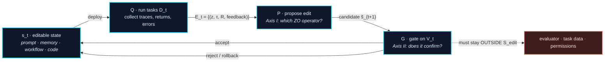

# Awesome Harness Optimization

**A curated, theory-organized reading list on Harness Optimization (HarnessOpt): how the software system *around* a frozen LLM proposes edits to itself, and what it takes to confirm one is worth keeping.**

[](https://awesome.re)
[](#contributing)
[](LICENSE)

**English** | [中文](README_zh.md)

> **What makes this list different.** Existing lists organize self-improving agents by *what object gets edited* (prompt → memory → workflow → code). That axis is necessary but not sufficient: it tells you nothing about **how a modification proposal is formed under a gradient-free information structure**, or **whether an accepted modification is statistically justified**. This list adds those two orthogonal axes:
>
> - **[Axis I — Zeroth-Order (ZO) view](#axis-i--the-zeroth-order-view):** the optimizer can only *deploy a candidate, run tasks, and observe returns*. Which classical ZO operator does each method actually instantiate — and does the editable surface even admit that operator?
> - **[Axis II — PAC / stability view](#axis-ii--pac-and-stability):** two non-interchangeable bounds govern HarnessOpt. Update stability ($\beta_{\exp}$) controls whether a single rollout can hijack the update; independent confirmation controls whether a selected candidate generalizes. Most published systems satisfy neither cleanly, and this list says *which one* each violates.

---

## Table of Contents

- [Scope](#scope)
- [The HarnessOpt Update Loop](#the-harnessopt-update-loop)
- [Axis 0 — The Editable Surface (L0–L5)](#axis-0--the-editable-surface-l0l5)
- [**Axis I — The Zeroth-Order View**](#axis-i--the-zeroth-order-view)
  - [I.1 Why zeroth-order](#i1-why-zeroth-order)
  - [I.2 Proposal signals and their operators](#i2-proposal-signals-and-their-operators)
  - [I.3 Operator implementability depends on surface structure](#i3-operator-implementability-depends-on-surface-structure)
- [**Axis II — PAC and Stability**](#axis-ii--pac-and-stability)
  - [II.1 Two bounds, two different jobs](#ii1-two-bounds-two-different-jobs)
  - [II.2 Multi-round reuse: the reachable-set bound](#ii2-multi-round-reuse-the-reachable-set-bound)
  - [II.3 What follows for the acceptance gate](#ii3-what-follows-for-the-acceptance-gate)
- [Paper List](#paper-list)
  - [1. Foundations and the Guarantee Ladder](#1-foundations-and-the-guarantee-ladder)
  - [**2. The Editable Surface: L0–L5**](#2-the-editable-surface-l0l5)
  - [3. Proposal Mechanisms](#3-proposal-mechanisms-how-run-evidence-becomes-an-edit)
  - [4. Validation Protocols](#4-validation-protocols-how-a-candidate-enters-persistent-state)
  - [5. Evaluators and Benchmarks](#5-evaluators-and-benchmarks)
  - [6. Related Surveys and Boundaries](#6-related-surveys-and-boundaries)
- [Open Problems](#open-problems)
- [Companion Documents](#companion-documents)
- [Contributing](#contributing)
- [Citation](#citation)

---

## Scope

**Working definition.** Fix a base model $M$, a task distribution $\mathcal{D}$, and an external evaluation boundary. Let $s$ be *model-external* software state — prompts, context, memory, workflow graphs, tool interfaces, agent code, optimizer code. The harness executes a task $z$ as $\tau = H_s(M, z)$. **HarnessOpt** is any procedure that repeatedly (i) runs the system to collect evidence, (ii) proposes edits to $s$ from that evidence, and (iii) decides via some accept/reject/rollback rule which edits persist.

**In focus.** Work where model-external state is modified *using run-time feedback*, with base model frozen. This includes prompt optimization, self-evolving memory/skills, workflow search, self-modifying agent code, meta-optimizer code, and the evaluators/benchmarks such loops optimize against.

**Boundary cases.** L5 (joint harness + weights) is included as a boundary, not as the core. Pure weight-side self-improvement (self-play, RLVR, synthetic data) and hand-authored harness *design* (ReAct, SWE-agent, MCP) are listed only in [§7](#6-related-surveys-and-boundaries) to mark the edge.

---

## The HarnessOpt Update Loop

Four components, one update:

$$
\underbrace{\mathcal{E}_t = Q(s_t; D_t)}_{\text{collect evidence}}
\qquad
\underbrace{\tilde{s}_{t+1} = P(s_t, \mathcal{E}_t)}_{\text{propose edit}}
\qquad
\underbrace{s_{t+1} = G(s_t, \tilde{s}_{t+1}; V_t)}_{\text{gate: accept / reject / rollback}}
$$



Three conditions define a HarnessOpt system; everything else is a *protocol option*, not part of the definition:

1. the base model and the external evaluation boundary are fixed for the round;
2. edits target an explicitly delimited editable state set $\mathcal{S}_{\mathrm{edit}}$;
3. candidates undergo some accept / reject / rollback treatment whose outcome affects later state.

> Allowlists, compile gates, smoke tests, independent validation, statistical dead-zones, and human review are *how well* a system does step 3 — they are the subject of [Axis II](#axis-ii--pac-and-stability), not entry requirements.

---

## Axis 0 — The Editable Surface (L0–L5)

The object axis, kept as scaffolding for the two analytical axes. It answers **"what can be changed"** — not how, and not whether the change was justified. **The six rungs and their papers are in [§2](#2-the-editable-surface-l0l5), in one section.** What follows here is the part the level number hides.

### Three discriminating sub-axes (the part the level number hides)

The level of an editable object says little about the *actual* action space. Three properties do:

| Sub-axis | Question | Why it matters |
|---|---|---|
| **Write authority** | Does the agent write autonomously, or only after human review? | Determines whether the loop is closed at all |
| **Persistence** | Ephemeral sandbox run, or committed to versioned state? | Determines whether an error can accumulate |
| **Constraint enforcement** | Declared in the prompt, or enforced by permissions / sandbox / hidden evaluator / static checks? | Determines whether [PAC premise (iii)](#ii1-two-bounds-two-different-jobs) holds at all |

> **Editable-surface size and gate strength are not conserved quantities.** A system whose surface covers control flow and executable code is *not* thereby more rigorously gated; some of the largest surfaces ship with the weakest confirmation. Do not infer gate strength from level number. See the [audit table](#4-validation-protocols-how-a-candidate-enters-persistent-state).

---
## Axis I — The Zeroth-Order View

*Classification axis: **through what zeroth-order information structure does run evidence become a modification proposal?** Orthogonal to the object axis — the same operator appears at L0 and L4, and one level hosts several operators.*

### I.1 Why zeroth-order

$\mathcal{S}_{\mathrm{edit}}$ is discrete text, programs, and file structure; $H_s \circ M$ is non-differentiable. So $\nabla_s f_M(s)$ is unavailable, where $f_M(s) = \mathbb{E}_{z \sim \mathcal{D}}[R(H_s(M,z))]$.

What makes a method zeroth-order is not that its variables are numeric. It is that **the optimizer obtains objective information only by querying an oracle**: deploy a candidate → run tasks → observe scores and traces → decide how to edit. A single run gives $Y(s,z) = R(H_s(M,z))$; the empirical mean estimates $f_M(s)$. Randomness comes from task sampling, model sampling, and environment execution — no explicit perturbation direction is ever constructed.

**The one substantive departure from classical ZO.** The query returns semantics, not just a scalar:

$$
\mathcal{E}_t = \{(z_i, \tau_i, R_i, \mathrm{feedback}_i)\}_{i=1}^{n_t}
$$

Traces, error logs, stack traces, and test results localize failure and suggest what to edit. SkillOpt-Lite frames this as **language-mediated program compilation**: the editable state is a program, the rollout is its execution trace, the LLM is compiler and runtime.

> **Insight 1.** Classical ZO perturbs blindly because it cannot inspect the function. HarnessOpt reads execution traces and debugs semantically — under the *same* query-only budget. **The gain is proposal quality, not oracle access.** Two things do not follow: semantic side-information does not lift the query-only constraint, and *a readable trace is not correct attribution*, let alone statistical evidence for acceptance. Reported step-level attribution accuracy is low, and regression prediction is markedly weaker than fix prediction.

### I.2 Proposal signals and their operators

Formulas below express *comparison relations*, not implementations of continuous ZO estimators. SkillOpt's $B_m{=}8$ aggregates rollouts over several tasks; it does not apply eight numerical perturbations to one state.

| Signal type | Analytical form (analogy) | Engineering realization | Representative work |
|---|---|---|---|
| **Scalar comparison** | $\widehat{\Delta} = \widehat{R}(s') - \widehat{R}(s)$ | Single-trace reflection; batch rollout; rank or keep elites by score | Reflexion, Voyager, APE, OPRO, DSPy, MIPROv2, GEPA, SkillOpt |
| **Batch consensus** | $\frac{1}{b}\sum_i [f(s+\mu u_i) - f(s)]\,u_i$ | Aggregate a batch before proposing; require a cross-task reproducible pattern, not one anomaly | SkillOpt ($B_m{=}8$), SkillOpt-Lite, Trace2Skill, SkillForge, ExpeL, Self-Harness |
| **Pairwise contrast** | $\widehat{\Delta} = \widehat{R}(s^+) - \widehat{R}(s^-)$ | Contrast success/failure traces on one task; extract the behavioral divergence point | SkillCAT, ProTeGi, TextGrad, DemoEvolve, ReasoningBank |
| **Localized edit** | $\mathcal{B}_{\mathrm{edit}}(s)$ | One module/file/entry changed, rest fixed; minimal patch; restricted paths | SkillAdaptor, Trace2Skill, SkillWeaver, AgentSquare, MASS, AlphaEvolve, Meta-Harness, AHE |
| **Bounded search** | $s_{k+1} \in \mathcal{B}(s_k, \Delta_k)$ | Edit budget, minimal-modification principle, allowlist, interface-signature invariance | SkillOpt ($L_t: 4{\to}2$), SkillOpt-Lite, SkillForge, SoftSkill ($m{=}32$), ACE, Self-Harness |
| **Search memory** | archive of candidates, returns, rejections | Rejected-edit buffer avoids re-exploring dead directions; novelty rejection sampling | SkillOpt rejected buffer, ShinkaEvolve, GEPA, Meta-Harness |
| **Gradient-free search** | $\tilde{s} \in \operatorname{Select}(\mathcal{A}_t; R)$ | Elitism, island models, recombination, Pareto selection | Promptbreeder, ADAS, AFlow, AgentSquare, ELM, FunSearch, AlphaEvolve, DGM, CORAL |
| **Adaptive search** | $\delta_t = F_t - F_{t-1}$, schedule by $\delta_t$ | Allocate exploration budget by fitness improvement and stagnation | AdaEvolve, ShinkaEvolve, ThetaEvolve, AFlow |

Full per-operator notes, including where each analogy breaks, are in [`docs/zo-operator-map.md`](docs/zo-operator-map.md).

**A restatement worth making.** SkillOpt describes itself with first-order vocabulary — learning rate, momentum, mini-batch. Structurally it is a **(1+1)-ES with a structured proposal operator**: the edit budget is a proposal radius, the rejected buffer is negative conditioning of the proposal distribution, "slow update" is a low-frequency cross-epoch component, and acceptance is strict-improvement-on-held-out. This does not weaken the method; it clarifies that the ZO map organizes information structure, not gradient-descent equivalence.

### I.3 Operator implementability depends on surface structure

**The real dependency between the object axis and this one — and it is not monotone in level.** It is not that higher levels get stronger operators; it is that **specific operators require specific structure**.

| Operator | Requires | Plain text | Versioned executable code |
|---|---|---|---|
| **Pairwise contrast** | a constructible negative direction | $s - \mu u$ cannot be built; only heuristic contrast at divergence points | Feature toggles make on/off both deployable and co-runnable — a genuine paired comparison |
| **Localized edit** | objective block boundaries | Text coordinates are not orthogonal; paragraph splits are arbitrary | Import graph and interface signatures give statically decidable boundaries |
| **Search memory** | pairable replay | No explicit variate, no known mean, no unbiased correction — variance reduction unverifiable | Deterministic seeds plus version control cancel common randomness |
| **Bounded search** | a measurable behavioral distance | Edit count is not semantic distance: one word can change everything, ten lines of comment nothing | Files touched, cross-module reach, signature change, smoke pass rate |

This is why allowlists, feature toggles, and versioned rollback are not bolt-on safety measures: they are preconditions that make these operators implementable at all — and, by [Proposition A](#ii2-multi-round-reuse-the-reachable-set-bound), they also tighten the confirmation bound.

Two further points, stated once. **(a) Query budget has an extra tier.** Compile, type-check, and static analysis reject candidates *before* any rollout, so the optimal allocation is filter-then-evaluate rather than uniform; and the *form* of the surface determines how strong that filter is, since natural-language artifacts admit no comparable pre-run criterion. This is not a "zero-cost oracle" — it consumes compute, just not task rollouts. **(b) Evidence is on-policy.** $\mathcal{E}_t$ is sampled under the current $s_t$, so once a failure class is fixed it vanishes from later traces, and the optimizer may revert the constraint that fixed it. This is an estimator-bias problem, not a generalization-bound problem, and no bound is given here: any bound would require modeling the proposer's behavior, and the assumptions would outweigh the conclusion.

---

## Axis II — PAC and Stability

*Axis I explains how candidates are produced. This axis answers: **under what conditions may one stochastic trial be promoted to persistent state?***

Setup: base model $M$ fixed, $z \sim \mathcal{D}$, loss $\ell(s;z) = 1 - R(H_s(M,z)) \in [0,1]$, risk $\epsilon(s) = \mathbb{E}_{z\sim\mathcal{D}}[\ell(s;z)]$.

### II.1 Two bounds, two different jobs

A candidate scoring higher on observed tasks is not thereby better on $\mathcal{D}$. Two bounds address two distinct failures.

**(B1) Update side — stability.** With $s_D = \mathcal{A}(D_N)$ and $s_{D^{\setminus i}}$ its leave-one-out counterpart, expected on-average stability is

$$
\beta_{\exp} = \mathbb{E}_{D_N, i, z}\big[\,\lvert \ell(s_D; z) - \ell(s_{D^{\setminus i}}; z)\rvert\,\big],
$$

giving

$$
\epsilon(s_D) \le \widehat{\epsilon}_{D_N}(s_D) + O\!\left(\beta_{\exp} + \sqrt{\tfrac{\ln(1/\delta)}{N}}\right).
$$

$\beta_{\exp}$ measures how much a single rollout anomaly moves the update. Case-by-case hardcoding and mimicking one trial's environment inflate it; cross-task aggregation and bounded edits reduce it. **This is the statistical content of the batch-consensus row in [I.2](#i2-proposal-signals-and-their-operators)** — where the two axes meet.

**(B2) Confirmation side — independent validation.** If $V_m$ is independent of the training data *and of the proposal process*, then for a fixed candidate $\tilde{s}$,

$$
\epsilon(\tilde{s}) \le \widehat{\epsilon}_{V_m}(\tilde{s}) + O\!\left(\sqrt{\tfrac{\ln(1/\delta)}{m}}\right).
$$

However unstable the update was, $\beta_{\exp}$ is **completely absent** from this bound.

> **Insight 2.** The two are not additive and not substitutable. (B1) governs whether the update was hijacked by one rollout; (B2) governs whether repeated selection on one set created selection bias. **An update with tiny $\beta_{\exp}$ can still overfit $V_m$ badly across rounds, and vice versa.** So consensus mining (lowering $\beta_{\exp}$) and validation rotation (lowering selection bias) solve different problems. The literature calls both "improving generalization," which hides the split.

**Three premises of (B2), all of which fail in practice.**

| Premise | How it fails |
|---|---|
| **(i) Independence** | Fixed selection sets are repeatedly `argmax`-ed. When tasks are expensive, systems substitute manual inspection and leak audits — defensible engineering, but not independence, and the equivalence is rarely argued |
| **(ii) Bounded signal bias** | Compile-pass and smoke tests show a candidate *runs*, not that it meets spec. Structurally hardest for semantic constraints: whatever is auto-checkable has already been made a gate, so what remains is exactly what auto-checking cannot establish — and the only self-verification signal is task success, while one class of constraint exists to prevent fabricated success |
| **(iii) External evaluator** | Most fragile, structurally: **the evaluator and the evaluated share one repository.** Documented behaviors include deleting logging to bypass detection and pre-seeding the environment to obtain reward without doing the work |

### II.2 Multi-round reuse: the reachable-set bound

The multi-round loop breaks premise (i) directly — $\tilde{s}_{t+1}$ depends on $V$ through rounds $1..t$. The fix is to bound not the independence, but **the hypothesis class that was actually tested**.

STOP's Lemma 1 union-bounds over all programs of length $\le l$, a *static* class. HarnessOpt has two things it does not: **A1**, an anchored start $s_0$ fixed before optimization; and **A2**, a per-round edit bounded by an edit script of length $\le L$ — the direct product of the trust-region principle. Under A1–A2, the set $\mathcal{H}_T$ of all states ever proposed **or tested** satisfies $\ln\lvert\mathcal{H}_T\rvert \le T(L+1)\ln\lvert\Sigma\rvert$.

> **Proposition A.** With loss bounded in $[0,1]$ and A1–A2 holding, with probability $\ge 1-\delta$, simultaneously for all $s \in \mathcal{H}_T$:
>
> $$\epsilon(s) \le \widehat{\epsilon}_{V_m}(s) + \eta_T, \qquad \eta_T := \sqrt{\frac{T(L+1)\ln\lvert\Sigma\rvert + \ln(1/\delta)}{2m}}$$
>
> This holds for $s_T$ **without requiring $s_T \perp V_m$** — exactly what multi-round reuse needs. *(Hoeffding plus a union bound over $\mathcal{H}_T$.)*

Three consequences:

- **Evolution rounds cost statistical budget.** $\eta_T$ grows as $\sqrt{T}$: each round looks at the same set once more. Holding slack under $\epsilon$ needs $m \gtrsim T(L+1)\ln\lvert\Sigma\rvert / (2\epsilon^2)$ — validation size must scale with rounds. Reported practice sits in the opposite regime: small splits, non-small $T$.
- **The edit budget, not the program size, controls tightness.** With $l_{\mathrm{eff}} := T(L+1)$, Proposition A is STOP's bound with $l \to l_{\mathrm{eff}}$, and is strictly stronger whenever $T(L+1) < \lvert s_T \rvert$. **This gives trust-region and minimal-edit design a justification beyond variance reduction: a smaller $L$ directly tightens confirmation.** Unbudgeted whole-file rewrites drive $L \approx \lvert s \rvert$ and forfeit it.
- **Rotation beats enlargement.** Using a fresh $V^{(t)}$ each round with $\delta_t = \delta/T$ gives slack $\sqrt{(\ln T + \ln(1/\delta))/(2m)}$ — logarithmic in $T$ instead of linear, at a cost of $Tm$ tasks. Rotate rather than enlarge when fresh tasks cost less than $\sqrt{T/\ln T}$ times the enlargement.

**Where this breaks.** A2 is the weak point: $L$ must be the *description length* of the edit (diff bytes), not the edit count — one edit can paste 400 lines. If the proposer can retrieve arbitrary external content into the state, $L$ is unbounded and the proposition does not apply. A1 fails if Round-0 consumed tasks later used for confirmation.

### II.3 What follows for the acceptance gate

**Accepted gains are real if the dead-zone is wide enough.** If acceptance requires $\widehat{\Delta}_{V_m} > \Delta$ with $\Delta > 2\eta_T$, then on the uniform event every accepted update satisfies $\epsilon(s_{t+1}) < \epsilon(s_t)$. Two corollaries:

- **$\Delta$ and $L$ are coupled, not independent knobs.** The bound on $\Delta$ grows with $L$. Relaxing the edit budget requires raising the threshold in step. Current practice tunes $\Delta$ as a noise estimate and $L$ as a proposal control, independently — inconsistent.
- **Monotone improvement requires behaviorally exact rollback.** The trajectory claim $\epsilon(s_T) \le \epsilon(s_0)$ needs rejected proposals to leave no residue. If $s_{t+1} = s_t$ fails behaviorally — lingering processes, registry entries, cache files, written memory — the chain breaks at that round. **Revertible effects are a theorem premise, not engineering hygiene**; a `git` rollback not covering runtime side effects is insufficient.

**Average non-regression hides tail collapse.** $\epsilon$ is an expectation, so degradation confined to a cluster of mass $p_k$ is invisible while it stays under $\eta_T / p_k$. Per-cluster guarantees need per-cluster sampling, $m_k = \Omega\big((T(L+1)\ln\lvert\Sigma\rvert + \ln(K/\delta))/\epsilon_k^2\big)$. This is how "aggregate score rises while individual milestones are lost" happens **without violating any bound in force** — which is why non-regression suites must be stratified and reported per cluster.

**Two drifts must not be conflated.** *Target drift* ($z \sim \mathcal{D}_t$) belongs here and accumulates as $\sum_t d(\mathcal{D}_{t-1},\mathcal{D}_t)$ — **linearly, while $\eta_T$ grows only as $\sqrt{T}$, so on a long horizon drift dominates selection bias**, giving a checkable criterion for when to restart rather than continue. *Evidence drift* belongs to [Axis I](#i3-operator-implementability-depends-on-surface-structure) and is an estimator-bias problem, not a bound problem.

Full statements, proofs, and the assumption audit are in [`docs/pac-stability.md`](docs/pac-stability.md).

---
## Paper List

**Organization.** §1 gives the foundations and the guarantee ladder motivating both axes. **§2 is the core: the whole editable surface L0–L5 in one section.** §3 and §4 then re-index the *same* works by the two analytical axes — §3 by the proposal mechanism, §4 by the validation protocol. §5 covers evaluators and documented failure modes; §6 marks the boundaries.

A work appearing in §2, §3, and §4 is not counted three times: §2 records what it edits, §3 how it proposes, §4 what its gate licenses one to conclude.

**Entry format.** `**Name** — "Title". Authors. Venue Year. [[paper]](link) — one line tying it to HarnessOpt. [ZO: operator] [PAC: class]`
`[ZO: …]` places the work on [Axis I](#i2-proposal-signals-and-their-operators); `[PAC: …]` on [Axis II](#4-validation-protocols-how-a-candidate-enters-persistent-state) (`open` / `same-set` / `independent`). Both tags are this list's reading, not the paper's self-description. `†` marks a preprint whose metadata may still change.

---

### 1. Foundations and the Guarantee Ladder

This section exists to answer one question: *in what sense can a self-modification be judged worth keeping?* Three reference points have been proposed historically. HarnessOpt sits in the middle one, which is where both axes are aimed.

| Reference point | How a modification is judged | How this list treats it |
|---|---|---|
| **Formal proof** | Executed only after the system internally proves it beneficial | Historical anchor; not required of any current system |
| **Probabilistic confirmation** | Degradation or selection bias controlled at a stated probability | **The target of [Axis II](#axis-ii--pac-and-stability)** — stated as an object of study, not as a solved problem |
| **Empirical score** | Scores higher on some tasks | The common practice; §4 analyzes its boundary |

- **Gödel Machines: Self-Referential Universal Problem Solvers Making Provably Optimal Self-Improvements** — J. Schmidhuber. *arXiv* 2003. [[paper]](https://arxiv.org/abs/cs/0309048) — Self-rewrite only upon an internal proof of utility gain. The upper rung. Its position is that if a rewrite's utility cannot be proven, no more can be said; this list's position is that *unprovable is not unanalyzable* — ZO describes the search-side information structure, PAC the confirmation-side sample conditions.
- **Speculations Concerning the First Ultraintelligent Machine** — I. J. Good. *Advances in Computers* 1965. — Origin of the intelligence-explosion idea via self-design. Motivation only, one paragraph's worth.
- **Recursive Self-Improvement** — E. Yudkowsky. *LessWrong* 2008. [[post]](https://www.lesswrong.com/posts/JBadX7rwdcRFzGuju/recursive-self-improvement) — Names the RSI feedback loop.
- **Harness Engineering for Self-Improvement** — Lilian Weng. *Lil'Log* 2026. [[blog]](https://lilianweng.github.io/posts/2026-07-04-harness/) — Frames the harness as the near-term substrate for self-improvement: the loop rarely starts with weights, it runs through the scaffolding.
- **Code as Agent Harness: Toward Executable, Verifiable, and Stateful Agent Systems** — *arXiv* 2026.† [[paper]](https://arxiv.org/abs/2605.18747) — Argues for executable, verifiable, stateful harnesses. Its verification-strength / recovery-ability / state-consistency / replayability list is name-only in the original — no definitions, no measurement protocol, no empirics. This list operationalizes them as runtime companion metrics in the [reporting checklist](#open-problems).
- **A Survey of Self-Evolving Agents: What, When, How, and Where to Evolve** — Gao et al. *arXiv* 2025.† [[paper]](https://arxiv.org/abs/2507.21046) — Taxonomy across models, memory, tools, architecture; source of the capability-dimension and time-scale distinctions this list adapts.
- **A Comprehensive Survey of Self-Evolving AI Agents** — Fang et al. *arXiv* 2025.† [[paper]](https://arxiv.org/abs/2508.07407) — Bridges foundation models and lifelong agentic systems; proposes "Three Laws of Self-Evolving AI Agents".

---

### 2. The Editable Surface: L0–L5

**All six rungs in one section.** Each subsection states what the surface is, what one edit unit looks like, and — the part the level number hides — **what structure the surface does or does not supply to the operators of [Axis I](#i3-operator-implementability-depends-on-surface-structure)**.

| Level | Object | Edit unit | Feasibility oracle available? | Subsection |
|---|---|---|---|---|
| **L0** | Instruction prompt | prompt, instruction block, exemplar | ❌ no pre-run criterion | [2.1](#21-l0--instruction-prompts) |
| **L1** | Context / memory / skill | memory entry, skill file, retrieval unit | ⚠️ only if skills are executable | [2.2](#22-l1--context-memory-and-skill-libraries) |
| **L2** | Workflow / graph / architecture | node, edge, subgraph, module slot | ⚠️ graph validity, not semantics | [2.3](#23-l2--agentic-workflow-and-architecture-search) |
| **L3** | Harness / agent code | file, module, tool, plugin | ✅ compiler, type system, static analysis | [2.4](#24-l3--self-modifying-harness-code) |
| **L4** | Optimizer / meta-harness code | proposer, selector, search operator | ✅ same, plus the loop edits its own editor | [2.5](#25-l4--optimizer-and-meta-harness-code) |
| **L5** | Harness + model weights | checkpoint, LoRA, prefix | — base-model-fixed condition suspended | [2.6](#26-l5--joint-harness-and-weight-optimization-boundary) |

> **Read the fourth column against Axis 0's three sub-axes.** Level tells you what is nominally editable. Feasibility-oracle strength, write authority, persistence, and enforcement tell you what the action space *actually* is. The two come apart routinely: see [cross-cutting observation 1](docs/audit-table.md#cross-cutting-observations).

#### 2.1 L0 — Instruction prompts

*The instruction layer as the optimized object. Surface: plain text.* No pre-run feasibility criterion exists, so every candidate costs rollouts; and with no constructible negative direction or objective block boundary, central difference and coordinate descent exist here only as analogies ([I.3](#i3-operator-implementability-depends-on-surface-structure)).

- **APE** — "Large Language Models Are Human-Level Prompt Engineers". Zhou et al. *ICLR* 2023. [[paper]](https://arxiv.org/abs/2211.01910) — Treats the instruction as a program; proposes and scores candidates by search. `[ZO: population & archive]` `[PAC: same-set]`
- **OPRO** — "Large Language Models as Optimizers". Yang et al. *ICLR* 2024. [[paper]](https://arxiv.org/abs/2309.03409) — Generates new solutions from a meta-prompt of prior (solution, score) pairs. The meta-prompt sees scalars only — no trace evidence — so the semantic advantage of Axis I is left unused. `[ZO: one-point]` `[PAC: same-set]`
- **EvoPrompt** — "Connecting LLMs with Evolutionary Algorithms Yields Powerful Prompt Optimizers". Guo et al. *ICLR* 2024. [[paper]](https://arxiv.org/abs/2309.08532) — GA/DE over a prompt population with LLM mutation and crossover. `[ZO: population]` `[PAC: same-set]`
- **Promptbreeder** — "Self-Referential Self-Improvement via Prompt Evolution". Fernando et al. *arXiv* 2023.† [[paper]](https://arxiv.org/abs/2309.16797) — Evolves task-prompts *and* the mutation-prompts that modify them. An L0-content / L4-mechanism hybrid: the earliest instance in this list of a loop editing its own editor. `[ZO: population]` `[PAC: same-set]`
- **ProTeGi** — "Automatic Prompt Optimization with 'Gradient Descent' and Beam Search". Pryzant et al. *EMNLP* 2023. [[paper]](https://arxiv.org/abs/2305.03495) — Coined "textual gradients": LLM critiques as natural-language gradients editing prompts. Structurally the central-difference *role* without a constructible $s-\mu u$. `[ZO: central difference (analogy)]` `[PAC: same-set]`
- **DSPy** — "Compiling Declarative Language Model Calls into Self-Improving Pipelines". Khattab et al. *ICLR* 2024. [[paper]](https://arxiv.org/abs/2310.03714) — Programming model treating LM pipelines as optimizable text-transformation graphs. `[ZO: population & archive]` `[PAC: same-set]`
- **MIPROv2** — "Optimizing Instructions and Demonstrations for Multi-Stage Language Model Programs". Opsahl-Ong et al. *EMNLP* 2024. [[paper]](https://arxiv.org/abs/2406.11695) — Jointly bootstraps few-shot demos and proposes instructions via Bayesian optimization. Building a surrogate for $f$ instead of querying it blindly is a materially different ZO strategy from LLM-proposal, and the only one in this list that does so. `[ZO: surrogate-model search]` `[PAC: same-set]`
- **TextGrad** — "Automatic 'Differentiation' via Text". Yuksekgonul et al. *Nature* 2025. [[paper]](https://arxiv.org/abs/2406.07496) — Backpropagates textual feedback through compound AI systems. The "gradient" is semantic side-information on a zeroth-order query, not a verifiable derivative; nothing cancels, so none of central difference's variance advantages transfer. `[ZO: central difference (analogy)]` `[PAC: same-set]`
- **GEPA** — "Reflective Prompt Evolution Can Outperform Reinforcement Learning". Agrawal et al. *arXiv* 2025.† [[paper]](https://arxiv.org/abs/2507.19457) — Genetic-Pareto reflective optimizer reading full traces; up to 35× fewer rollouts than RL. Evidence that trace-informed proposals reduce the *number of queries needed* — a proposal-quality claim, not a claim that any query was avoided. `[ZO: population + control variate]` `[PAC: independent]`

#### 2.2 L1 — Context, memory, and skill libraries

*The agent curates and grows its own context, memory, or skill store from experience, without weight updates.* This is where the open-loop protocol class concentrates: most of these systems write experience straight into later state, with no test that could have stopped a bad entry.

**Context and memory**

- **Reflexion** — "Language Agents with Verbal Reinforcement Learning". Shinn et al. *NeurIPS* 2023. [[paper]](https://arxiv.org/abs/2303.11366) — Converts feedback into verbal self-reflections stored in episodic memory across trials. The archetypal one-point estimator — one trace, one edit — and the highest-$\beta_{\exp}$ design in this list. Bypasses dynamic validation entirely in an open loop. `[ZO: one-point]` `[PAC: open]`
- **ExpeL** — "LLM Agents Are Experiential Learners". Zhao et al. *AAAI* 2024. [[paper]](https://arxiv.org/abs/2308.10144) — Gathers experiences and extracts natural-language insights into a growing store. Cross-experience extraction is a genuine $\beta_{\exp}$-reducing mechanism even without a formal gate. `[ZO: multi-point]` `[PAC: open]`
- **Dynamic Cheatsheet** — "Test-Time Learning with Adaptive Memory". Suzgun et al. *EACL* 2026.† [[paper]](https://arxiv.org/abs/2504.07952) — Persistent self-curated memory of strategies and snippets at inference. `[ZO: one-point]` `[PAC: open]`
- **ACE** — "Agentic Context Engineering: Evolving Contexts for Self-Improving Language Models". Zhang et al. *ICLR* 2026. [[paper]](https://arxiv.org/abs/2510.04618) — Generator/Reflector/Curator with incremental delta updates, avoiding context collapse. Delta updates are a trust region on a text surface; the "context collapse" it prevents is a concrete instance of high $\beta_{\exp}$. `[ZO: trust region]` `[PAC: open]`
- **ReasoningBank** — "Scaling Agent Self-Evolving with Reasoning Memory". Ouyang et al. *ICLR* 2026.† [[paper]](https://arxiv.org/abs/2509.25140) — Distills generalizable strategies from successes *and* failures; introduces memory-aware test-time scaling. Success/failure pairing plays the central-difference role at the memory layer. `[ZO: central difference (analogy)]` `[PAC: open]`
- **Agent Workflow Memory (AWM)** — Wang, Mao, Fried, Neubig. *ICML* 2025. [[paper]](https://arxiv.org/abs/2409.07429) — Induces reusable workflows as durable procedural memory the agent grows and reuses. `[ZO: multi-point]` `[PAC: open]`
- **Memp** — "Exploring Agent Procedural Memory". Fang et al. *ACL Findings* 2026.† [[paper]](https://arxiv.org/abs/2508.06433) — Distills trajectories into script-like procedures with build/retrieve/update strategies. One of the few works specifying *deletion*, not only writing — directly relevant to the lifecycle gap in [§8.2](#open-problems). `[ZO: multi-point]` `[PAC: open]`
- **MemAct** — "Memory as Action: Autonomous Context Curation for Long-Horizon Agentic Tasks". Zhang et al. *ACL Findings* 2026.† [[paper]](https://arxiv.org/abs/2510.12635) — Reframes working-memory management as learnable policy actions trained end-to-end. `[ZO: — trained policy]` `[PAC: open]`
- **Continual Harness** — "Online Adaptation for Self-Improving Foundation Agents". *arXiv* 2026.† [[paper]](https://arxiv.org/abs/2605.09998) — Online harness adaptation. Continuous adaptation places it directly in the small-$m$, large-$T$ regime that [corollary A-2](#ii2-multi-round-reuse-the-reachable-set-bound) flags. `[ZO: one-point / multi-point]` `[PAC: open]`

**Skill libraries and skill optimization** — the narrowest editable surface in this list, and simultaneously the one with the most developed operator inventory and the strongest confirmation protocols. That inversion is the single clearest refutation of "larger surface ⇒ stronger method."

- **Voyager** — "An Open-Ended Embodied Agent with Large Language Models". Wang et al. *TMLR* 2024. [[paper]](https://arxiv.org/abs/2305.16291) — Lifelong learning via automatic curriculum plus a self-growing executable skill library. Single-error signals trigger local program overwrites. The library is executable, so a feasibility oracle exists — but it gates compilation, not generalization. `[ZO: one-point]` `[PAC: open]`
- **SkillWeaver** — "Web Agents can Self-Improve by Discovering and Honing Skills". Zheng et al. *COLM* 2025. [[paper]](https://arxiv.org/abs/2504.07079) — Agents synthesize reusable, debugged API skills into their harness; +31.8% on WebArena. The debug loop is a feasibility oracle, not a confirmation gate. `[ZO: coordinate descent]` `[PAC: same-set]`
- **SkillOpt** — "Executive Strategy for Self-Evolving Agent Skills". *arXiv* 2026.† [[paper]](https://arxiv.org/abs/2605.23904) — Mini-batch reflection ($B_m{=}8$), decaying edit budget ($L_t: 4 \to 2$), rejected-edit buffer, hierarchical parallel LLM tree reduction; three-way disjoint split with the test set locked before final reporting. The most complete operator inventory in the skill literature. It describes itself in first-order vocabulary (learning rate, momentum, mini-batch), but structurally it is a (1+1)-ES with a structured proposal operator — see [I.2](#i2-proposal-signals-and-their-operators). `[ZO: multi-point + trust region + control variate]` `[PAC: independent]`
- **SkillOpt-Lite** — "Better and Faster Agent Self-evolution via One Line of Code". *arXiv* 2026.† [[paper]](https://arxiv.org/abs/2607.03451) — Consensus mining, held-out selection, staged compile–smoke–full confirmation. Source of the ZO/PAC framing this list builds on; explicitly formulates skill optimization as language-mediated program compilation. Reports high variance on small validation splits — the small-$m$ regime of corollary A-2, observed empirically. `[ZO: multi-point + confirmation gate]` `[PAC: independent]`
- **Trace2Skill** — "Distill Trajectory-Local Lessons into Transferable Agent Skills". *arXiv* 2026.† [[paper]](https://arxiv.org/abs/2603.25158) — ZO-SGD with map-reduce patch merging. Strong (B1) mechanism, compromised (B2): it gates on sub-sampled training subsets. The cleanest single illustration that the two bounds are independent. `[ZO: multi-point + coordinate descent]` `[PAC: same-set]`
- **SkillForge** — "Forging Domain-Specific, Self-Evolving Agent Skills in Cloud Technical Support". *arXiv* 2026.† [[paper]](https://arxiv.org/abs/2604.08618) — Batch ticket aggregation for trajectory denoising; enforces a minimal-modification principle. `[ZO: multi-point + trust region]` `[PAC: independent]`
- **SkillCAT** — "Contrastive, Assessment-Augmented and Topology-Aware Skill Self-Evolution for LLM Agents". *arXiv* 2026.† [[paper]](https://arxiv.org/abs/2606.13317) — Custom contrastive operator at the action-divergence point $w_i$. The closest thing in the skill literature to a real central difference; still lacks a constructible $s-\mu u$, and it gates on direct clones of the source training-failure instances. `[ZO: central difference]` `[PAC: same-set]`
- **SkillAdaptor** — "Self-Adapting Skills for LLM Agents from Trajectories". *arXiv* 2026.† [[paper]](https://arxiv.org/abs/2606.01311) — Coordinate descent with faulty step $t^*$ as axis and candidate skill $s_j$ as basis vector. `[ZO: coordinate descent]` `[PAC: same-set]`
- **SoftSkill** — "Behavioral Compression for Contextual Adaptation". *arXiv* 2026.† [[paper]](https://arxiv.org/abs/2606.20333) — Bounds the soft prefix at $m{=}32$ tokens. A rare case where the trust region is a *hard dimensional* constraint rather than an edit-count heuristic — the only radius in this list that is unambiguously measurable. `[ZO: trust region]` `[PAC: same-set]`

#### 2.3 L2 — Agentic workflow and architecture search

*The workflow graph or module composition is searched rather than hand-designed.* The first level where node/edge structure supplies **objective block boundaries**, making coordinate descent more than an analogy ([I.3](#i3-operator-implementability-depends-on-surface-structure)).

- **ADAS / Meta Agent Search** — "Automated Design of Agentic Systems". Hu, Lu, Clune. *ICLR* 2025. [[paper]](https://arxiv.org/abs/2408.08435) — A meta-agent programs ever-better agents in code over a growing archive. `[ZO: population & archive]` `[PAC: same-set]`
- **AFlow** — "Automating Agentic Workflow Generation". Zhang et al. *ICLR* 2025. [[paper]](https://arxiv.org/abs/2410.10762) — Workflow optimization as MCTS over code-represented graphs. MCTS makes the exploration/exploitation schedule explicit — the adaptive-step row of the operator table. `[ZO: population + adaptive step]` `[PAC: same-set]`
- **GPTSwarm** — "Language Agents as Optimizable Graphs". Zhuge et al. *ICML* 2024. [[paper]](https://arxiv.org/abs/2402.16823) — Agents as computational graphs; node-level prompt plus edge-level REINFORCE optimization. Edge-level REINFORCE is genuinely *not* zeroth-order over the topology — a useful boundary case that shows the ZO framing is a claim about information availability, not a universal label. `[ZO: partially first-order over edges]` `[PAC: same-set]`
- **AgentSquare** — "Automatic LLM Agent Search in Modular Design Space". Shang et al. *ICLR* 2025. [[paper]](https://arxiv.org/abs/2410.06153) — Searches a modular Planning/Reasoning/ToolUse/Memory space via evolution and recombination. Module slots give the cleanest objective coordinate basis in this list. `[ZO: coordinate descent + population]` `[PAC: same-set]`
- **MaAS** — "Multi-agent Architecture Search via Agentic Supernet". Zhang et al. *ICML* 2025. [[paper]](https://arxiv.org/abs/2502.04180) — Optimizes a probabilistic agentic supernet for cost-adaptive, query-dependent systems. `[ZO: population]` `[PAC: same-set]`
- **MASS** — "Multi-Agent Design: Optimizing Agents with Better Prompts and Topologies". Zhou et al. *arXiv* 2025.† [[paper]](https://arxiv.org/abs/2502.02533) — Interleaved multi-stage search over prompts and topologies. Explicit block-coordinate structure: prompts and topology are alternated rather than searched jointly. `[ZO: block coordinate descent]` `[PAC: same-set]`
- **ScoreFlow** — "Mastering LLM Agent Workflows via Score-based Preference Optimization". Wang et al. *arXiv* 2025.† [[paper]](https://arxiv.org/abs/2502.04306) — Continuous gradient-based workflow optimization via Score-DPO. A first-order boundary case: it relaxes part of the workflow into a differentiable object, escaping the ZO setting by changing the representation rather than the information available. `[ZO: boundary — first-order]` `[PAC: same-set]`
- **FlowReasoner** — "Reinforcing Query-Level Meta-Agents". Gao et al. *arXiv* 2025.† [[paper]](https://arxiv.org/abs/2504.15257) — An RL-tuned reasoning meta-agent that designs a bespoke multi-agent system per query. `[ZO: boundary — RL]` `[PAC: same-set]`
- **EvoAgent** — "Towards Automatic Multi-Agent Generation via Evolutionary Algorithms". Yuan et al. *NAACL* 2025. [[paper]](https://arxiv.org/abs/2406.14228) — Mutation, crossover, and selection extending one agent into a multi-agent system. `[ZO: population]` `[PAC: same-set]`
- **Agent Symbolic Learning** — "Symbolic Learning Enables Self-Evolving Agents". Zhou et al. *arXiv* 2024.† [[paper]](https://arxiv.org/abs/2406.18532) — Language "loss/gradients/backprop" to jointly optimize prompts, tools, and pipeline. `[ZO: central difference (analogy)]` `[PAC: same-set]`
- **Alita** — "Generalist Agent Enabling Scalable Agentic Reasoning with Minimal Predefinition and Maximal Self-Evolution". Qiu et al. *arXiv* 2025.† [[paper]](https://arxiv.org/abs/2505.20286) — Self-evolves by autonomously generating and reusing its own MCP tools on the fly. Tool generation expands the *interaction* surface, not just the state — exactly the case where safety probes must cover newly introduced surfaces rather than only final output ([§4.4](#42-acceptance-should-be-a-joint-condition)). `[ZO: population]` `[PAC: open]`

#### 2.4 L3 — Self-modifying harness code

*The agent's own code as the object of modification.* The only level where the [feasibility oracle](#i3-operator-implementability-depends-on-surface-structure) is strong, real central difference is constructible via feature toggles, and paired replay makes control variates verifiable. It is simultaneously where premise (iii) of (B2) is most fragile — **the evaluator lives in the same repository as the code being edited**.

- **STOP** — "Self-Taught Optimizer: Recursively Self-Improving Code Generation". Zelikman et al. *COLM* 2024. [[paper]](https://arxiv.org/abs/2310.02304) — A seed improver recursively improves its own scaffolding code with weights fixed; the improver, not the solution, is the target. Its Appendix A.2 Lemma 1 gives a uniform-convergence bound over all programs of length $\le l$. [Proposition A](#ii2-multi-round-reuse-the-reachable-set-bound) is its dynamic counterpart: an anchored start plus a bounded per-round edit replaces the static program class with a reachable set, and $l$ with $l_{\mathrm{eff}} = T(L+1)$. `[ZO: population]` `[PAC: same-set + uniform-convergence analysis]`
- **Gödel Agent** — "A Self-Referential Agent Framework for Recursive Self-Improvement". Yin et al. *ACL* 2025. [[paper]](https://arxiv.org/abs/2410.04444) — Monkey-patches its own logic dynamically at runtime. In-place runtime patching makes *behaviorally exact* rollback hard, which directly threatens the monotonicity premise [B-2](#ii3-what-follows-for-the-acceptance-gate). `[ZO: one-point]` `[PAC: open]`
- **Darwin Gödel Machine (DGM)** — "Open-Ended Evolution of Self-Improving Agents". Zhang et al. *arXiv* 2025.† [[paper]](https://arxiv.org/abs/2505.22954) — A coding agent rewrites its own codebase over an open-ended archive; SWE-bench 20%→50%. Archive search with a large per-round $L$ — the regime where $\eta_T$ grows fastest ([A-3](#ii2-multi-round-reuse-the-reachable-set-bound)), since unbudgeted rewrites drive $L \approx |s|$. `[ZO: population & archive]` `[PAC: same-set]`
- **SICA** — "A Self-Improving Coding Agent". Robeyns et al. *arXiv* 2025.† [[paper]](https://arxiv.org/abs/2504.15228) — Removes the meta/target distinction; the agent edits its own codebase for cost, speed, and accuracy. `[ZO: one-point + coordinate descent]` `[PAC: same-set]`
- **Self-Harness** — "Harnesses That Improve Themselves". Zhang et al. *arXiv* 2026.† [[paper]](https://arxiv.org/abs/2606.09498) — Weakness mining → bounded harness proposal → regression validation on held-in/held-out splits. The bidirectional held-in/held-out non-regression check is the closest published approximation to the [four acceptance checks](#42-acceptance-should-be-a-joint-condition). `[ZO: multi-point + trust region + confirmation gate]` `[PAC: independent]`
- **Agentic Harness Engineering (AHE)** — "Observability-Driven Automatic Evolution of Coding-Agent Harnesses". *arXiv* 2026.† [[paper]](https://arxiv.org/abs/2604.25850) — Prediction manifest plus next-round rollback. Retrospective confirmation without a disjoint held-out set; its safety ceiling is bounded by attribution accuracy, which is reported low ([II.1](#ii1-two-bounds-two-different-jobs)). `[ZO: coordinate descent]` `[PAC: independent (retrospective)]`
- **AutoHarness** — "Improving LLM Agents by Automatically Synthesizing a Code Harness". Lou et al. *arXiv* 2026.† — Iterative code refinement with environment feedback to auto-synthesize a code harness. `[ZO: one-point / multi-point]` `[PAC: unverified]`
- **Ouroboros** — "A Self-Developing Frontier Coding Agent with Reviewed Core Evolution". Razzhigaev et al. *arXiv* 2026.† [[paper]](https://arxiv.org/abs/2608.08311) [[code]](https://github.com/razzant/ouroboros) — Reviewed commits become the runtime for later work. Human review in the write path is a distinct point on the *write-authority* sub-axis, and it materially changes what $\mathcal{H}_T$ contains: a human-rejected candidate never enters the reachable set. `[ZO: coordinate descent]` `[PAC: independent (human-gated)]`
- **CORAL** — "Towards Autonomous Multi-Agent Evolution for Open-Ended Discovery". Qu et al. *COLM* 2026. [[paper]](https://arxiv.org/abs/2604.01658) [[code]](https://github.com/Human-Agent-Society/CORAL) — Coding agents in isolated worktrees around an external grader, retaining scored attempts and sharing notes and reusable skills. Worktree isolation is a concrete implementation of the exact-rollback premise of [B-2](#ii3-what-follows-for-the-acceptance-gate) — a rejected attempt cannot leave residue in the parent state by construction. `[ZO: population & archive]` `[PAC: independent]`
- **DemoEvolve** — "Overcoming Sparse Feedback in Agentic Harness Evolution with Demonstrations". *arXiv* 2026.† [[paper]](https://arxiv.org/abs/2605.24539) — Human demonstrations supply the contrast signal that sparse rewards do not. A demonstration is an externally supplied "positive direction" — one of the few ways to get a contrast pair without constructing $s - \mu u$. `[ZO: central difference]` `[PAC: independent]`

#### 2.5 L4 — Optimizer and meta-harness code

*The code that proposes edits is itself edited.* Not a "higher" rung in any capability sense — it is the case where $P$ enters $\mathcal{S}_{\mathrm{edit}}$. The consequence for Axis II is specific: the reachable-set count of Proposition A still applies, but $\beta_{\exp}$ now describes an algorithm that is itself changing, so (B1) governs a moving object.

- **Meta-Harness** — "End-to-End Optimization of Model Harnesses". Lee et al. *arXiv* 2026.† [[paper]](https://arxiv.org/abs/2603.28052) — An agentic proposer searches over harness *code* via the file system; returns a Pareto frontier of harnesses. File-level edits give real block boundaries and Pareto selection is the population row. Reports declining to carve an independent split on expensive terminal tasks — the small-$m$, non-small-$T$ case corollary A-2 warns about. `[ZO: coordinate descent + population + control variate]` `[PAC: independent (partial)]`
- **Hyperagents** — Zhang et al. *arXiv* 2026.† [[paper]](https://arxiv.org/abs/2603.19461) — A meta-agent controls how to modify task agents to create new ones. `[ZO: population]` `[PAC: unverified]`
- **MCE** — "Meta Context Engineering via Agentic Skill Evolution". Ye et al. *arXiv* 2026.† [[paper]](https://arxiv.org/abs/2601.21557) — Bi-level framework co-evolving context-management *skills* (meta) and context *artifacts* (base, as files or code). L1 content with an L4 mechanism in one loop; the explicit separation of mechanism from content is what makes the two levels separable at all. `[ZO: population]` `[PAC: same-set]`
- **Promptbreeder** — *(also §2.1)* — Evolving the mutation-prompt is the L4 facet of an L0 system. Listed twice by facet, not counted twice.

#### 2.6 L5 — Joint harness and weight optimization (boundary)

*Harness edits and weight updates in one loop.* Included as a boundary, not a core comparison object: once weights move, the "base model fixed" condition of the HarnessOpt definition is suspended, $\beta_{\exp}$ must be redefined over the joint state, and the reachable-set count of Proposition A no longer applies because weight updates are not describable by a bounded edit script over $\Sigma$.

- **SIA** — "Self Improving AI with Harness & Weight Updates". Hebbar et al. *arXiv* 2026.† [[paper]](https://arxiv.org/abs/2605.27276) — A Feedback-Agent decides, per iteration, whether to update the harness or the model weights. `[ZO: — mixed]` `[PAC: same-set]`
- **SEAL** — "Self-Adapting Language Models". Zweiger et al. *NeurIPS* 2025. [[paper]](https://arxiv.org/abs/2506.10943) — The model generates its own "self-edits" (finetuning data plus directives), applied via SFT inside an RL loop. `[ZO: boundary — RL]` `[PAC: same-set]`

---
### 3. Proposal Mechanisms: How Run Evidence Becomes an Edit

Related surveys have catalogued prompt optimization and self-evolving agents by method family. This section does not repeat that. It maps work onto **how a query signal becomes a modification proposal** — the editable range is §2's subject, the acceptance protocol is §4's.

Scalar returns answer *which candidates are worth continuing*. Trace feedback further answers *where the failure is and what might change*. Candidate archives decide *what to keep, mutate, or recombine*. These compose; most systems use two or three.

| Signal | What it can support | What it cannot | Work |
|---|---|---|---|
| **Scalar return and ranking** | Comparing candidates or versions | Locating a cause; justifying a specific edit | APE, OPRO, DSPy, MIPROv2, Reflexion, Voyager |
| **Trajectory and error logs** | Localizing failure; proposing a plausible patch | Correct attribution; evidence for acceptance | ProTeGi, TextGrad, SkillCAT, GEPA, AHE, Trace2Skill |
| **Search history and archive** | Diversity, novelty, avoiding dead directions | Whether a retained candidate generalizes | Promptbreeder, ADAS, AFlow, ELM, AlphaEvolve, ShinkaEvolve, DGM |

Language feedback remains a zeroth-order query carrying semantic side-information — not a verifiable gradient. Localized edits, edit budgets, and rejected buffers constrain the *reach* of a proposal and repeated exploration; they do not create a differentiable object. However a proposal is formed, it cannot by itself justify entry into persistent state: acceptance, non-regression, and rollback remain §4's gate $G$.

#### 3.1 Operator inventory by system

Cross-tabulating [I.2](#i2-proposal-signals-and-their-operators) against the levels of §2. Reading down a column shows one operator recurring across levels; reading across a row shows a system's actual mechanism mix.

| System | Level | Scalar | Batch | Contrast | Localized | Bounded | Memory | Population | Adaptive |
|---|---|:-:|:-:|:-:|:-:|:-:|:-:|:-:|:-:|
| Reflexion | L1 | ● | | | | | | | |
| Voyager | L1 | ● | | | ● | | | | |
| ExpeL | L1 | | ● | | | | | | |
| ACE | L1 | | ● | | | ● | | | |
| ReasoningBank | L1 | | ● | ● | | | | | |
| SkillOpt | L1 | ● | ● | | | ● | ● | | |
| SkillOpt-Lite | L1 | | ● | | | ● | | | |
| Trace2Skill | L1 | | ● | | ● | | | | |
| SkillCAT | L1 | | | ● | | | | | |
| SkillAdaptor | L1 | | | | ● | | | | |
| SoftSkill | L1 | | | | | ● | | | |
| OPRO | L0 | ● | | | | | | | |
| ProTeGi | L0 | | ● | ● | | | | | |
| TextGrad | L0 | | | ● | | | | | |
| GEPA | L0 | ● | | | | | ● | ● | |
| Promptbreeder | L0 | | | | | | | ● | |
| ADAS | L2 | | | | | | ● | ● | |
| AFlow | L2 | | | | | | | ● | ● |
| AgentSquare | L2 | | | | ● | | | ● | |
| MASS | L2 | | | | ● | | | | |
| DGM | L3 | | | | | | ● | ● | |
| SICA | L3 | ● | | | ● | | | | |
| Self-Harness | L3 | | ● | | | ● | | | |
| AHE | L3 | | | | ● | | | | |
| DemoEvolve | L3 | | | ● | | | | | |
| CORAL | L3 | | | | | | ● | ● | |
| AlphaEvolve | L3 | | | | ● | | | ● | ● |
| ShinkaEvolve | L3 | | | | | | ● | ● | ● |
| AdaEvolve | L3 | | | | | | | | ● |
| ELM | L3 | | | | | ● | | ● | |
| Meta-Harness | L4 | | | | ● | | ● | ● | |

Three readings:

1. **Operators are level-independent.** Localized edits run from L1 skill files to L4 optimizer code; population search from L0 prompts to L4. The object axis does not predict the mechanism.
2. **The narrowest surface has the richest inventory.** L1 skill optimization occupies more cells than L3 code editing. Operator sophistication tracks *how hard the confirmation problem was taken*, not how much is editable.
3. **Contrast and localization rarely co-occur** — most systems pick one. Under [I.3](#i3-operator-implementability-depends-on-surface-structure) they need different structure from the surface, so this is a constraint, not a preference.

#### 3.2 Search engines

The mechanisms L2–L4 systems build on. Their contribution *is* the operator.

- **FunSearch** — "Mathematical Discoveries from Program Search with Large Language Models". Romera-Paredes et al. *Nature* 2023. [[paper]](https://www.nature.com/articles/s41586-023-06924-6) — LLM plus evaluator in an evolutionary loop; the template later self-improving coding agents descend from.
- **AlphaEvolve** — "A Coding Agent for Scientific and Algorithmic Discovery". Novikov et al. *arXiv* 2025.† [[paper]](https://arxiv.org/abs/2506.13131) — LLM ensemble plus evaluators over marked `EVOLVE-BLOCK` regions. The marked region is a human-declared coordinate basis — the clearest case of a surface engineered so localization is implementable rather than analogical.
- **ShinkaEvolve** — "Towards Open-Ended and Sample-Efficient Program Evolution". Lange et al. *arXiv* 2025.† [[paper]](https://arxiv.org/abs/2509.19349) — Parent sampling, novelty rejection sampling, bandit LLM selection. Novelty rejection steers proposals away from covered directions, though without an unbiased correction.
- **AdaEvolve** — "Adaptive LLM Driven Zeroth-Order Optimization". *arXiv* 2026.† [[paper]](https://arxiv.org/abs/2602.20133) — Explicitly casts LLM-driven search as zeroth-order with an adaptive schedule; the nearest published neighbor to this axis.
- **ThetaEvolve** — "Test-time Learning on Open Problems". Wang et al. *arXiv* 2025.† [[paper]](https://arxiv.org/abs/2511.23473) — Evolutionary search with RL and in-context learning.
- **ELM** — "Evolution through Large Models". Lehman et al. *arXiv* 2022.† [[paper]](https://arxiv.org/abs/2206.08896) — LLM diff model as mutation operator inside MAP-Elites. A diff model is a literal bounded-edit-script proposer — assumption A2 realized by construction rather than convention.
- **AIDE** — "AI-Driven Exploration in the Space of Code". Jiang et al. *arXiv* 2025.† [[paper]](https://arxiv.org/abs/2502.13138) — ML engineering as agentic tree search over its own solutions.

#### 3.3 Classical zeroth-order theory

Cited for operator definitions and their known properties; none is about agents.

- **A Primer on Zeroth-Order Optimization in Signal Processing and Machine Learning** — Liu et al. *IEEE SPM* 2020. [[paper]](https://arxiv.org/abs/2006.06224) — The toolbox this axis maps onto: one-point and two-point estimators, coordinate methods, variance reduction, rates.
- **Optimal Rates for Zero-Order Convex Optimization: The Power of Two Function Evaluations** — Duchi, Jordan, Wainwright, Wibisono. *IEEE TIT* 2015. [[paper]](https://arxiv.org/abs/1312.2139) — Why two-point estimators dominate one-point ones, with matching lower bounds. The formal reason a constructible negative direction matters: what text surfaces lose is a provable rate, not elegance.
- **Random Gradient-Free Minimization of Convex Functions** — Nesterov & Spokoiny. *FoCM* 2017. [[paper]](https://link.springer.com/article/10.1007/s10208-015-9296-2) — Gaussian-smoothing estimators and dimension-dependent rates. Larger edit surfaces are more expensive to *search*, independently of the confirmation argument.
- **Online Convex Optimization in the Bandit Setting** — Flaxman, Kalai, McMahan. *SODA* 2005. [[paper]](https://arxiv.org/abs/cs/0408007) — The one-point bandit estimator and its variance cost; formal ancestor of single-trace reflection.
- **Introduction to Derivative-Free Optimization** — Conn, Scheinberg, Vicente. *SIAM* 2009. [[book]](https://epubs.siam.org/doi/book/10.1137/1.9780898718768) — Trust-region and model-based DFO; source of the requirement that a radius be a behavioral distance.
- **Completely Derandomized Self-Adaptation in Evolution Strategies** — Hansen & Ostermeier. *Evolutionary Computation* 2001. [[paper]](https://direct.mit.edu/evco/article/9/2/159/892/Completely-Derandomized-Self-Adaptation-in) — The reference for reading SkillOpt-style methods as structured (1+1)-ES rather than SGD.

---

### 4. Validation Protocols: How a Candidate Enters Persistent State

§II.1 gives two bounds: update-side stability and confirmation-side independent validation. To describe what the literature actually does, add a third class that has no independent confirmation at all. Permissions, sandboxing, auditing, and rollback are governance conditions cutting across all three, not a separate class.

**The decisive difference is not whether tests were run. It is whether a test result can stop a candidate from entering persistent state, and whether the deciding set is reused across rounds.**

| Protocol | Characteristic | Representative work | Relation to the bounds |
|---|---|---|---|
| **Open loop** | Experience written straight into later state; no candidate test, no recovery path | Reflexion, Voyager, ExpeL, Dynamic Cheatsheet, ACE, ReasoningBank, Memp, AWM, MemAct, Continual Harness, Gödel Agent, Alita | Premise (i) absent by construction. Supports claims about experience accumulation only |
| **Same-set scoring** | Score, rank, keep elites on the search tasks; report a test set separately at the end | APE, OPRO, Promptbreeder, DSPy, MIPROv2, ADAS, AFlow, MaAS, AgentSquare, ELM, AlphaEvolve, ShinkaEvolve, ThetaEvolve, STOP, DGM, SICA | Candidates depend on repeatedly-observed tasks; independence fails. [Proposition A](#ii2-multi-round-reuse-the-reachable-set-bound) is the applicable reading, with $\eta_T$ growing in $T$ and $L$ |
| **Independent validation and rollback** | Confirmed on a disjoint set, or by retrospective prediction plus version test; failures rejected or rolled back | SkillOpt, SkillOpt-Lite, SkillForge, GEPA, SkillCAT, DemoEvolve, Self-Harness, CORAL, Ouroboros; Meta-Harness (partial); AHE (retrospective) | Premise (i) holds at round 1, degrades across rounds unless rotated. Proposition A′ if rotated, A otherwise |

Protocol detail differs within the third class. SkillOpt uses a three-way disjoint split with the test set locked before final reporting; SkillOpt-Lite uses held-out selection with staged compile–smoke–full confirmation; Self-Harness uses bidirectional held-in/held-out non-regression; CORAL isolates attempts in worktrees around an external grader; Ouroboros gates on human-reviewed commits. AHE's prediction manifest plus next-round rollback gives retrospective confirmation without a disjoint held-out set. SkillCAT, SkillAdaptor, and Trace2Skill run gates on clones or sub-samples of the source training failures — which places them in the second class despite having a gate.

#### 4.1 Three observations the table makes visible

**Editable-surface size does not predict gate strength.** Systems whose surface covers control flow and executable code are not thereby more rigorously gated; some of the largest surfaces ship with no confirmation gate, while the narrowest surfaces in skill optimization carry three-way disjoint splits. Gate strength cannot be inferred from level number.

**(B1) and (B2) are satisfied by different systems.** Trace2Skill and SkillCAT have strong consensus mechanisms and compromised confirmation; several evolutionary systems have the reverse profile. If the two bounds were substitutable this pattern would not persist — which is the empirical form of Insight 2.

**Operator sophistication does not track gate strength.** SkillOpt and ShinkaEvolve implement the widest operator ranges; neither rotates its validation set.

Per-system detail, with unverified entries marked, is in [`docs/audit-table.md`](docs/audit-table.md).

#### 4.2 Acceptance should be a joint condition

Nearly every published gate measures task pass rate alone, which is blind in principle to a documented failure: performance and safety move in opposite directions. In workflow optimization, HumanEval performance rose while Refusal Rate fell 36.3% → 5.6% and Attack Success Rate rose 54.4% → 83.1%; in a memory-evolution setting, Refusal Rate fell 99.4% → 54.4% and ASR rose 0.6% → 20.6% — and the collapse can be abrupt rather than gradual (Misevolution, [2509.26354](https://arxiv.org/abs/2509.26354)).

A gate keyed on pass rate cannot see this. **Safety metrics must enter $G$ itself, not appear as an extra column in the final table.** This is compatible with the staged oracle of [I.3](#i3-operator-implementability-depends-on-surface-structure): safety probes fit in the smoke tier at a fraction of full-validation cost. Optimized components can also grow externally-interacting structures — sub-agent construction, tool registration, integration nodes — so probes must cover the new interaction surface a candidate introduces, not only its output.

Combining this with §II.3, a candidate should persist only when four conditions hold: no critical performance regression (with $\Delta > 2\eta_T$, stratified per cluster); no critical safety or permission regression; evaluator, task data, and protected paths unmodified, enforced at runtime rather than declared in a prompt; and the candidate recordable, replayable, and rollback-exact.

#### 4.3 Statistical machinery

- **Stability and Generalization** — Bousquet & Elisseeff. *JMLR* 2002. [[paper]](https://www.jmlr.org/papers/v2/bousquet02a.html) — Uniform stability implies generalization; origin of the stability route.
- **Learnability, Stability and Uniform Convergence** — Shalev-Shwartz, Shamir, Srebro, Sridharan. *JMLR* 11:2635–2670, 2010. [[paper]](https://jmlr.org/papers/v11/shalev-shwartz10a.html) — Expected on-average stability, the notion $\beta_{\exp}$ instantiates. *(No arXiv version.)*
- **Train Faster, Generalize Better: Stability of Stochastic Gradient Descent** — Hardt, Recht, Singer. *ICML* 2016. [[paper]](https://arxiv.org/abs/1509.01240) — Fewer update steps imply better stability; the parametric analogue of "smaller cumulative edit budget tightens the bound," reached independently.
- **Mathematical Analysis of Machine Learning Algorithms** — T. Zhang. *Cambridge* 2023. [[book]](https://www.cambridge.org/core/books/mathematical-analysis-of-machine-learning-algorithms/0F86E4F79A5FE3EE9C0A0A5EBFCF8E2C) — The model-selection bound (B2) comes from.
- **Preserving Statistical Validity in Adaptive Data Analysis** — Dwork, Feldman, Hardt, Pitassi, Reingold, Roth. *STOC* 2015. [[paper]](https://arxiv.org/abs/1411.2664) — Differential privacy for reusing a holdout across adaptive queries. Whether it beats Proposition A's union bound for the accept/reject query pattern is open.
- **The Reusable Holdout** — Dwork et al. *Science* 349(6248), 2015. [[paper]](https://www.science.org/doi/10.1126/science.aaa9375) — The Thresholdout mechanism; the most plausible route to defensible multi-round reuse.
- **The Ladder: A Reliable Leaderboard for Machine Learning Competitions** — Blum & Hardt. *ICML* 2015. [[paper]](https://arxiv.org/abs/1502.04585) — Repeated leaderboard querying is structurally identical to repeated `argmax` on a fixed selection set, and its defense — report only on significant improvement — is what the dead-zone $\Delta$ implements.
- **Gradient Episodic Memory for Continual Learning** — Lopez-Paz & Ranzato. *NeurIPS* 2017. [[paper]](https://arxiv.org/abs/1706.08840) — Origin of BWT/FWT. Forgetting here is caused by an explicit edit and is therefore attributable to a specific diff — the one advantage of the non-parametric setting.
- **Overcoming Catastrophic Forgetting in Neural Networks** — Kirkpatrick et al. *PNAS* 2017. [[paper]](https://arxiv.org/abs/1612.00796) — Marks the contrast: with no weights to protect, stability–plasticity must be restated on task-set performance, with no parameter-importance analogue.
- **A Programming Paradigm for Spatiotemporal Composability** — *2026.†* — Revertible effects and reactive coeffects; the systems language for the exact-rollback premise.

---

### 5. Evaluators and Benchmarks

A benchmark plays two roles that are routinely conflated: the set that **drives proposals** and the set that **confirms candidates**. Only the second is governed by Axis II. Using one set for both is a choice, and should be reported as one.

**Coding and terminal agents**

- **SWE-bench** — Jimenez et al. *ICLR* 2024. [[paper]](https://arxiv.org/abs/2310.06770) — 2,294 real issue→PR tasks; the standard target for coding-harness self-improvement.
- **Terminal-Bench** — Merrill et al. *arXiv* 2026.† — Human-verified containerized terminal tasks; used by Meta-Harness and Self-Harness. Per-task cost is what pushes systems out of an independent split.
- **ClawBench** — Zhang et al. *arXiv* 2026.† [[paper]](https://arxiv.org/abs/2604.08523) [[code]](https://github.com/reacher-z/ClawBench) — Live-web tasks with request interception and replayable traces.
- **HAL** — Kapoor et al. *ICLR* 2026. [[paper]](https://arxiv.org/abs/2510.11977) — Cost-aware third-party leaderboard across 9 benchmarks.

**AI research and ML engineering**

- **PaperBench** — Starace et al. *ICML* 2025. [[paper]](https://arxiv.org/abs/2504.01848) — Replicate 20 ICML 2024 papers; 8,316 rubrics.
- **MLE-bench** — Chan et al. *ICLR* 2025. [[paper]](https://arxiv.org/abs/2410.07095) — 75 Kaggle competitions with human baselines.
- **RE-Bench** — Wijk et al. *ICML* 2025. [[paper]](https://arxiv.org/abs/2411.15114) — 7 open-ended ML R&D environments versus 61 human experts.
- **KernelBench** — Ouyang et al. *ICML* 2025. [[paper]](https://arxiv.org/abs/2502.10517) — 250 PyTorch workloads scored by `fast_p`. A fast automatable verifier is a strong pre-run filter, which is why evolutionary harnesses favor it — and why its scores generalize less readily than they appear to.

**Long-horizon retention** — the benchmarks that can see what episodic evaluation cannot: LifelongAgentBench, LTMBenchmark, MemoryAgentBench. Most benchmarks reset agent state per task and therefore cannot observe forgetting, state pollution, or safety drift at all.

**Harness interaction**

- **Harness Updating Is Not Harness Benefit** — *arXiv* 2026.† [[paper]](https://arxiv.org/abs/2605.30621) — Separates harness-*updating* capability from harness-*benefit*, decomposing failure into activation versus adherence via SLR/HFR/LPR, and refuting the assumption that the strongest model makes the best optimizer. Two caveats the original makes checkable: its editable surface is limited to the skill layer, and its updating-side and benefit-side aggregations are asymmetric.

**Verifiers**

- **Let's Verify Step by Step** — Lightman et al. *ICLR* 2024. [[paper]](https://arxiv.org/abs/2305.20050) — Process supervision beats outcome supervision; releases PRM800K.
- **Generative Verifiers** — Zhang et al. *ICLR* 2025. [[paper]](https://arxiv.org/abs/2408.15240) — CoT verification via next-token prediction.
- **LLMs Cannot Self-Correct Reasoning Yet** — Huang et al. *ICLR* 2024. [[paper]](https://arxiv.org/abs/2310.01798) — Intrinsic self-correction degrades without an external signal — the empirical case for keeping the verifier outside $\mathcal{S}_{\mathrm{edit}}$.

**Structural limits shared across this section.** Episodic design cannot measure retention. Repeated selection on one set erodes confirmation. Execution verifiers can still be narrow proxies, so report verification strength and false acceptance, not only pass rate. Performance benchmarks are blind to evaluator hacking, which attacks the measuring apparatus and needs hidden evaluators and audit logs. Safety and capability can move in opposite directions. And gains across different base models and harnesses cannot be merged: one score mixes base model, evolver, harness, tool protocol, and evaluator.

**Failure modes documented in the literature.** Misevolution ([2509.26354](https://arxiv.org/abs/2509.26354)) is the systematic study across model, memory, tool, and workflow paths. On the evaluator being reachable: reward tampering ([2406.10162](https://arxiv.org/abs/2406.10162)), monitoring and obfuscation ([2503.11926](https://arxiv.org/abs/2503.11926)), reward hacking formalized ([2209.13085](https://arxiv.org/abs/2209.13085)), overoptimization scaling laws ([2210.10760](https://arxiv.org/abs/2210.10760)). On evaluation validity: AI Agents That Matter ([2407.01502](https://arxiv.org/abs/2407.01502)), leakage in ML-based science ([2207.07048](https://arxiv.org/abs/2207.07048)), METR's finding that many SWE-bench-passing PRs would not be merged. On loops declaring victory on noise: "p-hacking and eureka-ing" ([2511.16072](https://arxiv.org/abs/2511.16072)) — the failure the dead-zone is built to prevent — and six recurring failure modes of self-directed research loops ([2601.03315](https://arxiv.org/abs/2601.03315)). Safety probes suitable for placing inside $G$: AgentHarm ([2410.09024](https://arxiv.org/abs/2410.09024)).

---

### 6. Related Surveys and Boundaries

- **Awesome-Harness-Self-Improvement** — leezythu. 2026. [[repo]](https://github.com/leezythu/Awesome-Harness-Self-Improvement) — The object-axis list this one complements. It organizes by the optimization ladder; this list adds the two analytical axes. Start there for field coverage; come here for how proposals are formed and whether they confirm.
- **A Survey of Self-Evolving Agents** — Gao et al. *arXiv* 2025.† [[paper]](https://arxiv.org/abs/2507.21046) — Source of the capability-dimension and time-scale distinctions this list adapts.
- **A Comprehensive Survey of Self-Evolving AI Agents** — Fang et al. *arXiv* 2025.† [[paper]](https://arxiv.org/abs/2508.07407)
- **A Survey on Self-Evolution of Large Language Models** — Tao et al. *arXiv* 2024.† [[paper]](https://arxiv.org/abs/2404.14387)
- **A Survey of Context Engineering for LLMs** — Mei et al. *arXiv* 2025.† [[paper]](https://arxiv.org/abs/2507.13334)
- **Agent Harness for LLM Agents: A Survey** — Meng et al. *Preprints.org* 2026.† [[repo]](https://github.com/Gloriaameng/Awesome-Agent-Harness) — Formalizes the harness as $H = (E,T,C,S,L,V)$.

**Out of scope, listed to mark the edge.** *Harness design* — the hand-authored substrate these methods act on: ReAct ([2210.03629](https://arxiv.org/abs/2210.03629)), Self-Refine ([2303.17651](https://arxiv.org/abs/2303.17651)), SWE-agent ([2405.15793](https://arxiv.org/abs/2405.15793)), OpenHands ([2407.16741](https://arxiv.org/abs/2407.16741)), CodeAct ([2402.01030](https://arxiv.org/abs/2402.01030)), AutoGen ([2308.08155](https://arxiv.org/abs/2308.08155)), MetaGPT ([2308.00352](https://arxiv.org/abs/2308.00352)), MemGPT ([2310.08560](https://arxiv.org/abs/2310.08560)), MCP ([2503.23278](https://arxiv.org/abs/2503.23278)). *Weight-only self-improvement* — improves the model, not the harness: SPIN ([2401.01335](https://arxiv.org/abs/2401.01335)), Self-Rewarding LMs ([2401.10020](https://arxiv.org/abs/2401.10020)), Absolute Zero ([2505.03335](https://arxiv.org/abs/2505.03335)), R-Zero ([2508.05004](https://arxiv.org/abs/2508.05004)), TTRL ([2504.16084](https://arxiv.org/abs/2504.16084)), DeepSeek-R1 ([2501.12948](https://arxiv.org/abs/2501.12948)), STaR ([2203.14465](https://arxiv.org/abs/2203.14465)). When co-optimized with the harness in one loop, the work belongs in [§2.6](#26-l5--joint-harness-and-weight-optimization-boundary).

---
## Open Problems

Stated as questions that experiment can settle, not as designs asserted to work.

**1 · Tighter multi-round reuse.** Proposition A pays $\sqrt{T}$ for validation reuse. A differentially-private reusable holdout answers many adaptive queries against one set with a better dependence. Whether that survives the HarnessOpt query pattern — accept/reject decisions on candidates, more structured than general adaptive analysis — and at what accuracy cost, is open.

**2 · A formulation for evidence drift.** Once a failure class is fixed it disappears from traces, so the optimizer loses the evidence that the constraint remains necessary and may revert it. No bound is given here because any bound requires modeling the proposer. An assumption-light formulation — bounding how far a constraint's evidence may decay before reversion becomes likely — would be a real contribution.

**3 · Deletion, not just writing.** Most self-evolving work specifies how to write and not how to delete, and this has a statistical consequence: exact rollback is a premise of the monotonicity result, so uncleaned side effects break it at that round. Two invariants are needed — unloading revokes registrations and side effects; dependency changes re-resolve into a compatible configuration. A workable specification gives entries an explicit lifecycle with a retention criterion that depends on **whether the entry still covers a high-probability trap in the current search neighborhood**, not on its length. In Axis I's terms, the memory set should cover the current neighborhood's high-probability failure directions.

**4 · Merging independently evolved lineages.** Per-round local edit records do not predict merged behavior, and the single-lineage protocol does not carry over. This is a theoretical gap, not only an engineering one: the reachable-set count fails on merge, because the merged state lies in neither lineage's reachable set.

**5 · An operational cluster partition.** Stratified validation requires per-cluster reporting, but "report per cluster" is unexecutable without a defensible way to partition capabilities. Until one exists, report the partition used and its rationale, so readers can judge whether a tail capability could have hidden inside a large cluster.

**6 · Quantifying stability–plasticity.** A smaller edit budget means less forgetting and slower improvement. Making this a proposition requires an assumption bounding the behavioral reach of an edit, and no defensible one is currently available.

**7 · When to restart rather than continue.** Target drift accumulates linearly while the confirmation slack grows as $\sqrt{T}$, so past some horizon re-running Round-0 dominates incremental evolution. Locating that crossover is a cheap experiment that no published work appears to have run.

**8 · Model–harness co-design, as a checkable loop.** The proposition is not that componentization produces intelligence. Three published observations motivate a joint loop: weaker models gain more from harness optimization, no universal harness is optimal across models, and agent capability is not determined by model intelligence alone. The loop: traces expose a recurring failure, the harness proposes a local patch or the traces become training evidence, independent tasks confirm the gain and the absence of regression, stable experience is distilled into general capability, and **after the model improves the original scaffolding can be deleted while the cross-task gain persists.** The last step is the evidence: long-term progress shows as scaffolding shrinking, not as an accumulating pile of undeletable rules.

## Companion Documents

| Document | Contents |
|---|---|
| [`docs/zo-operator-map.md`](docs/zo-operator-map.md) | The full ZO operator table with per-work notes, plus the exact point where each text-space analogy breaks |
| [`docs/pac-stability.md`](docs/pac-stability.md) | Complete statements and proofs of Propositions A, A′, B, B-1, B-2, C, with the assumption audit |
| [`docs/audit-table.md`](docs/audit-table.md) | Per-system stability/confirmation audit, with the evidence status of each entry marked |
| [`docs/glossary.md`](docs/glossary.md) | All symbols and metric abbreviations used in this list |

---

## Contributing

PRs are very welcome. This list has one requirement beyond the usual:

**Keep the three sentence types separate.** When adding an entry:
- claims must be attributable to a specific paper (section or experimental setting where it matters);
- claims are this list's comparison under a unified frame and must not be presented as the original paper's conclusion;
- claims must read as recommendations ("should report", "may serve as a protocol option"), never as descriptions of current practice.

Also:
- Place the work on **all three axes** where possible: level (L0–L5), `[ZO: operator]`, `[PAC: class]`.
- For a `[PAC: independent]` claim, say **what the split actually is** and **whether it is reused across rounds**. "Ran a test" is not independent confirmation.
- If a system's gate strength is unverified from the primary source, mark it **`待核实 / unverified`** rather than inferring it from the level number or from secondary summaries.
- Use `†` for preprints. Prefer the canonical venue; otherwise the arXiv abstract page.

**Accuracy note.** Entries marked `†` include 2025–2026 preprints whose IDs, authorship, or venues may still change. Verify links before citing in formal work. Where this list assigns a ZO operator or PAC class, that assignment is this list's reading, not the paper's self-description.

---

## Citation

```bibtex
@misc{propose_and_confirm_2026,
  title        = {Propose and Confirm: A Zeroth-Order and PAC View of Agent Harness Optimization},
  author       = {Wei, Chenyang},
  year         = {2026},
  howpublished = {\url{https://github.com/Weichy9218/Awesome-Harness-Optimization}}
}
```

## License

[MIT](LICENSE). Paper metadata belongs to the respective authors.
