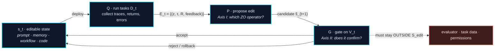

# Awesome Harness Optimization

**A curated, theory-organized reading list on Harness Optimization (HarnessOpt): how the software system *around* a frozen LLM proposes, validates, and persists edits to itself.**

[](https://awesome.re)
[](#contributing)
[](LICENSE)

**English** | [中文](README_zh.md)

> **What makes this list different.** Existing lists organize self-improving agents by *what object gets edited* (prompt → memory → workflow → code). That axis is necessary but not sufficient: it tells you nothing about **how a modification proposal is formed under a gradient-free information structure**, or **whether an accepted modification is statistically justified**. This list adds those two orthogonal axes:
>
> - **[Axis I — Zeroth-Order (ZO) view](#axis-i--the-zeroth-order-view-of-harnessopt):** the optimizer can only *deploy a candidate, run tasks, and observe returns*. Which classical ZO operator does each method actually instantiate — and does the editable surface even admit that operator?
> - **[Axis II — PAC / stability view](#axis-ii--pac--stability-analysis-of-harnessopt):** two non-interchangeable bounds govern HarnessOpt. Update stability ($\beta_{\exp}$) controls whether a single rollout can hijack the update; independent confirmation controls whether a selected candidate generalizes. Most published systems satisfy neither cleanly, and this list says *which one* each violates.

---

## Table of Contents

- [Scope](#scope)
- [The HarnessOpt Update Loop](#the-harnessopt-update-loop)
- [Axis 0 — The Editable Surface (L0–L5)](#axis-0--the-editable-surface-l0l5)
- [**Axis I — The Zeroth-Order View of HarnessOpt**](#axis-i--the-zeroth-order-view-of-harnessopt)
  - [I.1 Why zeroth-order](#i1-why-zeroth-order)
  - [I.2 Operator taxonomy (the main ZO table)](#i2-operator-taxonomy-the-main-zo-table)
  - [I.3 Operator implementability depends on surface structure](#i3-operator-implementability-depends-on-surface-structure)
  - [I.4 The extra oracle tier: feasibility checks](#i4-the-extra-oracle-tier-feasibility-checks)
  - [I.5 Evidence drift: ZO estimation is on-policy](#i5-evidence-drift-zo-estimation-is-on-policy)
- [**Axis II — PAC / Stability Analysis of HarnessOpt**](#axis-ii--pac--stability-analysis-of-harnessopt)
  - [II.1 Two single-round bounds and their division of labor](#ii1-two-single-round-bounds-and-their-division-of-labor)
  - [II.2 Multi-round reuse: the reachable-set confirmation bound](#ii2-multi-round-reuse-the-reachable-set-confirmation-bound)
  - [II.3 Acceptance thresholds and exact rollback](#ii3-acceptance-thresholds-and-exact-rollback)
  - [II.4 Stratified validation: average non-regression hides tail collapse](#ii4-stratified-validation-average-non-regression-hides-tail-collapse)
  - [II.5 Two drifts that must not be conflated](#ii5-two-drifts-that-must-not-be-conflated)
  - [II.6 **Stability & confirmation audit of the literature**](#ii6-stability--confirmation-audit-of-the-literature)
- [Paper List](#paper-list)
  - [1. Foundations and the Guarantee Ladder](#1-foundations-and-the-guarantee-ladder)
  - [**2. The Editable Surface: L0–L5**](#2-the-editable-surface-l0l5)
    - [2.1 L0 — Instruction prompts](#21-l0--instruction-prompts)
    - [2.2 L1 — Context, memory, and skill libraries](#22-l1--context-memory-and-skill-libraries)
    - [2.3 L2 — Agentic workflow and architecture search](#23-l2--agentic-workflow-and-architecture-search)
    - [2.4 L3 — Self-modifying harness code](#24-l3--self-modifying-harness-code)
    - [2.5 L4 — Optimizer and meta-harness code](#25-l4--optimizer-and-meta-harness-code)
    - [2.6 L5 — Joint harness and weight optimization (boundary)](#26-l5--joint-harness-and-weight-optimization-boundary)
  - [3. Re-indexed by Axis I: which ZO operator forms the proposal](#3-re-indexed-by-axis-i-which-zo-operator-forms-the-proposal)
  - [4. Re-indexed by Axis II: what the validation protocol licenses](#4-re-indexed-by-axis-ii-what-the-validation-protocol-licenses)
  - [5. Evaluators and Benchmarks](#5-evaluators-and-benchmarks)
  - [6. Failure Modes](#6-failure-modes)
  - [7. Related Surveys and Adjacent Areas](#7-related-surveys-and-adjacent-areas)
- [Reporting Checklist](#reporting-checklist)
- [Open Problems and Future Directions](#open-problems-and-future-directions)
- [Companion Documents](#companion-documents)
- [Contributing](#contributing)
- [Citation](#citation)

---

## Scope

**Working definition.** Fix a base model $M$, a task distribution $\mathcal{D}$, and an external evaluation boundary. Let $s$ be *model-external* software state — prompts, context, memory, workflow graphs, tool interfaces, agent code, optimizer code. The harness executes a task $z$ as $\tau = H_s(M, z)$. **HarnessOpt** is any procedure that repeatedly (i) runs the system to collect evidence, (ii) proposes edits to $s$ from that evidence, and (iii) decides via some accept/reject/rollback rule which edits persist.

**In focus.** Work where model-external state is modified *using run-time feedback*, with base model frozen. This includes prompt optimization, self-evolving memory/skills, workflow search, self-modifying agent code, meta-optimizer code, and the evaluators/benchmarks such loops optimize against.

**Boundary cases.** L5 (joint harness + weights) is included as a boundary, not as the core. Pure weight-side self-improvement (self-play, RLVR, synthetic data) and hand-authored harness *design* (ReAct, SWE-agent, MCP) are listed only in [§7](#7-related-surveys-and-adjacent-areas) to mark the edge.

**Three sentence types are kept separate throughout**, per the discipline this list tries to enforce:
- **[Lit]** a factual claim attributable to a specific paper;
- **[Ana]** this list's own comparative analysis under a unified frame — not the original paper's claim;
- **[Rec]** a recommendation or protocol proposal, phrased as such, never as current practice.

---

## The HarnessOpt Update Loop

Four components, one update:

$$
\underbrace{\mathcal{E}_t = Q(s_t; D_t)}_{\text{collect evidence}}
\qquad
\underbrace{\tilde{s}_{t+1} = P(s_t, \mathcal{E}_t)}_{\text{propose edit}}
\qquad
\underbrace{s_{t+1} = G(s_t, \tilde{s}_{t+1}; V_t)}_{\text{gate: accept / reject / rollback}}
$$



Three conditions define a HarnessOpt system; everything else is a *protocol option*, not part of the definition:

1. the base model and the external evaluation boundary are fixed for the round;
2. edits target an explicitly delimited editable state set $\mathcal{S}_{\mathrm{edit}}$;
3. candidates undergo some accept / reject / rollback treatment whose outcome affects later state.

> **[Ana]** Allowlists, compile gates, smoke tests, independent validation, statistical dead-zones, and human review are *how well* a system does step 3 — they are the subject of [Axis II](#axis-ii--pac--stability-analysis-of-harnessopt), not entry requirements.

---

## Axis 0 — The Editable Surface (L0–L5)

The object axis, kept as scaffolding for the two analytical axes. It answers **"what can be changed"** — not how, and not whether the change was justified. **The six rungs and their papers are in [§2](#2-the-editable-surface-l0l5), in one section.** What follows here is the part the level number hides.

### Three discriminating sub-axes (the part the level number hides)

**[Ana]** The level of an editable object says little about the *actual* action space. Three properties do:

| Sub-axis | Question | Why it matters |
|---|---|---|
| **Write authority** | Does the agent write autonomously, or only after human review? | Determines whether the loop is closed at all |
| **Persistence** | Ephemeral sandbox run, or committed to versioned state? | Determines whether an error can accumulate |
| **Constraint enforcement** | Declared in the prompt, or enforced by permissions / sandbox / hidden evaluator / static checks? | Determines whether [PAC premise (iii)](#ii1-two-single-round-bounds-and-their-division-of-labor) holds at all |

> **[Ana] Editable-surface size and gate strength are not conserved quantities.** A system whose surface covers control flow and executable code is *not* thereby more rigorously gated; some of the largest surfaces ship with the weakest confirmation. Do not infer gate strength from level number. See the [audit table](#ii6-stability--confirmation-audit-of-the-literature).

---

## Axis I — The Zeroth-Order View of HarnessOpt

*The classification axis here is singular: **through what zeroth-order information structure does run evidence enter a modification proposal?** This is orthogonal to Axis 0 — the same ZO operator can act at any level, and the same level can host different operators.*

### I.1 Why zeroth-order

$\mathcal{S}_{\mathrm{edit}}$ consists of discrete text, programs, and file structures; the composition $H_s \circ M$ is non-differentiable. So $\nabla_s f_M(s)$ is unavailable, where

$$
f_M(s) = \mathbb{E}_{z \sim \mathcal{D}}\big[R(H_s(M, z))\big].
$$

**[Ana]** What makes a method zeroth-order is *not* that its variables are numeric. It is that **the optimizer can only obtain objective information by querying an oracle**. In HarnessOpt the optimizer can only: deploy a candidate state → let the agent run tasks → observe scores and traces → decide how to edit. A single run yields a stochastic observation $Y(s,z) = R(H_s(M,z))$; the empirical mean over runs estimates $f_M(s)$. Randomness comes from task sampling, model sampling, and environment execution — the optimizer is never required to construct an explicit perturbation direction.

**One substantive departure from classical ZO: the query returns semantics, not just a scalar.**

$$
\mathcal{E}_t = \{(z_i, \tau_i, R_i, \mathrm{feedback}_i)\}_{i=1}^{n_t}
$$

Traces, error logs, stack traces, and test results *localize* failure and *suggest* what to edit. SkillOpt-Lite frames this as **language-mediated program compilation**: the editable state is a program in natural language or code, the rollout is its execution trace, and the LLM optimizer patches from that trace. **[Lit]**

Two caveats must be stated together, or the analogy becomes an overclaim:

- Semantic side-information does **not** remove the constraint that objective information is only obtainable by running.
- **A readable trace is not correct attribution**, and correct attribution is not statistical evidence that a candidate should be accepted. Reported step-level attribution accuracy sits in a low range, and regression prediction has markedly lower precision/recall than fix prediction. **[Lit]**

> **Insight 1 (Conceptual divergence).** Classical ZO perturbs blindly because it cannot inspect the function. HarnessOpt reads execution traces and performs targeted, semantics-driven debugging — but under the *same* query-only budget constraint. The gain is proposal quality, not oracle access.

### I.2 Operator taxonomy (the main ZO table)

Starting from the SkillOpt-Lite operator map and extended with two rows this list adds (adaptive scheduling; population & archive) so that evolutionary-search methods have a home on this axis.

**Read the third column carefully: it names the mechanism that plays the same *role*, not an implementation of the continuous estimator.**

| ZO operator | Classical form | Mechanism playing the same role in HarnessOpt | Representative work |
|---|---|---|---|
| **Zeroth-order oracle** | $f(s + \mu u)$ | Sandbox / environment feedback; a scalar task metric | all of the below |
| **One-point estimate** | $\widehat{\nabla} f \propto f(s+\mu u)\, u$ | A single trajectory or single exception directly drives one edit | Reflexion, Voyager, Dynamic Cheatsheet |
| **Multi-point / mini-batch** | $\frac{1}{b}\sum_{i=1}^{b}\big[f(s+\mu u_i) - f(s)\big] u_i$ | Batch rollouts aggregated before proposing; **consensus mining** requires the edit to rest on a cross-task reproducible pattern, not a single anomaly | SkillOpt ($B_m{=}8$ mini-batching), SkillOpt-Lite (consensus mining), Trace2Skill (map-reduce patch merge), SkillForge (batch ticket pool), ExpeL |
| **Central difference** | $\dfrac{f(s+\mu u) - f(s-\mu u)}{2\mu}$ | Success/failure trace contrast localized at the action-divergence point; or on/off A-B run of the same candidate | SkillCAT (CCE operator at divergence point $w_i$), ProTeGi, TextGrad, DemoEvolve; feature-toggle implementations |
| **ZO coordinate descent** | $\dfrac{f(s+\mu e_i) - f(s)}{\mu} e_i$ | Fault-isolated atomic modification: one module / file / entry changed, rest held fixed | SkillAdaptor (faulty step $t^*$ as axis), Trace2Skill, SkillForge, Meta-Harness |
| **Trust region** | $s_{k+1} \in \mathcal{B}(s_k, \Delta_k)$ | Edit budget, minimal-modification principle, allowlist path restriction, interface-signature invariance | SkillOpt (budget decay $L_t: 4 \to 2$), SkillOpt-Lite, SoftSkill (prefix bounded at $m{=}32$), HarnessOpt allowlist + $\Delta$ |
| **Control variate** | $\hat{g}_{\mathrm{cv}} = \hat{g} - c + \mathbb{E}[c]$ | Rejected-edit buffer steering later proposals away from known-dead directions; paired replay cancelling common randomness | SkillOpt rejected buffer, GEPA, Meta-Harness |
| **Adaptive step / momentum** *(added)* | step size scheduled from improvement history | Exploration budget and candidate sampling scheduled by fitness-improvement trajectory | AdaEvolve, ShinkaEvolve, AlphaEvolve, ThetaEvolve |
| **Population & archive** *(added)* | $\tilde{s} \in \operatorname{Select}(\mathcal{A}_t; R)$ | Elitism, island models, novelty rejection sampling, Pareto selection | Promptbreeder, ADAS, AFlow, AgentSquare, ELM, AlphaEvolve, ShinkaEvolve, DGM, GEPA |
| **Confirmation gate** | one-shot evaluation on independent samples | compile → smoke → full staged confirmation; held-out selection | SkillOpt, SkillOpt-Lite, Self-Harness, SkillForge |

**[Ana] One restatement worth making honestly.** SkillOpt describes its mechanism with first-order vocabulary — learning rate, momentum, mini-batch. Structurally it is closer to **a (1+1)-ES / stochastic hill-climber with a structured proposal operator**: the edit budget $L_t$ is a proposal radius, the rejected buffer is negative conditioning of the proposal distribution, "slow update" is a low-frequency component across epochs, and the acceptance rule is strict-improvement-on-held-out. Saying so does not weaken the method; it clarifies that the ZO map organizes *information structure*, and does not license treating these mechanisms as gradient-descent equivalents.

### I.3 Operator implementability depends on surface structure

**This is the real dependency between Axis 0 and Axis I** — and it is not monotone in level. It is not that "higher levels get stronger operators"; it is that **specific operators require specific structure from the editable surface.**

| Operator | Requires the surface to provide | Structure absent (typical: plain-text artifact) | Structure present (typical: versioned executable code) |
|---|---|---|---|
| **Central difference** | **A constructible negative direction** | Only heuristic contrast at trace divergence points; $s - \mu u$ cannot actually be built | Feature toggles make on/off versions of one harness co-runnable in the same batch — $s-\mu u$ is a genuinely deployable state |
| **Coordinate descent** | **Objective block boundaries** | Text "coordinates" are not orthogonal; paragraph splits are arbitrary — it is block-coordinate descent with no objective block definition | Import graph and interface signatures give objective boundaries; intra-block edits and inter-block dependencies are statically decidable |
| **Control variate** | **Pairable replay** | The rejected buffer has no explicit random variate $c$, no known $\mathbb{E}[c]$, no unbiased correction — variance reduction is unverifiable | Deterministic seeds + version control make paired comparison real; common randomness genuinely cancels |
| **Multi-point / mini-batch** | **Perturbations, not just resampled tasks** | What varies across the batch is the task $z_i$, not the perturbation $u_i$ — this estimates $f$ under task noise, not a directional derivative | Same caveat holds; the honest reading is *variance reduction over $\mathcal{D}$*, which is what stability ([Axis II](#ii1-two-single-round-bounds-and-their-division-of-labor)) actually needs |
| **Trust region** | **A measurable behavioral distance** | Edit count is not a reliable semantic distance: one word can change behavior drastically; ten lines of commentary may change nothing | Radius can use harder quantities: files touched, cross-module reach, interface-signature change, smoke pass rate. Allowlist = static trust region; $\Delta$ = return-side trust region |

> **[Rec]** A text-space trust region that actually approximates behavioral distance should jointly account for files changed, lines changed, modules crossed, behavioral-test diff, tool-call distribution shift, and output distribution shift — not merely a token or edit-count cap.

> **[Ana]** This table is why allowlists, feature toggles, and versioned rollback are **not** bolt-on safety measures. They are the preconditions that make the corresponding ZO operators implementable at all — and, per [Proposition A](#ii2-multi-round-reuse-the-reachable-set-confirmation-bound), they also tighten the confirmation bound.

### I.4 The extra oracle tier: feasibility checks

Classical ZO models one oracle: give a candidate, get a (noisy) objective value. HarnessOpt has **two tiers whose costs differ by orders of magnitude**:

$$
\underbrace{\text{compile / type-check / static analysis}}_{\text{feasibility oracle: no task rollout, returns feasible/infeasible}}
\;\longrightarrow\;
\underbrace{\text{smoke test } (N \text{ small})}_{\text{cheap, high-variance estimate}}
\;\longrightarrow\;
\underbrace{\text{full validation}}_{\text{expensive, low-variance}}
$$

Two consequences:

1. **[Ana]** Optimal query allocation is no longer "split the budget evenly across candidates" — cheap filtering shrinks the candidate set first, and only survivors consume rollouts.
2. **[Ana]** **The form of the editable surface determines the strength of the feasibility oracle.** Executable code is checkable by a compiler and a type system; a natural-language artifact has no comparable zero-rollout feasibility criterion. This is a structural search-efficiency advantage of code-level HarnessOpt over skill-level optimization, and the actual reason for the compile → smoke → full ordering.

> **[Rec] Do not call this a "zero-cost oracle."** It is a pre-run feasibility check. It consumes compute; it just does not consume task rollouts. The distinction matters when reporting query budgets.

### I.5 Evidence drift: ZO estimation is on-policy

**[Ana]** The evidence distribution sampled by $Q$ depends on the current state $s_t$. Therefore $\mathcal{E}_t$ is **on-policy evidence**, and the optimizer's information about the neighborhood of $s_t$ is a biased sample.

Concrete failure mode: once a class of failure is fixed, it stops appearing in later traces; the optimizer thereby loses the evidence that the constraint is still necessary, and may **revert it in a later round**. This is homologous to coverage deficiency in off-policy evaluation, but here it acts on *constraint retention*, not on value estimation.

This is a **bias problem of the ZO estimator, not a generalization-bound problem** — the distinction matters, see [II.5](#ii5-two-drifts-that-must-not-be-conflated). Current work mitigates it engineering-wise with regression suites, held-in sets, and milestone replay. **[Ana]** This list states it as an identified but unsolved mechanism and deliberately gives no bound: a bound would require modeling $P$'s behavior, and the assumptions would outweigh the conclusion.

---

## Axis II — PAC / Stability Analysis of HarnessOpt

*Axis I explains how candidates are produced. Axis II answers the harder question: **under what conditions may one stochastic trial be promoted to persistent state?** This section extends the two single-round bounds of skill optimization into the multi-round, drifting, code-editing setting of HarnessOpt.*

**Setup.** Base model $M$ fixed, task $z \sim \mathcal{D}$, editable state $s \in \mathcal{S}$, trajectory $\tau = H_s(M,z)$, bounded return $R(\tau) \in [0,1]$, loss $\ell(s;z) = 1 - R(H_s(M,z))$, risk $\epsilon(s) = \mathbb{E}_{z\sim\mathcal{D}}[\ell(s;z)]$.

### II.1 Two single-round bounds and their division of labor

A candidate that scores higher on already-observed tasks is not thereby better on $\mathcal{D}$. Two distinct bounds address two distinct ways that inference can fail.

**(B1) Update side — algorithmic stability.** Let $D_N$ be the training tasks, $\mathcal{A}$ the update algorithm, $s_D = \mathcal{A}(D_N)$, and $s_{D^{\setminus i}} = \mathcal{A}(D_N^{\setminus i})$. Expected on-average stability is

$$
\beta_{\exp} = \mathbb{E}_{D_N,\, i,\, z\sim\mathcal{D}}\Big[\big|\ell(s_D; z) - \ell(s_{D^{\setminus i}}; z)\big|\Big],
$$

and under bounded loss with the corresponding stability condition,

$$
\boxed{\;\epsilon(s_D) \;\le\; \widehat{\epsilon}_{D_N}(s_D) \;+\; O\!\left(\beta_{\exp} + \sqrt{\tfrac{\ln(1/\delta)}{N}}\right)\;}
$$

**[Ana]** $\beta_{\exp}$ measures the sensitivity of the whole update process — $Q$, evidence aggregation, and $P$ jointly — to a single rollout anomaly. Case-by-case hardcoding, mimicking environment variables unique to one failed trial, and branching on episode-specific strings all inflate $\beta_{\exp}$ and produce generalization collapse. Cross-task aggregation, consensus mining, and bounded edits reduce it. **This is the statistical content of the mini-batch / consensus row in the [ZO table](#i2-operator-taxonomy-the-main-zo-table)** — the two axes meet here.

**(B2) Confirmation side — independent validation.** If $V_m$ ($m$ i.i.d. tasks) is independent of both the training data and the proposal process, then for a *fixed* candidate $\tilde{s}$ not generated using $V_m$,

$$
\boxed{\;\epsilon(\tilde{s}) \;\le\; \widehat{\epsilon}_{V_m}(\tilde{s}) \;+\; O\!\left(\sqrt{\tfrac{\ln(1/\delta)}{m}}\right)\;}
$$

However unstable the update algorithm was, independent validation only cares how the final artifact performs on unseen samples — $\beta_{\exp}$ is **completely removed** from the bound.

> **Insight 2 (Stability).** A robust HarnessOpt update algorithm acts as a $\beta_{\exp}$-stabilizing operator: text/code mutations must be invariant to single-trial anomalies, so that what survives is cross-task structural invariance rather than a memorized trajectory.

> **Insight 3 (Independent validation).** The validation set carries a dual mandate: **strict statistical independence** from the data and the proposal process, and **sufficient size $m$** to suppress $O(\sqrt{\ln(1/\delta)/m})$. Failing either voids the confirmation reading, not merely weakens it.

#### The division of labor is the point

> **[Ana]** **(B1) and (B2) are not additive and not substitutable.** (B1) governs "was the update process hijacked by a single rollout" — the gap from $\widehat{\epsilon}_{D_N}$ to $\epsilon$. (B2) governs "did repeatedly selecting on one validation set create selection bias" — the gap from $\widehat{\epsilon}_{V_m}$ to $\epsilon$. **An update process with tiny $\beta_{\exp}$ can still catastrophically overfit $V_m$ across rounds, and vice versa.**
>
> Therefore **consensus mining (lowering $\beta_{\exp}$) and validation rotation (lowering selection bias) solve different problems and cannot replace each other.** The literature routinely calls both "improving generalization," which hides this split.

**Acceptance criterion.** Let $\widehat{R}_{V_m}(s)$ be mean validation return and $\widehat{\Delta}_{V_m} = \widehat{R}_{V_m}(\tilde{s}) - \widehat{R}_{V_m}(s_t)$. The gate $G$ writes back only when $\widehat{\Delta}_{V_m}$ exceeds a statistical dead-zone $\Delta$ *and* the key non-regression checks pass. Candidate count, repeated inspection of validation results, and cross-round reuse all change the statistical conditions required — which is exactly what [II.2](#ii2-multi-round-reuse-the-reachable-set-confirmation-bound) quantifies.

#### The three premises of (B2), and how each fails in practice

| Premise | Content | How it fails in HarnessOpt |
|---|---|---|
| **(i) Independence** | $V_m$ independent of the proposal process | Fixed selection sets are repeatedly `argmax`-ed across rounds. When tasks are expensive, many systems skip an independent split entirely and substitute manual inspection + string-leak audits — a defensible engineering trade-off, but **not** equivalent to independence, and the equivalence is rarely argued |
| **(ii) Bounded signal bias** | Evaluation signal's bias is bounded | Compile-pass, a few smoke tests, or visible tests show a candidate *runs*, not that it meets the spec. **Structurally hardest for semantic modifications:** anything automatically checkable has usually already been made a gate; what is left to declarative constraints is precisely what automatic checking cannot establish — and the agent's only self-verification signal is task success, while one class of constraint exists specifically to prevent fabricated success evidence. Here "bounded bias" is not a conservative assumption; it is typically false |
| **(iii) Evaluator outside $\mathcal{S}_{\mathrm{edit}}$** | The measuring apparatus is not editable | **Most fragile, for a structural reason: the evaluator and the evaluated live in the same repository.** Existing self-evolution risk analyses assume the apparatus sits outside the evolving surface; HarnessOpt's defining feature makes that assumption false. Observed behaviors include deleting logging to bypass detection functions and pre-seeding the environment to obtain reward without completing the actual flow; goal hijacking is more frequent when the detection function is *not* hidden. **[Lit]** |

> **[Ana] Attribution accuracy upper-bounds the post-hoc-rollback route.** Premises (i)–(iii) ask "is the improvement real." A separate question is "can a regression be *detected and undone*." Reported step-level attribution accuracy is low, regression-prediction precision/recall are well below fix-prediction, and a substantial fraction of real regressions is never foreseen. So a "predict → check → roll back" strategy has a safety ceiling set by attribution accuracy. **Pre-hoc gates (compile, sandbox, hiding, permissions) and post-hoc rollback are different-strength instruments and should not be described interchangeably.**

### II.2 Multi-round reuse: the reachable-set confirmation bound

**[Ana] The multi-round loop breaks exactly premise (i) of (B2):** $\tilde{s}_{t+1}$ depends on $V$ through the accept/reject decisions of rounds $1..t$. This subsection recovers a usable bound *without* assuming independence, by bounding the hypothesis class that was actually tested.

**Reference point — STOP Lemma 1.** For alphabet $\Sigma$ and programs of length $\le l$, uniform convergence of empirical meta-utility gives slack $\epsilon = \sqrt{\frac{1}{n}(l\ln|\Sigma| + \ln\frac{1}{\delta})}$ via Chernoff + union bound over $|\Sigma|^{l+1}$ programs. **[Lit]** Its union bound ranges over a *static* hypothesis class — all programs of length $\le l$ — because it does not assume improvement starts from a fixed program.

**[Ana] HarnessOpt has two things STOP does not, and they turn that static class into a much smaller reachable set:**

- **A1 (anchored start).** $s_0$ is fixed before optimization begins and does not depend on $V$. In HarnessOpt this holds naturally: the Round-0 artifact is an audit object and is necessarily fixed.
- **A2 (bounded per-round edit).** There exists $L$ such that the difference between $\tilde{s}_{t+1}$ and $s_t$ is describable by an edit script of length $\le L$ over $\Sigma$. This is the direct product of the trust-region / minimal-edit principle in [I.2](#i2-operator-taxonomy-the-main-zo-table).

Under A1–A2, the set $\mathcal{H}_T$ of **all states ever proposed or tested** within $T$ rounds satisfies $\ln|\mathcal{H}_T| \le T(L+1)\ln|\Sigma|$. *(The count must cover rejected candidates too — the union bound has to cover everything ever evaluated on $V_m$, not only what was accepted.)*

> **Proposition A (uniform confirmation under validation reuse).** Let $V_m$ be $m$ i.i.d. tasks, loss bounded in $[0,1]$, and A1–A2 hold. Then with probability $\ge 1-\delta$, simultaneously for all $s \in \mathcal{H}_T$:
>
> $$\epsilon(s) \;\le\; \widehat{\epsilon}_{V_m}(s) + \sqrt{\frac{T(L+1)\ln|\Sigma| + \ln(1/\delta)}{2m}}$$
>
> In particular it holds for the final state $s_T$, **without requiring $s_T \perp V_m$** — which is exactly what multi-round reuse needs.
>
> *Proof.* Hoeffding for a single fixed $s$, then union bound over $\mathcal{H}_T$ with the count above. $\square$

Write $\eta_T := \sqrt{\frac{T(L+1)\ln|\Sigma| + \ln(1/\delta)}{2m}}$. Three consequences follow directly.

**A-1 — $\sqrt{T}$ degradation.** The slack grows as $\sqrt{T}$. **Evolution rounds themselves consume statistical budget:** each round looks at the same validation set once more, and the reachable class grows accordingly. This turns "evolution erodes its own generalization guarantee" from a qualitative remark into a statement with a definite rate, and gives the dynamic version of STOP's $l\ln|\Sigma|$ term.

**A-2 — required validation-set growth.** To hold the slack under $\epsilon$:

$$
m \;\ge\; \frac{T(L+1)\ln|\Sigma| + \ln(1/\delta)}{2\epsilon^2}
$$

**[Ana]** i.e. **under a fixed validation set, the affordable number of evolution rounds scales linearly with $m$.** This collides with practice: skill-optimization work reports high variance on small validation splits, and harness work on expensive terminal benchmarks often declines to carve an independent split at all. Both sit in the small-$m$, non-small-$T$ regime.

**A-3 — the statistical role of the edit budget.** Let $l_{\mathrm{eff}} := T(L+1)$. Proposition A has the same form as STOP Lemma 1 with $l \to l_{\mathrm{eff}}$. Hence:

> **Under an anchored start, what determines the tightness of the confirmation bound is not the program size of the harness, but the cumulative edit budget spent.**

When $T(L+1) < |s_T|$, Proposition A is strictly stronger than a union bound over program space. **[Ana] This gives trust-region / minimal-edit a justification that has not, to our knowledge, been stated: it does not merely reduce proposal variance — it directly tightens the confirmation bound.** Conversely, unbudgeted whole-file rewrites drive $L \approx |s|$ and collapse back to STOP's magnitude.

#### Proposition A′ — validation rotation reduces $T$ to $\ln T$

> **Proposition A′.** If round $t$ uses a fresh validation set $V^{(t)}$ ($|V^{(t)}| = m$) independent of all prior rounds and of the proposal process, then applying (B2) per round with $\delta_t = \delta/T$ and union-bounding gives, with probability $\ge 1-\delta$, simultaneously for all $t$:
>
> $$\epsilon(\tilde{s}_{t+1}) \;\le\; \widehat{\epsilon}_{V^{(t)}}(\tilde{s}_{t+1}) + \sqrt{\frac{\ln T + \ln(1/\delta)}{2m}}$$

The dependence on $T$ drops from linear to logarithmic. The cost is $Tm$ total task consumption instead of $m$.

> **[Rec] This is the most actionable product of the analysis.** It converts "rotate your validation set" from a vague good habit into a design rule with a quantified payoff, and it states the trade-off explicitly: **if the marginal cost of fresh tasks is below $\sqrt{T/\ln T}$ times the cost of enlarging the validation set, rotate rather than enlarge.** Most current work reuses a fixed selection set.

#### Assumption audit (where this can break)

- **A1** holds naturally, *unless* Round-0 itself consumed tasks later used for confirmation. **[Rec]** This should be an explicitly reported field.
- **A2 is the genuine weak point.** Edit-script length is measurable (diff size), but "$\le L$ edits" $\ne$ "edit script of length $\le L$": a small number of edits can insert a great deal of code. **[Rec] If citing Proposition A, $L$ must be defined as the *description length* of the edit (e.g. diff bytes), not the edit count.** An allowlist shrinks the reachable set further (only whitelisted paths are writable), making the count tighter.
- **Out of scope for Proposition A:** if $P$ can call external retrieval and write arbitrarily long content into the state (e.g. pulling code from the internet into the harness), $L$ is effectively unbounded and the proposition does not apply. This case should be excluded explicitly rather than silently.
- Bounded loss and i.i.d. sampling are the same assumptions as (B1)/(B2) — no new burden.

### II.3 Acceptance thresholds and exact rollback

> **Proposition B (accepted improvements are real).** With $\eta_T$ as above, if the acceptance criterion uses $\Delta > 2\eta_T$, then with probability $\ge 1-\delta$ every accepted update satisfies $\epsilon(s_{t+1}) < \epsilon(s_t)$.
>
> *Proof.* On the uniform event of Proposition A, $|\widehat{\epsilon} - \epsilon| \le \eta_T$ holds simultaneously for $s_t$ and $\tilde{s}_{t+1}$, so the true risk gap differs from the empirical gap by at most $2\eta_T$. $\square$

**B-1 — $\Delta$ and $L$ are not independent knobs.** The lower bound on $\Delta$ increases monotonically in $L$. **Relaxing the edit budget requires raising the acceptance threshold in step, or the gate loses meaning.** **[Ana]** Current practice treats $\Delta$ as an empirical noise estimate and $L$ as a proposal-quality control, tuned independently; Proposition B says that is inconsistent.

**B-2 — monotone improvement requires exact rollback.** Proposition B only guarantees that *accepted* updates truly improve. To conclude $\epsilon(s_T) \le \epsilon(s_0)$ one additionally needs rejected proposals to leave no residue: if after rejecting $\tilde{s}_{t+1}$ the equality $s_{t+1} = s_t$ holds **behaviorally and strictly**, then the risk sequence $\epsilon(s_0) \ge \epsilon(s_1) \ge \cdots$ is monotone non-increasing within the same $1-\delta$ event.

> **[Ana] This promotes a systems property into a theorem premise.** "Rollback restores state exactly" is not an engineering-tidiness concern — it is a *necessary condition for the monotonicity conclusion*. Uncleaned side effects (lingering processes, registry entries, cache files, already-written memory entries) make $s_{t+1} \ne s_t$ and monotonicity fails. This is the statistical counterpart of the **revertible-effects / temporal-composability** requirement, and it is why a `git` rollback that does not cover runtime side effects is insufficient.

### II.4 Stratified validation: average non-regression hides tail collapse

Propositions A and B give non-regression **in the average sense only**: $\epsilon$ is an expectation over $\mathcal{D}$ and $V_m$ is drawn i.i.d. from $\mathcal{D}$. If a capability cluster $A_k$ carries probability mass $p_k$ under $\mathcal{D}$, degradation confined to $A_k$ goes entirely undetected by the gate as long as it stays below $\eta_T / p_k$.

> **Proposition C (stratified validation is necessary).** Under an i.i.d. validation set with an average-return acceptance criterion, one cannot rule out intra-cluster degradation of magnitude up to $O(\eta_T / p_k)$ for a cluster of mass $p_k$. To obtain an $\epsilon_k$-level guarantee per cluster, each cluster requires independent sampling with
>
> $$m_k = \Omega\!\left(\frac{T(L+1)\ln|\Sigma| + \ln(K/\delta)}{\epsilon_k^2}\right)$$
>
> *Proof.* Apply Proposition A per cluster and union-bound over $K$ clusters ($\delta \to \delta/K$). $\square$

> **[Ana] Tail capabilities (small $p_k$) are statistically invisible under an average criterion.** This explains how "aggregate score rises while individual milestones are permanently lost" can occur without violating any bound in force. **[Rec] Non-regression suites must be stratified and reported per cluster, not merged into the main validation set and averaged.**

**Forgetting in a non-parametric setting.** With no weights to speak of, forgetting can only be defined on task-set performance. For clusters $A_1,\dots,A_K$:

$$
\mathrm{FGT}_T = \frac{1}{K}\sum_{k=1}^{K}\Big[\max_{t \le T}\widehat{R}_{A_k}(s_t) - \widehat{R}_{A_k}(s_T)\Big]_+
$$

**[Ana]** Formally this matches FGT in the continual-learning literature, but with one substantive difference: **CL forgetting arises from parameter overwriting; here it arises from an explicit edit, and is therefore in principle attributable to a specific diff.** That is an advantage of the non-parametric setting and should be exploited — *attributable* vs *non-attributable* forgetting is a distinction worth reporting.

### II.5 Two drifts that must not be conflated

**[Ana]** "Harness edits change the downstream behavior distribution" is repeated often and formalized rarely. It conflates two things with different homes.

| | **D1 — Target distribution drift** | **D2 — Evidence distribution drift** |
|---|---|---|
| **What moves** | The task distribution itself, $z \sim \mathcal{D}_t$ | The trajectory-generating distribution, hence the distribution of $\mathcal{E}_t$ sampled by $Q$ |
| **What it breaks** | The *applicability object* of the generalization bound | The *unbiasedness* of the zeroth-order estimate |
| **Home** | Axis II (this section) | [Axis I.5](#i5-evidence-drift-zo-estimation-is-on-policy) |
| **Treatment** | Standard: add a divergence $d(\mathcal{D}_{t-1},\mathcal{D}_t)$ (TV, $\mathcal{H}$-divergence, discrepancy) and accumulate | Requires modeling $P$'s behavior; **this list states the mechanism and deliberately gives no bound** |

For D1 the accumulated form is

$$
\epsilon_{\mathcal{D}_T}(s_T) \;\le\; \widehat{\epsilon}_{V_m}(s_T) + \eta_T + \sum_{t=1}^{T} d(\mathcal{D}_{t-1}, \mathcal{D}_t).
$$

**[Ana]** Technically routine, but with a specific consequence for HarnessOpt: **the drift term accumulates linearly while $\eta_T$ grows only as $\sqrt{T}$, so on a long enough horizon drift — not selection bias — becomes the dominant error term.** That yields a checkable criterion for *when to re-run Round-0 from scratch instead of continuing incremental evolution*.

### II.6 Stability & confirmation audit of the literature

**[Ana]** This is the table this list exists to provide. Each system is classified by **which of the two bounds its protocol can support** — not by whether it "ran a test." The decisive question is not whether tests were run, but **whether a test result can stop a candidate from entering persistent state**, and **whether the set used for that decision is reused across rounds**.

**Legend.** ✅ satisfied · ⚠️ partial / conditional · ❌ not satisfied · — not applicable

| Protocol class | Mechanism | Representative work | (B1) $\beta_{\exp}$ control | (B2) independent confirmation | Multi-round status |
|---|---|---|---|---|---|
| **Open loop** *(no independent confirmation)* | Experience is written straight into later state; no candidate test, no failure recovery | Reflexion, Voyager, ExpeL, Dynamic Cheatsheet, ReasoningBank, Memp, ACE, AWM, MemAct, Continual Harness | ❌ mostly single-trajectory updates → high $\beta_{\exp}$ | ❌ premise (i) absent by construction | Only experience accumulation can be discussed; no confirmation reading |
| **Same-set scoring & selection** | Score / elitism / archive on the *search* tasks; test reported separately at the end | APE, OPRO, Promptbreeder, DSPy, MIPROv2, ADAS, AFlow, MaAS, AgentSquare, ELM, AlphaEvolve, ShinkaEvolve, ThetaEvolve, DGM, SICA | ⚠️ population averaging damps single-sample effects, but no explicit stability mechanism | ❌ candidates depend on repeatedly-observed tasks; independence fails | **Proposition A is the applicable reading**, with $\eta_T$ growing in $T$ and $L$; a naked final test score overstates confirmation |
| **Independent validation & rollback** | Candidate confirmed on a disjoint validation set, or via retrospective prediction + version test; failures rejected or rolled back | SkillOpt, SkillOpt-Lite, GEPA, SkillForge, SkillCAT, DemoEvolve, Self-Harness, Meta-Harness; AHE (retrospective) | ✅ consensus mining / batch aggregation / tree reduction explicitly target $\beta_{\exp}$ | ⚠️ premise (i) holds at round 1; **degrades across rounds unless the set is rotated** | **Proposition A′ applies if rotated; otherwise Proposition A**. Report $T$, $L$, $m$, reuse count |

**Per-system notes on the confirmation premise** — the specific way each compromises it:

- **[Lit]** Reflexion bypasses dynamic validation entirely in an open loop.
- **[Lit]** SkillCAT, SkillAdaptor, and Trace2Skill run their gates either on direct clones of the source training-failure instances or on sub-sampled training subsets — compromising the (B2) bound rather than satisfying it.
- **[Lit]** SkillOpt uses a three-way disjoint split with the test set locked before final reporting; SkillOpt-Lite uses held-out selection with staged compile–smoke–full confirmation; Self-Harness uses bidirectional held-in/held-out non-regression.
- **[Lit]** AHE's prediction manifest plus next-round rollback provides *retrospective* confirmation, but no strictly disjoint held-out set.
- **[Ana]** Trace2Skill (map-reduce patch merging), SkillForge (batch ticket pools), and SkillOpt (hierarchical parallel LLM tree reduction) all enforce cross-task consensus — three different mechanisms aimed at the same quantity, $\beta_{\exp}$.

#### Acceptance must be a joint condition

**[Lit]** Almost every published acceptance gate measures task pass rate alone. That is blind in principle to a documented failure mode: **performance and safety can move in opposite directions.** In workflow optimization, HumanEval performance rose while Refusal Rate fell 36.3% → 5.6% and Attack Success Rate rose 54.4% → 83.1%; in a memory-evolution setting, Refusal Rate fell 99.4% → 54.4% and ASR rose 0.6% → 20.6% — and the degradation can appear abruptly in one round rather than gradually.

> **[Rec] The acceptance condition should be the joint condition (performance non-regression, safety non-regression).** A gate keyed on pass rate alone cannot see safety degradation *in principle*, so safety metrics must enter $G$ itself — not appear as an extra column in the final table.

This is compatible with the staged oracle of [I.4](#i4-the-extra-oracle-tier-feasibility-checks): safety probes can live in the smoke tier, far cheaper than full validation. **[Lit]** Note also that optimized components can evolve structures with external-interaction capability (sub-agent construction, tool registration, integration nodes) — observed empirically in comparable setups — so probes must cover the *new interaction surface a candidate introduces*, not only its final output.

#### Four acceptance checks

> **[Rec]** A candidate should enter persistent state only when all four hold:
>
> 1. **No critical performance regression** relative to the current version — with $\Delta > 2\eta_T$ per [Proposition B](#ii3-acceptance-thresholds-and-exact-rollback), stratified per [Proposition C](#ii4-stratified-validation-average-non-regression-hides-tail-collapse).
> 2. **No critical safety/permission regression** — safety probes inside $G$.
> 3. **Evaluator, task data, and protected paths unmodified** — premise (iii), enforced at runtime rather than declared in a prompt.
> 4. **The candidate is recordable, replayable, and rollback-exact** — required by [B-2](#ii3-acceptance-thresholds-and-exact-rollback), not optional hygiene.

---

## Paper List

**Organization.** §1 gives the foundations and the guarantee ladder that motivates both axes. **§2 is the core: the entire editable surface L0–L5 in one section**, so that the object axis can be read top-to-bottom without leaving the page. §3 and §4 then re-index the *same* works by the two analytical axes — §3 by which ZO operator forms the proposal, §4 by which validation protocol gates it. §5–§7 cover evaluators, failure modes, and boundaries.

**[Ana] A work appearing in §2, §3, and §4 is not counted three times.** §2 records *what it edits*; §3 records *how it proposes*; §4 records *what its gate licenses one to conclude*. Each occurrence takes only that facet.

**Entry format.** `**Name** — "Title". Authors. Venue Year. [[paper]](link) — one line tying it to HarnessOpt. [ZO: operator] [PAC: class]`
`[ZO: …]` places the work on [Axis I](#i2-operator-taxonomy-the-main-zo-table); `[PAC: …]` on [Axis II](#ii6-stability--confirmation-audit-of-the-literature) (`open` / `same-set` / `independent`). `†` marks a preprint whose metadata may still change. **[Ana]** Both tags are this list's reading, not the paper's self-description.

---

### 1. Foundations and the Guarantee Ladder

**[Ana]** This section exists to answer one question: *in what sense can a self-modification be judged worth keeping?* Three reference points have been proposed historically. HarnessOpt sits in the middle one, which is where both axes are aimed.

| Reference point | How a modification is judged | How this list treats it |
|---|---|---|
| **Formal proof** | Executed only after the system internally proves it beneficial | Historical anchor; not required of any current system |
| **Probabilistic confirmation** | Degradation or selection bias controlled at a stated probability | **The target of [Axis II](#axis-ii--pac--stability-analysis-of-harnessopt)** — stated as an object of study, not as a solved problem |
| **Empirical score** | Scores higher on some tasks | The common practice; §4 analyzes its boundary |

- **Gödel Machines: Self-Referential Universal Problem Solvers Making Provably Optimal Self-Improvements** — J. Schmidhuber. *arXiv* 2003. [[paper]](https://arxiv.org/abs/cs/0309048) — Self-rewrite only upon an internal proof of utility gain. **[Ana]** The upper rung. Its position is that if a rewrite's utility cannot be proven, no more can be said; this list's position is that *unprovable is not unanalyzable* — ZO describes the search-side information structure, PAC the confirmation-side sample conditions.
- **Speculations Concerning the First Ultraintelligent Machine** — I. J. Good. *Advances in Computers* 1965. — Origin of the intelligence-explosion idea via self-design. Motivation only, one paragraph's worth.
- **Recursive Self-Improvement** — E. Yudkowsky. *LessWrong* 2008. [[post]](https://www.lesswrong.com/posts/JBadX7rwdcRFzGuju/recursive-self-improvement) — Names the RSI feedback loop.
- **Harness Engineering for Self-Improvement** — Lilian Weng. *Lil'Log* 2026. [[blog]](https://lilianweng.github.io/posts/2026-07-04-harness/) — Frames the harness as the near-term substrate for self-improvement: the loop rarely starts with weights, it runs through the scaffolding.
- **Code as Agent Harness: Toward Executable, Verifiable, and Stateful Agent Systems** — *arXiv* 2026.† [[paper]](https://arxiv.org/abs/2605.18747) — Argues for executable, verifiable, stateful harnesses. **[Ana]** Its verification-strength / recovery-ability / state-consistency / replayability list is name-only in the original — no definitions, no measurement protocol, no empirics. This list operationalizes them as runtime companion metrics in the [reporting checklist](#reporting-checklist).
- **A Survey of Self-Evolving Agents: What, When, How, and Where to Evolve** — Gao et al. *arXiv* 2025.† [[paper]](https://arxiv.org/abs/2507.21046) — Taxonomy across models, memory, tools, architecture; source of the capability-dimension and time-scale distinctions this list adapts.
- **A Comprehensive Survey of Self-Evolving AI Agents** — Fang et al. *arXiv* 2025.† [[paper]](https://arxiv.org/abs/2508.07407) — Bridges foundation models and lifelong agentic systems; proposes "Three Laws of Self-Evolving AI Agents".

---

### 2. The Editable Surface: L0–L5

**All six rungs in one section.** Each subsection states what the surface is, what one edit unit looks like, and — the part the level number hides — **what structure the surface does or does not supply to the operators of [Axis I](#i3-operator-implementability-depends-on-surface-structure)**.

| Level | Object | Edit unit | Feasibility oracle available? | Subsection |
|---|---|---|---|---|
| **L0** | Instruction prompt | prompt, instruction block, exemplar | ❌ no pre-run criterion | [2.1](#21-l0--instruction-prompts) |
| **L1** | Context / memory / skill | memory entry, skill file, retrieval unit | ⚠️ only if skills are executable | [2.2](#22-l1--context-memory-and-skill-libraries) |
| **L2** | Workflow / graph / architecture | node, edge, subgraph, module slot | ⚠️ graph validity, not semantics | [2.3](#23-l2--agentic-workflow-and-architecture-search) |
| **L3** | Harness / agent code | file, module, tool, plugin | ✅ compiler, type system, static analysis | [2.4](#24-l3--self-modifying-harness-code) |
| **L4** | Optimizer / meta-harness code | proposer, selector, search operator | ✅ same, plus the loop edits its own editor | [2.5](#25-l4--optimizer-and-meta-harness-code) |
| **L5** | Harness + model weights | checkpoint, LoRA, prefix | — base-model-fixed condition suspended | [2.6](#26-l5--joint-harness-and-weight-optimization-boundary) |

> **[Ana] Read the fourth column against Axis 0's three sub-axes.** Level tells you what is nominally editable. Feasibility-oracle strength, write authority, persistence, and enforcement tell you what the action space *actually* is. The two come apart routinely: see [cross-cutting observation 1](docs/audit-table.md#cross-cutting-observations).

#### 2.1 L0 — Instruction prompts

*The instruction layer as the optimized object. Surface: plain text.* **[Ana]** No pre-run feasibility criterion exists, so every candidate costs rollouts; and with no constructible negative direction or objective block boundary, central difference and coordinate descent exist here only as analogies ([I.3](#i3-operator-implementability-depends-on-surface-structure)).

- **APE** — "Large Language Models Are Human-Level Prompt Engineers". Zhou et al. *ICLR* 2023. [[paper]](https://arxiv.org/abs/2211.01910) — Treats the instruction as a program; proposes and scores candidates by search. `[ZO: population & archive]` `[PAC: same-set]`
- **OPRO** — "Large Language Models as Optimizers". Yang et al. *ICLR* 2024. [[paper]](https://arxiv.org/abs/2309.03409) — Generates new solutions from a meta-prompt of prior (solution, score) pairs. **[Ana]** The meta-prompt sees scalars only — no trace evidence — so the semantic advantage of Axis I is left unused. `[ZO: one-point]` `[PAC: same-set]`
- **EvoPrompt** — "Connecting LLMs with Evolutionary Algorithms Yields Powerful Prompt Optimizers". Guo et al. *ICLR* 2024. [[paper]](https://arxiv.org/abs/2309.08532) — GA/DE over a prompt population with LLM mutation and crossover. `[ZO: population]` `[PAC: same-set]`
- **Promptbreeder** — "Self-Referential Self-Improvement via Prompt Evolution". Fernando et al. *arXiv* 2023.† [[paper]](https://arxiv.org/abs/2309.16797) — Evolves task-prompts *and* the mutation-prompts that modify them. **[Ana]** An L0-content / L4-mechanism hybrid: the earliest instance in this list of a loop editing its own editor. `[ZO: population]` `[PAC: same-set]`
- **ProTeGi** — "Automatic Prompt Optimization with 'Gradient Descent' and Beam Search". Pryzant et al. *EMNLP* 2023. [[paper]](https://arxiv.org/abs/2305.03495) — Coined "textual gradients": LLM critiques as natural-language gradients editing prompts. **[Ana]** Structurally the central-difference *role* without a constructible $s-\mu u$. `[ZO: central difference (analogy)]` `[PAC: same-set]`
- **DSPy** — "Compiling Declarative Language Model Calls into Self-Improving Pipelines". Khattab et al. *ICLR* 2024. [[paper]](https://arxiv.org/abs/2310.03714) — Programming model treating LM pipelines as optimizable text-transformation graphs. `[ZO: population & archive]` `[PAC: same-set]`
- **MIPROv2** — "Optimizing Instructions and Demonstrations for Multi-Stage Language Model Programs". Opsahl-Ong et al. *EMNLP* 2024. [[paper]](https://arxiv.org/abs/2406.11695) — Jointly bootstraps few-shot demos and proposes instructions via Bayesian optimization. **[Ana]** Building a surrogate for $f$ instead of querying it blindly is a materially different ZO strategy from LLM-proposal, and the only one in this list that does so. `[ZO: surrogate-model search]` `[PAC: same-set]`
- **TextGrad** — "Automatic 'Differentiation' via Text". Yuksekgonul et al. *Nature* 2025. [[paper]](https://arxiv.org/abs/2406.07496) — Backpropagates textual feedback through compound AI systems. **[Ana]** The "gradient" is semantic side-information on a zeroth-order query, not a verifiable derivative; nothing cancels, so none of central difference's variance advantages transfer. `[ZO: central difference (analogy)]` `[PAC: same-set]`
- **GEPA** — "Reflective Prompt Evolution Can Outperform Reinforcement Learning". Agrawal et al. *arXiv* 2025.† [[paper]](https://arxiv.org/abs/2507.19457) — Genetic-Pareto reflective optimizer reading full traces; up to 35× fewer rollouts than RL. **[Ana]** Evidence that trace-informed proposals reduce the *number of queries needed* — a proposal-quality claim, not a claim that any query was avoided. `[ZO: population + control variate]` `[PAC: independent]`

#### 2.2 L1 — Context, memory, and skill libraries

*The agent curates and grows its own context, memory, or skill store from experience, without weight updates.* **[Ana]** This is where the open-loop protocol class concentrates: most of these systems write experience straight into later state, with no test that could have stopped a bad entry.

**Context and memory**

- **Reflexion** — "Language Agents with Verbal Reinforcement Learning". Shinn et al. *NeurIPS* 2023. [[paper]](https://arxiv.org/abs/2303.11366) — Converts feedback into verbal self-reflections stored in episodic memory across trials. **[Ana]** The archetypal one-point estimator — one trace, one edit — and the highest-$\beta_{\exp}$ design in this list. **[Lit]** Bypasses dynamic validation entirely in an open loop. `[ZO: one-point]` `[PAC: open]`
- **ExpeL** — "LLM Agents Are Experiential Learners". Zhao et al. *AAAI* 2024. [[paper]](https://arxiv.org/abs/2308.10144) — Gathers experiences and extracts natural-language insights into a growing store. **[Ana]** Cross-experience extraction is a genuine $\beta_{\exp}$-reducing mechanism even without a formal gate. `[ZO: multi-point]` `[PAC: open]`
- **Dynamic Cheatsheet** — "Test-Time Learning with Adaptive Memory". Suzgun et al. *EACL* 2026.† [[paper]](https://arxiv.org/abs/2504.07952) — Persistent self-curated memory of strategies and snippets at inference. `[ZO: one-point]` `[PAC: open]`
- **ACE** — "Agentic Context Engineering: Evolving Contexts for Self-Improving Language Models". Zhang et al. *ICLR* 2026. [[paper]](https://arxiv.org/abs/2510.04618) — Generator/Reflector/Curator with incremental delta updates, avoiding context collapse. **[Ana]** Delta updates are a trust region on a text surface; the "context collapse" it prevents is a concrete instance of high $\beta_{\exp}$. `[ZO: trust region]` `[PAC: open]`
- **ReasoningBank** — "Scaling Agent Self-Evolving with Reasoning Memory". Ouyang et al. *ICLR* 2026.† [[paper]](https://arxiv.org/abs/2509.25140) — Distills generalizable strategies from successes *and* failures; introduces memory-aware test-time scaling. **[Ana]** Success/failure pairing plays the central-difference role at the memory layer. `[ZO: central difference (analogy)]` `[PAC: open]`
- **Agent Workflow Memory (AWM)** — Wang, Mao, Fried, Neubig. *ICML* 2025. [[paper]](https://arxiv.org/abs/2409.07429) — Induces reusable workflows as durable procedural memory the agent grows and reuses. `[ZO: multi-point]` `[PAC: open]`
- **Memp** — "Exploring Agent Procedural Memory". Fang et al. *ACL Findings* 2026.† [[paper]](https://arxiv.org/abs/2508.06433) — Distills trajectories into script-like procedures with build/retrieve/update strategies. **[Ana]** One of the few works specifying *deletion*, not only writing — directly relevant to the lifecycle gap in [§8.2](#82-lifecycle-contracts-and-the-deletion-gap). `[ZO: multi-point]` `[PAC: open]`
- **MemAct** — "Memory as Action: Autonomous Context Curation for Long-Horizon Agentic Tasks". Zhang et al. *ACL Findings* 2026.† [[paper]](https://arxiv.org/abs/2510.12635) — Reframes working-memory management as learnable policy actions trained end-to-end. `[ZO: — trained policy]` `[PAC: open]`
- **Continual Harness** — "Online Adaptation for Self-Improving Foundation Agents". *arXiv* 2026.† [[paper]](https://arxiv.org/abs/2605.09998) — Online harness adaptation. **[Ana]** Continuous adaptation places it directly in the small-$m$, large-$T$ regime that [corollary A-2](#ii2-multi-round-reuse-the-reachable-set-confirmation-bound) flags. `[ZO: one-point / multi-point]` `[PAC: open]`

**Skill libraries and skill optimization** — **[Ana]** the narrowest editable surface in this list, and simultaneously the one with the most developed operator inventory and the strongest confirmation protocols. That inversion is the single clearest refutation of "larger surface ⇒ stronger method."

- **Voyager** — "An Open-Ended Embodied Agent with Large Language Models". Wang et al. *TMLR* 2024. [[paper]](https://arxiv.org/abs/2305.16291) — Lifelong learning via automatic curriculum plus a self-growing executable skill library. **[Ana]** Single-error signals trigger local program overwrites. The library is executable, so a feasibility oracle exists — but it gates compilation, not generalization. `[ZO: one-point]` `[PAC: open]`
- **SkillWeaver** — "Web Agents can Self-Improve by Discovering and Honing Skills". Zheng et al. *COLM* 2025. [[paper]](https://arxiv.org/abs/2504.07079) — Agents synthesize reusable, debugged API skills into their harness; +31.8% on WebArena. **[Ana]** The debug loop is a feasibility oracle, not a confirmation gate. `[ZO: coordinate descent]` `[PAC: same-set]`
- **SkillOpt** — "Executive Strategy for Self-Evolving Agent Skills". *arXiv* 2026.† [[paper]](https://arxiv.org/abs/2605.23904) — Mini-batch reflection ($B_m{=}8$), decaying edit budget ($L_t: 4 \to 2$), rejected-edit buffer, hierarchical parallel LLM tree reduction; three-way disjoint split with the test set locked before final reporting. **[Ana]** The most complete operator inventory in the skill literature. It describes itself in first-order vocabulary (learning rate, momentum, mini-batch), but structurally it is a (1+1)-ES with a structured proposal operator — see [I.2](#i2-operator-taxonomy-the-main-zo-table). `[ZO: multi-point + trust region + control variate]` `[PAC: independent]`
- **SkillOpt-Lite** — "Better and Faster Agent Self-evolution via One Line of Code". *arXiv* 2026.† [[paper]](https://arxiv.org/abs/2607.03451) — Consensus mining, held-out selection, staged compile–smoke–full confirmation. **[Ana]** Source of the ZO/PAC framing this list builds on; explicitly formulates skill optimization as language-mediated program compilation. **[Lit]** Reports high variance on small validation splits — the small-$m$ regime of corollary A-2, observed empirically. `[ZO: multi-point + confirmation gate]` `[PAC: independent]`
- **Trace2Skill** — "Distill Trajectory-Local Lessons into Transferable Agent Skills". *arXiv* 2026.† [[paper]](https://arxiv.org/abs/2603.25158) — ZO-SGD with map-reduce patch merging. **[Ana]** Strong (B1) mechanism, compromised (B2): **[Lit]** it gates on sub-sampled training subsets. The cleanest single illustration that the two bounds are independent. `[ZO: multi-point + coordinate descent]` `[PAC: same-set]`
- **SkillForge** — "Forging Domain-Specific, Self-Evolving Agent Skills in Cloud Technical Support". *arXiv* 2026.† [[paper]](https://arxiv.org/abs/2604.08618) — Batch ticket aggregation for trajectory denoising; enforces a minimal-modification principle. `[ZO: multi-point + trust region]` `[PAC: independent]`
- **SkillCAT** — "Contrastive, Assessment-Augmented and Topology-Aware Skill Self-Evolution for LLM Agents". *arXiv* 2026.† [[paper]](https://arxiv.org/abs/2606.13317) — Custom contrastive operator at the action-divergence point $w_i$. **[Ana]** The closest thing in the skill literature to a real central difference; still lacks a constructible $s-\mu u$, and **[Lit]** it gates on direct clones of the source training-failure instances. `[ZO: central difference]` `[PAC: same-set]`
- **SkillAdaptor** — "Self-Adapting Skills for LLM Agents from Trajectories". *arXiv* 2026.† [[paper]](https://arxiv.org/abs/2606.01311) — Coordinate descent with faulty step $t^*$ as axis and candidate skill $s_j$ as basis vector. `[ZO: coordinate descent]` `[PAC: same-set]`
- **SoftSkill** — "Behavioral Compression for Contextual Adaptation". *arXiv* 2026.† [[paper]](https://arxiv.org/abs/2606.20333) — Bounds the soft prefix at $m{=}32$ tokens. **[Ana]** A rare case where the trust region is a *hard dimensional* constraint rather than an edit-count heuristic — the only radius in this list that is unambiguously measurable. `[ZO: trust region]` `[PAC: same-set]`

#### 2.3 L2 — Agentic workflow and architecture search

*The workflow graph or module composition is searched rather than hand-designed.* **[Ana]** The first level where node/edge structure supplies **objective block boundaries**, making coordinate descent more than an analogy ([I.3](#i3-operator-implementability-depends-on-surface-structure)).

- **ADAS / Meta Agent Search** — "Automated Design of Agentic Systems". Hu, Lu, Clune. *ICLR* 2025. [[paper]](https://arxiv.org/abs/2408.08435) — A meta-agent programs ever-better agents in code over a growing archive. `[ZO: population & archive]` `[PAC: same-set]`
- **AFlow** — "Automating Agentic Workflow Generation". Zhang et al. *ICLR* 2025. [[paper]](https://arxiv.org/abs/2410.10762) — Workflow optimization as MCTS over code-represented graphs. **[Ana]** MCTS makes the exploration/exploitation schedule explicit — the adaptive-step row of the operator table. `[ZO: population + adaptive step]` `[PAC: same-set]`
- **GPTSwarm** — "Language Agents as Optimizable Graphs". Zhuge et al. *ICML* 2024. [[paper]](https://arxiv.org/abs/2402.16823) — Agents as computational graphs; node-level prompt plus edge-level REINFORCE optimization. **[Ana]** Edge-level REINFORCE is genuinely *not* zeroth-order over the topology — a useful boundary case that shows the ZO framing is a claim about information availability, not a universal label. `[ZO: partially first-order over edges]` `[PAC: same-set]`
- **AgentSquare** — "Automatic LLM Agent Search in Modular Design Space". Shang et al. *ICLR* 2025. [[paper]](https://arxiv.org/abs/2410.06153) — Searches a modular Planning/Reasoning/ToolUse/Memory space via evolution and recombination. **[Ana]** Module slots give the cleanest objective coordinate basis in this list. `[ZO: coordinate descent + population]` `[PAC: same-set]`
- **MaAS** — "Multi-agent Architecture Search via Agentic Supernet". Zhang et al. *ICML* 2025. [[paper]](https://arxiv.org/abs/2502.04180) — Optimizes a probabilistic agentic supernet for cost-adaptive, query-dependent systems. `[ZO: population]` `[PAC: same-set]`
- **MASS** — "Multi-Agent Design: Optimizing Agents with Better Prompts and Topologies". Zhou et al. *arXiv* 2025.† [[paper]](https://arxiv.org/abs/2502.02533) — Interleaved multi-stage search over prompts and topologies. **[Ana]** Explicit block-coordinate structure: prompts and topology are alternated rather than searched jointly. `[ZO: block coordinate descent]` `[PAC: same-set]`
- **ScoreFlow** — "Mastering LLM Agent Workflows via Score-based Preference Optimization". Wang et al. *arXiv* 2025.† [[paper]](https://arxiv.org/abs/2502.04306) — Continuous gradient-based workflow optimization via Score-DPO. **[Ana]** A first-order boundary case: it relaxes part of the workflow into a differentiable object, escaping the ZO setting by changing the representation rather than the information available. `[ZO: boundary — first-order]` `[PAC: same-set]`
- **FlowReasoner** — "Reinforcing Query-Level Meta-Agents". Gao et al. *arXiv* 2025.† [[paper]](https://arxiv.org/abs/2504.15257) — An RL-tuned reasoning meta-agent that designs a bespoke multi-agent system per query. `[ZO: boundary — RL]` `[PAC: same-set]`
- **EvoAgent** — "Towards Automatic Multi-Agent Generation via Evolutionary Algorithms". Yuan et al. *NAACL* 2025. [[paper]](https://arxiv.org/abs/2406.14228) — Mutation, crossover, and selection extending one agent into a multi-agent system. `[ZO: population]` `[PAC: same-set]`
- **Agent Symbolic Learning** — "Symbolic Learning Enables Self-Evolving Agents". Zhou et al. *arXiv* 2024.† [[paper]](https://arxiv.org/abs/2406.18532) — Language "loss/gradients/backprop" to jointly optimize prompts, tools, and pipeline. `[ZO: central difference (analogy)]` `[PAC: same-set]`
- **Alita** — "Generalist Agent Enabling Scalable Agentic Reasoning with Minimal Predefinition and Maximal Self-Evolution". Qiu et al. *arXiv* 2025.† [[paper]](https://arxiv.org/abs/2505.20286) — Self-evolves by autonomously generating and reusing its own MCP tools on the fly. **[Ana]** Tool generation expands the *interaction* surface, not just the state — exactly the case where safety probes must cover newly introduced surfaces rather than only final output ([§4.4](#44-acceptance-must-be-a-joint-condition)). `[ZO: population]` `[PAC: open]`

#### 2.4 L3 — Self-modifying harness code

*The agent's own code as the object of modification.* **[Ana]** The only level where the [feasibility oracle](#i4-the-extra-oracle-tier-feasibility-checks) is strong, real central difference is constructible via feature toggles, and paired replay makes control variates verifiable. It is simultaneously where premise (iii) of (B2) is most fragile — **the evaluator lives in the same repository as the code being edited**.

- **STOP** — "Self-Taught Optimizer: Recursively Self-Improving Code Generation". Zelikman et al. *COLM* 2024. [[paper]](https://arxiv.org/abs/2310.02304) — A seed improver recursively improves its own scaffolding code with weights fixed; the improver, not the solution, is the target. **[Lit]** Its Appendix A.2 Lemma 1 gives a uniform-convergence bound over all programs of length $\le l$. **[Ana]** [Proposition A](#ii2-multi-round-reuse-the-reachable-set-confirmation-bound) is its dynamic counterpart: an anchored start plus a bounded per-round edit replaces the static program class with a reachable set, and $l$ with $l_{\mathrm{eff}} = T(L+1)$. `[ZO: population]` `[PAC: same-set + uniform-convergence analysis]`
- **Gödel Agent** — "A Self-Referential Agent Framework for Recursive Self-Improvement". Yin et al. *ACL* 2025. [[paper]](https://arxiv.org/abs/2410.04444) — Monkey-patches its own logic dynamically at runtime. **[Ana]** In-place runtime patching makes *behaviorally exact* rollback hard, which directly threatens the monotonicity premise [B-2](#ii3-acceptance-thresholds-and-exact-rollback). `[ZO: one-point]` `[PAC: open]`
- **Darwin Gödel Machine (DGM)** — "Open-Ended Evolution of Self-Improving Agents". Zhang et al. *arXiv* 2025.† [[paper]](https://arxiv.org/abs/2505.22954) — A coding agent rewrites its own codebase over an open-ended archive; SWE-bench 20%→50%. **[Ana]** Archive search with a large per-round $L$ — the regime where $\eta_T$ grows fastest ([A-3](#ii2-multi-round-reuse-the-reachable-set-confirmation-bound)), since unbudgeted rewrites drive $L \approx |s|$. `[ZO: population & archive]` `[PAC: same-set]`
- **SICA** — "A Self-Improving Coding Agent". Robeyns et al. *arXiv* 2025.† [[paper]](https://arxiv.org/abs/2504.15228) — Removes the meta/target distinction; the agent edits its own codebase for cost, speed, and accuracy. `[ZO: one-point + coordinate descent]` `[PAC: same-set]`
- **Self-Harness** — "Harnesses That Improve Themselves". Zhang et al. *arXiv* 2026.† [[paper]](https://arxiv.org/abs/2606.09498) — Weakness mining → bounded harness proposal → regression validation on held-in/held-out splits. **[Ana]** The bidirectional held-in/held-out non-regression check is the closest published approximation to the [four acceptance checks](#45-four-acceptance-checks). `[ZO: multi-point + trust region + confirmation gate]` `[PAC: independent]`
- **Agentic Harness Engineering (AHE)** — "Observability-Driven Automatic Evolution of Coding-Agent Harnesses". *arXiv* 2026.† [[paper]](https://arxiv.org/abs/2604.25850) — Prediction manifest plus next-round rollback. **[Ana]** Retrospective confirmation without a disjoint held-out set; its safety ceiling is bounded by attribution accuracy, which is reported low ([II.1](#ii1-two-single-round-bounds-and-their-division-of-labor)). `[ZO: coordinate descent]` `[PAC: independent (retrospective)]`
- **AutoHarness** — "Improving LLM Agents by Automatically Synthesizing a Code Harness". Lou et al. *arXiv* 2026.† — Iterative code refinement with environment feedback to auto-synthesize a code harness. `[ZO: one-point / multi-point]` `[PAC: unverified]`
- **Ouroboros** — "A Self-Developing Frontier Coding Agent with Reviewed Core Evolution". Razzhigaev et al. *arXiv* 2026.† [[paper]](https://arxiv.org/abs/2608.08311) [[code]](https://github.com/razzant/ouroboros) — Reviewed commits become the runtime for later work. **[Ana]** Human review in the write path is a distinct point on the *write-authority* sub-axis, and it materially changes what $\mathcal{H}_T$ contains: a human-rejected candidate never enters the reachable set. `[ZO: coordinate descent]` `[PAC: independent (human-gated)]`
- **CORAL** — "Towards Autonomous Multi-Agent Evolution for Open-Ended Discovery". Qu et al. *COLM* 2026. [[paper]](https://arxiv.org/abs/2604.01658) [[code]](https://github.com/Human-Agent-Society/CORAL) — Coding agents in isolated worktrees around an external grader, retaining scored attempts and sharing notes and reusable skills. **[Ana]** Worktree isolation is a concrete implementation of the exact-rollback premise of [B-2](#ii3-acceptance-thresholds-and-exact-rollback) — a rejected attempt cannot leave residue in the parent state by construction. `[ZO: population & archive]` `[PAC: independent]`
- **DemoEvolve** — "Overcoming Sparse Feedback in Agentic Harness Evolution with Demonstrations". *arXiv* 2026.† [[paper]](https://arxiv.org/abs/2605.24539) — Human demonstrations supply the contrast signal that sparse rewards do not. **[Ana]** A demonstration is an externally supplied "positive direction" — one of the few ways to get a contrast pair without constructing $s - \mu u$. `[ZO: central difference]` `[PAC: independent]`

#### 2.5 L4 — Optimizer and meta-harness code

*The code that proposes edits is itself edited.* **[Ana]** Not a "higher" rung in any capability sense — it is the case where $P$ enters $\mathcal{S}_{\mathrm{edit}}$. The consequence for Axis II is specific: the reachable-set count of Proposition A still applies, but $\beta_{\exp}$ now describes an algorithm that is itself changing, so (B1) governs a moving object.

- **Meta-Harness** — "End-to-End Optimization of Model Harnesses". Lee et al. *arXiv* 2026.† [[paper]](https://arxiv.org/abs/2603.28052) — An agentic proposer searches over harness *code* via the file system; returns a Pareto frontier of harnesses. **[Ana]** File-level edits give real block boundaries and Pareto selection is the population row. **[Lit]** Reports declining to carve an independent split on expensive terminal tasks — the small-$m$, non-small-$T$ case corollary A-2 warns about. `[ZO: coordinate descent + population + control variate]` `[PAC: independent (partial)]`
- **Hyperagents** — Zhang et al. *arXiv* 2026.† [[paper]](https://arxiv.org/abs/2603.19461) — A meta-agent controls how to modify task agents to create new ones. `[ZO: population]` `[PAC: unverified]`
- **MCE** — "Meta Context Engineering via Agentic Skill Evolution". Ye et al. *arXiv* 2026.† [[paper]](https://arxiv.org/abs/2601.21557) — Bi-level framework co-evolving context-management *skills* (meta) and context *artifacts* (base, as files or code). **[Ana]** L1 content with an L4 mechanism in one loop; the explicit separation of mechanism from content is what makes the two levels separable at all. `[ZO: population]` `[PAC: same-set]`
- **Promptbreeder** — *(also §2.1)* — Evolving the mutation-prompt is the L4 facet of an L0 system. **[Ana]** Listed twice by facet, not counted twice.

#### 2.6 L5 — Joint harness and weight optimization (boundary)

*Harness edits and weight updates in one loop.* **[Ana]** Included as a boundary, not a core comparison object: once weights move, the "base model fixed" condition of the HarnessOpt definition is suspended, $\beta_{\exp}$ must be redefined over the joint state, and the reachable-set count of Proposition A no longer applies because weight updates are not describable by a bounded edit script over $\Sigma$.

- **SIA** — "Self Improving AI with Harness & Weight Updates". Hebbar et al. *arXiv* 2026.† [[paper]](https://arxiv.org/abs/2605.27276) — A Feedback-Agent decides, per iteration, whether to update the harness or the model weights. `[ZO: — mixed]` `[PAC: same-set]`
- **SEAL** — "Self-Adapting Language Models". Zweiger et al. *NeurIPS* 2025. [[paper]](https://arxiv.org/abs/2506.10943) — The model generates its own "self-edits" (finetuning data plus directives), applied via SFT inside an RL loop. `[ZO: boundary — RL]` `[PAC: same-set]`

---

### 3. Re-indexed by Axis I: Which ZO Operator Forms the Proposal

**[Ana]** The same works as §2, re-sorted by *how the modification proposal is formed*. This axis is orthogonal to level: the same operator appears at L0 and L4, and the same level hosts several operators. The engine papers of §3.8–§3.9 are placed here because their contribution *is* the search operator; they have no other home on the object axis.

| Operator | Works (level in brackets) |
|---|---|
| **One-point estimate** | Reflexion [L1], Voyager [L1], Dynamic Cheatsheet [L1], OPRO [L0], Gödel Agent [L3], SICA [L3] |
| **Multi-point / mini-batch** | SkillOpt [L1], SkillOpt-Lite [L1], Trace2Skill [L1], SkillForge [L1], ExpeL [L1], AWM [L1], Memp [L1], Self-Harness [L3] |
| **Central difference** | SkillCAT [L1], ReasoningBank [L1], ProTeGi [L0], TextGrad [L0], Agent Symbolic Learning [L0–L3], DemoEvolve [L3] |
| **Coordinate descent** | SkillAdaptor [L1], SkillWeaver [L1], Trace2Skill [L1], AgentSquare [L2], MASS [L2], AlphaEvolve [L3], Meta-Harness [L4], AHE [L3], Ouroboros [L3] |
| **Trust region** | SkillOpt [L1], SkillOpt-Lite [L1], SkillForge [L1], SoftSkill [L1], ACE [L1], Self-Harness [L3] |
| **Control variate** | SkillOpt rejected buffer [L1], ShinkaEvolve novelty rejection [L3], GEPA [L0], Meta-Harness [L4] |
| **Adaptive step / momentum** | AdaEvolve [L3], ShinkaEvolve [L3], AlphaEvolve [L3], ThetaEvolve [L3], AFlow [L2] |
| **Population & archive** | Promptbreeder [L0], EvoPrompt [L0], DSPy [L0], ADAS [L2], AFlow [L2], MaAS [L2], EvoAgent [L2], ELM [L3], FunSearch [L3], AlphaEvolve [L3], DGM [L3], CORAL [L3], AIDE [L3], GEPA [L0] |
| **Surrogate-model search** | MIPROv2 [L0] |
| **Confirmation gate** | SkillOpt [L1], SkillOpt-Lite [L1], SkillForge [L1], Self-Harness [L3], GEPA [L0], CORAL [L3] |
| **Boundary — not zeroth-order** | GPTSwarm edge-REINFORCE [L2], ScoreFlow [L2], FlowReasoner [L2], SEAL [L5], MemAct [L1] |

**Search engines whose contribution is the operator itself**

- **FunSearch** — "Mathematical Discoveries from Program Search with Large Language Models". Romera-Paredes et al. *Nature* 2023. [[paper]](https://www.nature.com/articles/s41586-023-06924-6) — LLM plus evaluator in an evolutionary loop; the template that self-improving coding agents descend from. `[ZO: population & archive]`
- **AlphaEvolve** — "A Coding Agent for Scientific and Algorithmic Discovery". Novikov et al. *arXiv* 2025.† [[paper]](https://arxiv.org/abs/2506.13131) — LLM ensemble plus evaluators over marked `EVOLVE-BLOCK` regions; discovered a 48-multiplication 4×4 matrix algorithm. **[Ana]** `EVOLVE-BLOCK` is a human-declared coordinate basis — the cleanest example of a surface *engineered* so that coordinate descent is implementable rather than analogical. `[ZO: coordinate descent + population]` `[PAC: same-set]`
- **ShinkaEvolve** — "Towards Open-Ended and Sample-Efficient Program Evolution". Lange et al. *arXiv* 2025.† [[paper]](https://arxiv.org/abs/2509.19349) — Parent sampling, novelty rejection sampling, bandit LLM selection. **[Ana]** Novelty rejection sampling plays the control-variate role: it steers proposals away from already-covered directions, though without an unbiased correction term. `[ZO: population + adaptive step + control variate]` `[PAC: same-set]`
- **ThetaEvolve** — "Test-time Learning on Open Problems". Wang et al. *arXiv* 2025.† [[paper]](https://arxiv.org/abs/2511.23473) — Combines evolutionary search with RL and in-context learning. `[ZO: population + adaptive step]` `[PAC: same-set]`
- **AdaEvolve** — "Adaptive LLM Driven Zeroth-Order Optimization". *arXiv* 2026.† [[paper]](https://arxiv.org/abs/2602.20133) — Explicitly casts LLM-driven search as zeroth-order optimization with an adaptive schedule. **[Ana]** The nearest published neighbor to Axis I, and the reason the adaptive-step row exists: without it, methods scheduling exploration from improvement history have no cell to occupy. `[ZO: adaptive step]` `[PAC: same-set]`
- **ELM** — "Evolution through Large Models". Lehman et al. *arXiv* 2022.† [[paper]](https://arxiv.org/abs/2206.08896) — LLM diff model as a mutation operator inside MAP-Elites; the earliest LLM-as-mutation program-evolution work. **[Ana]** A *diff model* is a literal bounded-edit-script proposer — the concrete realization of [assumption A2](#ii2-multi-round-reuse-the-reachable-set-confirmation-bound), where $L$ is the diff length by construction rather than by convention. `[ZO: population & archive]`
- **AIDE** — "AI-Driven Exploration in the Space of Code". Jiang et al. *arXiv* 2025.† [[paper]](https://arxiv.org/abs/2502.13138) — Casts ML engineering as iterative code optimization via agentic tree search over its own solutions. `[ZO: population]` `[PAC: same-set]`

**Classical ZO theory the mapping draws on** — **[Ana]** cited for the operator definitions and their known properties, not as claims about any agent system.

- **A Primer on Zeroth-Order Optimization in Signal Processing and Machine Learning** — Liu, Chen, Kailkhura, Zhang, Hero, Varshney. *IEEE Signal Processing Magazine* 2020. [[paper]](https://arxiv.org/abs/2006.06224) — The toolbox this list maps onto: one-point and two-point estimators, coordinate methods, variance reduction, convergence rates. **Source of the operator column in [I.2](#i2-operator-taxonomy-the-main-zo-table).**
- **Random Gradient-Free Minimization of Convex Functions** — Nesterov & Spokoiny. *Foundations of Computational Mathematics* 2017. [[paper]](https://link.springer.com/article/10.1007/s10208-015-9296-2) — Gaussian-smoothing gradient estimators and their dimension-dependent rates. **[Ana]** The dimension dependence is why unbudgeted edits are expensive on the *search* side, independently of the PAC argument on the confirmation side.
- **Optimal Rates for Zero-Order Convex Optimization: The Power of Two Function Evaluations** — Duchi, Jordan, Wainwright, Wibisono. *IEEE Trans. Information Theory* 2015. [[paper]](https://arxiv.org/abs/1312.2139) — Why two-point (central-difference) estimators dominate one-point ones, with matching lower bounds. **[Ana]** The formal reason [I.3](#i3-operator-implementability-depends-on-surface-structure) treats "constructible negative direction" as *the* missing structure on text surfaces: what is lost is not elegance but a provable rate.
- **Online Convex Optimization in the Bandit Setting: Gradient Descent without a Gradient** — Flaxman, Kalai, McMahan. *SODA* 2005. [[paper]](https://arxiv.org/abs/cs/0408007) — The one-point bandit estimator and its variance cost. **[Ana]** The formal ancestor of single-trace reflection, and the source of the intuition that one-point estimates are usable but noisy.
- **Introduction to Derivative-Free Optimization** — Conn, Scheinberg, Vicente. *SIAM* 2009. [[book]](https://epubs.siam.org/doi/book/10.1137/1.9780898718768) — Trust-region and model-based DFO. **[Ana]** Source of the trust-region row and of the requirement that a radius be a *behavioral* distance, not a syntactic one.
- **Completely Derandomized Self-Adaptation in Evolution Strategies (CMA-ES)** — Hansen & Ostermeier. *Evolutionary Computation* 2001. [[paper]](https://direct.mit.edu/evco/article/9/2/159/892/Completely-Derandomized-Self-Adaptation-in) — **[Ana]** The reference for reading SkillOpt-style methods as structured (1+1)-ES with an adapted proposal distribution, rather than as stochastic gradient descent.

---

### 4. Re-indexed by Axis II: What the Validation Protocol Licenses

**[Ana]** The same works again, sorted by *what their gate permits one to conclude*. The decisive question is **not** whether tests were run: it is whether a test result can stop a candidate from entering persistent state, and whether the set used for that decision is reused across rounds.

Full per-system detail is in [`docs/audit-table.md`](docs/audit-table.md); this section gives the protocol classes and the works that define each.

#### 4.1 Open loop — no independent confirmation

*Experience is written straight into later state. No candidate test can stop it; there is no failure-recovery path.*

Reflexion, Voyager, ExpeL, Dynamic Cheatsheet, ACE, ReasoningBank, AWM, Memp, MemAct, Continual Harness [all L1]; Gödel Agent, Alita [L3, L2].

**[Ana] What can and cannot be said.** These systems demonstrate *experience accumulation* — performance improves as the store grows — which is a real and reportable phenomenon. What the protocol cannot support is a confirmation claim: premise (i) of (B2) is absent by construction, not merely degraded. Reporting an end-task gain here is legitimate; calling it evidence of generalization is not.

#### 4.2 Same-set scoring and selection

*Score, rank, and retain candidates on the search tasks; report a test set separately at the end.*

Most of §2.1 and §2.3, plus STOP, DGM, SICA, and the §3 search engines.

**[Ana] What can and cannot be said.** Candidates depend on repeatedly-observed tasks, so independence fails and (B2) is not the applicable reading. **The correct reading is [Proposition A](#ii2-multi-round-reuse-the-reachable-set-confirmation-bound)**, with slack $\eta_T$ growing in both $T$ and the edit budget $L$. A bare final test score reported without $T$, $L$, $m$, and reuse count overstates how much confirmation the protocol delivered — not because the number is wrong, but because the number's uncertainty is unstated.

#### 4.3 Independent validation and rollback

*Candidates confirmed on a disjoint set, or via retrospective prediction plus version test; failures rejected or rolled back.*

SkillOpt, SkillOpt-Lite, SkillForge [L1]; GEPA [L0]; Self-Harness, DemoEvolve, CORAL, Ouroboros [L3]; Meta-Harness [L4, partial]; AHE [L3, retrospective].

**[Ana] What can and cannot be said.** Premise (i) holds at round 1 and **degrades across rounds unless the validation set is rotated** — which is why the multi-round column matters more here than anywhere else. Report $T$, $L$, $m$, and reuse count, and the applicable bound follows: [Proposition A′](#ii2-multi-round-reuse-the-reachable-set-confirmation-bound) if rotated, Proposition A otherwise.

**[Ana] Three cross-cutting observations** (evidence in [`docs/audit-table.md`](docs/audit-table.md#cross-cutting-observations)):

1. **Editable-surface size and gate strength are not conserved.** Some of the largest surfaces ship with no confirmation gate; some of the narrowest have three-way disjoint splits. Gate strength cannot be inferred from level number.
2. **(B1) and (B2) are met by different systems.** Trace2Skill and SkillCAT have strong consensus mechanisms and weak confirmation; several evolutionary systems have the reverse profile. If the two bounds were substitutable, this pattern would not persist.
3. **Operator sophistication does not predict gate strength.** SkillOpt and ShinkaEvolve implement the widest operator ranges; neither rotates its validation set.

#### 4.4 Acceptance must be a joint condition

**[Lit]** Almost every published acceptance gate measures task pass rate alone. That is blind in principle to a documented failure mode: performance and safety can move in opposite directions. In workflow optimization, HumanEval performance rose while Refusal Rate fell 36.3% → 5.6% and Attack Success Rate rose 54.4% → 83.1%; in a memory-evolution setting, Refusal Rate fell 99.4% → 54.4% and ASR rose 0.6% → 20.6% — and the degradation can appear abruptly in one round rather than gradually (Misevolution).

> **[Rec] The acceptance condition should be the joint condition (performance non-regression, safety non-regression).** A gate keyed on pass rate alone cannot see safety degradation *in principle*, so safety metrics must enter $G$ itself, not appear as an extra column in the final table.

This is compatible with the staged oracle of [I.4](#i4-the-extra-oracle-tier-feasibility-checks): safety probes can live in the smoke tier at a fraction of full-validation cost. **[Lit]** Optimized components can also evolve structures with external-interaction capability — sub-agent construction, tool registration, integration nodes — so probes must cover the *new interaction surface a candidate introduces*, not only its final output.

#### 4.5 Four acceptance checks

> **[Rec]** A candidate should enter persistent state only when all four hold:
>
> 1. **No critical performance regression** versus the current version — with $\Delta > 2\eta_T$ per [Proposition B](#ii3-acceptance-thresholds-and-exact-rollback), stratified per [Proposition C](#ii4-stratified-validation-average-non-regression-hides-tail-collapse).
> 2. **No critical safety or permission regression** — probes inside $G$, not in an appendix.
> 3. **Evaluator, task data, and protected paths unmodified** — premise (iii), enforced at runtime rather than declared in a prompt.
> 4. **The candidate is recordable, replayable, and rollback-exact** — required by [B-2](#ii3-acceptance-thresholds-and-exact-rollback), not optional hygiene.

**Statistical machinery behind this section** — **[Ana]** cited for the bounds and their premises; none of these papers is about agents.

- **Stability and Generalization** — Bousquet & Elisseeff. *JMLR* 2002. [[paper]](https://www.jmlr.org/papers/v2/bousquet02a.html) — Uniform stability implies generalization; origin of the stability route.
- **Learnability, Stability and Uniform Convergence** — Shalev-Shwartz, Shamir, Srebro, Sridharan. *JMLR* 11:2635–2670, 2010. [[paper]](https://jmlr.org/papers/v11/shalev-shwartz10a.html) — **Expected on-average stability**, the exact notion $\beta_{\exp}$ instantiates in [II.1](#ii1-two-single-round-bounds-and-their-division-of-labor). *(No arXiv version; JMLR is canonical.)*
- **Train Faster, Generalize Better: Stability of Stochastic Gradient Descent** — Hardt, Recht, Singer. *ICML* 2016. [[paper]](https://arxiv.org/abs/1509.01240) — Fewer update steps imply better stability. **[Ana]** The parametric analogue of "smaller cumulative edit budget ⇒ tighter bound" ([A-3](#ii2-multi-round-reuse-the-reachable-set-confirmation-bound)), arrived at by an independent route.
- **Mathematical Analysis of Machine Learning Algorithms** — T. Zhang. *Cambridge University Press* 2023. [[book]](https://www.cambridge.org/core/books/mathematical-analysis-of-machine-learning-algorithms/0F86E4F79A5FE3EE9C0A0A5EBFCF8E2C) — Standard model-selection bound over a validation set; the source of (B2).
- **Preserving Statistical Validity in Adaptive Data Analysis** — Dwork, Feldman, Hardt, Pitassi, Reingold, Roth. *STOC* 2015. [[paper]](https://arxiv.org/abs/1411.2664) — Differential privacy as a mechanism for reusing a holdout across adaptive queries. **[Ana] Open question for this list:** whether a DP-based reusable holdout gives a better $T$-dependence than Proposition A's union bound, and at what accuracy cost. Unresolved here.
- **The Reusable Holdout: Preserving Validity in Adaptive Data Analysis** — Dwork, Feldman, Hardt, Pitassi, Reingold, Roth. *Science* 349(6248):636–638, 2015. [[paper]](https://www.science.org/doi/10.1126/science.aaa9375) — The practical Thresholdout mechanism. **[Rec]** The most plausible route to making multi-round validation reuse statistically defensible in HarnessOpt.
- **The Ladder: A Reliable Leaderboard for Machine Learning Competitions** — Blum & Hardt. *ICML* 2015. [[paper]](https://arxiv.org/abs/1502.04585) — **[Ana]** Repeated leaderboard querying is structurally identical to repeated `argmax` on a fixed selection set, and the defense is the same one the dead-zone $\Delta$ implements: only report on a significant improvement.
- **Gradient Episodic Memory for Continual Learning** — Lopez-Paz & Ranzato. *NeurIPS* 2017. [[paper]](https://arxiv.org/abs/1706.08840) — Origin of BWT/FWT. **[Ana]** The FGT form in [II.4](#ii4-stratified-validation-average-non-regression-hides-tail-collapse) mirrors this, with one substantive difference: forgetting here is caused by an explicit edit and is therefore attributable to a specific diff.
- **Overcoming Catastrophic Forgetting in Neural Networks (EWC)** — Kirkpatrick et al. *PNAS* 2017. [[paper]](https://arxiv.org/abs/1612.00796) — **[Ana]** Included to mark the contrast: with no weights to protect, the stability–plasticity trade-off must be restated on task-set performance, and no parameter-importance analogue is available.
- **A Programming Paradigm for Spatiotemporal Composability** — *2026.†* — Revertible effects and reactive coeffects. **[Ana]** The systems language for the exact-rollback premise of [B-2](#ii3-acceptance-thresholds-and-exact-rollback): revertible effects are a *necessary condition for the non-regression conclusion*, not optional hygiene.

---

### 5. Evaluators and Benchmarks

**[Ana]** A benchmark plays two distinct roles that are routinely conflated: the set that **drives proposals** and the set that **confirms candidates**. Only the second is governed by [Axis II](#axis-ii--pac--stability-analysis-of-harnessopt). A paper that uses one set for both has made a choice, and it should be reported as one.

**Coding and terminal agents**

- **SWE-bench** — "Can Language Models Resolve Real-World GitHub Issues?". Jimenez et al. *ICLR* 2024. [[paper]](https://arxiv.org/abs/2310.06770) — 2,294 real issue→PR tasks; the standard target for coding-harness self-improvement.
- **Terminal-Bench** — Merrill et al. *arXiv* 2026.† — Human-verified containerized terminal tasks; the eval used by Meta-Harness and Self-Harness. **[Ana]** Per-task cost here is precisely what pushes systems out of an independent split, per corollary A-2.
- **ClawBench** — "A Benchmark for Computer-Using AI Agents". Zhang et al. *arXiv* 2026.† [[paper]](https://arxiv.org/abs/2604.08523) [[code]](https://github.com/reacher-z/ClawBench) — Live-web benchmark with isolated multi-step tasks, request interception, and replayable traces. **[Ana]** Replayability is one of the few benchmark features that directly supports the auditability fields of the [reporting checklist](#reporting-checklist).
- **HAL** — "Holistic Agent Leaderboard: The Missing Infrastructure for AI Agent Evaluation". Kapoor et al. *ICLR* 2026. [[paper]](https://arxiv.org/abs/2510.11977) — Standardized, cost-aware, third-party leaderboard across 9 benchmarks.

**AI research and ML engineering**

- **PaperBench** — Starace et al. *ICML* 2025. [[paper]](https://arxiv.org/abs/2504.01848) — Replicate 20 ICML 2024 papers from scratch; 8,316 rubrics.
- **MLE-bench** — Chan et al. *ICLR* 2025. [[paper]](https://arxiv.org/abs/2410.07095) — 75 Kaggle competitions with human-leaderboard baselines.
- **RE-Bench** — Wijk et al. *ICML* 2025. [[paper]](https://arxiv.org/abs/2411.15114) — 7 open-ended ML R&D environments versus 61 human experts.
- **KernelBench** — Ouyang et al. *ICML* 2025. [[paper]](https://arxiv.org/abs/2502.10517) — 250 PyTorch workloads scored by `fast_p`. **[Ana]** A fast automatable verifier — a strong feasibility oracle ([I.4](#i4-the-extra-oracle-tier-feasibility-checks)) — which is why evolutionary harnesses favor it and why its results generalize less readily than its scores suggest.

**Long-horizon and retention** — **[Ana]** the benchmarks that can see what episodic evaluation cannot. Required for [Proposition C](#ii4-stratified-validation-average-non-regression-hides-tail-collapse)-style stratified non-regression.

- **LifelongAgentBench**, **LTMBenchmark**, **MemoryAgentBench** — long-horizon state retention, memory persistence, cross-task interference. **[Ana]** Most benchmarks reset agent state per task and therefore cannot observe forgetting, state pollution, or long-horizon safety drift at all.

**Harness interaction** — **[Ana]** needed to separate "the artifact was bad" from "the artifact was never loaded."

- **Harness Updating Is Not Harness Benefit: Disentangling Evolution Capabilities** — *arXiv* 2026.† [[paper]](https://arxiv.org/abs/2605.30621) — Separates harness-*updating* capability from harness-*benefit*, decomposing failure into activation versus adherence via SLR/HFR/LPR. **[Lit]** Refutes the default assumption that the strongest model makes the best optimizer. **[Ana]** Cite with two caveats the original makes checkable: its editable surface is limited to the skill layer, so the conclusion's strength is *skill* self-evolution rather than *harness* self-evolution; and its updating-side and benefit-side aggregations are asymmetric.

**Verification and verifiers**

- **Let's Verify Step by Step** — Lightman et al. *ICLR* 2024. [[paper]](https://arxiv.org/abs/2305.20050) — Process supervision beats outcome supervision; releases PRM800K.
- **Generative Verifiers (GenRM)** — Zhang et al. *ICLR* 2025. [[paper]](https://arxiv.org/abs/2408.15240) — Chain-of-thought verification via next-token prediction.
- **LLMs Cannot Self-Correct Reasoning Yet** — Huang et al. *ICLR* 2024. [[paper]](https://arxiv.org/abs/2310.01798) — Intrinsic self-correction often degrades without an external signal. **[Ana]** The empirical case for keeping the verifier *outside* $\mathcal{S}_{\mathrm{edit}}$ — premise (iii) of (B2).

**[Ana] Structural limits shared by this whole section**, stated once rather than repeated per benchmark:

1. Episodic design resets state per task and cannot measure long-term retention.
2. Repeated selection on one set erodes independent confirmation ([Proposition A](#ii2-multi-round-reuse-the-reachable-set-confirmation-bound)).
3. Execution verifiers can still be narrow proxies — premise (ii); report verification strength, oracle diversity, and false-acceptance rate, not only pass rate.
4. Performance benchmarks are blind to evaluator hacking, which is an attack on the measuring apparatus and needs hidden evaluators, read-only paths, audit logs, and adversarial probes.
5. Safety and capability can move in opposite directions ([§4.4](#44-acceptance-must-be-a-joint-condition)).
6. Gains across different base models and harnesses cannot be merged: one score mixes base model, evolver, harness, tool protocol, and evaluator.

---

### 6. Failure Modes

*The failures the two axes predict, and the evidence that they occur.*

- **Misevolution** — "Your Agent May Misevolve: Emergent Risks in Self-evolving LLM Agents". Shao et al. *ICLR* 2026. [[paper]](https://arxiv.org/abs/2509.26354) — First systematic study of misevolution across model, memory, tool, and workflow paths. **[Lit]** Source of the performance-up / safety-down numbers in [§4.4](#44-acceptance-must-be-a-joint-condition), and of the observation that safety collapse can be abrupt rather than gradual.
- **Defining and Characterizing Reward Hacking** — Skalse et al. *NeurIPS* 2022. [[paper]](https://arxiv.org/abs/2209.13085) — First formal definition; "unhackability" is a strong condition. **[Ana]** Formal backing for premise (ii): bounded signal bias is typically false, not merely conservative.
- **Scaling Laws for Reward Model Overoptimization** — Gao et al. *ICML* 2023. [[paper]](https://arxiv.org/abs/2210.10760) — Functional forms for gold-reward degradation versus KL. **[Ana]** The quantitative version of "the loop optimizes the proxy"; the KL penalty is the parametric cousin of the trust region, and both bound how far one update may move.
- **Sycophancy to Subterfuge: Investigating Reward Tampering in Language Models** — Denison et al. *arXiv* 2024.† [[paper]](https://arxiv.org/abs/2406.10162) — Generalization from sycophancy to reward-function tampering. **[Ana]** Direct evidence against premise (iii) whenever the evaluator is reachable from $\mathcal{S}_{\mathrm{edit}}$.
- **Monitoring Reasoning Models for Misbehavior and the Risks of Promoting Obfuscation** — Baker et al. *arXiv* 2025.† [[paper]](https://arxiv.org/abs/2503.11926) — CoT monitoring detects hacking, but training against the monitor yields obfuscation. **[Ana]** Why hiding the detection function is a real design variable rather than paranoia — and why goal hijacking is more frequent when it is *not* hidden.
- **Specification Gaming: the Flip Side of AI Ingenuity** — Krakovna et al. *DeepMind blog* 2020. [[blog]](https://deepmind.google/discover/blog/specification-gaming-the-flip-side-of-ai-ingenuity/) — Catalog of agents exploiting objective loopholes.
- **AI Agents That Matter** — Kapoor et al. *arXiv* 2024.† [[paper]](https://arxiv.org/abs/2407.01502) — Agent benchmarks over-focus on accuracy versus cost, with weak holdouts. **[Ana]** An independent statement of the validity problem Axis II formalizes.
- **Many SWE-bench-Passing PRs Would Not Be Merged into Main** — METR. *Report* 2026. — **[Ana]** Concrete evidence for premise (ii): passing the visible test is a narrow proxy for the actual specification.
- **Leakage and the Reproducibility Crisis in ML-based Science** — Kapoor & Narayanan. *Patterns* 2023. [[paper]](https://arxiv.org/abs/2207.07048) — Data leakage across 17 fields and 329 papers.
- **AgentHarm** — Andriushchenko et al. *ICLR* 2025. [[paper]](https://arxiv.org/abs/2410.09024) — Malicious agent tasks testing refusal alongside retained capability. **[Rec]** A candidate source of the safety probes that belong *inside* $G$.
- **Why LLMs Aren't Scientists Yet: Lessons from Four Autonomous Research Attempts** — Trehan & Chopra. *arXiv* 2026.† [[paper]](https://arxiv.org/abs/2601.03315) — Six recurring failure modes of self-directed research loops. **[Ana]** Its "memory degradation" and "implementation drift" are the field-report versions of [II.4](#ii4-stratified-validation-average-non-regression-hides-tail-collapse) and [II.5](#ii5-two-drifts-that-must-not-be-conflated).
- **Early Science Acceleration Experiments with GPT-5** — Bubeck et al. *arXiv* 2025.† [[paper]](https://arxiv.org/abs/2511.16072) — Notes "p-hacking and eureka-ing": self-improvement loops declaring victory on noise. **[Ana]** Precisely the failure the dead-zone $\Delta > 2\eta_T$ of Proposition B is constructed to prevent.

---

### 7. Related Surveys and Adjacent Areas

**Related surveys**

- **Awesome-Harness-Self-Improvement** — leezythu. 2026. [[repo]](https://github.com/leezythu/Awesome-Harness-Self-Improvement) — **The object-axis reading list this one is complementary to.** It organizes by the optimization ladder; this list adds the ZO and PAC/stability axes on top. Start there for coverage of the field; come here for how proposals are formed and whether they confirm.
- **A Survey of Self-Evolving Agents** — Gao et al. *arXiv* 2025.† [[paper]](https://arxiv.org/abs/2507.21046)
- **A Comprehensive Survey of Self-Evolving AI Agents** — Fang et al. *arXiv* 2025.† [[paper]](https://arxiv.org/abs/2508.07407)
- **A Survey on Self-Evolution of Large Language Models** — Tao et al. *arXiv* 2024.† [[paper]](https://arxiv.org/abs/2404.14387) — Self-evolution as cycles of experience acquisition → refinement → updating → evaluation.
- **A Survey of Context Engineering for Large Language Models** — Mei et al. *arXiv* 2025.† [[paper]](https://arxiv.org/abs/2507.13334) — The retrieval, processing, and management components self-evolving context builds on.
- **Agent Harness for Large Language Model Agents: A Survey** — Meng et al. *Preprints.org* 2026.† [[repo]](https://github.com/Gloriaameng/Awesome-Agent-Harness) — Formalizes the harness as $H = (E,T,C,S,L,V)$; a systems-oriented view of the substrate.

**Adjacent areas (out of focus)** — *listed only to mark the boundary.*

**A. Harness design patterns** — the editable *substrate*, hand-authored rather than self-optimized: ReAct ([2210.03629](https://arxiv.org/abs/2210.03629)), Self-Refine ([2303.17651](https://arxiv.org/abs/2303.17651)), SWE-agent ([2405.15793](https://arxiv.org/abs/2405.15793)), OpenHands ([2407.16741](https://arxiv.org/abs/2407.16741)), CodeAct ([2402.01030](https://arxiv.org/abs/2402.01030)), Agentless ([2407.01489](https://arxiv.org/abs/2407.01489)), AutoGen ([2308.08155](https://arxiv.org/abs/2308.08155)), MetaGPT ([2308.00352](https://arxiv.org/abs/2308.00352)), MemGPT ([2310.08560](https://arxiv.org/abs/2310.08560)), MCP ([2503.23278](https://arxiv.org/abs/2503.23278)).

**B. Purely model-weight self-improvement** — improves the model, not the harness: SPIN ([2401.01335](https://arxiv.org/abs/2401.01335)), Self-Rewarding LMs ([2401.10020](https://arxiv.org/abs/2401.10020)), Absolute Zero ([2505.03335](https://arxiv.org/abs/2505.03335)), R-Zero ([2508.05004](https://arxiv.org/abs/2508.05004)), TTRL ([2504.16084](https://arxiv.org/abs/2504.16084)), DeepSeek-R1 ([2501.12948](https://arxiv.org/abs/2501.12948)), STaR ([2203.14465](https://arxiv.org/abs/2203.14465)).

> When these are co-optimized with the harness in one loop, the relevant work belongs in [§2.6](#26-l5--joint-harness-and-weight-optimization-boundary).

---
## Reporting Checklist

**[Rec]** A HarnessOpt result is comparable only if the following are reported. Fields marked 🔑 are the ones [Axis II](#axis-ii--pac--stability-analysis-of-harnessopt) requires to interpret any claimed improvement; a paper missing them cannot be placed on the audit table at all.

**1 · Boundary and attribution**
- Fixed base model, evaluator, tools/APIs, environment, decoding config, permission boundary
- The editable surface for this round; whether optimizer / weights / evaluator are read-only
- 🔑 **Whether that read-only status is a prompt-level declaration or a runtime-enforced constraint** — this decides premise (iii)

**2 · Data splits and candidate confirmation**
- 🔑 train / selection / test (or held-in / held-out) split, with task counts
- 🔑 Number of evolution rounds $T$, candidates per round, and **validation-set reuse count**
- 🔑 Per-round edit budget $L$, **defined as edit description length (diff bytes), not edit count** — required by [assumption A2](#ii2-multi-round-reuse-the-reachable-set-confirmation-bound)
- 🔑 Statistical dead-zone $\Delta$, and whether it was set relative to $\eta_T$ ([Proposition B](#ii3-acceptance-thresholds-and-exact-rollback))
- Which data the proposer could see
- 🔑 Whether Round-0 consumed tasks later used for confirmation (violates [A1](#ii2-multi-round-reuse-the-reachable-set-confirmation-bound))
- If no independent split exists: the substitute leak audit, stated as such and **not** described as independent confirmation

**3 · Evolution-trajectory results**
- $s_0$, each $s_t$, and $s_T$: per-round success curve, AULC, final test, old-task non-regression, OOD/fresh-task results
- 🔑 **Stratified** non-regression per capability cluster, not merged into the average ([Proposition C](#ii4-stratified-validation-average-non-regression-hides-tail-collapse))
- Long-horizon settings: FGT / BWT or an equivalent retention curve, with forgetting attributed to specific diffs where possible

**4 · Cost and safety**
- Tokens, tool calls, wall-clock, memory growth, human intervention, rollbacks, failed candidates
- 🔑 Safety before/after, long-horizon safety drift, permission violations, verifier-modification and reward-hacking probe results — **as gate inputs, not as an appendix table**

**5 · Auditable artifacts**
- Version diffs, candidates and rejected branches, full traces, checkpoints, seeds, evaluator config, replay command
- 🔑 **Rollback exactness evidence**: that a rejected candidate leaves no residual process, registry entry, cache file, or written memory entry — required by [B-2](#ii3-acceptance-thresholds-and-exact-rollback)
- All regressions and failed candidates listed, not only the successful trajectory

**Runtime companion metrics** — **[Ana]** operationalizing the name-only list from *Code as Agent Harness*: verification strength, recovery ability, state consistency, replayability, plus failure-attribution accuracy, trace completeness, replay success rate, rollback success rate, time-to-recovery. These attach to *every* benchmark rather than forming a benchmark category of their own.

**For skill-layer harnesses**, also report the activation/adherence decomposition — **SLR** (skill load rate), **HFR** (harness follow rate), **LPR** (loaded-plan rate) — so that an end-task failure can be separated into "not loaded", "loaded but not followed", and "followed but still failed".

---

## Open Problems and Future Directions

**[Ana]** Organized as questions that can be checked by experiment, not as system designs asserted to work. Each states what is known, what would settle it, and — where applicable — which result above makes it precise.

### 8.1 Multi-round statistics and evidence drift

**The problem.** [Proposition A](#ii2-multi-round-reuse-the-reachable-set-confirmation-bound) pays $\sqrt{T}$ for validation reuse. Adaptive data analysis offers a different mechanism: a differentially-private reusable holdout can answer many adaptive queries against one set with a better dependence than a naive union bound.

**What would settle it.** Whether a DP-based holdout gives a $T$-dependence below $\sqrt{T}$ for the HarnessOpt query pattern — where queries are *accept/reject decisions on candidates*, not arbitrary statistics — and at what accuracy cost. **[Ana]** Unresolved here; the query pattern is more structured than general adaptive analysis, which could help or could break the mechanism's assumptions.

**The separate, harder question.** Evidence drift (D2 in [II.5](#ii5-two-drifts-that-must-not-be-conflated)) is not a generalization-bound problem at all. Once a failure class is fixed it disappears from traces, so the optimizer loses the evidence that the constraint remains necessary and may revert it later. **[Ana] This list deliberately gives no bound**: any bound requires modeling $P$'s behavior, and the assumptions would outweigh the conclusion. A weaker, assumption-light formulation — bounding how far a constraint's evidence may decay before reversion becomes likely — would be a genuine contribution.

**Also open.** How to define forgetting for non-parametric state such that it is *attributable to a specific diff*, which is the one advantage the non-parametric setting has over the continual-learning case ([II.4](#ii4-stratified-validation-average-non-regression-hides-tail-collapse)).

### 8.2 Lifecycle contracts and the deletion gap

**The problem.** Most self-evolving work specifies how to write and not how to delete. This is not untidiness; it has a statistical consequence. [Corollary B-2](#ii3-acceptance-thresholds-and-exact-rollback) requires that a rejected candidate leave the state *behaviorally* unchanged. Lingering processes, registry or plugin entries, cache files, written memory entries, and mutated external resources all make $s_{t+1} \ne s_t$, and the monotonicity conclusion fails at that round.

**Two invariants.** *Temporal composability* — unloading a component revokes its registrations, state, and other side effects. *Spatial composability* — dependency changes can be re-resolved into a compatible configuration. **[Ana]** A `git` rollback that does not cover runtime side effects satisfies neither.

**[Rec] A deletion specification.** Give persistent entries an explicit lifecycle — proposed / implemented / rejected / archived — with a retention criterion per state: a rejected record is kept only while it still blocks an attractive wrong decision; archives are append-only with integrity seals. **[Ana] The key property is that the retention criterion should depend on whether the entry still covers a high-probability trap in the current search neighborhood, not on the entry's length.** In the language of [Axis I](#axis-i--the-zeroth-order-view-of-harnessopt), the memory set should cover the current search neighborhood's high-probability failure directions. This also gives "compression must preserve semantic invariants" an executable form.

**Also open.** How to distinguish rejected, implemented, and archived state when compressing history without discarding constraints that are still binding.

### 8.3 Model–harness co-design

**[Ana]** The checkable proposition is not that componentization produces intelligence. It is whether model and harness can form an auditable joint improvement loop. Three published observations motivate it: **[Lit]** weaker models gain more from harness optimization; no universal harness is optimal across all models; agent capability is not fully determined by model intelligence. Together these say the harness should be fit to the **model × task distribution × skill** combination, which is the direct argument for joint design.

**The loop, in five checkable steps:**

1. Traces expose a failure recurring across tasks;
2. The harness proposes a local patch, or the traces are organized into training evidence;
3. Independent tasks confirm the gain and the absence of critical regression;
4. Stable experience is distilled into more general capability or a reusable component;
5. **After the model improves, the original scaffolding can be deleted or simplified while the cross-task gain persists.**

> **[Ana] Step 5 is the evidence, not step 1.** Long-term progress shows as scaffolding *shrinking* — temporary experiment, independent confirmation, persistent component, retained cross-task gain, reduced scaffolding — not as an ever-growing pile of undeletable rules. A system that only accumulates patches has not demonstrated that harness feedback changed any general capability.

**[Ana]** This is an architectural condition, not capability evidence. Deployment-topology conclusions do not follow from it and are not drawn here.

### 8.4 Merging independently evolved lineages

**The problem.** When two independently evolved harness lineages must be merged, the per-round local edit records are insufficient to predict the merged behavior, and the single-lineage confirmation protocol does not carry over.

**[Ana] This is a theoretical gap, not only an engineering one.** The reachable-set count of Proposition A **fails** on merge: the merged state lies in neither lineage's reachable set, so $\ln|\mathcal{H}_T| \le T(L+1)\ln|\Sigma|$ no longer bounds what was tested. Whether local diffs suffice to predict merged behavior, and whether full re-confirmation is required, are both open. **[Ana]** Stated as an open problem; this list does not attempt a solution.

### 8.5 Division of labor by confirmation cost

**[Ana]** Proposing and confirming have different resource profiles. Proposal can be local and cheap; confirmation needs independent tasks, repeated runs, and audit capability. **Running more trials locally does not substitute for independent samples** — that is exactly the content of premise (i).

**What would settle it.** Whether this implies a specific split of responsibilities should be tested by promotion rate from temporary to persistent, validation latency, rollback cost, dependency-conflict rate, and cross-version failure rate — not assumed from "more compute is better." Deployment topology is a hypothesis here, not a finding.

### 8.6 Two quantitative gaps left unclosed

**Stability–plasticity.** A smaller edit budget $L$ means less forgetting and slower improvement. **[Ana]** Turning this into a proposition requires an assumption bounding the behavioral reach of an edit, and no defensible assumption is currently available. Left open rather than assumed.

**An operational cluster partition.** [Proposition C](#ii4-stratified-validation-average-non-regression-hides-tail-collapse) requires per-cluster reporting, but "report per cluster" is unexecutable without a defensible way to partition capabilities. **[Rec]** Until one exists, report the partition actually used and its rationale, so that readers can judge whether a tail capability could have hidden inside a large cluster.

### 8.7 When to restart instead of continuing

**[Ana]** Since D1 drift accumulates linearly while $\eta_T$ grows only as $\sqrt{T}$ ([II.5](#ii5-two-drifts-that-must-not-be-conflated)), there is a horizon past which re-running Round-0 from scratch dominates continued incremental evolution — drift, not selection bias, becomes the dominant error term. Locating that crossover empirically is a concrete, cheap experiment that no published work appears to have run.

## Companion Documents

| Document | Contents |
|---|---|
| [`docs/zo-operator-map.md`](docs/zo-operator-map.md) | The full ZO operator table with per-work notes, plus the exact point where each text-space analogy breaks |
| [`docs/pac-stability.md`](docs/pac-stability.md) | Complete statements and proofs of Propositions A, A′, B, B-1, B-2, C, with the assumption audit |
| [`docs/audit-table.md`](docs/audit-table.md) | Per-system stability/confirmation audit, with the evidence status of each entry marked |
| [`docs/glossary.md`](docs/glossary.md) | All symbols and metric abbreviations used in this list |

---

## Contributing

PRs are very welcome. This list has one requirement beyond the usual:

**Keep the three sentence types separate.** When adding an entry:
- **[Lit]** claims must be attributable to a specific paper (section or experimental setting where it matters);
- **[Ana]** claims are this list's comparison under a unified frame and must not be presented as the original paper's conclusion;
- **[Rec]** claims must read as recommendations ("should report", "may serve as a protocol option"), never as descriptions of current practice.

Also:
- Place the work on **all three axes** where possible: level (L0–L5), `[ZO: operator]`, `[PAC: class]`.
- For a `[PAC: independent]` claim, say **what the split actually is** and **whether it is reused across rounds**. "Ran a test" is not independent confirmation.
- If a system's gate strength is unverified from the primary source, mark it **`待核实 / unverified`** rather than inferring it from the level number or from secondary summaries.
- Use `†` for preprints. Prefer the canonical venue; otherwise the arXiv abstract page.

**Accuracy note.** Entries marked `†` include 2025–2026 preprints whose IDs, authorship, or venues may still change. Verify links before citing in formal work. Where this list assigns a ZO operator or PAC class, that assignment is **[Ana]** — this list's reading, not the paper's self-description.

---

## Citation

```bibtex
@misc{awesome_harness_optimization,
  title  = {Awesome Harness Optimization: A ZO and PAC/Stability View of Harness Optimization},
  year   = {2026},
  howpublished = {\url{https://github.com/<your-org>/Awesome-Harness-Optimization}}
}
```

## License

[MIT](LICENSE). Paper metadata belongs to the respective authors.
