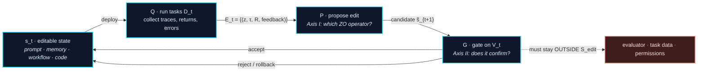

# Awesome Harness Optimization

**A reading list on Harness Optimization (HarnessOpt): how run-time evidence is used to modify the software system around a frozen language model, and how those modifications are evaluated before they persist.**

[](https://awesome.re)
[](#contributing)
[](LICENSE)

**English** | [中文](README_zh.md)

> **Organization.** The list uses three complementary axes:
>
> - **[Axis 0 — editable surface](#axis-0--the-editable-surface-l0l5):** what can change, from prompts to optimizer code.
> - **[Axis I — query and proposal](#axis-i--the-zeroth-order-view):** what objective information and run evidence the proposer receives, and how it turns them into an edit.
> - **[Axis II — validation](#axis-ii--pac-and-stability):** what data the gate uses, whether those data were reused adaptively, and what a reported score can support.
>
> “ZO operator” labels below are analytical analogies unless a method constructs the corresponding numerical estimator. “Held-out” is not synonymous with “independent” when the same set is reused for adaptive selection.

---

## Table of Contents

- [Scope](#scope)
- [The HarnessOpt Update Loop](#the-harnessopt-update-loop)
- [Axis 0 — The Editable Surface (L0–L5)](#axis-0--the-editable-surface-l0l5)
- [**Axis I — The Zeroth-Order View**](#axis-i--the-zeroth-order-view)
  - [I.1 Why zeroth-order](#i1-why-zeroth-order)
  - [I.2 Proposal signals and their operators](#i2-proposal-signals-and-their-operators)
  - [I.3 Operator implementability depends on surface structure](#i3-operator-implementability-depends-on-surface-structure)
- [**Axis II — PAC and Stability**](#axis-ii--pac-and-stability)
  - [II.1 Two bounds, two different jobs](#ii1-two-bounds-two-different-jobs)
  - [II.2 Multi-round reuse: the reachable-set bound](#ii2-multi-round-reuse-the-reachable-set-bound)
  - [II.3 What follows for the acceptance gate](#ii3-what-follows-for-the-acceptance-gate)
- [Paper List](#paper-list)
  - [1. Background](#1-background)
  - [**2. The Editable Surface: L0–L5**](#2-the-editable-surface-l0l5)
  - [3. Proposal Mechanisms](#3-proposal-mechanisms-how-run-evidence-becomes-an-edit)
  - [4. Validation Protocols](#4-validation-protocols-how-a-candidate-enters-persistent-state)
  - [5. Evaluators and Benchmarks](#5-evaluators-and-benchmarks)
  - [6. Related Surveys and Boundaries](#6-related-surveys-and-boundaries)
- [Open Problems](#open-problems)
- [Companion Documents](#companion-documents)
- [Contributing](#contributing)
- [Citation](#citation)

---

## Scope

Fix a base model $M$, a task distribution $\mathcal{D}$, and an external evaluation boundary. Let $s$ denote model-external software state: prompts, context, memory, workflow graphs, tool interfaces, agent code, or optimizer code. The harness executes task $z$ as $\tau = H_s(M,z)$.

**HarnessOpt** is the repeated process of collecting run-time evidence, proposing an edit to $s$, and deciding what state persists. The persistence rule may be a genuine accept/reject gate or an unconditional write; the latter is classified as open loop.

**In focus.** Work where model-external state is modified *using run-time feedback*, with base model frozen. This includes prompt optimization, self-evolving memory/skills, workflow search, self-modifying agent code, meta-optimizer code, and the evaluators/benchmarks such loops optimize against.

**Boundary cases.** L5 (joint harness + weights) is included as a boundary, not as the core. Pure weight-side self-improvement (self-play, RLVR, synthetic data) and hand-authored harness *design* (ReAct, SWE-agent, MCP) are listed only in [§6](#6-related-surveys-and-boundaries) to mark the edge.

---

## The HarnessOpt Update Loop

Three operators define one state transition:

```math
\begin{aligned}
\mathcal{E}_t &= Q(s_t;D_t),\\
\widetilde{s}_{t+1} &= P(s_t,\mathcal{E}_t),\\
s_{t+1} &= G(s_t,\widetilde{s}_{t+1};V_t).
\end{aligned}
```

$Q$ collects evidence on proposal tasks $D_t$; $P$ proposes a candidate; $G$ decides what state persists after consulting validation data $V_t$. For an open-loop method, $G$ simply writes the proposal.



Three conditions define the core scope:

1. the base model and the external evaluation boundary are fixed for the round;
2. edits target an explicitly delimited editable state set $\mathcal{S}_{\mathrm{edit}}$;
3. the result of the update affects later runs.

Compile gates, smoke tests, held-out evaluation, human review, and rollback are protocol choices, not entry requirements.

---

## Axis 0 — The Editable Surface (L0–L5)

The object axis, kept as scaffolding for the two analytical axes. It answers **"what can be changed"** — not how, and not whether the change was justified. **The six rungs and their papers are in [§2](#2-the-editable-surface-l0l5), in one section.** What follows here is the part the level number hides.

### Three discriminating sub-axes

The level of an editable object says little about the *actual* action space. Three properties do:

| Sub-axis | Question | Why it matters |
|---|---|---|
| **Write authority** | Does the agent write autonomously, or only after human review? | Determines whether the loop is closed at all |
| **Persistence** | Ephemeral sandbox run, or committed to versioned state? | Determines whether an error can accumulate |
| **Constraint enforcement** | Declared in a prompt, or enforced by permissions, a sandbox, a hidden evaluator, or static checks? | Determines whether the evaluation boundary is protected |

Editable-surface size does not determine gate strength. Record write authority, persistence, and enforcement separately from L0–L5.

---

## Axis I — The Zeroth-Order View

This axis records the information available to the proposer. It uses classical zeroth-order optimization as a reference, not as an equivalence claim.

### I.1 Why zeroth-order

Define expected return under a fixed base model:

```math
f_M(s)=\mathbb{E}_{z\sim\mathcal{D}}\!\left[R\!\left(H_s(M,z)\right)\right].
```

$\nabla_s f_M(s)$ is unavailable for two independent reasons, and they fail differently.

**Discreteness.** The editable state $s\in\mathcal{S}_{\mathrm{edit}}$ is text, programs, and file structures. Without an explicit continuous relaxation there is no ambient space in which $s+\mu u$ is defined, so the derivative is not defined either.

**Non-differentiable composition.** Even under a continuous relaxation of the state, the composition $H_s\circ M$ — tool calls, control flow, environment side effects, sampling, external exit codes — is not a differentiable map. This is the reason that closes the obvious escape route: embedding the text does not produce a differentiable objective, because the execution in between remains non-differentiable however the state is encoded. It is also why methods that do obtain a real gradient — GPTSwarm's edge-level REINFORCE over topology, ScoreFlow's Score-DPO relaxation, SEAL's RL loop — are boundary cases on this axis rather than instances of it.

The objective can instead be estimated only by running a state on sampled tasks:

```math
Y(s,z)=R\!\left(H_s(M,z)\right),
\qquad
\widehat{f}_{D}(s)=\frac{1}{|D|}\sum_{z\in D}Y(s,z).
```

This is a zeroth-order **objective interface** because the optimizer observes function values rather than derivatives. Many HarnessOpt systems also receive traces, errors, tests, or textual feedback:

```math
\mathcal{E}_t=\{(z_i,\tau_i,R_i,\mathrm{feedback}_i)\}_{i=1}^{n_t}.
```

That side information is richer than a classical function-value oracle. It can improve proposal quality, but it does not make the text update a numerical gradient and does not validate the proposed edit.

### I.2 Proposal signals and their operators

The second column names the classical derivative-free operator each engineering practice resembles. **It is an analogy, not an implementation claim:** SkillOpt's $B_m{=}8$ aggregates rollouts over eight *tasks*, and does not apply eight numerical perturbations to one state.

| Signal or constraint | Classical form (analogy, not implementation) | Engineering role | Representative work |
|---|---|---|---|
| **Scalar score** | $\widehat{\Delta}=\widehat{R}(s')-\widehat{R}(s)$ | rank candidates or retain elites | APE, OPRO, DSPy, MIPROv2, GEPA, Reflexion, Voyager |
| **Batch evidence** | $\frac{1}{b}\sum_i\big[f(s+\mu u_i)-f(s)\big]u_i$ | aggregate patterns across tasks before editing | ExpeL, SkillOpt ($B_m{=}8$), SkillOpt-Lite, Trace2Skill, SkillForge, Self-Harness |
| **Success/failure contrast** | $\widehat{\Delta}=\widehat{R}(s^{+})-\widehat{R}(s^{-})$ | localize a behavioral difference | ProTeGi, TextGrad, SkillCAT, ReasoningBank, DemoEvolve |
| **Localized edit** | $\dfrac{f(s+\mu e_i)-f(s)}{\mu}\,e_i$ | restrict a proposal to one entry, module, file, or subgraph | SkillAdaptor, Trace2Skill, SkillWeaver, AgentSquare, MASS, AlphaEvolve, Meta-Harness, AHE |
| **Bounded edit** | $s_{k+1}\in\mathcal{B}(s_k,\Delta_k)$ | limit description-space change per round | SkillOpt ($L_t: 4 \to 2$), SkillOpt-Lite, SkillForge, SoftSkill ($m{=}32$), ACE, Self-Harness |
| **Search memory** | $\hat g_{\mathrm{cv}}=\hat g-c+\mathbb{E}[c]$ | steer proposals away from known-dead directions; novelty rejection | SkillOpt rejected buffer, ShinkaEvolve, GEPA, Meta-Harness |
| **Archive or population** | $\widetilde{s} \in \mathrm{Select}(\mathcal{A}_t; R)$ | retain, recombine, or diversify candidates | Promptbreeder, EvoPrompt, ADAS, AFlow, MaAS, ELM, FunSearch, AlphaEvolve, DGM, CORAL, AIDE |
| **Adaptive schedule** | step size or radius set from improvement history | allocate exploration budget by improvement and stagnation | AdaEvolve, ShinkaEvolve, ThetaEvolve, AFlow |

The rows are not mutually exclusive: SkillOpt occupies four of them at once. The taxonomy classifies mechanisms, not papers.

Where each analogy stops: batch aggregation over tasks is not a multi-direction ZO estimator, because tasks are noise samples rather than perturbation directions; success/failure contrast is not a central difference unless both states are controlled perturbations of the same state; an edit-count limit is not automatically a trust-region radius, because syntactic size need not bound behavioral distance; and a rejected-edit buffer is a control variate only if the correlated quantity is named and its variance reduction measured. Per-label requirements are in [`docs/zo-operator-map.md`](docs/zo-operator-map.md).

**A restatement worth making.** SkillOpt describes itself with first-order vocabulary — learning rate, momentum, mini-batch. Structurally it is a **(1+1)-ES with a structured proposal operator**: the edit budget is a proposal radius, the rejected buffer is negative conditioning of the proposal distribution, and acceptance is strict improvement on a held-out set. This does not weaken the method; it clarifies that the ZO map organizes information structure and does not assert gradient-descent equivalence.

### I.3 Operator implementability depends on surface structure

| Requirement | Plain text | Versioned executable code |
|---|---|---|
| Controlled paired comparison | usually heuristic | possible with feature flags and paired replay |
| Stable edit boundary | section or entry chosen by convention | file, module, interface, or graph node |
| Pre-run feasibility check | schema and syntax checks only | compile, type-check, static analysis |
| Exact restoration | content can be restored; side effects need separate handling | version control plus process, cache, registry, and memory cleanup |

Allowlists, feature flags, and rollback affect both search and governance. They do not by themselves prove that an edit improves expected performance.

---

## Axis II — PAC and Stability

Let the bounded loss and population risk be

```math
\ell(s;z)=1-R\!\left(H_s(M,z)\right)\in[0,1],
\qquad
\epsilon(s)=\mathbb{E}_{z\sim\mathcal{D}}[\ell(s;z)].
```

For a finite task set $V$, write $\widehat\epsilon_V(s)$ for mean empirical loss and $\widehat R_V(s)=1-\widehat\epsilon_V(s)$ for mean empirical return.

### II.1 Two bounds, two different jobs

**Update stability** asks how much the learned state changes when one proposal task changes. Let $\mathcal{A}$ map a proposal sample $D_N$ to a state, and let $\beta_{\mathrm{avg}}$ be the expected replace-one sensitivity of $\ell(\mathcal{A}(D_N);z)$. Average stability supports an **expectation-level** statement,

```math
\mathbb{E}\!\left[\epsilon(\mathcal{A}(D_N))-\widehat{\epsilon}_{D_N}(\mathcal{A}(D_N))\right]
\le
\beta_{\mathrm{avg}},
```

and nothing stronger: from this definition alone no high-probability bound follows, which would require uniform stability or further assumptions.

$\beta_{\mathrm{avg}}$ is what the **batch-evidence** row of [I.2](#i2-proposal-signals-and-their-operators) is about, and it is the one place the two axes meet. Hardcoding a single case, or copying an environment detail specific to one trial, raises it; aggregating across tasks and bounding the edit lowers it. That is a mechanism hypothesis, not a measured coefficient, unless a paper actually estimates the replace-one quantity.

**Independent confirmation** asks how a fixed candidate performs on fresh tasks. If $V_m$ contains $m$ i.i.d. tasks from $\mathcal{D}$ and the candidate $s$ was fixed without using $V_m$, Hoeffding's inequality gives, with probability at least $1-\delta$,

```math
\epsilon(s)
\le
\widehat{\epsilon}_{V_m}(s)
+
\sqrt{\frac{\ln(1/\delta)}{2m}}.
```

These questions are related but not interchangeable. Batch aggregation may reduce sensitivity to one proposal task; it does not make a repeatedly reused validation set fresh. Conversely, fresh validation measures a fixed candidate honestly but does not make the proposal algorithm stable.

The inequality guarantees only the metric encoded by $\ell$. Evaluator validity and evaluator protection are measurement conditions, not extra conclusions supplied by concentration.

### II.2 Multi-round reuse: the reachable-set bound

After validation results influence later proposals, the final candidate is no longer independent of the reused set. One conservative repair is a uniform bound over a **fixed, validation-independent finite class** $\mathcal{C}$ containing every state the process may test:

```math
\epsilon(s)
\le
\widehat{\epsilon}_{V_m}(s)
+
\sqrt{\frac{\ln|\mathcal{C}|+\ln(1/\delta)}{2m}}
\qquad
\text{for all }s\in\mathcal{C}.
```

A bounded edit language can make such a class finite. If $s_0$ is fixed independently of $V_m$ and each round applies one script from a fixed set $\mathcal{U}_L$, then all states reachable within $T$ rounds lie in a class with

```math
|\mathcal{C}_T|
\le
\sum_{t=0}^{T}|\mathcal{U}_L|^t.
```

This count is conditional on a complete script language: path names, inserted content, external retrieval, and side-effecting operations must all be covered. Diff size is only a proxy for the required description length. Candidate count alone is not enough to justify a union bound when candidates are chosen adaptively from validation feedback.

Write $\eta_T$ for the resulting slack. Since $\ln|\mathcal{C}_T|\le(T+1)\ln|\mathcal{U}_L|+O(1)$,

```math
\eta_T
\;=\;
\sqrt{\frac{\ln|\mathcal{C}_T|+\ln(1/\delta)}{2m}}
\;=\;
O\!\left(\sqrt{\frac{T\ln|\mathcal{U}_L|+\ln(1/\delta)}{2m}}\right).
```

Three consequences follow, each conditional on the assumptions above.

- **Rounds cost statistical budget.** $\eta_T$ grows as $\sqrt{T}$, so holding the slack under a target $\epsilon$ requires $m=\Omega\big(T\ln|\mathcal{U}_L|/\epsilon^2\big)$: **validation size must scale with the number of rounds.** Reported practice usually sits in the opposite regime — a small fixed split and a non-small $T$.
- **The edit language, not the artifact size, controls tightness.** $\eta_T$ depends on $|\mathcal{U}_L|$, the richness of one round's edit, not on $|s_T|$. This gives bounded editing a justification beyond variance reduction: **a narrower edit language directly tightens confirmation.** Unbudgeted whole-file rewrites make $\mathcal{U}_L$ effectively the whole state space and forfeit the bound entirely.
- **Rotation beats enlargement.** Drawing a fresh $V^{(t)}$ each round and splitting the failure probability as $\delta/T$ gives slack $\sqrt{\ln(T/\delta)/(2m)}$ — logarithmic in $T$ rather than square-root — at a cost of $Tm$ tasks. This favors rotation whenever fresh tasks cost less than roughly $\sqrt{T/\ln T}$ times the enlargement. It requires genuinely unused sets; cycling through a small pool of previously observed sets is reuse.

### II.3 What follows for the acceptance gate

Suppose a valid uniform event gives $|\epsilon(s)-\widehat{\epsilon}_{V_m}(s)|\le\eta$ for both the current and candidate states. Then

```math
\widehat{R}_{V_m}(\widetilde{s}_{t+1})
-
\widehat{R}_{V_m}(s_t)
>
2\eta
```

is sufficient to conclude that the candidate has lower true risk on the metric represented by $R$. This statement is conditional on the uniform class and the evaluator; it is not a guarantee for safety, specification coverage, or a shifted task distribution.

**The dead zone and the edit budget are coupled, not independent knobs.** If the gate accepts on $\widehat{\Delta}_{V_m}>\Delta$ with $\Delta>2\eta_T$, then on the uniform event every accepted update lowers true risk. But $\eta_T$ grows with $|\mathcal{U}_L|$, so relaxing the edit budget requires raising the acceptance threshold in step. Tuning $\Delta$ as a noise estimate and $L$ as a proposal control, independently — the common practice — is inconsistent with the condition that makes either meaningful.

**Monotone improvement additionally requires behaviorally exact rollback.** The chained claim $\epsilon(s_T)\le\epsilon(s_0)$ needs each rejected proposal to leave no residue. If $s_{t+1}=s_t$ holds for files but not for behavior — lingering processes, registry entries, caches, written memory — the chain breaks at that round. Revertible effects are a premise of the result, not engineering hygiene, and a `git` revert that does not cover runtime side effects does not supply it.

**Average non-regression hides tail collapse.** $\epsilon$ is an expectation, so degradation confined to a task cluster of probability mass $p_k$ stays invisible while it remains below $\eta_T/p_k$. A per-cluster guarantee needs per-cluster sampling, $m_k=\Omega\big((\ln|\mathcal{C}_T|+\ln(K/\delta))/\epsilon_k^2\big)$ across $K$ clusters. This is how "aggregate score rises while specific capabilities are lost" occurs **without violating any bound in force**, and it is why a non-regression suite must be stratified and reported per cluster rather than as one mean.

**Two drifts must not be conflated.** *Target drift* — the task distribution itself moving, $z\sim\mathcal{D}_t$ — accumulates as $\sum_t d(\mathcal{D}_{t-1},\mathcal{D}_t)$, that is, **linearly in $T$, while $\eta_T$ grows only as $\sqrt{T}$.** Past some horizon drift therefore dominates selection bias, which gives a checkable criterion for when re-running from a fresh $s_0$ beats continuing to evolve. *Evidence drift* is a different failure and belongs to [Axis I](#i3-operator-implementability-depends-on-surface-structure): $\mathcal{E}_t$ is sampled under the current $s_t$, so once a failure class is fixed it disappears from later traces and the optimizer may revert the constraint that fixed it. That is estimator bias, not a generalization-bound problem, and no bound is offered here because any bound would require modeling the proposer.

A practical gate should record four separate checks:

1. performance non-regression on appropriately separated data;
2. safety and permission non-regression;
3. evaluator and protected-path integrity enforced at run time;
4. reproducible state restoration after rejection.

The assumptions and derivations behind these statements are in [`docs/pac-stability.md`](docs/pac-stability.md).

---

## Paper List

**Organization.** §1 is background. **§2 is the core: the whole editable surface L0–L5 in one section.** §3 and §4 re-index the *same* works by the two analytical axes — §3 by proposal mechanism, §4 by validation protocol. §5 covers evaluators and documented failure modes; §6 marks the boundaries.

A work appearing in §2, §3, and §4 is not counted three times: §2 records what it edits, §3 how it proposes, §4 what its gate lets you conclude.

**Entry format.** `**Name** — "Title". Authors. Venue Year. [[paper]](link) — one line tying it to HarnessOpt. [ZO analogy: role] [Gate: protocol]`

`[ZO analogy: …]` is our reading of the proposal mechanism, not the paper's own claim. `[Gate: …]` records the data relationship used for persistence: `open`, `search-set`, `held-out`, `fresh test`, `human review`, or `unverified`. `†` marks a recent posting whose metadata may still change — recheck before citing.

---

### 1. Background

The idea that a system might improve itself is old. Good (1966) described a machine that designs better machines; Schmidhuber (2003) asked what it would take to do that responsibly, and answered: rewrite only when you can prove the rewrite helps. Yudkowsky (2008) named the loop. For decades this stayed a thought experiment, because nothing could actually write the next version of itself.

Language agents changed that, but not in the way the early work assumed. What agents can edit is not their own weights — it is the software around them: prompts, memory files, skill libraries, workflow graphs, tool code, the harness itself. Weng (2026) makes the point directly: the self-improvement loop rarely starts with weights, it runs through the scaffolding. That is the subject of this list.

The proof requirement did not survive the transition. No current system proves anything about its edits; they run tasks and compare scores. So the question becomes: **when a system cannot prove an edit is good, what can it establish instead?** Three answers have been given, and they are worth keeping distinct because papers routinely claim the second while doing the third.

| | What it takes to keep an edit | Status |
|---|---|---|
| **Proof** | the system internally proves the rewrite improves utility | Schmidhuber's position; no current system does this |
| **Probabilistic confirmation** | degradation and selection bias are controlled at a stated probability | what [Axis II](#axis-ii--pac-and-stability) is about — an open problem, not a solved one |
| **A higher score** | the edit scored better on some tasks | what nearly everyone actually does; §4 covers what it does and does not license |

The gap between the second and third rows is the reason this list exists.

- **Speculations Concerning the First Ultraintelligent Machine** — I. J. Good. *Advances in Computers* 1966. [[paper]](https://doi.org/10.1016/S0065-2458%2808%2960418-0) — Where the intelligence-explosion idea starts. Historical motivation only.
- **Gödel Machines: Self-Referential Universal Problem Solvers Making Provably Optimal Self-Improvements** — J. Schmidhuber. *arXiv* 2003. [[paper]](https://arxiv.org/abs/cs/0309048) — Rewrite only on an internal proof of utility gain. The strictest answer anyone has given, and the reason the weaker answers need to be stated carefully: unprovable is not unanalyzable.
- **Recursive Self-Improvement** — E. Yudkowsky. *LessWrong* 2008. [[post]](https://www.lesswrong.com/posts/JBadX7rwdcRFzGuju/recursive-self-improvement) — Names the RSI feedback loop.
- **Harness Engineering for Self-Improvement** — Lilian Weng. *Lil'Log* 2026. [[blog]](https://lilianweng.github.io/posts/2026-07-04-harness/) — Argues the near-term loop runs through the scaffolding rather than the weights.
- **Code as Agent Harness** — Ning et al. *arXiv* 2026.† [[paper]](https://arxiv.org/abs/2605.18747) — Surveys code as executable agent infrastructure; names verification, recovery, state consistency, and replayability as open evaluation problems.
- **A Survey of Self-Evolving Agents: What, When, How, and Where to Evolve** — Gao et al. *arXiv* 2025.† [[paper]](https://arxiv.org/abs/2507.21046) — Taxonomy across models, memory, tools, and architecture. This list takes its capability-dimension and time-scale distinctions from here.
- **A Comprehensive Survey of Self-Evolving AI Agents** — Fang et al. *arXiv* 2025.† [[paper]](https://arxiv.org/abs/2508.07407) — Connects foundation models to lifelong agentic systems; proposes "Three Laws of Self-Evolving AI Agents".

---

### 2. The Editable Surface: L0–L5

**All six rungs in one section.** Each subsection states what the surface is, what one edit unit looks like, and — the part the level number hides — **what structure the surface does or does not supply to the operators of [Axis I](#i3-operator-implementability-depends-on-surface-structure)**.

| Level | Object | Edit unit | Feasibility oracle available? | Subsection |
|---|---|---|---|---|
| **L0** | Instruction prompt | prompt, instruction block, exemplar | ❌ no pre-run criterion | [2.1](#21-l0--instruction-prompts) |
| **L1** | Context / memory / skill | memory entry, skill file, retrieval unit | ⚠️ only if skills are executable | [2.2](#22-l1--context-memory-and-skill-libraries) |
| **L2** | Workflow / graph / architecture | node, edge, subgraph, module slot | ⚠️ graph validity, not semantics | [2.3](#23-l2--agentic-workflow-and-architecture-search) |
| **L3** | Harness / agent code | file, module, tool, plugin | ✅ compiler, type system, static analysis | [2.4](#24-l3--self-modifying-harness-code) |
| **L4** | Optimizer / meta-harness code | proposer, selector, search operator | ✅ same, plus the loop edits its own editor | [2.5](#25-l4--optimizer-and-meta-harness-code) |
| **L5** | Harness + model weights | checkpoint, LoRA, prefix | — base-model-fixed condition suspended | [2.6](#26-l5--joint-harness-and-weight-optimization-boundary) |

> **Read the fourth column against Axis 0's three sub-axes.** Level tells you what is nominally editable. Feasibility-oracle strength, write authority, persistence, and enforcement tell you what the action space *actually* is. The two come apart routinely: see [cross-cutting observation 1](docs/audit-table.md#cross-cutting-observations).

#### 2.1 L0 — Instruction prompts

*The instruction layer as the optimized object. Surface: plain text.* Syntax and schema checks may filter malformed candidates, but there is no general pre-run semantic test for instruction quality. Without a constructible negative direction or representation-defined block boundary, central difference and coordinate descent remain analogies ([I.3](#i3-operator-implementability-depends-on-surface-structure)).

- **APE** — "Large Language Models Are Human-Level Prompt Engineers". Zhou et al. *ICLR* 2023. [[paper]](https://arxiv.org/abs/2211.01910) — Treats the instruction as a program; proposes and scores candidates by search. `[ZO analogy: population / archive]` `[Gate: search-set]`
- **OPRO** — "Large Language Models as Optimizers". Yang et al. *ICLR* 2024. [[paper]](https://arxiv.org/abs/2309.03409) — Generates new solutions from a meta-prompt of prior (solution, score) pairs. The meta-prompt sees scalars only — no trace evidence — so the semantic advantage of Axis I is left unused. `[ZO analogy: one-point]` `[Gate: search-set]`
- **EvoPrompt** — "EvoPrompt: Connecting LLMs with Evolutionary Algorithms Yields Powerful Prompt Optimizers". Guo et al. *ICLR* 2024. [[paper]](https://arxiv.org/abs/2309.08532) — GA/DE over a prompt population with LLM mutation and crossover. `[ZO analogy: population / archive]` `[Gate: search-set]`
- **Promptbreeder** — "Promptbreeder: Self-Referential Self-Improvement Via Prompt Evolution". Fernando et al. *arXiv* 2023.† [[paper]](https://arxiv.org/abs/2309.16797) — Evolves task prompts and the mutation prompts that modify them, combining L0 content with an L4 mechanism. `[ZO analogy: population / archive]` `[Gate: search-set]`
- **ProTeGi** — "Automatic Prompt Optimization with 'Gradient Descent' and Beam Search". Pryzant et al. *EMNLP* 2023. [[paper]](https://arxiv.org/abs/2305.03495) — Uses LLM critiques, called “textual gradients,” to guide prompt edits and beam search. The feedback is diagnostic language, not a numerical derivative. `[ZO analogy: trace-informed proposal]` `[Gate: search-set]`
- **DSPy** — "DSPy: Compiling Declarative Language Model Calls into Self-Improving Pipelines". Khattab et al. *ICLR* 2024. [[paper]](https://arxiv.org/abs/2310.03714) — Programming model treating LM pipelines as optimizable text-transformation graphs. `[ZO analogy: population / archive]` `[Gate: search-set]`
- **MIPROv2** — "Optimizing Instructions and Demonstrations for Multi-Stage Language Model Programs". Opsahl-Ong et al. *EMNLP* 2024. [[paper]](https://arxiv.org/abs/2406.11695) — Jointly bootstraps few-shot demos and proposes instructions via Bayesian optimization, an example of surrogate-model search rather than critique-only proposal. `[ZO analogy: surrogate-model search]` `[Gate: search-set]`
- **TextGrad** — "TextGrad: Automatic 'Differentiation' via Text". Yuksekgonul et al. *Nature* 2025. [[paper]](https://arxiv.org/abs/2406.07496) — Propagates textual feedback through compound AI systems. The “gradient” is semantic side information, not a verifiable derivative. `[ZO analogy: trace-informed proposal]` `[Gate: search-set]`
- **GEPA** — "GEPA: Reflective Prompt Evolution Can Outperform Reinforcement Learning". Agrawal et al. *arXiv* 2025.† [[paper]](https://arxiv.org/abs/2507.19457) — A Genetic-Pareto reflective optimizer that reads full traces; the paper reports up to 35× rollout efficiency over its RL comparisons. `[ZO analogy: population / archive + trace-informed proposal]` `[Gate: held-out]`

#### 2.2 L1 — Context, memory, and skill libraries

*The agent curates and grows its own context, memory, or skill store from experience, without weight updates.* This is where the open-loop protocol class concentrates: most of these systems write experience straight into later state, with no test that could have stopped a bad entry.

**Context and memory**

- **Reflexion** — "Reflexion: Language Agents with Verbal Reinforcement Learning". Shinn et al. *NeurIPS* 2023. [[paper]](https://arxiv.org/abs/2303.11366) — Converts feedback into verbal reflections stored in episodic memory across trials. `[ZO analogy: one-point]` `[Gate: open]`
- **ExpeL** — "ExpeL: LLM Agents Are Experiential Learners". Zhao et al. *AAAI* 2024. [[paper]](https://arxiv.org/abs/2308.10144) — Extracts reusable natural-language insights from a pool of experiences. Aggregation may reduce dependence on one trajectory, but the paper does not establish an algorithmic-stability coefficient. `[ZO analogy: batch evidence]` `[Gate: open]`
- **Dynamic Cheatsheet** — "Dynamic Cheatsheet: Test-Time Learning with Adaptive Memory". Suzgun et al. *EACL* 2026.† [[paper]](https://arxiv.org/abs/2504.07952) — Persistent self-curated memory of strategies and snippets at inference. `[ZO analogy: one-point]` `[Gate: open]`
- **ACE** — "Agentic Context Engineering: Evolving Contexts for Self-Improving Language Models". Zhang et al. *ICLR* 2026. [[paper]](https://arxiv.org/abs/2510.04618) — Uses Generator, Reflector, and Curator roles with incremental context updates. The bounded-edit label is an analogy; edit count is not a semantic distance. `[ZO analogy: bounded edit]` `[Gate: open]`
- **ReasoningBank** — "ReasoningBank: Scaling Agent Self-Evolving with Reasoning Memory". Ouyang et al. *ICLR* 2026.† [[paper]](https://arxiv.org/abs/2509.25140) — Distills strategies from successes and failures and introduces memory-aware test-time scaling. `[ZO analogy: contrastive diagnosis]` `[Gate: open]`
- **Agent Workflow Memory (AWM)** — Wang, Mao, Fried, Neubig. *ICML* 2025. [[paper]](https://arxiv.org/abs/2409.07429) — Induces reusable workflows as durable procedural memory the agent grows and reuses. `[ZO analogy: batch evidence]` `[Gate: open]`
- **Memp** — "Memp: Exploring Agent Procedural Memory". Fang et al. *ACL Findings* 2026.† [[paper]](https://arxiv.org/abs/2508.06433) — Distills trajectories into script-like procedures with build, retrieval, and update strategies, including deletion. `[ZO analogy: batch evidence]` `[Gate: open]`
- **MemAct** — "Memory as Action: Autonomous Context Curation for Long-Horizon Agentic Tasks". Zhang et al. *ACL Findings* 2026.† [[paper]](https://arxiv.org/abs/2510.12635) — Reframes working-memory management as learnable policy actions trained end-to-end. `[ZO analogy: boundary — trained policy]` `[Gate: open]`
- **Continual Harness** — "Continual Harness: Online Adaptation for Self-Improving Foundation Agents". *arXiv* 2026.† [[paper]](https://arxiv.org/abs/2605.09998) — Studies online harness adaptation, where round count and evaluation-data reuse become important reporting fields. `[ZO analogy: history-conditioned proposal]` `[Gate: open]`

**Skill libraries and skill optimization** — a narrow editable surface with several comparatively structured proposal and confirmation protocols. These examples show why editable-surface size and protocol strength should be recorded separately.

- **Voyager** — "Voyager: An Open-Ended Embodied Agent with Large Language Models". Wang et al. *TMLR* 2024. [[paper]](https://arxiv.org/abs/2305.16291) — Lifelong learning via automatic curriculum plus a self-growing executable skill library. Single-error signals trigger local program overwrites. The library is executable, so a feasibility oracle exists — but it gates compilation, not generalization. `[ZO analogy: one-point]` `[Gate: open]`
- **SkillWeaver** — "SkillWeaver: Web Agents can Self-Improve by Discovering and Honing Skills". Zheng et al. *COLM* 2025. [[paper]](https://arxiv.org/abs/2504.07079) — Agents synthesize reusable, debugged API skills into their harness; the paper reports a 31.8% improvement on WebArena. The debug loop is a feasibility filter, not a confirmation gate. `[ZO analogy: localized edit]` `[Gate: search-set]`
- **SkillOpt** — "SkillOpt: Executive Strategy for Self-Evolving Agent Skills". *arXiv* 2026.† [[paper]](https://arxiv.org/abs/2605.23904) — Mini-batch reflection ($B_m{=}8$), decaying edit budget ($L_t: 4 \to 2$), rejected-edit buffer, hierarchical parallel LLM tree reduction; three-way disjoint split with the test set locked before final reporting. This list reads these mechanisms as batch evidence, bounded editing, and history-conditioned proposal rather than as literal first-order optimization. `[ZO analogy: batch evidence + bounded edit]` `[Gate: held-out]`
- **SkillOpt-Lite** — "SkillOpt-Lite: Better and Faster Agent Self-evolution via One Line of Vibe". Shen, Li, Zhang. *arXiv* 2026.† [[paper]](https://arxiv.org/abs/2607.03451) — Uses consensus mining, held-out selection, and staged compile–smoke–full evaluation. The paper is the source of the ZO/PAC framing adopted here; this list narrows several of its theoretical claims. `[ZO analogy: batch evidence + bounded edit]` `[Gate: held-out]`
- **Trace2Skill** — "Trace2Skill: Distill Trajectory-Local Lessons into Transferable Agent Skills". *arXiv* 2026.† [[paper]](https://arxiv.org/abs/2603.25158) — Uses map-reduce patch merging over trajectory-local lessons. Its gate uses training-derived subsets, so it is not independent confirmation. `[ZO analogy: batch evidence + localized edit]` `[Gate: search-set]`
- **SkillForge** — "SkillForge: Forging Domain-Specific, Self-Evolving Agent Skills in Cloud Technical Support". *arXiv* 2026.† [[paper]](https://arxiv.org/abs/2604.08618) — Aggregates batches of tickets for trajectory denoising and applies a minimal-modification principle. `[ZO analogy: batch evidence + bounded edit]` `[Gate: held-out]`
- **SkillCAT** — "SkillCAT: Contrastive, Assessment-Augmented and Topology-Aware Skill Self-Evolution for LLM Agents". *arXiv* 2026.† [[paper]](https://arxiv.org/abs/2606.13317) — Contrasts trajectories at an action-divergence point. This is diagnostic contrast, not a numerical central-difference estimator. `[ZO analogy: contrastive diagnosis]` `[Gate: search-set]`
- **SkillAdaptor** — "SkillAdaptor: Self-Adapting Skills for LLM Agents from Trajectories". *arXiv* 2026.† [[paper]](https://arxiv.org/abs/2606.01311) — Localizes a faulty trajectory step and proposes a targeted skill change. `[ZO analogy: localized edit]` `[Gate: search-set]`
- **SoftSkill** — "SoftSkill: Behavioral Compression for Contextual Adaptation". *arXiv* 2026.† [[paper]](https://arxiv.org/abs/2606.20333) — Constrains adaptation to a 32-token soft prefix, giving a measurable parameter-space dimension. `[ZO analogy: bounded edit]` `[Gate: search-set]`

#### 2.3 L2 — Agentic workflow and architecture search

*The workflow graph or module composition is searched rather than hand-designed.* Declared node, edge, and module slots can supply **representation-defined block boundaries**, making block or coordinate search literal when the algorithm uses those slots ([I.3](#i3-operator-implementability-depends-on-surface-structure)).

- **ADAS / Meta Agent Search** — "Automated Design of Agentic Systems". Hu, Lu, Clune. *ICLR* 2025. [[paper]](https://arxiv.org/abs/2408.08435) — A meta-agent programs ever-better agents in code over a growing archive. `[ZO analogy: population / archive]` `[Gate: search-set]`
- **AFlow** — "AFlow: Automating Agentic Workflow Generation". Zhang et al. *ICLR* 2025. [[paper]](https://arxiv.org/abs/2410.10762) — Workflow optimization as MCTS over code-represented graphs. MCTS makes the exploration/exploitation schedule explicit — the adaptive-step row of the operator table. `[ZO analogy: population / archive + adaptive schedule]` `[Gate: search-set]`
- **GPTSwarm** — "Language Agents as Optimizable Graphs". Zhuge et al. *ICML* 2024. [[paper]](https://arxiv.org/abs/2402.16823) — Agents as computational graphs; node-level prompt plus edge-level REINFORCE optimization. Edge-level REINFORCE is genuinely *not* zeroth-order over the topology — a useful boundary case that shows the ZO framing is a claim about information availability, not a universal label. `[ZO analogy: boundary — first-order over edges]` `[Gate: search-set]`
- **AgentSquare** — "AgentSquare: Automatic LLM Agent Search in Modular Design Space". Shang et al. *ICLR* 2025. [[paper]](https://arxiv.org/abs/2410.06153) — Searches a modular Planning/Reasoning/ToolUse/Memory space via evolution and recombination. Its declared module slots provide a coordinate basis for search. `[ZO analogy: localized edit + population / archive]` `[Gate: search-set]`
- **MaAS** — "Multi-agent Architecture Search via Agentic Supernet". Zhang et al. *ICML* 2025. [[paper]](https://arxiv.org/abs/2502.04180) — Optimizes a probabilistic agentic supernet for cost-adaptive, query-dependent systems. `[ZO analogy: population / archive]` `[Gate: search-set]`
- **MASS** — "Multi-Agent Design: Optimizing Agents with Better Prompts and Topologies". Zhou et al. *arXiv* 2025.† [[paper]](https://arxiv.org/abs/2502.02533) — Interleaved multi-stage search over prompts and topologies. Explicit block-coordinate structure: prompts and topology are alternated rather than searched jointly. `[ZO analogy: localized edit]` `[Gate: search-set]`
- **ScoreFlow** — "ScoreFlow: Mastering LLM Agent Workflows via Score-based Preference Optimization". Wang et al. *arXiv* 2025.† [[paper]](https://arxiv.org/abs/2502.04306) — Continuous gradient-based workflow optimization via Score-DPO. A first-order boundary case: it relaxes part of the workflow into a differentiable object, escaping the ZO setting by changing the representation rather than the information available. `[ZO analogy: boundary — first-order]` `[Gate: search-set]`
- **FlowReasoner** — "FlowReasoner: Reinforcing Query-Level Meta-Agents". Gao et al. *arXiv* 2025.† [[paper]](https://arxiv.org/abs/2504.15257) — An RL-tuned reasoning meta-agent that designs a bespoke multi-agent system per query. `[ZO analogy: boundary — RL]` `[Gate: search-set]`
- **EvoAgent** — "EvoAgent: Towards Automatic Multi-Agent Generation via Evolutionary Algorithms". Yuan et al. *NAACL* 2025. [[paper]](https://arxiv.org/abs/2406.14228) — Mutation, crossover, and selection extending one agent into a multi-agent system. `[ZO analogy: population / archive]` `[Gate: search-set]`
- **Agent Symbolic Learning** — "Symbolic Learning Enables Self-Evolving Agents". Zhou et al. *arXiv* 2024.† [[paper]](https://arxiv.org/abs/2406.18532) — Uses language-level “loss,” “gradients,” and “backpropagation” to optimize prompts, tools, and pipelines. `[ZO analogy: trace-informed proposal]` `[Gate: search-set]`
- **Alita** — "Alita: Generalist Agent Enabling Scalable Agentic Reasoning with Minimal Predefinition and Maximal Self-Evolution". Qiu et al. *arXiv* 2025.† [[paper]](https://arxiv.org/abs/2505.20286) — Generates and reuses MCP tools at run time. Tool generation expands the interaction surface, so the safety checks in [§4.2](#42-acceptance-should-be-a-joint-condition) must cover new tools as well as final output. `[ZO analogy: population / archive]` `[Gate: open]`

#### 2.4 L3 — Self-modifying harness code

*The agent's own code as the object of modification.* Executable code supports compile-time checks, feature flags, and paired replay. It also creates a governance risk when the evaluator or protected paths share the writer's permission boundary.

- **STOP** — "Self-Taught Optimizer (STOP): Recursively Self-Improving Code Generation". Zelikman et al. *COLM* 2024. [[paper]](https://arxiv.org/abs/2310.02304) — A seed improver recursively improves its own scaffolding code with weights fixed. Appendix A.2 gives a uniform-convergence argument over a bounded program class; the reachable-class discussion in [II.2](#ii2-multi-round-reuse-the-reachable-set-bound) adapts only that counting pattern. `[ZO analogy: population / archive]` `[Gate: search-set]`
- **Gödel Agent** — "Gödel Agent: A Self-Referential Agent Framework for Recursive Self-Improvement". Yin et al. *ACL* 2025. [[paper]](https://arxiv.org/abs/2410.04444) — Monkey-patches its own logic at run time. File restoration alone may not undo processes, caches, or other side effects created by an in-place patch. `[ZO analogy: one-point]` `[Gate: open]`
- **Darwin Gödel Machine (DGM)** — "Darwin Godel Machine: Open-Ended Evolution of Self-Improving Agents". Zhang et al. *arXiv* 2025.† [[paper]](https://arxiv.org/abs/2505.22954) — A coding agent rewrites its own codebase while maintaining an archive of agents. `[ZO analogy: population / archive]` `[Gate: search-set]`
- **SICA** — "A Self-Improving Coding Agent". Robeyns et al. *arXiv* 2025.† [[paper]](https://arxiv.org/abs/2504.15228) — Removes the meta/target distinction; the agent edits its own codebase for cost, speed, and accuracy. `[ZO analogy: localized edit]` `[Gate: search-set]`
- **Self-Harness** — "Self-Harness: Harnesses That Improve Themselves". Zhang et al. *arXiv* 2026.† [[paper]](https://arxiv.org/abs/2606.09498) — Uses weakness mining, bounded harness proposals, and regression checks on held-in/held-out splits. `[ZO analogy: batch evidence + bounded edit]` `[Gate: held-out]`
- **Agentic Harness Engineering (AHE)** — "Agentic Harness Engineering: Observability-Driven Automatic Evolution of Coding-Agent Harnesses". *arXiv* 2026.† [[paper]](https://arxiv.org/abs/2604.25850) — Uses a prediction manifest and next-round rollback. This is retrospective recovery rather than confirmation on a disjoint set; missed attributions can therefore prevent rollback. `[ZO analogy: localized edit]` `[Gate: retrospective]`
- **Ouroboros** — "Ouroboros: A Self-Developing Frontier Coding Agent with Reviewed Core Evolution". Razzhigaev et al. *arXiv* 2026.† [[paper]](https://arxiv.org/abs/2608.08311) [[code]](https://github.com/razzant/ouroboros) — Reviewed commits become the runtime for later work. Human review changes write authority, but it is not statistical independence unless the review uses fresh evaluation data. `[ZO analogy: localized edit]` `[Gate: human review]`
- **CORAL** — "CORAL: Towards Autonomous Multi-Agent Evolution for Open-Ended Discovery". Qu et al. *COLM* 2026. [[paper]](https://arxiv.org/abs/2604.01658) [[code]](https://github.com/Human-Agent-Society/CORAL) — Coding agents operate in isolated worktrees around a grader while retaining scored attempts and shared notes. Worktree isolation protects the parent filesystem, but behavioral rollback also depends on processes and external side effects. `[ZO analogy: population / archive]` `[Gate: held-out, reuse unverified]`
- **DemoEvolve** — "DemoEvolve: Overcoming Sparse Feedback in Agentic Harness Evolution with Demonstrations". *arXiv* 2026.† [[paper]](https://arxiv.org/abs/2605.24539) — Uses human demonstrations to supply diagnostic evidence that sparse rewards omit. `[ZO analogy: contrastive diagnosis]` `[Gate: held-out]`
- **AutoHarness** — "AutoHarness: improving LLM agents by automatically synthesizing a code harness". Lou et al. *arXiv* 2026.† [[paper]](https://arxiv.org/abs/2603.03329) — Synthesizes the external control code (action parser, legality checker, retry logic) rather than the policy, refining it iteratively from environment feedback. The target is illegal-action failures in rule-bound environments, which makes legality a necessary condition rather than a complete objective. `[ZO analogy: one-point + localized edit]` `[Gate: search-set]`

#### 2.5 L4 — Optimizer and meta-harness code

*The code that proposes edits is itself edited.* Here $P$ enters $\mathcal{S}_{\mathrm{edit}}$. Any stability or finite-class analysis must therefore cover the changing proposer as part of the state.

- **Meta-Harness** — "Meta-Harness: End-to-End Optimization of Model Harnesses". Lee et al. *arXiv* 2026.† [[paper]](https://arxiv.org/abs/2603.28052) — Searches harness code through a filesystem interface and returns a Pareto frontier. File-level representation supplies a local edit unit; its terminal-task setting has no independent selection split. `[ZO analogy: localized edit + population / archive]` `[Gate: search-set]`
- **Hyperagents** — Zhang et al. *arXiv* 2026.† [[paper]](https://arxiv.org/abs/2603.19461) — A meta-agent controls how to modify task agents to create new ones. `[ZO analogy: population / archive]` `[Gate: unverified]`
- **MCE** — "Meta Context Engineering via Agentic Skill Evolution". Ye et al. *arXiv* 2026.† [[paper]](https://arxiv.org/abs/2601.21557) — A bi-level framework that co-evolves context-management skills and context artifacts, combining L1 content with an L4 mechanism. `[ZO analogy: population / archive]` `[Gate: search-set]`
- **Promptbreeder** — *(also §2.1)* — Evolving the mutation-prompt is the L4 facet of an L0 system. Listed twice by facet, not counted twice.

#### 2.6 L5 — Joint harness and weight optimization (boundary)

*Harness edits and weight updates in one loop.* Included as a boundary, not a core comparison object. Once weights move, the base-model-fixed definition is suspended and any analysis must treat software and parameters as a joint state.

- **SIA** — "SIA: Self Improving AI with Harness & Weight Updates". Hebbar et al. *arXiv* 2026.† [[paper]](https://arxiv.org/abs/2605.27276) — A Feedback-Agent decides, per iteration, whether to update the harness or the model weights. `[ZO analogy: boundary — mixed]` `[Gate: search-set]`
- **HarnessX** — "HarnessX: A Composable, Adaptive, and Evolvable Agent Harness Foundry". Chen et al. *arXiv* 2026.† [[paper]](https://arxiv.org/abs/2606.14249) [[code]](https://github.com/Darwin-Agent/HarnessX) — Splits the harness into `ModelConfig` and `HarnessConfig`, with pluggable processors on the agent loop's hooks as the edit unit. A MetaAgent proposes the next config; a validator runs canonicalize, contract, dry-fire, and replay checks before the round accepts. Harness-only and harness-plus-weight rounds are run as separate arms, which is what makes it readable as a boundary case rather than a confound. `[ZO analogy: localized edit + boundary — mixed]` `[Gate: held-out]`
- **SEAL** — "Self-Adapting Language Models". Zweiger et al. *NeurIPS* 2025. [[paper]](https://arxiv.org/abs/2506.10943) — The model generates its own "self-edits" (finetuning data plus directives), applied via SFT inside an RL loop. `[ZO analogy: boundary — RL]` `[Gate: search-set]`

---

### 3. Proposal Mechanisms: How Run Evidence Becomes an Edit

Related surveys already catalogue prompt optimization and self-evolving agents by method family. This section asks a different question: **how does a query signal become a modification proposal?** What can be edited is §2's subject; whether the edit should persist is §4's.

Three signals, three jobs. A scalar return tells you which candidate to continue with. A trace additionally tells you where the run went wrong and what might change. An archive tells you what to keep, mutate, or recombine. Most systems use two or three of them, and the columns below are about what each signal can and cannot carry.

| Signal | What it can support | What it cannot | Work |
|---|---|---|---|
| **Scalar return and ranking** | comparing candidates or versions | locating a cause; justifying one specific edit | APE, OPRO, DSPy, MIPROv2, Reflexion, Voyager |
| **Trajectory and error logs** | locating failure; proposing a plausible patch | correct attribution; evidence for acceptance | ProTeGi, TextGrad, SkillCAT, GEPA, AHE, Trace2Skill |
| **Search history and archive** | diversity, novelty, avoiding dead directions | whether a retained candidate generalizes | Promptbreeder, ADAS, AFlow, ELM, AlphaEvolve, ShinkaEvolve, DGM |

The objective channel is zeroth-order; language feedback adds semantic side information, not a verifiable gradient. Localized edits, edit budgets, and rejected buffers constrain where a proposal can reach — they do not make it correct. However good the proposal mechanism, acceptance is still §4's gate $G$.

#### 3.1 Representative proposal-role inventory

This representative table maps [I.2](#i2-proposal-signals-and-their-operators) to the levels of §2. Reading down a column shows one role across levels; reading across a row shows a system's mechanism mix.

| System | Level | Scalar | Batch | Contrast | Localized | Bounded | Memory | Population | Adaptive |
|---|---|:-:|:-:|:-:|:-:|:-:|:-:|:-:|:-:|
| Reflexion | L1 | ● | | | | | | | |
| Voyager | L1 | ● | | | ● | | | | |
| ExpeL | L1 | | ● | | | | | | |
| ACE | L1 | | ● | | | ● | | | |
| ReasoningBank | L1 | | ● | ● | | | | | |
| SkillOpt | L1 | ● | ● | | | ● | ● | | |
| SkillOpt-Lite | L1 | | ● | | | ● | | | |
| Trace2Skill | L1 | | ● | | ● | | | | |
| SkillCAT | L1 | | | ● | | | | | |
| SkillAdaptor | L1 | | | | ● | | | | |
| SoftSkill | L1 | | | | | ● | | | |
| OPRO | L0 | ● | | | | | | | |
| ProTeGi | L0 | | ● | ● | | | | | |
| TextGrad | L0 | | | ● | | | | | |
| GEPA | L0 | ● | | | | | ● | ● | |
| Promptbreeder | L0 | | | | | | | ● | |
| ADAS | L2 | | | | | | ● | ● | |
| AFlow | L2 | | | | | | | ● | ● |
| AgentSquare | L2 | | | | ● | | | ● | |
| MASS | L2 | | | | ● | | | | |
| DGM | L3 | | | | | | ● | ● | |
| SICA | L3 | ● | | | ● | | | | |
| Self-Harness | L3 | | ● | | | ● | | | |
| AHE | L3 | | | | ● | | | | |
| DemoEvolve | L3 | | | ● | | | | | |
| AutoHarness | L3 | ● | | | ● | | | | |
| CORAL | L3 | | | | | | ● | ● | |
| AlphaEvolve | L3 | | | | ● | | | ● | ● |
| ShinkaEvolve | L3 | | | | | | ● | ● | ● |
| AdaEvolve | L3 | | | | | | | | ● |
| ELM | L3 | | | | | ● | | ● | |
| Meta-Harness | L4 | | | | ● | | ● | ● | |

Three readings:

1. **Operators are level-independent.** Localized edits run from L1 skill files to L4 optimizer code; population search from L0 prompts to L4. The object axis does not predict the mechanism.
2. **The narrowest surface has the richest inventory.** L1 skill optimization occupies more cells than L3 code editing. Operator sophistication tracks *how hard the confirmation problem was taken*, not how much is editable.
3. **Contrast and localization often appear separately in this catalogue.** They need different information and representation structure; the table is descriptive and does not establish that the two are incompatible.

#### 3.2 Search engines

The mechanisms L2–L4 systems build on. Their contribution *is* the operator.

- **FunSearch** — "Mathematical Discoveries from Program Search with Large Language Models". Romera-Paredes et al. *Nature* 2023. [[paper]](https://www.nature.com/articles/s41586-023-06924-6) — LLM plus evaluator in an evolutionary loop; the template later self-improving coding agents descend from.
- **AlphaEvolve** — "AlphaEvolve: A coding agent for scientific and algorithmic discovery". Novikov et al. *arXiv* 2025.† [[paper]](https://arxiv.org/abs/2506.13131) — LLM ensemble plus evaluators over marked `EVOLVE-BLOCK` regions. The marked region is a human-declared coordinate basis — the clearest case of a surface engineered so localization is implementable rather than analogical.
- **ShinkaEvolve** — "ShinkaEvolve: Towards Open-Ended And Sample-Efficient Program Evolution". Lange et al. *arXiv* 2025.† [[paper]](https://arxiv.org/abs/2509.19349) — Parent sampling, novelty rejection sampling, bandit LLM selection. Novelty rejection steers proposals away from covered directions, though without an unbiased correction.
- **AdaEvolve** — "AdaEvolve: Adaptive LLM Driven Zeroth-Order Optimization". *arXiv* 2026.† [[paper]](https://arxiv.org/abs/2602.20133) — Explicitly casts LLM-driven search as zeroth-order with an adaptive schedule; the nearest published neighbor to this axis.
- **ThetaEvolve** — "ThetaEvolve: Test-time Learning on Open Problems". Wang et al. *arXiv* 2025.† [[paper]](https://arxiv.org/abs/2511.23473) — Evolutionary search with RL and in-context learning.
- **ELM** — "Evolution through Large Models". Lehman et al. *arXiv* 2022.† [[paper]](https://arxiv.org/abs/2206.08896) — Uses an LLM diff model as a mutation operator inside MAP-Elites. The diff representation supplies an explicit edit unit, but not by itself a finite validation-independent candidate class.
- **AIDE** — "AIDE: AI-Driven Exploration in the Space of Code". Jiang et al. *arXiv* 2025.† [[paper]](https://arxiv.org/abs/2502.13138) — ML engineering as agentic tree search over its own solutions.

#### 3.3 Classical zeroth-order theory

Cited for operator definitions and their known properties; none is about agents.

- **A Primer on Zeroth-Order Optimization in Signal Processing and Machine Learning** — Liu et al. *IEEE SPM* 2020. [[paper]](https://arxiv.org/abs/2006.06224) — The toolbox this axis maps onto: one-point and two-point estimators, coordinate methods, variance reduction, rates.
- **Optimal Rates for Zero-Order Convex Optimization: The Power of Two Function Evaluations** — Duchi, Jordan, Wainwright, Wibisono. *IEEE TIT* 2015. [[paper]](https://arxiv.org/abs/1312.2139) — Analyzes one- and two-point feedback in convex optimization, including matching rates under its stated assumptions. Those rates require numerical perturbations and do not transfer to text edits.
- **Random Gradient-Free Minimization of Convex Functions** — Nesterov & Spokoiny. *FoCM* 2017. [[paper]](https://link.springer.com/article/10.1007/s10208-015-9296-2) — Gaussian-smoothing estimators and dimension-dependent rates. Larger edit surfaces are more expensive to *search*, independently of the confirmation argument.
- **Online Convex Optimization in the Bandit Setting** — Flaxman, Kalai, McMahan. *SODA* 2005. [[paper]](https://arxiv.org/abs/cs/0408007) — A reference point for one-point bandit feedback and its estimation cost; single-trace reflection shares only the one-observation role.
- **Introduction to Derivative-Free Optimization** — Conn, Scheinberg, Vicente. *SIAM* 2009. [[book]](https://epubs.siam.org/doi/book/10.1137/1.9780898718768) — Trust-region and model-based DFO; source of the requirement that a radius be a behavioral distance.
- **Completely Derandomized Self-Adaptation in Evolution Strategies** — Hansen & Ostermeier. *Evolutionary Computation* 2001. [[paper]](https://direct.mit.edu/evco/article/9/2/159/892/Completely-Derandomized-Self-Adaptation-in) — The reference for reading SkillOpt-style methods as structured (1+1)-ES rather than SGD.

---

### 4. Validation Protocols: How a Candidate Enters Persistent State

We classify gates by two fields: **which data can block persistence**, and **how many times those data are reused**. Everything else — runtime isolation, human review, rollback — is recorded separately, because it controls what happens when an edit is wrong, not what the score means.

We use two fields rather than one because the words in the literature do not separate these cases. "Held-out", "validation", and "independent" are all used for setups ranging from a set that is scored once to a set that is `argmax`-ed for fifty rounds. Those have different statistical readings and we give them different labels.

| Protocol | Persistence rule | What a score on it supports |
|---|---|---|
| **Open loop** | the proposal is written with no evaluation that could block it | nothing about the candidate; the edit was not tested before it persisted |
| **Search-set gate** | the data driving proposals also rank or accept candidates | empirical selection on observed tasks; a locked final test can still evaluate the finished procedure |
| **Held-out gate** | a separate selection or regression set can reject candidates | real separation, but reuse across rounds makes later candidates depend on the set |
| **Fresh confirmation** | a candidate fixed by the finished search is scored once on untouched data | the fixed-candidate bound in [§II.1](#ii1-two-bounds-two-different-jobs) applies |
| **Human or retrospective gate** | review, or later checks, can block or undo persistence | evidence about governance and recovery, not statistical independence |

Two consequences we want to be explicit about. A held-out set is not fresh data once its scores have steered the search — freshness is a property of the *history*, not of how the split was created. And an open-loop system is not thereby careless: for many L1 memory systems, writing every reflection is the design. It just means the score cannot be read as confirmation.

#### 4.1 Three things this classification separates

**Surface size does not predict gate strength.** Some of the largest editable surfaces here ship with no gate at all, while several of the narrowest skill editors run three-way splits.

**Proposal sophistication does not predict gate strength either.** The systems with the richest operator inventories are not the ones with the most careful validation.

**Governance and statistics answer different questions.** Sandboxing, review, and rollback decide what an incorrect edit can damage. Data relationship and reuse count decide whether the reported improvement is real. A system can be strong on one and silent on the other.

Per-system protocol fields, with anything we could not confirm from a primary source marked `unverified`, are in [`docs/audit-table.md`](docs/audit-table.md).

#### 4.2 Acceptance should be a joint condition

Task pass rate alone can miss safety regressions. In the settings studied by Misevolution, AFlow optimization raised HumanEval accuracy from 81.6% to 93.3% while Refusal Rate on RedCode-Gen fell from 36.3% to 5.6% and Attack Success Rate rose from 54.4% to 83.1%. In a separate memory-evolution experiment, Refusal Rate fell from 99.4% to 54.4% and ASR rose from 0.6% to 20.6% ([paper](https://arxiv.org/abs/2509.26354)). These are results for the paper's specific models, tasks, and protocols, not universal rates.

A deployment gate should therefore include safety and permission checks relevant to the editable surface. The checks must cover newly introduced tools or interactions, not only final output.

The four checks listed in §II.3 separate performance, safety, evaluator integrity, and state restoration. A single average score does not cover all four.

#### 4.3 Statistical machinery

- **Stability and Generalization** — Bousquet & Elisseeff. *JMLR* 2002. [[paper]](https://www.jmlr.org/papers/v2/bousquet02a.html) — Uniform stability implies generalization; origin of the stability route.
- **Learnability, Stability and Uniform Convergence** — Shalev-Shwartz, Shamir, Srebro, Sridharan. *JMLR* 11:2635–2670, 2010. [[paper]](https://jmlr.org/papers/v11/shalev-shwartz10a.html) — Relates average replace-one stability to on-average generalization; it does not by itself supply the high-probability formula removed from this list. *(No arXiv version.)*
- **Train Faster, Generalize Better: Stability of Stochastic Gradient Descent** — Hardt, Recht, Singer. *ICML* 2016. [[paper]](https://arxiv.org/abs/1509.01240) — Stability analysis for stochastic gradient methods; cited as background, not as a theorem about text edits.
- **Mathematical Analysis of Machine Learning Algorithms** — T. Zhang. *Cambridge* 2023. [[book]](https://www.cambridge.org/core/books/mathematical-analysis-of-machine-learning-algorithms/0F86E4F79A5FE3EE9C0A0A5EBFCF8E2C) — Background on concentration and model selection.
- **Preserving Statistical Validity in Adaptive Data Analysis** — Dwork, Feldman, Hardt, Pitassi, Reingold, Roth. *STOC* 2015. [[paper]](https://arxiv.org/abs/1411.2664) — Differential-privacy-based tools for adaptive statistical queries.
- **The Reusable Holdout** — Dwork et al. *Science* 349(6248), 2015. [[paper]](https://www.science.org/doi/10.1126/science.aaa9375) — Thresholdout for controlled reuse of a holdout.
- **The Ladder: A Reliable Leaderboard for Machine Learning Competitions** — Blum & Hardt. *ICML* 2015. [[paper]](https://arxiv.org/abs/1502.04585) — A mechanism for limiting information released by repeated leaderboard interaction; related to, but not identical with, HarnessOpt selection.
- **Gradient Episodic Memory for Continual Learning** — Lopez-Paz & Ranzato. *NeurIPS* 2017. [[paper]](https://arxiv.org/abs/1706.08840) — Source for backward/forward transfer metrics used as continual-learning references.
- **Overcoming Catastrophic Forgetting in Neural Networks** — Kirkpatrick et al. *PNAS* 2017. [[paper]](https://arxiv.org/abs/1612.00796) — Marks the contrast: with no weights to protect, stability–plasticity must be restated on task-set performance, with no parameter-importance analogue.
- **A Programming Paradigm for Spatiotemporal Composability** — Shi, Zhang, Cui. *arXiv* 2026.† [[paper]](https://arxiv.org/abs/2608.25512) — Defines revertible effects and reactive coeffects; retained as a systems-design reference, not as evidence that current HarnessOpt systems implement them.

---

### 5. Evaluators and Benchmarks

A benchmark plays two roles that are routinely conflated: the set that **drives proposals** and the set that **confirms candidates**. Only the second is governed by Axis II. Using one set for both is a choice, and should be reported as one.

**Coding and terminal agents**

- **SWE-bench** — Jimenez et al. *ICLR* 2024. [[paper]](https://arxiv.org/abs/2310.06770) — 2,294 real issue→PR tasks; a common evaluation target for coding agents.
- **Terminal-Bench: Benchmarking Agents on Hard, Realistic Tasks in Command Line Interfaces** — Merrill et al. *ICLR* 2026. [[paper]](https://openreview.net/forum?id=a7Qa4CcHak) [[code]](https://github.com/harbor-framework/terminal-bench-1) — Human-verified containerized terminal tasks used by Meta-Harness and Self-Harness. Experiments should still report how selection data relate to the final test.
- **ClawBench** — Zhang et al. *arXiv* 2026.† [[paper]](https://arxiv.org/abs/2604.08523) [[code]](https://github.com/reacher-z/ClawBench) — Live-web tasks with request interception and replayable traces.
- **HAL** — Kapoor et al. *ICLR* 2026. [[paper]](https://arxiv.org/abs/2510.11977) — Cost-aware third-party leaderboard across 9 benchmarks.

**AI research and ML engineering**

- **PaperBench** — Starace et al. *ICML* 2025. [[paper]](https://arxiv.org/abs/2504.01848) — Replicate 20 ICML 2024 papers; 8,316 rubrics.
- **MLE-bench** — Chan et al. *ICLR* 2025. [[paper]](https://arxiv.org/abs/2410.07095) — 75 Kaggle competitions with human baselines.
- **RE-Bench** — Wijk et al. *ICML* 2025. [[paper]](https://arxiv.org/abs/2411.15114) — 7 open-ended ML R&D environments versus 61 human experts.
- **KernelBench** — Ouyang et al. *ICML* 2025. [[paper]](https://arxiv.org/abs/2502.10517) — 250 PyTorch workloads scored by `fast_p`. Its automated verifier is convenient for search, while the score remains limited to the correctness and performance criteria it encodes.

**Long-horizon retention** — benchmarks such as LifelongAgentBench, LTMBenchmark, and MemoryAgentBench evaluate cross-task state. Any evaluation that resets agent state per task cannot measure cross-round forgetting, state pollution, or safety drift.

**Harness interaction**

- **Harness Updating Is Not Harness Benefit** — *arXiv* 2026.† [[paper]](https://arxiv.org/abs/2605.30621) — Separates harness-*updating* capability from harness-*benefit* and decomposes failure into activation and adherence via SLR/HFR/LPR. Its reported comparisons indicate that a stronger model is not always a better harness optimizer; the editable surface is limited to the skill layer.

**Verifiers**

- **Let's Verify Step by Step** — Lightman et al. *ICLR* 2024. [[paper]](https://arxiv.org/abs/2305.20050) — Process supervision beats outcome supervision; releases PRM800K.
- **Generative Verifiers** — Zhang et al. *ICLR* 2025. [[paper]](https://arxiv.org/abs/2408.15240) — CoT verification via next-token prediction.
- **LLMs Cannot Self-Correct Reasoning Yet** — Huang et al. *ICLR* 2024. [[paper]](https://arxiv.org/abs/2310.01798) — Reports that intrinsic self-correction can reduce reasoning performance without external feedback, supporting a distinction between proposer self-critique and external evidence.

**Structural limits shared across this section.** Episodic design cannot measure retention. Repeated selection on one set erodes confirmation. Execution verifiers can still be narrow proxies, so report verification strength and false acceptance, not only pass rate. Performance benchmarks are blind to evaluator hacking, which attacks the measuring apparatus and needs hidden evaluators and audit logs. Safety and capability can move in opposite directions. And gains across different base models and harnesses cannot be merged: one score mixes base model, evolver, harness, tool protocol, and evaluator.

**Failure modes documented in the literature.** Misevolution ([2509.26354](https://arxiv.org/abs/2509.26354)) studies safety degradation across model, memory, tool, and workflow evolution. Related evidence covers reward tampering ([2406.10162](https://arxiv.org/abs/2406.10162)), monitoring and obfuscation ([2503.11926](https://arxiv.org/abs/2503.11926)), formal accounts of reward hacking ([2209.13085](https://arxiv.org/abs/2209.13085)), overoptimization scaling laws ([2210.10760](https://arxiv.org/abs/2210.10760)), evaluation design ([2407.01502](https://arxiv.org/abs/2407.01502)), and leakage in ML-based science ([2207.07048](https://arxiv.org/abs/2207.07048)). Self-directed research loops may also select noise ([2511.16072](https://arxiv.org/abs/2511.16072), [2601.03315](https://arxiv.org/abs/2601.03315)). AgentHarm ([2410.09024](https://arxiv.org/abs/2410.09024)) is one candidate safety probe; applicability depends on the system's interaction surface.

---

### 6. Related Surveys and Boundaries

- **Awesome-Harness-Self-Improvement** — leezythu. 2026. [[repo]](https://github.com/leezythu/Awesome-Harness-Self-Improvement) — The object-axis list this one complements. It organizes by the optimization ladder; this list adds the two analytical axes. Start there for field coverage; come here for how proposals are formed and whether they confirm.
- **A Survey of Self-Evolving Agents** — Gao et al. *arXiv* 2025.† [[paper]](https://arxiv.org/abs/2507.21046) — Source of the capability-dimension and time-scale distinctions this list adapts.
- **A Comprehensive Survey of Self-Evolving AI Agents** — Fang et al. *arXiv* 2025.† [[paper]](https://arxiv.org/abs/2508.07407)
- **A Survey on Self-Evolution of Large Language Models** — Tao et al. *arXiv* 2024.† [[paper]](https://arxiv.org/abs/2404.14387)
- **A Survey of Context Engineering for LLMs** — Mei et al. *arXiv* 2025.† [[paper]](https://arxiv.org/abs/2507.13334)
- **Agent Harness for LLM Agents: A Survey** — Meng et al. *Preprints.org* 2026.† [[repo]](https://github.com/Gloriaameng/Awesome-Agent-Harness) — Formalizes the harness as $H = (E,T,C,S,L,V)$.

**Out of scope, listed to mark the edge.** *Harness design* — the hand-authored substrate these methods act on: ReAct ([2210.03629](https://arxiv.org/abs/2210.03629)), Self-Refine ([2303.17651](https://arxiv.org/abs/2303.17651)), SWE-agent ([2405.15793](https://arxiv.org/abs/2405.15793)), OpenHands ([2407.16741](https://arxiv.org/abs/2407.16741)), CodeAct ([2402.01030](https://arxiv.org/abs/2402.01030)), AutoGen ([2308.08155](https://arxiv.org/abs/2308.08155)), MetaGPT ([2308.00352](https://arxiv.org/abs/2308.00352)), MemGPT ([2310.08560](https://arxiv.org/abs/2310.08560)), MCP ([2503.23278](https://arxiv.org/abs/2503.23278)). *Weight-only self-improvement* — improves the model, not the harness: SPIN ([2401.01335](https://arxiv.org/abs/2401.01335)), Self-Rewarding LMs ([2401.10020](https://arxiv.org/abs/2401.10020)), Absolute Zero ([2505.03335](https://arxiv.org/abs/2505.03335)), R-Zero ([2508.05004](https://arxiv.org/abs/2508.05004)), TTRL ([2504.16084](https://arxiv.org/abs/2504.16084)), DeepSeek-R1 ([2501.12948](https://arxiv.org/abs/2501.12948)), STaR ([2203.14465](https://arxiv.org/abs/2203.14465)). When co-optimized with the harness in one loop, the work belongs in [§2.6](#26-l5--joint-harness-and-weight-optimization-boundary).

---

## Open Problems

These questions are distilled from the future-work sections of `SURVEY-OUTLINE-v2.md` and `SURVEY-OUTLINE-v3（fable5）.md`.

**1 · Lifecycle contracts for persistent components.** What executable contract is sufficient to ensure that unloading a plugin removes registrations and side effects, dependency changes can be resolved, and rejection restores the pre-edit behavior? Evaluation should test cleanup, replay, and cross-version recovery rather than only file rollback.

**2 · Deletion and non-parametric forgetting.** When should a memory entry, rule, test, or plugin be retained, compressed, archived, or removed? The field needs a forgetting definition based on task behavior and a reporting protocol that links regressions to accepted diffs without assuming that every regression has a single cause.

**3 · Division of responsibility by confirmation cost.** Which checks can run near execution, and which require a separate evaluator with fresh tasks, repeated trials, and audit capacity? The hypothesis should be tested with promotion rate, validation latency, privacy exposure, rollback cost, and cross-version failure rate; deployment location alone does not determine statistical independence.

**4 · Stability–plasticity under an edit budget.** How do edit size, affected components, and behavioral reach trade improvement speed against regression risk? Description length is measurable, but its relationship to behavioral change is unknown; that relationship must be estimated before edit budget can serve as more than an engineering limit.

**5 · Multi-round confirmation under reuse and drift.** How should validation be allocated when selection sets are reused, tasks are expensive, and the deployment distribution changes? Required outputs include reuse count, fresh-test cadence, candidate history, and explicit assumptions behind any finite-class or reusable-holdout analysis.

**6 · Merging independently evolved lineages.** How should two harness branches align state, dependencies, and behavior before merge? Local diffs from each branch do not establish the behavior of their composition, so the merged state may require a new regression and safety evaluation rather than inherited approval.

**7 · Model–harness co-design and distillation.** Can harness improvements confirmed on fresh tasks be distilled into model training or a smaller reusable component? The test is whether the updated model preserves fresh-task gains after compensating scaffolding is removed or simplified. Without that ablation, rule accumulation is not evidence of capability internalization.

## Companion Documents

| Document | Contents |
|---|---|
| [`docs/zo-operator-map.md`](docs/zo-operator-map.md) | Classical operator requirements, the corresponding HarnessOpt roles, and where each analogy stops |
| [`docs/pac-stability.md`](docs/pac-stability.md) | Fixed-candidate and finite-class validation bounds, with their assumptions and non-conclusions |
| [`docs/audit-table.md`](docs/audit-table.md) | A compact protocol audit separating data reuse, gate action, evaluator protection, and rollback |
| [`docs/glossary.md`](docs/glossary.md) | Symbols and protocol terms used across the repository |

---

## Contributing

PRs are very welcome. This list has one requirement beyond the usual:

**Keep three sentence types separate.** When adding an entry:

- facts must be attributable to a specific paper and experimental setting;
- interpretations from this list must be labelled as interpretations;
- recommendations must read as recommendations, not as descriptions of current practice.

Also:

- Place the work on **all three axes** where possible: level (L0–L5), `[ZO analogy: role]`, and `[Gate: protocol]`.
- For a `[Gate: held-out]` claim, say **what the split actually is** and **whether it is reused across rounds**. "Ran a test" is not independent confirmation.
- If a system's gate strength is unverified from the primary source, mark it **`待核实 / unverified`** rather than inferring it from the level number or from secondary summaries.
- Use `†` for preprints. Prefer the canonical venue; otherwise the arXiv abstract page.

**Accuracy note.** Entries marked `†` include 2025–2026 preprints whose authorship or venue may still change. Verify metadata before formal citation. ZO analogies and gate labels are this list's interpretations, not the papers' self-descriptions.

---

## Citation

```bibtex
@misc{harnessopt_zo_pac_2026,
  title        = {A Zeroth-Order and PAC View of Agent Harness Optimization},
  author       = {Wei, Chuyang and Shen, Yifei},
  year         = {2026},
  howpublished = {\url{https://github.com/Weichy9218/Awesome-Harness-Optimization}}
}
```

## License

[MIT](LICENSE). Paper metadata belongs to the respective authors.
