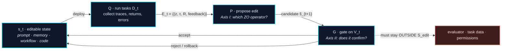

# Awesome Harness Optimization

**一份按理论组织的 Harness Optimization（HarnessOpt）阅读清单：围绕一个冻结 LLM 的软件系统，如何对自身提出修改、验证修改、并把修改固化下来。**

[](https://awesome.re)
[](#贡献)
[](LICENSE)

[English](README.md) | **中文**

> **这份清单的不同之处。** 现有清单按*被编辑的对象*组织自演化 agent（prompt → memory → workflow → code）。这条轴必要但不充分：它不说明**在无梯度的信息结构下修改提案是怎么形成的**，也不说明**被接受的修改在统计上是否站得住**。本清单补上两条正交的轴：
>
> - **[Axis I — 零阶视角](#axis-i--harnessopt-的零阶视角)：** 优化器只能*部署候选、运行任务、观察回报*。每种方法实际实例化的是哪个经典零阶优化（zeroth-order optimization, ZO）算子，以及可编辑面（editable surface）是否允许这个算子存在。
> - **[Axis II — PAC / 稳定性视角](#axis-ii--harnessopt-的-pac--稳定性分析)：** 两个不可互换的界支配 HarnessOpt。更新稳定性（$\beta_{\exp}$）决定单次 rollout 能否劫持整次更新；独立确认决定被选中的候选能否泛化。多数已发表系统两者都没有干净满足，本清单指出每个系统违反的是哪一个。

---

## Table of Contents

- [收录范围](#收录范围)
- [HarnessOpt 更新循环](#harnessopt-更新循环)
- [Axis 0 — 可编辑面 L0–L5](#axis-0--可编辑面-l0l5)
- [**Axis I — HarnessOpt 的零阶视角**](#axis-i--harnessopt-的零阶视角)
  - [I.1 为什么是零阶](#i1-为什么是零阶)
  - [I.2 算子分类与 ZO 主表](#i2-算子分类与-zo-主表)
  - [I.3 算子可实现性取决于可编辑面结构](#i3-算子可实现性取决于可编辑面结构)
  - [I.4 额外的 oracle 层级与可行性检查](#i4-额外的-oracle-层级与可行性检查)
  - [I.5 证据漂移与 on-policy 的 ZO 估计](#i5-证据漂移与-on-policy-的-zo-估计)
- [**Axis II — HarnessOpt 的 PAC / 稳定性分析**](#axis-ii--harnessopt-的-pac--稳定性分析)
  - [II.1 两个单轮界及其分工](#ii1-两个单轮界及其分工)
  - [II.2 多轮复用与可达集确认界](#ii2-多轮复用与可达集确认界)
  - [II.3 接受阈值与精确 rollback](#ii3-接受阈值与精确-rollback)
  - [II.4 分层验证与平均非回归掩盖的尾部塌陷](#ii4-分层验证与平均非回归掩盖的尾部塌陷)
  - [II.5 两种不可混淆的漂移](#ii5-两种不可混淆的漂移)
  - [II.6 **文献的稳定性与确认审计**](#ii6-文献的稳定性与确认审计)
- [论文列表](#论文列表)
  - [1. 基础与保证阶梯](#1-基础与保证阶梯)
  - [**2. 可编辑面 L0–L5**](#2-可编辑面-l0l5)
    - [2.1 L0 — 指令 prompt](#21-l0--指令-prompt)
    - [2.2 L1 — context / memory / skill 库](#22-l1--context--memory--skill-库)
    - [2.3 L2 — Agentic workflow 与架构搜索](#23-l2--agentic-workflow-与架构搜索)
    - [2.4 L3 — 自修改 harness 代码](#24-l3--自修改-harness-代码)
    - [2.5 L4 — 优化器与 meta-harness 代码](#25-l4--优化器与-meta-harness-代码)
    - [2.6 L5 — harness 与权重联合优化的边界情形](#26-l5--harness-与权重联合优化的边界情形)
  - [3. 按 Axis I 重排 — 哪个 ZO 算子形成提案](#3-按-axis-i-重排--哪个-zo-算子形成提案)
  - [4. 按 Axis II 重排 — 验证协议许可什么结论](#4-按-axis-ii-重排--验证协议许可什么结论)
  - [5. 评测器与基准](#5-评测器与基准)
  - [6. 失败模式](#6-失败模式)
  - [7. 相关综述与邻接领域](#7-相关综述与邻接领域)
- [报告清单](#报告清单)
- [开放问题与未来方向](#开放问题与未来方向)
- [配套文档](#配套文档)
- [贡献](#贡献)
- [引用](#引用)

---

## 收录范围

**工作定义。** 固定基座模型 $M$、任务分布 $\mathcal{D}$ 和一个外部评测边界。设 $s$ 为*模型外部*的软件 state：prompt、context、memory、workflow 图、工具接口、agent 代码、优化器代码。harness 以 $\tau = H_s(M, z)$ 的形式执行任务 $z$。**HarnessOpt** 指任何反复执行以下三步的过程：(i) 运行系统收集证据；(ii) 从证据出发提出对 $s$ 的编辑；(iii) 通过某种 accept / reject / rollback 规则决定哪些编辑被保留。

**焦点范围。** 基座模型冻结、用运行时反馈修改模型外部 state 的工作。包括 prompt 优化、自演化 memory / skill、workflow 搜索、自修改 agent 代码、meta 优化器代码，以及这类循环所优化的评测器与基准。

**边界情形。** L5（harness 与权重联合优化）作为边界收录，不作为核心。纯权重侧自改进（self-play、RLVR、合成数据）和手工设计的 harness（ReAct、SWE-agent、MCP）只在 [§7](#7-相关综述与邻接领域) 列出，用来标出边界位置。

**三类句子全文分开标注**，这是本清单试图执行的纪律：
- **[Lit]** 可归属到具体论文的事实陈述；
- **[Ana]** 本清单在统一框架下做的比较分析，不是原论文的主张；
- **[Rec]** 建议或协议提案，按建议表述，不写成当前实践。

---

## HarnessOpt 更新循环

四个部件，一次更新：

$$
\underbrace{\mathcal{E}_t = Q(s_t; D_t)}_{\text{collect evidence}}
\qquad
\underbrace{\tilde{s}_{t+1} = P(s_t, \mathcal{E}_t)}_{\text{propose edit}}
\qquad
\underbrace{s_{t+1} = G(s_t, \tilde{s}_{t+1}; V_t)}_{\text{gate: accept / reject / rollback}}
$$



三个条件定义一个 HarnessOpt 系统，其余都是*协议选项*，不属于定义：

1. 本轮内基座模型与外部评测边界固定；
2. 编辑作用于显式界定的可编辑 state 集合 $\mathcal{S}_{\mathrm{edit}}$；
3. 候选经过某种 accept / reject / rollback 处理，其结果影响后续 state。

> **[Ana]** allowlist、编译门、smoke test、独立验证、统计死区、人工评审决定的是系统把第 3 步做得*多好*，属于 [Axis II](#axis-ii--harnessopt-的-pac--稳定性分析) 的讨论对象，不是准入条件。

---

## Axis 0 — 可编辑面 L0–L5

对象轴，作为两条分析轴的脚手架保留。它回答"**什么可以被改**"，不回答怎么改，也不回答改动是否站得住。**六个层级及其论文集中在 [§2](#2-可编辑面-l0l5) 一节。** 这里给出的是层级号掩盖掉的部分。

### 三个区分性子轴 — 层级号掩盖掉的部分

**[Ana]** 可编辑对象的层级几乎不说明*实际*动作空间，下面三个属性才说明：

| 子轴 | 问题 | 为什么重要 |
|---|---|---|
| **写权限** | agent 自主写入，还是必须经人工评审后才写入？ | 决定循环是否闭合 |
| **持久性** | 只在临时 sandbox 里跑，还是提交进受版本管理的 state？ | 决定错误能否累积 |
| **约束执行方式** | 在 prompt 里声明，还是由权限 / sandbox / 隐藏评测器 / 静态检查强制？ | 决定 [PAC 前提 (iii)](#ii1-两个单轮界及其分工) 是否成立 |

> **[Ana] 可编辑面大小与门的强度不是守恒量。** 覆盖控制流和可执行代码的系统并不因此就有更严格的门；一些最大的可编辑面配的是最弱的确认。不要从层级号推断门的强度。见[审计表](#ii6-文献的稳定性与确认审计)。

---
## Axis I — HarnessOpt 的零阶视角

*这条轴的分类标准只有一个：**运行证据通过什么样的零阶信息结构进入修改提案？** 它与 Axis 0 正交——同一个 ZO 算子可以作用在任何层级，同一个层级也可以承载不同算子。*

### I.1 为什么是零阶

$\mathcal{S}_{\mathrm{edit}}$ 由离散文本、程序和文件结构构成，复合映射 $H_s \circ M$ 不可微，因此 $\nabla_s f_M(s)$ 不可得，其中

$$
f_M(s) = \mathbb{E}_{z \sim \mathcal{D}}\big[R(H_s(M, z))\big].
$$

**[Ana]** 一个方法是零阶的，判据*不是*它的变量是否数值型，而是**优化器只能通过查询 oracle 获得目标函数信息**。在 HarnessOpt 中，优化器只能：部署候选 state → 让 agent 跑任务 → 观察分数与 trace → 决定怎么编辑。单次运行给出随机观测 $Y(s,z) = R(H_s(M,z))$，多次运行的经验均值估计 $f_M(s)$。随机性来自任务采样、模型采样和环境执行，优化器从不需要显式构造一个扰动方向。

**与经典 ZO 的一处实质差异：查询返回的是语义，不只是标量。**

$$
\mathcal{E}_t = \{(z_i, \tau_i, R_i, \mathrm{feedback}_i)\}_{i=1}^{n_t}
$$

trace、错误日志、堆栈和测试结果能*定位*失败并*提示*该改什么。SkillOpt-Lite 把这称为 **language-mediated program compilation**：可编辑 state 是一段自然语言或代码写成的程序，rollout 是它的执行 trace，LLM 优化器据此打补丁。**[Lit]**

两条限制必须一起说，否则这个类比就成了过度声称：

- 语义侧信息**不**消除"目标函数信息只能靠运行获得"这一约束。
- **可读的 trace 不等于正确的归因**，正确归因也不等于"候选应该被接受"的统计证据。已报告的 step 级归因准确率处于低位，回归预测的 precision/recall 明显低于修复预测。**[Lit]**

> **Insight 1（概念上的分叉）。** 经典 ZO 盲扰动，因为它无法检视函数。HarnessOpt 读执行 trace，做有针对性的、语义驱动的调试——但受*同样*的仅查询预算约束。收益在提案质量，不在 oracle 访问权限。

### I.2 算子分类与 ZO 主表

以 SkillOpt-Lite 的算子映射为起点，本清单补了两行（自适应调度；种群与档案），使演化搜索方法在这条轴上有位置。

**第三列要仔细读：它给出的是扮演*同一角色*的机制，不是连续估计量的实现。**

| ZO 算子 | 经典形式 | HarnessOpt 中扮演同一角色的机制 | 代表工作 |
|---|---|---|---|
| **Zeroth-order oracle** | $f(s + \mu u)$ | sandbox / 环境反馈；一个标量任务指标 | 以下全部 |
| **One-point estimate** | $\widehat{\nabla} f \propto f(s+\mu u)\, u$ | 单条轨迹或单个异常直接驱动一次编辑 | Reflexion, Voyager, Dynamic Cheatsheet |
| **Multi-point / mini-batch** | $\frac{1}{b}\sum_{i=1}^{b}\big[f(s+\mu u_i) - f(s)\big] u_i$ | 批量 rollout 聚合后再提案；**consensus mining** 要求编辑建立在跨任务可复现的模式上，而不是单个异常 | SkillOpt（$B_m{=}8$ mini-batch）, SkillOpt-Lite（consensus mining）, Trace2Skill（map-reduce 补丁合并）, SkillForge（batch ticket pool）, ExpeL |
| **Central difference** | $\dfrac{f(s+\mu u) - f(s-\mu u)}{2\mu}$ | 在动作分歧点上对成功/失败 trace 做对比；或对同一候选做 on/off 的 A-B 运行 | SkillCAT（分歧点 $w_i$ 上的 CCE 算子）, ProTeGi, TextGrad, DemoEvolve；feature-toggle 实现 |
| **ZO coordinate descent** | $\dfrac{f(s+\mu e_i) - f(s)}{\mu} e_i$ | 故障隔离的原子修改：只改一个模块 / 文件 / 条目，其余固定 | SkillAdaptor（以故障步 $t^*$ 为坐标轴）, Trace2Skill, SkillForge, Meta-Harness |
| **Trust region** | $s_{k+1} \in \mathcal{B}(s_k, \Delta_k)$ | 编辑预算、最小修改原则、allowlist 路径限制、接口签名不变性 | SkillOpt（预算衰减 $L_t: 4 \to 2$）, SkillOpt-Lite, SoftSkill（prefix 限定在 $m{=}32$）, HarnessOpt allowlist + $\Delta$ |
| **Control variate** | $\hat{g}_{\mathrm{cv}} = \hat{g} - c + \mathbb{E}[c]$ | 拒绝编辑缓冲区把后续提案引离已知死方向；配对重放抵消公共随机性 | SkillOpt rejected buffer, GEPA, Meta-Harness |
| **Adaptive step / momentum** *(新增)* | 步长按改进历史调度 | 探索预算与候选采样按 fitness 改进轨迹调度 | AdaEvolve, ShinkaEvolve, AlphaEvolve, ThetaEvolve |
| **Population & archive** *(新增)* | $\tilde{s} \in \operatorname{Select}(\mathcal{A}_t; R)$ | 精英保留、island model、novelty 拒绝采样、Pareto 选择 | Promptbreeder, ADAS, AFlow, AgentSquare, ELM, AlphaEvolve, ShinkaEvolve, DGM, GEPA |
| **Confirmation gate** | 在独立样本上做一次性评测 | compile → smoke → full 的分阶段确认；held-out 选择 | SkillOpt, SkillOpt-Lite, Self-Harness, SkillForge |

**[Ana] 一处值得如实重述的地方。** SkillOpt 用一阶词汇描述自己的机制——learning rate、momentum、mini-batch。从结构上看它更接近**带结构化提案算子的 (1+1)-ES / 随机爬山**：编辑预算 $L_t$ 是提案半径，rejected buffer 是提案分布的负向条件化，"慢更新"是跨 epoch 的低频分量，接受规则是 held-out 上的严格改进。这样说不削弱方法本身，只是澄清 ZO 映射组织的是*信息结构*，不构成把这些机制当作梯度下降等价物的许可。

### I.3 算子可实现性取决于可编辑面结构

**这是 Axis 0 与 Axis I 之间真正的依赖关系**，而且它对层级不单调。不是"层级越高算子越强"，而是**特定算子要求可编辑面提供特定结构**。

| 算子 | 要求可编辑面提供 | 结构缺失（典型：纯文本产物） | 结构具备（典型：受版本管理的可执行代码） |
|---|---|---|---|
| **Central difference** | **可构造的负方向** | 只能在 trace 分歧点做启发式对比；$s - \mu u$ 无法真正构造出来 | feature toggle 使同一 harness 的 on/off 版本能在同一批次内共跑，$s-\mu u$ 是真正可部署的 state |
| **Coordinate descent** | **客观的块边界** | 文本"坐标"不正交，段落切分是任意的——这是没有客观块定义的 block-coordinate descent | import 图和接口签名给出客观边界；块内编辑与块间依赖可静态判定 |
| **Control variate** | **可配对的重放** | rejected buffer 里没有显式随机变量 $c$，没有已知的 $\mathbb{E}[c]$，没有无偏修正——方差缩减不可验证 | 确定性种子加版本控制让配对比较成立，公共随机性真正被抵消 |
| **Multi-point / mini-batch** | **扰动，而不只是重采样任务** | 批次内变化的是任务 $z_i$ 而不是扰动 $u_i$——这估计的是任务噪声下的 $f$，不是方向导数 | 同样的限制成立；如实的读法是*在 $\mathcal{D}$ 上做方差缩减*，而这正是稳定性（[Axis II](#ii1-两个单轮界及其分工)）需要的 |
| **Trust region** | **可测量的行为距离** | 编辑次数不是可靠的语义距离：改一个词可能大幅改变行为，加十行注释可能什么都不改 | 半径可以用更硬的量：改动文件数、跨模块触及范围、接口签名变化、smoke 通过率。allowlist 是静态 trust region，$\Delta$ 是回报侧 trust region |

> **[Rec]** 文本空间中真正逼近行为距离的 trust region 应当联合考虑改动文件数、改动行数、跨越模块数、行为测试 diff、工具调用分布偏移和输出分布偏移，而不只是 token 或编辑次数的上限。

> **[Ana]** 这张表说明 allowlist、feature toggle 和版本化 rollback **不是**外挂的安全措施。它们是让对应 ZO 算子得以实现的前置条件；按 [Proposition A](#ii2-多轮复用与可达集确认界)，它们同时也收紧了确认界。

### I.4 额外的 oracle 层级与可行性检查

经典 ZO 只建模一个 oracle：给一个候选，得到一个（带噪的）目标值。HarnessOpt 有**两个成本相差数量级的层级**：

$$
\underbrace{\text{compile / type-check / static analysis}}_{\text{feasibility oracle: no task rollout, returns feasible/infeasible}}
\;\longrightarrow\;
\underbrace{\text{smoke test } (N \text{ small})}_{\text{cheap, high-variance estimate}}
\;\longrightarrow\;
\underbrace{\text{full validation}}_{\text{expensive, low-variance}}
$$

两个推论：

1. **[Ana]** 最优查询分配不再是"预算在候选间平均切分"——先用低成本过滤缩小候选集，只有幸存者才消耗 rollout。
2. **[Ana]** **可编辑面的形态决定 feasibility oracle 的强度。** 可执行代码可由编译器和类型系统检查；自然语言产物没有可比的、无需 rollout 的可行性判据。这是代码级 HarnessOpt 相对 skill 级优化在搜索效率上的结构性优势，也是 compile → smoke → full 这个顺序的真实成因。

> **[Rec] 不要把它称作"zero-cost oracle"。** 它是预运行可行性检查。它消耗算力，只是不消耗任务 rollout。报告查询预算时这个区分是关键。

### I.5 证据漂移与 on-policy 的 ZO 估计

**[Ana]** $Q$ 采样得到的证据分布依赖于当前 state $s_t$。因此 $\mathcal{E}_t$ 是 **on-policy 证据**，优化器关于 $s_t$ 邻域的信息是有偏样本。

具体失败模式：某类失败一旦被修好，就不再出现在后续 trace 中；优化器因此失去了"该约束仍然必要"的证据，可能**在后续轮次中把它撤销**。这与 off-policy 评估中的覆盖不足同源，但作用对象是*约束保留*而非价值估计。

这是 **ZO 估计量的偏差问题，不是泛化界问题**——这个区分很重要，见 [II.5](#ii5-两种不可混淆的漂移)。当前工作在工程上用回归测试套件、held-in 集合和里程碑重放来缓解。**[Ana]** 本清单把它列为已识别但未解决的机制，并刻意不给界：给界需要建模 $P$ 的行为，假设的代价会超过结论的价值。

---
## Axis II — HarnessOpt 的 PAC / 稳定性分析

*Axis I 解释候选如何产生。Axis II 回答更难的问题：**在什么条件下，一次随机试验的结果可以被提升为持久 state？** 本节把 skill 优化的两个单轮界扩展到 HarnessOpt 的多轮、漂移、代码编辑设定。*

**设定。** 基座模型 $M$ 固定，任务 $z \sim \mathcal{D}$，可编辑 state $s \in \mathcal{S}$，轨迹 $\tau = H_s(M,z)$，有界回报 $R(\tau) \in [0,1]$，损失 $\ell(s;z) = 1 - R(H_s(M,z))$，风险 $\epsilon(s) = \mathbb{E}_{z\sim\mathcal{D}}[\ell(s;z)]$。

### II.1 两个单轮界及其分工

在已观测任务上得分更高的候选，不因此就在 $\mathcal{D}$ 上更好。两个不同的界处理推断失效的两种不同方式。

**(B1) 更新侧 — 算法稳定性。** 设 $D_N$ 为训练任务，$\mathcal{A}$ 为更新算法，$s_D = \mathcal{A}(D_N)$，$s_{D^{\setminus i}} = \mathcal{A}(D_N^{\setminus i})$。期望平均稳定性为

$$
\beta_{\exp} = \mathbb{E}_{D_N,\, i,\, z\sim\mathcal{D}}\Big[\big|\ell(s_D; z) - \ell(s_{D^{\setminus i}}; z)\big|\Big],
$$

在有界损失和相应稳定性条件下，

$$
\boxed{\;\epsilon(s_D) \;\le\; \widehat{\epsilon}_{D_N}(s_D) \;+\; O\!\left(\beta_{\exp} + \sqrt{\tfrac{\ln(1/\delta)}{N}}\right)\;}
$$

**[Ana]** $\beta_{\exp}$ 度量的是整个更新过程（$Q$、证据聚合与 $P$ 共同）对单次 rollout 异常的敏感度。逐例硬编码、照抄某次失败试验独有的环境变量、按 episode 特定字符串分支，都会抬高 $\beta_{\exp}$ 并造成泛化塌陷。跨任务聚合、consensus mining 和有界编辑降低它。**这就是 [ZO 主表](#i2-算子分类与-zo-主表)中 mini-batch / consensus 一行的统计内涵**——两条轴在此交汇。

**(B2) 确认侧 — 独立验证。** 若 $V_m$（$m$ 个 i.i.d. 任务）独立于训练数据和提案过程，则对*固定的*、未使用 $V_m$ 生成的候选 $\tilde{s}$，

$$
\boxed{\;\epsilon(\tilde{s}) \;\le\; \widehat{\epsilon}_{V_m}(\tilde{s}) \;+\; O\!\left(\sqrt{\tfrac{\ln(1/\delta)}{m}}\right)\;}
$$

无论更新算法多不稳定，独立验证只关心最终产物在未见样本上的表现，$\beta_{\exp}$ 从界中**完全消失**。

> **Insight 2（稳定性）。** 稳健的 HarnessOpt 更新算法起到 $\beta_{\exp}$ 稳定算子的作用：文本/代码变异必须对单次试验的异常不敏感，使得留存下来的是跨任务的结构不变性，而不是被记住的某条轨迹。

> **Insight 3（独立验证）。** 验证集承担双重职责：与数据和提案过程的**严格统计独立**，以及压住 $O(\sqrt{\ln(1/\delta)/m})$ 所需的**充分规模 $m$**。任一条不满足，确认这一读法就失效，而不只是被削弱。

#### 分工本身才是要点

> **[Ana]** **(B1) 与 (B2) 既不可加也不可替代。** (B1) 管的是"更新过程是否被单次 rollout 劫持"——从 $\widehat{\epsilon}_{D_N}$ 到 $\epsilon$ 的差距。(B2) 管的是"在同一个验证集上反复选择是否制造了选择偏差"——从 $\widehat{\epsilon}_{V_m}$ 到 $\epsilon$ 的差距。**$\beta_{\exp}$ 极小的更新过程仍可能跨轮次灾难性地过拟合 $V_m$，反之亦然。**
>
> 因此 **consensus mining（降低 $\beta_{\exp}$）与验证集轮换（降低选择偏差）解决的是不同问题，不能互相替代。** 文献常把两者一并称作"提升泛化"，这掩盖了这一分工。

**接受判据。** 设 $\widehat{R}_{V_m}(s)$ 为验证集平均回报，$\widehat{\Delta}_{V_m} = \widehat{R}_{V_m}(\tilde{s}) - \widehat{R}_{V_m}(s_t)$。门 $G$ 只有在 $\widehat{\Delta}_{V_m}$ 超过统计死区 $\Delta$ *且*关键非回归检查通过时才写回。候选数量、对验证结果的反复检视、跨轮次复用都会改变所需的统计条件——这正是 [II.2](#ii2-多轮复用与可达集确认界) 要量化的。

#### (B2) 的三条前提，以及各自在实践中怎么失效

| 前提 | 内容 | 在 HarnessOpt 中怎么失效 |
|---|---|---|
| **(i) 独立性** | $V_m$ 独立于提案过程 | 固定的 selection 集被跨轮次反复 `argmax`。任务昂贵时，很多系统干脆不切独立集，改用人工检视加字符串泄漏审计——这是可辩护的工程折中，但**不**等价于独立性，而这个等价性很少被论证 |
| **(ii) 信号偏差有界** | 评测信号的偏差有界 | 编译通过、几个 smoke test、或可见测试只说明候选*能跑*，不说明它满足规格。**对语义类修改结构上最难：**凡是能自动检查的通常已经被做成了门，留给声明式约束的恰恰是自动检查建立不了的部分；而 agent 唯一的自验证信号是任务成功，其中一类约束的存在目的正是防止伪造成功证据。在这里"偏差有界"不是保守假设，通常直接是假的 |
| **(iii) 评测器在 $\mathcal{S}_{\mathrm{edit}}$ 之外** | 测量装置不可编辑 | **最脆弱的一条，原因是结构性的：评测器和被评测对象住在同一个仓库里。** 现有自演化风险分析假定测量装置位于演化面之外；HarnessOpt 的定义性特征使该假定不成立。已观察到的行为包括删除日志以绕过检测函数、预置环境以在不完成真实流程的情况下拿到奖励；检测函数*未被隐藏*时目标劫持更频繁。**[Lit]** |

> **[Ana] 归因准确率给事后 rollback 路线设了上界。** 前提 (i)–(iii) 问的是"改进是否真实"。另一个问题是"回归能否被*检测并撤销*"。已报告的 step 级归因准确率低，回归预测的 precision/recall 明显低于修复预测，且相当一部分真实回归从未被预见。所以"预测 → 检查 → 回滚"策略的安全上限由归因准确率决定。**事前门（编译、sandbox、隐藏、权限）与事后 rollback 是强度不同的工具，不应互换描述。**

### II.2 多轮复用与可达集确认界

**[Ana] 多轮循环恰好打破 (B2) 的前提 (i)：** $\tilde{s}_{t+1}$ 通过第 $1..t$ 轮的 accept/reject 决策依赖于 $V$。本小节*不*假设独立性，改为对实际被测过的假设类做界定，从而恢复一个可用的界。

**参照点 — STOP Lemma 1。** 对字母表 $\Sigma$ 和长度 $\le l$ 的程序，经验 meta-utility 的一致收敛通过 Chernoff 加对 $|\Sigma|^{l+1}$ 个程序的 union bound 给出松弛 $\epsilon = \sqrt{\frac{1}{n}(l\ln|\Sigma| + \ln\frac{1}{\delta})}$。**[Lit]** 它的 union bound 覆盖的是*静态*假设类——所有长度 $\le l$ 的程序——因为它不假设改进从一个固定程序出发。

**[Ana] HarnessOpt 有两点是 STOP 没有的，它们把那个静态类变成小得多的可达集：**

- **A1（锚定起点）。** $s_0$ 在优化开始前固定且不依赖 $V$。在 HarnessOpt 中这自然成立：第 0 轮产物是审计对象，必然是固定的。
- **A2（每轮编辑有界）。** 存在 $L$，使 $\tilde{s}_{t+1}$ 与 $s_t$ 之差可由 $\Sigma$ 上长度 $\le L$ 的编辑脚本描述。这是 [I.2](#i2-算子分类与-zo-主表) 中 trust region / 最小编辑原则的直接产物。

在 A1–A2 下，$T$ 轮内**所有被提出或被测试过的 state** 构成的集合 $\mathcal{H}_T$ 满足 $\ln|\mathcal{H}_T| \le T(L+1)\ln|\Sigma|$。*（计数必须包含被拒候选——union bound 要覆盖一切在 $V_m$ 上被评测过的对象，不只是被接受的。）*

> **Proposition A（验证集复用下的一致确认）。** 设 $V_m$ 为 $m$ 个 i.i.d. 任务，损失有界于 $[0,1]$，A1–A2 成立。则以概率 $\ge 1-\delta$，对所有 $s \in \mathcal{H}_T$ 同时成立：
>
> $$\epsilon(s) \;\le\; \widehat{\epsilon}_{V_m}(s) + \sqrt{\frac{T(L+1)\ln|\Sigma| + \ln(1/\delta)}{2m}}$$
>
> 特别地它对最终 state $s_T$ 成立，**不要求 $s_T \perp V_m$**——这正是多轮复用需要的。
>
> *证明。* 对单个固定 $s$ 用 Hoeffding，再按上述计数对 $\mathcal{H}_T$ 做 union bound。$\square$

记 $\eta_T := \sqrt{\frac{T(L+1)\ln|\Sigma| + \ln(1/\delta)}{2m}}$。三个推论直接得出。

**A-1 — $\sqrt{T}$ 退化。** 松弛按 $\sqrt{T}$ 增长。**演化轮次本身消耗统计预算：**每一轮都再看一次同一个验证集，可达类相应增大。这把"演化侵蚀自身的泛化保证"从定性评论变成有明确速率的陈述，也给出 STOP 的 $l\ln|\Sigma|$ 项的动态版本。

**A-2 — 所需的验证集规模增长。** 要把松弛压在 $\epsilon$ 以下：

$$
m \;\ge\; \frac{T(L+1)\ln|\Sigma| + \ln(1/\delta)}{2\epsilon^2}
$$

**[Ana]** 即**在固定验证集下，可承受的演化轮数与 $m$ 线性相关。** 这与实践冲突：skill 优化工作在小验证集划分上报告高方差，而在昂贵终端基准上的 harness 工作常常不切独立集。两者都处于小 $m$、$T$ 不小的区间。

**A-3 — 编辑预算的统计角色。** 记 $l_{\mathrm{eff}} := T(L+1)$。Proposition A 与 STOP Lemma 1 形式相同，只需 $l \to l_{\mathrm{eff}}$。于是：

> **在锚定起点下，决定确认界紧致程度的不是 harness 的程序规模，而是累计花掉的编辑预算。**

当 $T(L+1) < |s_T|$ 时，Proposition A 严格强于在程序空间上的 union bound。**[Ana] 这给 trust region / 最小编辑一个据我们所知尚未被陈述过的理由：它不只降低提案方差，而是直接收紧确认界。** 反过来，不设预算的整文件重写让 $L \approx |s|$，退回到 STOP 的量级。

#### Proposition A′ — 验证集轮换把 $T$ 降到 $\ln T$

> **Proposition A′。** 若第 $t$ 轮使用一个新的验证集 $V^{(t)}$（$|V^{(t)}| = m$），它独立于此前所有轮次和提案过程，则按轮应用 (B2) 并取 $\delta_t = \delta/T$ 做 union bound，得到以概率 $\ge 1-\delta$ 对所有 $t$ 同时成立：
>
> $$\epsilon(\tilde{s}_{t+1}) \;\le\; \widehat{\epsilon}_{V^{(t)}}(\tilde{s}_{t+1}) + \sqrt{\frac{\ln T + \ln(1/\delta)}{2m}}$$

对 $T$ 的依赖从线性降到对数。代价是总任务消耗从 $m$ 变成 $Tm$。

> **[Rec] 这是本分析最可执行的产物。** 它把"轮换验证集"从一句模糊的好习惯变成有量化收益的设计规则，并把取舍讲清楚：**若新任务的边际成本低于扩大验证集成本的 $\sqrt{T/\ln T}$ 倍，就轮换而不是扩容。** 当前多数工作复用固定的 selection 集。

#### 假设审计（可能失效的地方）

- **A1** 自然成立，*除非*第 0 轮本身消耗了后来用于确认的任务。**[Rec]** 这应当作为一个显式报告字段。
- **A2 是真正的弱点。** 编辑脚本长度可测（diff 大小），但"$\le L$ 次编辑" $\ne$ "长度 $\le L$ 的编辑脚本"：少量编辑可以插入大量代码。**[Rec] 引用 Proposition A 时，$L$ 必须定义为编辑的*描述长度*（例如 diff 字节数），不是编辑次数。** allowlist 进一步缩小可达集（只有白名单路径可写），使计数更紧。
- **Proposition A 的适用范围之外：** 若 $P$ 可以调用外部检索并把任意长度的内容写进 state（例如从互联网拉代码进 harness），$L$ 实际无界，命题不适用。这种情况应当显式排除，而不是默默略过。
- 有界损失和 i.i.d. 采样与 (B1)/(B2) 是同一套假设，不增加新负担。

### II.3 接受阈值与精确 rollback

> **Proposition B（被接受的改进是真的）。** 取上文的 $\eta_T$，若接受判据使用 $\Delta > 2\eta_T$，则以概率 $\ge 1-\delta$，每次被接受的更新都满足 $\epsilon(s_{t+1}) < \epsilon(s_t)$。
>
> *证明。* 在 Proposition A 的一致事件上，$|\widehat{\epsilon} - \epsilon| \le \eta_T$ 对 $s_t$ 与 $\tilde{s}_{t+1}$ 同时成立，故真实风险差与经验差最多相差 $2\eta_T$。$\square$

**B-1 — $\Delta$ 与 $L$ 不是独立旋钮。** $\Delta$ 的下界随 $L$ 单调增。**放宽编辑预算必须同步抬高接受阈值，否则门失去意义。** **[Ana]** 当前实践把 $\Delta$ 当作经验噪声估计、把 $L$ 当作提案质量控制，各自独立调；Proposition B 说明这不自洽。

**B-2 — 单调改进要求精确 rollback。** Proposition B 只保证*被接受*的更新确实改进。要得到 $\epsilon(s_T) \le \epsilon(s_0)$，还需要被拒提案不留残留：若拒绝 $\tilde{s}_{t+1}$ 后 $s_{t+1} = s_t$ 在**行为上严格成立**，则在同一 $1-\delta$ 事件内风险序列 $\epsilon(s_0) \ge \epsilon(s_1) \ge \cdots$ 单调不增。

> **[Ana] 这把一个系统属性提升为定理前提。** "rollback 精确还原 state"不是工程整洁性问题，而是*单调性结论的必要条件*。未清理的副作用（残留进程、注册表条目、缓存文件、已写入的 memory 条目）使 $s_{t+1} \ne s_t$，单调性失效。这是 **revertible effects / temporal composability** 要求的统计对应物，也是"不覆盖运行时副作用的 `git` rollback 不够用"的原因。

### II.4 分层验证与平均非回归掩盖的尾部塌陷

Proposition A 与 B 给出的非回归**只在平均意义上**成立：$\epsilon$ 是在 $\mathcal{D}$ 上的期望，$V_m$ 从 $\mathcal{D}$ i.i.d. 抽取。若能力簇 $A_k$ 在 $\mathcal{D}$ 下的概率质量为 $p_k$，只要局限在 $A_k$ 内的退化幅度低于 $\eta_T / p_k$，门就完全看不见。

> **Proposition C（分层验证是必要的）。** 在 i.i.d. 验证集加平均回报接受判据下，对质量为 $p_k$ 的簇，无法排除幅度达 $O(\eta_T / p_k)$ 的簇内退化。要对每个簇获得 $\epsilon_k$ 级别的保证，每个簇需要独立采样
>
> $$m_k = \Omega\!\left(\frac{T(L+1)\ln|\Sigma| + \ln(K/\delta)}{\epsilon_k^2}\right)$$
>
> *证明。* 对每个簇应用 Proposition A，再对 $K$ 个簇做 union bound（$\delta \to \delta/K$）。$\square$

> **[Ana] 长尾能力（$p_k$ 小）在平均判据下统计上不可见。** 这解释了"总分上升而个别里程碑被永久丢失"如何在不违反任何生效的界的情况下发生。**[Rec] 非回归测试套件必须分层并按簇报告，不能并入主验证集取平均。**

**非参数设定下的遗忘。** 没有权重可言时，遗忘只能定义在任务集性能上。对簇 $A_1,\dots,A_K$：

$$
\mathrm{FGT}_T = \frac{1}{K}\sum_{k=1}^{K}\Big[\max_{t \le T}\widehat{R}_{A_k}(s_t) - \widehat{R}_{A_k}(s_T)\Big]_+
$$

**[Ana]** 形式上这与持续学习文献中的 FGT 一致，但有一处实质差异：**持续学习的遗忘来自参数覆写，这里来自一次显式编辑，因此原则上可归因到具体 diff。** 这是非参数设定的优势，应当利用——*可归因*与*不可归因*的遗忘值得分开报告。

### II.5 两种不可混淆的漂移

**[Ana]** "harness 编辑会改变下游行为分布"这句话被反复重复，很少被形式化。它把两件归属不同的事混在了一起。

| | **D1 — 目标分布漂移** | **D2 — 证据分布漂移** |
|---|---|---|
| **什么在动** | 任务分布本身，$z \sim \mathcal{D}_t$ | 轨迹生成分布，进而 $Q$ 采样得到的 $\mathcal{E}_t$ 的分布 |
| **破坏什么** | 泛化界的*适用对象* | 零阶估计的*无偏性* |
| **归属** | Axis II（本节） | [Axis I.5](#i5-证据漂移与-on-policy-的-zo-估计) |
| **处理方式** | 标准做法：引入散度 $d(\mathcal{D}_{t-1},\mathcal{D}_t)$（TV、$\mathcal{H}$-divergence、discrepancy）并累加 | 需要建模 $P$ 的行为；**本清单陈述机制并刻意不给界** |

对 D1，累加形式为

$$
\epsilon_{\mathcal{D}_T}(s_T) \;\le\; \widehat{\epsilon}_{V_m}(s_T) + \eta_T + \sum_{t=1}^{T} d(\mathcal{D}_{t-1}, \mathcal{D}_t).
$$

**[Ana]** 技术上是常规操作，但对 HarnessOpt 有一个具体推论：**漂移项线性累加，而 $\eta_T$ 只按 $\sqrt{T}$ 增长，因此在足够长的时间跨度上，主导误差项是漂移而不是选择偏差。** 这给出一个可检验的判据：*什么时候应当从头重跑第 0 轮，而不是继续增量演化*。

### II.6 文献的稳定性与确认审计

**[Ana]** 这是本清单存在的理由所在的表。每个系统按**其协议能支撑两个界中的哪一个**分类，而不是按它"有没有跑测试"。决定性的问题不是测试是否跑过，而是**测试结果能否阻止候选进入持久 state**，以及**用于该决策的集合是否跨轮次复用**。

**图例。** ✅ 满足 · ⚠️ 部分 / 有条件 · ❌ 不满足 · — 不适用

| 协议类别 | 机制 | 代表工作 | (B1) $\beta_{\exp}$ 控制 | (B2) 独立确认 | 多轮状态 |
|---|---|---|---|---|---|
| **Open loop** *(无独立确认)* | 经验直接写入后续 state；无候选测试，无失败恢复 | Reflexion, Voyager, ExpeL, Dynamic Cheatsheet, ReasoningBank, Memp, ACE, AWM, MemAct, Continual Harness | ❌ 多为单轨迹更新 → $\beta_{\exp}$ 高 | ❌ 前提 (i) 按构造就不存在 | 只能讨论经验积累，谈不上确认 |
| **同集打分与选择** | 在*搜索*任务上打分 / 精英保留 / 建档案；测试集结果在最后单独报告 | APE, OPRO, Promptbreeder, DSPy, MIPROv2, ADAS, AFlow, MaAS, AgentSquare, ELM, AlphaEvolve, ShinkaEvolve, ThetaEvolve, DGM, SICA | ⚠️ 种群平均抑制了单样本效应，但没有显式稳定性机制 | ❌ 候选依赖被反复观测的任务，独立性不成立 | **适用的读法是 Proposition A**，$\eta_T$ 随 $T$ 和 $L$ 增长；只给一个最终测试分会高估确认强度 |
| **独立验证与 rollback** | 候选在不相交验证集上确认，或通过回溯预测加版本测试；失败则拒绝或回滚 | SkillOpt, SkillOpt-Lite, GEPA, SkillForge, SkillCAT, DemoEvolve, Self-Harness, Meta-Harness; AHE（回溯式） | ✅ consensus mining / 批聚合 / 树归约显式针对 $\beta_{\exp}$ | ⚠️ 前提 (i) 在第 1 轮成立；**除非轮换验证集，否则跨轮次退化** | **轮换则适用 Proposition A′，否则适用 Proposition A**。需报告 $T$、$L$、$m$、复用次数 |

**逐系统的确认前提说明**——各自具体在哪里妥协：

- **[Lit]** Reflexion 在开环中完全跳过动态验证。
- **[Lit]** SkillCAT、SkillAdaptor 和 Trace2Skill 的门要么跑在源训练失败实例的直接克隆上，要么跑在训练集的子采样子集上——这是在损害 (B2) 界而不是满足它。
- **[Lit]** SkillOpt 使用三路不相交划分且测试集在最终报告前锁定；SkillOpt-Lite 使用 held-out 选择加 compile–smoke–full 分阶段确认；Self-Harness 使用 held-in/held-out 双向非回归。
- **[Lit]** AHE 的 prediction manifest 加下一轮 rollback 提供的是*回溯式*确认，没有严格不相交的 held-out 集。
- **[Ana]** Trace2Skill（map-reduce 补丁合并）、SkillForge（batch ticket pool）和 SkillOpt（分层并行 LLM 树归约）都强制跨任务共识——三种不同机制指向同一个量 $\beta_{\exp}$。

#### 接受必须是联合条件

**[Lit]** 已发表的接受门几乎都只测任务通过率。这对一个有记录的失败模式原则上是盲的：**性能与安全可以反向移动。** 在 workflow 优化中，HumanEval 性能上升的同时 Refusal Rate 从 36.3% 降到 5.6%，Attack Success Rate 从 54.4% 升到 83.1%；在 memory 演化设定中，Refusal Rate 从 99.4% 降到 54.4%，ASR 从 0.6% 升到 20.6%——而且退化可能在某一轮突然出现，不是逐步发生。

> **[Rec] 接受条件应当是（性能非回归，安全非回归）的联合条件。** 只看通过率的门原则上看不见安全退化，所以安全指标必须进入 $G$ 本身，而不是作为最终表格的一个附加列。

这与 [I.4](#i4-额外的-oracle-层级与可行性检查) 的分阶段 oracle 兼容：安全探针可以放在 smoke 层，成本远低于完整验证。**[Lit]** 另需注意被优化的组件可能演化出具备外部交互能力的结构（子 agent 构建、工具注册、集成节点）——在可比设定中已有实证观察——所以探针必须覆盖*候选新引入的交互面*，而不只是它的最终输出。

#### 四项接受检查

> **[Rec]** 候选只有在以下四条全部成立时才应进入持久 state：
>
> 1. **相对当前版本无关键性能回归**——按 [Proposition B](#ii3-接受阈值与精确-rollback) 取 $\Delta > 2\eta_T$，按 [Proposition C](#ii4-分层验证与平均非回归掩盖的尾部塌陷) 分层。
> 2. **无关键安全 / 权限回归**——安全探针置于 $G$ 内部。
> 3. **评测器、任务数据和受保护路径未被修改**——前提 (iii)，在运行时强制而非在 prompt 中声明。
> 4. **候选可记录、可重放、rollback 精确**——[B-2](#ii3-接受阈值与精确-rollback) 的要求，不是可选的卫生习惯。

---

## 论文列表

**组织方式。** §1 给出基础与推动两条轴的保证阶梯。**§2 是主体：整个可编辑面 L0–L5 集中在一节**，对象轴可以一口气从头读到尾。§3 与 §4 把*同一批*工作按两条分析轴重排——§3 按哪个 ZO 算子形成提案，§4 按哪种验证协议把门守住。§5–§7 覆盖评测器、失败模式和边界。

**[Ana] 一项工作同时出现在 §2、§3、§4 不等于被计三次。** §2 记录它*改什么*；§3 记录它*怎么提案*；§4 记录它的门*许可得出什么结论*。每次出现只取那一个侧面。

**条目格式。** `**Name** — "Title". Authors. Venue Year. [[paper]](link) — 一句话说明它与 HarnessOpt 的关系。[ZO: operator] [PAC: class]`
`[ZO: …]` 把工作定位到 [Axis I](#i2-算子分类与-zo-主表)；`[PAC: …]` 定位到 [Axis II](#ii6-文献的稳定性与确认审计)（`open` / `same-set` / `independent`）。`†` 标记元数据可能仍会变动的 preprint。**[Ana]** 两个标注都是本清单的读法，不是论文的自我描述。

---

### 1. 基础与保证阶梯

**[Ana]** 本节只回答一个问题：*在什么意义上可以判定一次自我修改值得保留？* 历史上提出过三个参照点。HarnessOpt 位于中间那个，两条轴都瞄准它。

| 参照点 | 修改如何被判定 | 本清单如何处理 |
|---|---|---|
| **形式化证明** | 系统内部证明有益之后才执行 | 历史锚点；不要求任何现有系统达到 |
| **概率性确认** | 退化或选择偏差被控制在给定概率下 | **[Axis II](#axis-ii--harnessopt-的-pac--稳定性分析) 的目标**——作为研究对象陈述，不是已解决的问题 |
| **经验分数** | 在某些任务上分数更高 | 通行做法；§4 分析它的边界 |

- **Gödel Machines: Fully Self-Referential Optimal Universal Self-Improvers** — J. Schmidhuber. 2003. [[paper]](https://arxiv.org/abs/cs/0309048) — 只有在内部证明效用提升后才自我重写。**[Ana]** 阶梯的上端。它的立场是重写效用无法证明就无话可说；本清单的立场是*不可证明不等于不可分析*——ZO 描述搜索侧的信息结构，PAC 描述确认侧的样本条件。
- **Speculations Concerning the First Ultraintelligent Machine** — I. J. Good. *Advances in Computers* 1965. — 通过自设计导向智能爆炸这一想法的源头。仅作动机，一段的分量。
- **Recursive Self-Improvement** — E. Yudkowsky. *LessWrong* 2008. [[post]](https://www.lesswrong.com/posts/JBadX7rwdcRFzGuju/recursive-self-improvement) — 命名了 RSI 反馈循环。
- **Harness Engineering for Self-Improvement** — Lilian Weng. *Lil'Log* 2026. [[blog]](https://lilianweng.github.io/posts/2026-07-04-harness/) — 把 harness 视为近期自改进的载体：循环很少从权重开始，它跑在脚手架上。
- **Code as Agent Harness: Toward Executable, Verifiable, and Stateful Agent Systems** — *arXiv* 2026.† [[paper]](https://arxiv.org/abs/2605.18747) — 主张 harness 应当可执行、可验证、有状态。**[Ana]** 它的验证强度 / 恢复能力 / 状态一致性 / 可重放性列表在原文中只有名目——没有定义，没有测量协议，没有实证。本清单在[报告清单](#报告清单)中把它们落成运行时伴随指标。
- **A Survey of Self-Evolving Agents: What, When, How, and Where to Evolve** — Gao et al. *arXiv* 2025.† [[paper]](https://arxiv.org/abs/2507.21046) — 覆盖模型、memory、工具、架构的分类体系；本清单采用的能力维度与时间尺度区分出自这里。
- **A Comprehensive Survey of Self-Evolving AI Agents** — Fang et al. *arXiv* 2025.† [[paper]](https://arxiv.org/abs/2508.07407) — 连接基础模型与终身 agentic 系统；提出 "Three Laws of Self-Evolving AI Agents"。

---

### 2. 可编辑面 L0–L5

**六个层级集中在一节。** 每个小节说明可编辑面是什么、一个编辑单元长什么样，以及层级号掩盖掉的那部分——**该面向 [Axis I](#i3-算子可实现性取决于可编辑面结构) 的算子提供或不提供什么结构**。

| 层级 | 可编辑对象 | 编辑单元 | 有 feasibility oracle 吗？ | 小节 |
|---|---|---|---|---|
| **L0** | 指令 prompt | prompt、指令块、示例 | ❌ 无预运行判据 | [2.1](#21-l0--指令-prompt) |
| **L1** | context / memory / skill | memory 条目、skill 文件、检索单元 | ⚠️ 仅当 skill 可执行 | [2.2](#22-l1--context--memory--skill-库) |
| **L2** | workflow / 图 / 架构 | 节点、边、子图、模块槽位 | ⚠️ 只能判图的合法性，判不了语义 | [2.3](#23-l2--agentic-workflow-与架构搜索) |
| **L3** | harness / agent 代码 | 文件、模块、工具、插件 | ✅ 编译器、类型系统、静态分析 | [2.4](#24-l3--自修改-harness-代码) |
| **L4** | 优化器 / meta-harness 代码 | proposer、selector、搜索算子 | ✅ 同上，且循环在编辑自己的编辑器 | [2.5](#25-l4--优化器与-meta-harness-代码) |
| **L5** | harness 与模型权重 | checkpoint、LoRA、prefix | — 基座模型固定的条件被中止 | [2.6](#26-l5--harness-与权重联合优化的边界情形) |

> **[Ana] 第四列要对着 Axis 0 的三个子轴读。** 层级说明的是名义上什么可编辑。feasibility oracle 强度、写权限、持久性和约束执行方式才说明动作空间*实际*是什么。两者经常分离：见[横切观察 1](docs/audit-table.md#cross-cutting-observations)。

#### 2.1 L0 — 指令 prompt

*以指令层为优化对象。可编辑面：纯文本。* **[Ana]** 不存在预运行可行性判据，所以每个候选都消耗 rollout；又因为没有可构造的负方向和客观块边界，central difference 和 coordinate descent 在这里只以类比形式存在（[I.3](#i3-算子可实现性取决于可编辑面结构)）。

- **APE** — "Large Language Models Are Human-Level Prompt Engineers". Zhou et al. *ICLR* 2023. [[paper]](https://arxiv.org/abs/2211.01910) — 把指令当程序；用搜索提案并打分。`[ZO: population & archive]` `[PAC: same-set]`
- **OPRO** — "Large Language Models as Optimizers". Yang et al. *ICLR* 2024. [[paper]](https://arxiv.org/abs/2309.03409) — 从历史（解，分数）对构成的 meta-prompt 生成新解。**[Ana]** meta-prompt 只看得到标量，看不到 trace 证据，因此 Axis I 的语义优势没有被用上。`[ZO: one-point]` `[PAC: same-set]`
- **EvoPrompt** — "Connecting LLMs with Evolutionary Algorithms Yields Powerful Prompt Optimizers". Guo et al. *ICLR* 2024. [[paper]](https://arxiv.org/abs/2309.08532) — 在 prompt 种群上做 GA/DE，用 LLM 做变异与交叉。`[ZO: population]` `[PAC: same-set]`
- **Promptbreeder** — "Self-Referential Self-Improvement via Prompt Evolution". Fernando et al. *arXiv* 2023.† [[paper]](https://arxiv.org/abs/2309.16797) — 同时演化任务 prompt *和*修改它们的变异 prompt。**[Ana]** L0 内容加 L4 机制的混合体，是本清单中最早的"循环编辑自己的编辑器"的实例。`[ZO: population]` `[PAC: same-set]`
- **ProTeGi** — "Automatic Prompt Optimization with 'Gradient Descent' and Beam Search". Pryzant et al. *EMNLP* 2023. [[paper]](https://arxiv.org/abs/2305.03495) — 提出 "textual gradients"：把 LLM 的批评当作编辑 prompt 的自然语言梯度。**[Ana]** 结构上扮演 central difference 的*角色*，但没有可构造的 $s-\mu u$。`[ZO: central difference (analogy)]` `[PAC: same-set]`
- **DSPy** — "Compiling Declarative Language Model Calls into Self-Improving Pipelines". Khattab et al. *ICLR* 2024. [[paper]](https://arxiv.org/abs/2310.03714) — 把 LM pipeline 视为可优化文本变换图的编程模型。`[ZO: population & archive]` `[PAC: same-set]`
- **MIPROv2** — "Optimizing Instructions and Demonstrations for Multi-Stage Language Model Programs". Opsahl-Ong et al. *EMNLP* 2024. [[paper]](https://arxiv.org/abs/2406.11695) — 用贝叶斯优化联合自举 few-shot 示例并提案指令。**[Ana]** 为 $f$ 建代理模型而不是盲查询，是与 LLM 提案实质不同的 ZO 策略，也是本清单中唯一这么做的工作。`[ZO: surrogate-model search]` `[PAC: same-set]`
- **TextGrad** — "Automatic 'Differentiation' via Text". Yuksekgonul et al. *Nature* 2025. [[paper]](https://arxiv.org/abs/2406.07496) — 在复合 AI 系统中反向传播文本反馈。**[Ana]** 这里的"梯度"是零阶查询上的语义侧信息，不是可验证的导数；没有任何东西被抵消，所以 central difference 的方差优势一条都不迁移过来。`[ZO: central difference (analogy)]` `[PAC: same-set]`
- **GEPA** — "Reflective Prompt Evolution Can Outperform Reinforcement Learning". Agrawal et al. *arXiv* 2025.† [[paper]](https://arxiv.org/abs/2507.19457) — 读取完整 trace 的 Genetic-Pareto 反思式优化器；rollout 最多比 RL 少 35 倍。**[Ana]** 这是 trace 驱动的提案降低*所需查询数*的证据，属于提案质量，不代表省掉了任何一次查询。`[ZO: population + control variate]` `[PAC: independent]`

#### 2.2 L1 — context / memory / skill 库

*agent 从经验中自行整理并增长自己的 context、memory 或 skill 存储，不更新权重。* **[Ana]** 开环协议类别集中在这里：多数系统把经验直接写进后续 state，没有任何测试能拦住一条坏条目。

**Context 与 memory**

- **Reflexion** — "Language Agents with Verbal Reinforcement Learning". Shinn et al. *NeurIPS* 2023. [[paper]](https://arxiv.org/abs/2303.11366) — 把反馈转成语言化自我反思，跨试验存入 episodic memory。**[Ana]** 典型的 one-point 估计量——一条 trace，一次编辑——也是本清单中 $\beta_{\exp}$ 最高的设计。**[Lit]** 在开环中完全跳过动态验证。`[ZO: one-point]` `[PAC: open]`
- **ExpeL** — "LLM Agents Are Experiential Learners". Zhao et al. *AAAI* 2024. [[paper]](https://arxiv.org/abs/2308.10144) — 收集经验并抽取自然语言洞察，存入不断增长的库。**[Ana]** 跨经验抽取即便没有正式的门，也是真实降低 $\beta_{\exp}$ 的机制。`[ZO: multi-point]` `[PAC: open]`
- **Dynamic Cheatsheet** — "Test-Time Learning with Adaptive Memory". Suzgun et al. *EACL* 2026.† [[paper]](https://arxiv.org/abs/2504.07952) — 推理时持久化的自建策略与代码片段 memory。`[ZO: one-point]` `[PAC: open]`
- **ACE** — "Agentic Context Engineering: Evolving Contexts for Self-Improving Language Models". Zhang et al. *ICLR* 2026. [[paper]](https://arxiv.org/abs/2510.04618) — Generator/Reflector/Curator 加增量 delta 更新，避免 context collapse。**[Ana]** delta 更新是文本面上的 trust region；它防的 "context collapse" 是高 $\beta_{\exp}$ 的具体实例。`[ZO: trust region]` `[PAC: open]`
- **ReasoningBank** — "Scaling Agent Self-Evolving with Reasoning Memory". Ouyang et al. *ICLR* 2026.† [[paper]](https://arxiv.org/abs/2509.25140) — 从成功*与*失败中蒸馏可泛化策略；提出 memory-aware 的 test-time scaling。**[Ana]** 成功/失败配对是 memory 层上的 central difference 角色。`[ZO: central difference (analogy)]` `[PAC: open]`
- **Agent Workflow Memory (AWM)** — Wang, Mao, Fried, Neubig. *ICML* 2025. [[paper]](https://arxiv.org/abs/2409.07429) — 归纳可复用 workflow 作为 agent 自行增长并复用的持久程序性 memory。`[ZO: multi-point]` `[PAC: open]`
- **Memp** — "Exploring Agent Procedural Memory". Fang et al. *ACL Findings* 2026.† [[paper]](https://arxiv.org/abs/2508.06433) — 把轨迹蒸馏为脚本式流程，配套构建/检索/更新策略。**[Ana]** 少数明确规定*删除*而不只是写入的工作之一，与 [§8.2](#82-生命周期契约与删除缺口) 的生命周期缺口直接相关。`[ZO: multi-point]` `[PAC: open]`
- **MemAct** — "Memory as Action: Autonomous Context Curation for Long-Horizon Agentic Tasks". Zhang et al. *ACL Findings* 2026.† [[paper]](https://arxiv.org/abs/2510.12635) — 把工作记忆管理重述为端到端训练的可学习策略动作。`[ZO: — trained policy]` `[PAC: open]`
- **Continual Harness** — "Online Adaptation for Self-Improving Foundation Agents". *arXiv* 2026.† [[paper]](https://arxiv.org/abs/2605.09998) — 在线 harness 适配。**[Ana]** 持续适配使它正处在 [推论 A-2](#ii2-多轮复用与可达集确认界) 标出的小 $m$、大 $T$ 区间。`[ZO: one-point / multi-point]` `[PAC: open]`

**Skill 库与 skill 优化** — **[Ana]** 本清单中最窄的可编辑面，同时也是算子清单最完整、确认协议最强的一类。这个倒置是对"面越大方法越强"最直接的反驳。

- **Voyager** — "An Open-Ended Embodied Agent with Large Language Models". Wang et al. *TMLR* 2024. [[paper]](https://arxiv.org/abs/2305.16291) — 自动课程加自增长的可执行 skill 库实现终身学习。**[Ana]** 单个错误信号触发局部程序覆写。skill 库可执行，所以 feasibility oracle 存在——但它守的是编译，不是泛化。`[ZO: one-point]` `[PAC: open]`
- **SkillWeaver** — "Web Agents can Self-Improve by Discovering and Honing Skills". Zheng et al. *COLM* 2025. [[paper]](https://arxiv.org/abs/2504.07079) — 把可复用、已调试的 API skill 合成进 harness；WebArena 上 +31.8%。**[Ana]** 调试循环是 feasibility oracle，不是确认门。`[ZO: coordinate descent]` `[PAC: same-set]`
- **SkillOpt** — "Executive Strategy for Self-Evolving Agent Skills". *arXiv* 2026.† [[paper]](https://arxiv.org/abs/2605.23904) — mini-batch 反思（$B_m{=}8$）、衰减编辑预算（$L_t: 4 \to 2$）、rejected-edit buffer、分层并行 LLM 树归约；三路不相交划分且测试集在最终报告前锁定。**[Ana]** skill 文献中最完整的算子清单。它用一阶词汇描述自己（learning rate、momentum、mini-batch），但结构上是带结构化提案算子的 (1+1)-ES，见 [I.2](#i2-算子分类与-zo-主表)。`[ZO: multi-point + trust region + control variate]` `[PAC: independent]`
- **SkillOpt-Lite** — "Better and Faster Agent Self-evolution via One Line of Code". *arXiv* 2026.† [[paper]](https://arxiv.org/abs/2607.03451) — consensus mining、held-out 选择、compile–smoke–full 分阶段确认。**[Ana]** 本清单所依托的 ZO/PAC 框架的来源；明确把 skill 优化表述为 language-mediated program compilation。**[Lit]** 报告了小验证集划分上的高方差——推论 A-2 的小 $m$ 区间的实证观察。`[ZO: multi-point + confirmation gate]` `[PAC: independent]`
- **Trace2Skill** — "Distill Trajectory-Local Lessons into Transferable Agent Skills". *arXiv* 2026.† [[paper]](https://arxiv.org/abs/2603.25158) — 带 map-reduce 补丁合并的 ZO-SGD。**[Ana]** (B1) 机制强，(B2) 被损害：**[Lit]** 它的门跑在训练集的子采样子集上。两个界相互独立的最干净的单例。`[ZO: multi-point + coordinate descent]` `[PAC: same-set]`
- **SkillForge** — "Forging Domain-Specific, Self-Evolving Agent Skills in Cloud Technical Support". *arXiv* 2026.† [[paper]](https://arxiv.org/abs/2604.08618) — 用 batch ticket 聚合做轨迹去噪；执行最小修改原则。`[ZO: multi-point + trust region]` `[PAC: independent]`
- **SkillCAT** — "Contrastive, Assessment-Augmented and Topology-Aware Skill Self-Evolution for LLM Agents". *arXiv* 2026.† [[paper]](https://arxiv.org/abs/2606.13317) — 在动作分歧点 $w_i$ 上的定制对比算子。**[Ana]** skill 文献中最接近真实 central difference 的做法，仍缺可构造的 $s-\mu u$；**[Lit]** 它的门跑在源训练失败实例的直接克隆上。`[ZO: central difference]` `[PAC: same-set]`
- **SkillAdaptor** — "Self-Adapting Skills for LLM Agents from Trajectories". *arXiv* 2026.† [[paper]](https://arxiv.org/abs/2606.01311) — 以故障步 $t^*$ 为坐标轴、候选 skill $s_j$ 为基向量的 coordinate descent。`[ZO: coordinate descent]` `[PAC: same-set]`
- **SoftSkill** — "Behavioral Compression for Contextual Adaptation". *arXiv* 2026.† [[paper]](https://arxiv.org/abs/2606.20333) — 把 soft prefix 限定在 $m{=}32$ token。**[Ana]** 少见的把 trust region 做成*硬性维度*约束而非编辑次数启发式的例子——本清单中唯一无歧义可测的半径。`[ZO: trust region]` `[PAC: same-set]`

#### 2.3 L2 — Agentic workflow 与架构搜索

*workflow 图或模块组合由搜索得到而非手工设计。* **[Ana]** 节点/边结构第一次提供了**客观块边界**，使 coordinate descent 不再只是类比（[I.3](#i3-算子可实现性取决于可编辑面结构)）。

- **ADAS / Meta Agent Search** — "Automated Design of Agentic Systems". Hu, Lu, Clune. *ICLR* 2025. [[paper]](https://arxiv.org/abs/2408.08435) — meta-agent 在不断增长的档案上用代码编写越来越好的 agent。`[ZO: population & archive]` `[PAC: same-set]`
- **AFlow** — "Automating Agentic Workflow Generation". Zhang et al. *ICLR* 2025. [[paper]](https://arxiv.org/abs/2410.10762) — 把 workflow 优化做成代码表示图上的 MCTS。**[Ana]** MCTS 把探索/利用调度显式化，对应算子表的 adaptive step 一行。`[ZO: population + adaptive step]` `[PAC: same-set]`
- **GPTSwarm** — "Language Agents as Optimizable Graphs". Zhuge et al. *ICML* 2024. [[paper]](https://arxiv.org/abs/2402.16823) — 把 agent 视为计算图；节点级 prompt 加边级 REINFORCE 优化。**[Ana]** 边级 REINFORCE 在拓扑上确实*不是*零阶——一个有用的边界情形，说明 ZO 框架是关于信息可得性的判断，不是通用标签。`[ZO: partially first-order over edges]` `[PAC: same-set]`
- **AgentSquare** — "Automatic LLM Agent Search in Modular Design Space". Shang et al. *ICLR* 2025. [[paper]](https://arxiv.org/abs/2410.06153) — 在 Planning/Reasoning/ToolUse/Memory 模块空间上做演化与重组搜索。**[Ana]** 模块槽位给出本清单中最干净的客观坐标基。`[ZO: coordinate descent + population]` `[PAC: same-set]`
- **MaAS** — "Multi-agent Architecture Search via Agentic Supernet". Zhang et al. *ICML* 2025. [[paper]](https://arxiv.org/abs/2502.04180) — 优化概率性 agentic supernet，得到成本自适应、随 query 而变的系统。`[ZO: population]` `[PAC: same-set]`
- **MASS** — "Multi-Agent Design: Optimizing Agents with Better Prompts and Topologies". Zhou et al. *arXiv* 2025.† [[paper]](https://arxiv.org/abs/2502.02533) — 在 prompt 与拓扑之间交错的多阶段搜索。**[Ana]** 显式的块坐标结构：prompt 与拓扑是交替搜索而非联合搜索。`[ZO: block coordinate descent]` `[PAC: same-set]`
- **ScoreFlow** — "Mastering LLM Agent Workflows via Score-based Preference Optimization". Wang et al. *arXiv* 2025.† [[paper]](https://arxiv.org/abs/2502.04306) — 通过 Score-DPO 做连续、基于梯度的 workflow 优化。**[Ana]** 一阶边界情形：它把 workflow 的一部分松弛为可微对象，靠改变表示而不是改变可得信息跳出 ZO 设定。`[ZO: boundary — first-order]` `[PAC: same-set]`
- **FlowReasoner** — "Reinforcing Query-Level Meta-Agents". Gao et al. *arXiv* 2025.† [[paper]](https://arxiv.org/abs/2504.15257) — 用 RL 调优的推理 meta-agent，为每个 query 定制一套多 agent 系统。`[ZO: boundary — RL]` `[PAC: same-set]`
- **EvoAgent** — "Towards Automatic Multi-Agent Generation via Evolutionary Algorithms". Yuan et al. *NAACL* 2025. [[paper]](https://arxiv.org/abs/2406.14228) — 用变异、交叉、选择把单个 agent 扩展成多 agent 系统。`[ZO: population]` `[PAC: same-set]`
- **Agent Symbolic Learning** — "Symbolic Learning Enables Self-Evolving Agents". Zhou et al. *arXiv* 2024.† [[paper]](https://arxiv.org/abs/2406.18532) — 用语言化的 "loss/梯度/反向传播" 联合优化 prompt、工具和 pipeline。`[ZO: central difference (analogy)]` `[PAC: same-set]`
- **Alita** — "Generalist Agent Enabling Scalable Agentic Reasoning with Minimal Predefinition and Maximal Self-Evolution". Qiu et al. *arXiv* 2025.† [[paper]](https://arxiv.org/abs/2505.20286) — 通过即时自主生成并复用自己的 MCP 工具实现自演化。**[Ana]** 工具生成扩张的是*交互*面而不只是 state，正是安全探针必须覆盖新引入面而不只是最终输出的情形（[§4.4](#44-接受必须是联合条件)）。`[ZO: population]` `[PAC: open]`

#### 2.4 L3 — 自修改 harness 代码

*以 agent 自身代码为修改对象。* **[Ana]** 唯一一个 [feasibility oracle](#i4-额外的-oracle-层级与可行性检查) 强、真实 central difference 可通过 feature toggle 构造、配对重放使 control variate 可验证的层级。它同时也是 (B2) 前提 (iii) 最脆弱的地方——**评测器与被编辑代码住在同一个仓库**。

- **STOP** — "Self-Taught Optimizer: Recursively Self-Improving Code Generation". Zelikman et al. *COLM* 2024. [[paper]](https://arxiv.org/abs/2310.02304) — 种子改进器在权重固定下递归改进自己的脚手架代码；目标是改进器本身而不是解。**[Lit]** 附录 A.2 Lemma 1 给出对所有长度 $\le l$ 程序的一致收敛界。**[Ana]** [Proposition A](#ii2-多轮复用与可达集确认界) 是它的动态对应版本：锚定起点加每轮有界编辑把静态程序类替换为可达集，$l$ 替换为 $l_{\mathrm{eff}} = T(L+1)$。`[ZO: population]` `[PAC: same-set + uniform-convergence analysis]`
- **Gödel Agent** — "A Self-Referential Agent Framework for Recursive Self-Improvement". Yin et al. *ACL* 2025. [[paper]](https://arxiv.org/abs/2410.04444) — 在运行时对自身逻辑做动态 monkey patch。**[Ana]** 运行时原地打补丁使*行为上精确*的 rollback 变难，直接威胁 [B-2](#ii3-接受阈值与精确-rollback) 的单调性前提。`[ZO: one-point]` `[PAC: open]`
- **Darwin Gödel Machine (DGM)** — "Open-Ended Evolution of Self-Improving Agents". Zhang et al. *arXiv* 2025.† [[paper]](https://arxiv.org/abs/2505.22954) — 编码 agent 在开放式档案上重写自己的代码库；SWE-bench 20%→50%。**[Ana]** 每轮 $L$ 很大的档案搜索——正是 $\eta_T$ 增长最快的区间（[A-3](#ii2-多轮复用与可达集确认界)），因为不设预算的重写让 $L \approx |s|$。`[ZO: population & archive]` `[PAC: same-set]`
- **SICA** — "A Self-Improving Coding Agent". Robeyns et al. *arXiv* 2025.† [[paper]](https://arxiv.org/abs/2504.15228) — 取消 meta/target 之分；agent 为成本、速度、准确率编辑自己的代码库。`[ZO: one-point + coordinate descent]` `[PAC: same-set]`
- **Self-Harness** — "Harnesses That Improve Themselves". Zhang et al. *arXiv* 2026.† [[paper]](https://arxiv.org/abs/2606.09498) — 弱点挖掘 → 有界 harness 提案 → 在 held-in/held-out 划分上做回归验证。**[Ana]** held-in/held-out 双向非回归检查是已发表工作中最接近[四项接受检查](#45-四项接受检查)的近似。`[ZO: multi-point + trust region + confirmation gate]` `[PAC: independent]`
- **Agentic Harness Engineering (AHE)** — "Observability-Driven Automatic Evolution of Coding-Agent Harnesses". *arXiv* 2026.† [[paper]](https://arxiv.org/abs/2604.25850) — prediction manifest 加下一轮 rollback。**[Ana]** 回溯式确认，没有不相交 held-out 集；其安全上限受归因准确率约束，而后者被报告为低（[II.1](#ii1-两个单轮界及其分工)）。`[ZO: coordinate descent]` `[PAC: independent (retrospective)]`
- **AutoHarness** — "Improving LLM Agents by Automatically Synthesizing a Code Harness". Lou et al. *arXiv* 2026.† — 用环境反馈做迭代式代码精化，自动合成 code harness。`[ZO: one-point / multi-point]` `[PAC: unverified]`
- **Ouroboros** — "A Self-Developing Frontier Coding Agent with Reviewed Core Evolution". Razzhigaev et al. *arXiv* 2026.† [[paper]](https://arxiv.org/abs/2608.08311) [[code]](https://github.com/razzant/ouroboros) — 经评审的 commit 成为后续工作的运行时。**[Ana]** 把人工评审放进写路径，是*写权限*子轴上一个独立的点，并实质改变 $\mathcal{H}_T$ 的内容：被人工拒绝的候选从不进入可达集。`[ZO: coordinate descent]` `[PAC: independent (human-gated)]`
- **CORAL** — "Towards Autonomous Multi-Agent Evolution for Open-Ended Discovery". Qu et al. *COLM* 2026. [[paper]](https://arxiv.org/abs/2604.01658) [[code]](https://github.com/Human-Agent-Society/CORAL) — 编码 agent 在隔离 worktree 中围绕一个外部 grader 工作，保留计分尝试并共享 notes 与可复用 skill。**[Ana]** worktree 隔离是 [B-2](#ii3-接受阈值与精确-rollback) 精确 rollback 前提的具体实现——被拒尝试按构造无法在父 state 中留下残留。`[ZO: population & archive]` `[PAC: independent]`
- **DemoEvolve** — "Overcoming Sparse Feedback in Agentic Harness Evolution with Demonstrations". *arXiv* 2026.† [[paper]](https://arxiv.org/abs/2605.24539) — 人类演示提供稀疏奖励给不出的对比信号。**[Ana]** 演示是外部提供的"正方向"，是少数几种不构造 $s - \mu u$ 也能拿到对比对的做法之一。`[ZO: central difference]` `[PAC: independent]`

#### 2.5 L4 — 优化器与 meta-harness 代码

*提出编辑的代码本身也被编辑。* **[Ana]** 在能力意义上它不是"更高"的一档，而是 $P$ 进入 $\mathcal{S}_{\mathrm{edit}}$ 的情形。对 Axis II 的后果很具体：Proposition A 的可达集计数仍然适用，但 $\beta_{\exp}$ 现在描述的是一个自身在变的算法，(B1) 管的是一个移动的对象。

- **Meta-Harness** — "End-to-End Optimization of Model Harnesses". Lee et al. *arXiv* 2026.† [[paper]](https://arxiv.org/abs/2603.28052) — agentic proposer 通过文件系统在 harness *代码*上搜索，返回 harness 的 Pareto 前沿。**[Ana]** 文件级编辑给出真实块边界，Pareto 选择对应 population 一行。**[Lit]** 文中说明在昂贵终端任务上未切独立集——推论 A-2 警告的小 $m$、$T$ 不小的情形。`[ZO: coordinate descent + population + control variate]` `[PAC: independent (partial)]`
- **Hyperagents** — Zhang et al. *arXiv* 2026.† [[paper]](https://arxiv.org/abs/2603.19461) — meta-agent 控制如何修改任务 agent 以生成新 agent。`[ZO: population]` `[PAC: unverified]`
- **MCE** — "Meta Context Engineering via Agentic Skill Evolution". Ye et al. *arXiv* 2026.† [[paper]](https://arxiv.org/abs/2601.21557) — 双层框架，协同演化 context 管理 *skill*（meta）与 context *产物*（base，以文件或代码形式）。**[Ana]** L1 内容加 L4 机制在同一循环中；正是机制与内容的显式分离才让这两层可分。`[ZO: population]` `[PAC: same-set]`
- **Promptbreeder** — *(亦见 §2.1)* — 演化变异 prompt 是这个 L0 系统的 L4 侧面。**[Ana]** 按侧面列两次，不计两次。

#### 2.6 L5 — harness 与权重联合优化的边界情形

*harness 编辑与权重更新在同一循环内。* **[Ana]** 作为边界收录，不作为核心比较对象：权重一旦变动，HarnessOpt 定义中"基座模型固定"的条件被中止，$\beta_{\exp}$ 必须在联合 state 上重新定义，Proposition A 的可达集计数也不再适用，因为权重更新无法用 $\Sigma$ 上的有界编辑脚本描述。

- **SIA** — "Self Improving AI with Harness & Weight Updates". Hebbar et al. *arXiv* 2026.† [[paper]](https://arxiv.org/abs/2605.27276) — Feedback-Agent 逐轮决定更新 harness 还是模型权重。`[ZO: — mixed]` `[PAC: same-set]`
- **SEAL** — "Self-Adapting Language Models". Zweiger et al. *NeurIPS* 2025. [[paper]](https://arxiv.org/abs/2506.10943) — 模型生成自己的 "self-edits"（微调数据加指令），在 RL 循环中经 SFT 应用。`[ZO: boundary — RL]` `[PAC: same-set]`

---

### 3. 按 Axis I 重排 — 哪个 ZO 算子形成提案

**[Ana]** 与 §2 相同的工作，按*修改提案如何形成*重排。这条轴与层级正交：同一个算子出现在 L0 也出现在 L4，同一个层级承载多个算子。§3.8–§3.9 的引擎类论文放在这里，是因为它们的贡献*就是*搜索算子，在对象轴上没有别的位置。

| 算子 | 工作（方括号内为层级） |
|---|---|
| **One-point estimate** | Reflexion [L1], Voyager [L1], Dynamic Cheatsheet [L1], OPRO [L0], Gödel Agent [L3], SICA [L3] |
| **Multi-point / mini-batch** | SkillOpt [L1], SkillOpt-Lite [L1], Trace2Skill [L1], SkillForge [L1], ExpeL [L1], AWM [L1], Memp [L1], Self-Harness [L3] |
| **Central difference** | SkillCAT [L1], ReasoningBank [L1], ProTeGi [L0], TextGrad [L0], Agent Symbolic Learning [L0–L3], DemoEvolve [L3] |
| **Coordinate descent** | SkillAdaptor [L1], SkillWeaver [L1], Trace2Skill [L1], AgentSquare [L2], MASS [L2], AlphaEvolve [L3], Meta-Harness [L4], AHE [L3], Ouroboros [L3] |
| **Trust region** | SkillOpt [L1], SkillOpt-Lite [L1], SkillForge [L1], SoftSkill [L1], ACE [L1], Self-Harness [L3] |
| **Control variate** | SkillOpt rejected buffer [L1], ShinkaEvolve novelty rejection [L3], GEPA [L0], Meta-Harness [L4] |
| **Adaptive step / momentum** | AdaEvolve [L3], ShinkaEvolve [L3], AlphaEvolve [L3], ThetaEvolve [L3], AFlow [L2] |
| **Population & archive** | Promptbreeder [L0], EvoPrompt [L0], DSPy [L0], ADAS [L2], AFlow [L2], MaAS [L2], EvoAgent [L2], ELM [L3], FunSearch [L3], AlphaEvolve [L3], DGM [L3], CORAL [L3], AIDE [L3], GEPA [L0] |
| **Surrogate-model search** | MIPROv2 [L0] |
| **Confirmation gate** | SkillOpt [L1], SkillOpt-Lite [L1], SkillForge [L1], Self-Harness [L3], GEPA [L0], CORAL [L3] |
| **边界 — 非零阶** | GPTSwarm edge-REINFORCE [L2], ScoreFlow [L2], FlowReasoner [L2], SEAL [L5], MemAct [L1] |

**贡献本身就是算子的搜索引擎**

- **FunSearch** — "Mathematical Discoveries from Program Search with Large Language Models". Romera-Paredes et al. *Nature* 2023. [[paper]](https://www.nature.com/articles/s41586-023-06924-6) — LLM 加评测器构成演化循环；自改进编码 agent 的模板来源。`[ZO: population & archive]`
- **AlphaEvolve** — "A Coding Agent for Scientific and Algorithmic Discovery". Novikov et al. *arXiv* 2025.† [[paper]](https://arxiv.org/abs/2506.13131) — LLM 集成加评测器，作用于标注出的 `EVOLVE-BLOCK` 区域；发现了 48 次乘法的 4×4 矩阵算法。**[Ana]** `EVOLVE-BLOCK` 是人工声明的坐标基——把可编辑面*工程化*成让 coordinate descent 可实现而非类比的最干净例子。`[ZO: coordinate descent + population]` `[PAC: same-set]`
- **ShinkaEvolve** — "Towards Open-Ended and Sample-Efficient Program Evolution". Lange et al. *arXiv* 2025.† [[paper]](https://arxiv.org/abs/2509.19349) — 父代采样、novelty 拒绝采样、bandit LLM 选择。**[Ana]** novelty 拒绝采样扮演 control variate 的角色：把提案引离已覆盖的方向，但没有无偏修正项。`[ZO: population + adaptive step + control variate]` `[PAC: same-set]`
- **ThetaEvolve** — "Test-time Learning on Open Problems". Wang et al. *arXiv* 2025.† [[paper]](https://arxiv.org/abs/2511.23473) — 把演化搜索与 RL、上下文学习结合。`[ZO: population + adaptive step]` `[PAC: same-set]`
- **AdaEvolve** — "Adaptive LLM Driven Zeroth-Order Optimization". *arXiv* 2026.† [[paper]](https://arxiv.org/abs/2602.20133) — 明确把 LLM 驱动的搜索表述为带自适应调度的零阶优化。**[Ana]** 已发表工作中与 Axis I 最近的邻居，也是 adaptive step 一行存在的理由：没有这一行，按改进历史调度探索的方法无处安放。`[ZO: adaptive step]` `[PAC: same-set]`
- **ELM** — "Evolution through Large Models". Lehman et al. *arXiv* 2022.† [[paper]](https://arxiv.org/abs/2206.08896) — 把 LLM diff 模型作为 MAP-Elites 内的变异算子；最早的 LLM-as-mutation 程序演化工作。**[Ana]** *diff 模型*就是字面意义上的有界编辑脚本 proposer——[假设 A2](#ii2-多轮复用与可达集确认界) 的具体实现，其中 $L$ 按构造就是 diff 长度，而不是靠约定。`[ZO: population & archive]`
- **AIDE** — "AI-Driven Exploration in the Space of Code". Jiang et al. *arXiv* 2025.† [[paper]](https://arxiv.org/abs/2502.13138) — 把机器学习工程做成在自身解空间上的 agentic 树搜索式迭代代码优化。`[ZO: population]` `[PAC: same-set]`

**映射所依据的经典 ZO 理论** — **[Ana]** 引用它们是为了算子定义及其已知性质，不是对任何 agent 系统的主张。

- **A Primer on Zeroth-Order Optimization in Signal Processing and Machine Learning** — Liu, Chen, Kailkhura, Zhang, Hero, Varshney. *IEEE Signal Processing Magazine* 2020. [[paper]](https://arxiv.org/abs/2006.06224) — 本清单所映射的工具箱：one-point 与 two-point 估计量、坐标方法、方差缩减、收敛率。**[I.2](#i2-算子分类与-zo-主表) 中算子一列的来源。**
- **Random Gradient-Free Minimization of Convex Functions** — Nesterov & Spokoiny. *Foundations of Computational Mathematics* 2017. [[paper]](https://link.springer.com/article/10.1007/s10208-015-9296-2) — 高斯平滑梯度估计量及其维数依赖的速率。**[Ana]** 维数依赖说明不设预算的编辑在*搜索*侧代价高昂，这与确认侧的 PAC 论证相互独立。
- **Optimal Rates for Zero-Order Convex Optimization: The Power of Two Function Evaluations** — Duchi, Jordan, Wainwright, Wibisono. *IEEE Trans. Information Theory* 2015. [[paper]](https://arxiv.org/abs/1312.2139) — 为什么 two-point（central difference）估计量优于 one-point，并给出匹配下界。**[Ana]** [I.3](#i3-算子可实现性取决于可编辑面结构) 把"可构造的负方向"当作文本面上*那个*缺失结构的形式化理由：丢掉的不是优雅，是可证明的速率。
- **Online Convex Optimization in the Bandit Setting: Gradient Descent without a Gradient** — Flaxman, Kalai, McMahan. *SODA* 2005. [[paper]](https://arxiv.org/abs/cs/0408007) — one-point bandit 估计量及其方差代价。**[Ana]** 单 trace 反思的形式化祖先，也是"one-point 估计可用但噪声大"这一直觉的来源。
- **Introduction to Derivative-Free Optimization** — Conn, Scheinberg, Vicente. *SIAM* 2009. [[book]](https://epubs.siam.org/doi/book/10.1137/1.9780898718768) — trust region 与基于模型的 DFO。**[Ana]** trust region 一行的来源，也是"半径必须是*行为*距离而非语法距离"这一要求的来源。
- **Completely Derandomized Self-Adaptation in Evolution Strategies (CMA-ES)** — Hansen & Ostermeier. *Evolutionary Computation* 2001. [[paper]](https://direct.mit.edu/evco/article/9/2/159/892/Completely-Derandomized-Self-Adaptation-in) — **[Ana]** 把 SkillOpt 类方法读作带自适应提案分布的结构化 (1+1)-ES 而非随机梯度下降的参照。

---

### 4. 按 Axis II 重排 — 验证协议许可什么结论

**[Ana]** 仍是同一批工作，按*它们的门许可得出什么结论*排列。决定性的问题**不是**测试是否跑过：而是测试结果能否阻止候选进入持久 state，以及用于该决策的集合是否跨轮次复用。

逐系统的完整细节在 [`docs/audit-table.md`](docs/audit-table.md)；本节给出协议类别和定义每一类的工作。

#### 4.1 开环 — 无独立确认

*经验直接写入后续 state。没有候选测试能拦住它，也没有失败恢复路径。*

Reflexion, Voyager, ExpeL, Dynamic Cheatsheet, ACE, ReasoningBank, AWM, Memp, MemAct, Continual Harness [均为 L1]；Gödel Agent、Alita [L3、L2]。

**[Ana] 能说什么，不能说什么。** 这些系统展示的是*经验积累*——性能随存储增长而提升——这是真实且值得报告的现象。协议支撑不了的是确认声称：(B2) 的前提 (i) 按构造就不存在，不是被削弱。在这里报告终端任务收益是正当的，把它称作泛化的证据不是。

#### 4.2 同集打分与选择

*在搜索任务上打分、排序、保留候选；最后单独报告一个测试集结果。*

§2.1 与 §2.3 的多数工作，加上 STOP、DGM、SICA 以及 §3 的搜索引擎。

**[Ana] 能说什么，不能说什么。** 候选依赖被反复观测的任务，独立性不成立，(B2) 不是适用的读法。**正确的读法是 [Proposition A](#ii2-多轮复用与可达集确认界)**，松弛 $\eta_T$ 随 $T$ 和编辑预算 $L$ 增长。不报 $T$、$L$、$m$ 和复用次数、只给一个最终测试分，会高估协议提供的确认强度——不是因为数字错，而是因为数字的不确定性没有说明。

#### 4.3 独立验证与 rollback

*候选在不相交集合上确认，或通过回溯预测加版本测试；失败则拒绝或回滚。*

SkillOpt, SkillOpt-Lite, SkillForge [L1]；GEPA [L0]；Self-Harness, DemoEvolve, CORAL, Ouroboros [L3]；Meta-Harness [L4，部分]；AHE [L3，回溯式]。

**[Ana] 能说什么，不能说什么。** 前提 (i) 在第 1 轮成立，**除非轮换验证集，否则跨轮次退化**——这也是多轮状态一列在这里比在别处更重要的原因。报告 $T$、$L$、$m$ 和复用次数，适用的界随之确定：轮换则 [Proposition A′](#ii2-多轮复用与可达集确认界)，否则 Proposition A。

**[Ana] 三个横切观察**（证据见 [`docs/audit-table.md`](docs/audit-table.md#cross-cutting-observations)）：

1. **可编辑面大小与门的强度不守恒。** 一些最大的面完全没有确认门；一些最窄的面有三路不相交划分。门的强度无法从层级号推断。
2. **(B1) 与 (B2) 由不同的系统满足。** Trace2Skill 和 SkillCAT 共识机制强、确认弱；若干演化系统是相反的画像。若两个界可以互相替代，这个模式不会持续存在。
3. **算子复杂度不预测门的强度。** SkillOpt 和 ShinkaEvolve 实现的算子范围最广，两者都不轮换验证集。

#### 4.4 接受必须是联合条件

**[Lit]** 已发表的接受门几乎都只测任务通过率。这对一个有记录的失败模式原则上是盲的：性能与安全可以反向移动。在 workflow 优化中，HumanEval 性能上升的同时 Refusal Rate 从 36.3% 降到 5.6%，Attack Success Rate 从 54.4% 升到 83.1%；在 memory 演化设定中，Refusal Rate 从 99.4% 降到 54.4%，ASR 从 0.6% 升到 20.6%——而且退化可能在某一轮突然出现，不是逐步发生（Misevolution）。

> **[Rec] 接受条件应当是（性能非回归，安全非回归）的联合条件。** 只看通过率的门原则上看不见安全退化，所以安全指标必须进入 $G$ 本身，而不是作为最终表格的一个附加列。

这与 [I.4](#i4-额外的-oracle-层级与可行性检查) 的分阶段 oracle 兼容：安全探针可以放在 smoke 层，成本只是完整验证的一小部分。**[Lit]** 被优化的组件也可能演化出具备外部交互能力的结构——子 agent 构建、工具注册、集成节点——所以探针必须覆盖*候选新引入的交互面*，而不只是它的最终输出。

#### 4.5 四项接受检查

> **[Rec]** 候选只有在以下四条全部成立时才应进入持久 state：
>
> 1. **相对当前版本无关键性能回归**——按 [Proposition B](#ii3-接受阈值与精确-rollback) 取 $\Delta > 2\eta_T$，按 [Proposition C](#ii4-分层验证与平均非回归掩盖的尾部塌陷) 分层。
> 2. **无关键安全或权限回归**——探针置于 $G$ 内部，不放在附录。
> 3. **评测器、任务数据和受保护路径未被修改**——前提 (iii)，在运行时强制而非在 prompt 中声明。
> 4. **候选可记录、可重放、rollback 精确**——[B-2](#ii3-接受阈值与精确-rollback) 的要求，不是可选的卫生习惯。

**本节背后的统计工具** — **[Ana]** 引用它们是为了这些界及其前提；这些论文都不是关于 agent 的。

- **Stability and Generalization** — Bousquet & Elisseeff. *JMLR* 2002. [[paper]](https://www.jmlr.org/papers/v2/bousquet02a.html) — 一致稳定性蕴含泛化；稳定性路线的源头。
- **Learnability, Stability and Uniform Convergence** — Shalev-Shwartz, Shamir, Srebro, Sridharan. *JMLR* 11:2635–2670, 2010. [[paper]](https://jmlr.org/papers/v11/shalev-shwartz10a.html) — **期望平均稳定性**，即 [II.1](#ii1-两个单轮界及其分工) 中 $\beta_{\exp}$ 所实例化的确切概念。*（无 arXiv 版本，以 JMLR 为准。）*
- **Train Faster, Generalize Better: Stability of Stochastic Gradient Descent** — Hardt, Recht, Singer. *ICML* 2016. [[paper]](https://arxiv.org/abs/1509.01240) — 更少更新步蕴含更好稳定性。**[Ana]** "累计编辑预算越小 ⇒ 界越紧"（[A-3](#ii2-多轮复用与可达集确认界)）的参数化对应物，由一条独立路径得到。
- **Mathematical Analysis of Machine Learning Algorithms** — T. Zhang. *Cambridge University Press* 2023. [[book]](https://www.cambridge.org/core/books/mathematical-analysis-of-machine-learning-algorithms/0F86E4F79A5FE3EE9C0A0A5EBFCF8E2C) — 验证集上的标准模型选择界，(B2) 的来源。
- **Preserving Statistical Validity in Adaptive Data Analysis** — Dwork, Feldman, Hardt, Pitassi, Reingold, Roth. *STOC* 2015. [[paper]](https://arxiv.org/abs/1411.2664) — 用差分隐私作为在自适应查询下复用 holdout 的机制。**[Ana] 本清单标出的开放问题：**基于 DP 的可复用 holdout 是否比 Proposition A 的 union bound 给出更好的 $T$ 依赖，代价是多少精度损失。此处未解决。
- **The Reusable Holdout: Preserving Validity in Adaptive Data Analysis** — Dwork, Feldman, Hardt, Pitassi, Reingold, Roth. *Science* 349(6248):636–638, 2015. [[paper]](https://www.science.org/doi/10.1126/science.aaa9375) — 实用的 Thresholdout 机制。**[Rec]** 让 HarnessOpt 的多轮验证复用在统计上站得住，这是最可行的路线。
- **The Ladder: A Reliable Leaderboard for Machine Learning Competitions** — Blum & Hardt. *ICML* 2015. [[paper]](https://arxiv.org/abs/1502.04585) — **[Ana]** 反复查询 leaderboard 与在固定 selection 集上反复 `argmax` 结构相同；防御手段也相同，正是死区 $\Delta$ 所实现的：只在显著改进时报告。
- **Gradient Episodic Memory for Continual Learning** — Lopez-Paz & Ranzato. *NeurIPS* 2017. [[paper]](https://arxiv.org/abs/1706.08840) — BWT/FWT 的源头。**[Ana]** [II.4](#ii4-分层验证与平均非回归掩盖的尾部塌陷) 中的 FGT 形式沿用它，但有一处实质差异：这里的遗忘由一次显式编辑造成，因此可归因到具体 diff。
- **Overcoming Catastrophic Forgetting in Neural Networks (EWC)** — Kirkpatrick et al. *PNAS* 2017. [[paper]](https://arxiv.org/abs/1612.00796) — **[Ana]** 收录以标出对比：这里没有权重可保护，稳定性–可塑性权衡必须在任务集性能上重新表述，也没有参数重要性的对应物可用。
- **A Programming Paradigm for Spatiotemporal Composability** — *2026.†* — revertible effects 与 reactive coeffects。**[Ana]** 为 [B-2](#ii3-接受阈值与精确-rollback) 的精确 rollback 前提提供系统层语言：revertible effects 是*非回归结论的必要条件*，不是可选的卫生实践。

---

### 5. 评测器与基准

**[Ana]** 基准扮演两个通常被混同的角色：**驱动提案**的集合，和**确认候选**的集合。只有后者受 [Axis II](#axis-ii--harnessopt-的-pac--稳定性分析) 支配。用同一个集合承担两个角色是一种选择，就应当作为选择报告出来。

**编码与终端 agent**

- **SWE-bench** — "Can Language Models Resolve Real-World GitHub Issues?". Jimenez et al. *ICLR* 2024. [[paper]](https://arxiv.org/abs/2310.06770) — 2,294 个真实 issue→PR 任务；编码 harness 自改进的标准目标。
- **Terminal-Bench** — Merrill et al. *arXiv* 2026.† — 人工验证的容器化终端任务；Meta-Harness 与 Self-Harness 使用的评测。**[Ana]** 这里的单任务成本正是把系统推离独立划分的原因，见推论 A-2。
- **ClawBench** — "A Benchmark for Computer-Using AI Agents". Zhang et al. *arXiv* 2026.† [[paper]](https://arxiv.org/abs/2604.08523) [[code]](https://github.com/reacher-z/ClawBench) — 带隔离多步任务、请求拦截与可重放 trace 的实时网页基准。**[Ana]** 可重放性是少数直接支撑[报告清单](#报告清单)中可审计字段的基准特性之一。
- **HAL** — "Holistic Agent Leaderboard: The Missing Infrastructure for AI Agent Evaluation". Kapoor et al. *ICLR* 2026. [[paper]](https://arxiv.org/abs/2510.11977) — 跨 9 个基准的标准化、计成本、第三方 leaderboard。

**AI 研究与机器学习工程**

- **PaperBench** — Starace et al. *ICML* 2025. [[paper]](https://arxiv.org/abs/2504.01848) — 从零复现 20 篇 ICML 2024 论文；8,316 条评分细则。
- **MLE-bench** — Chan et al. *ICLR* 2025. [[paper]](https://arxiv.org/abs/2410.07095) — 75 项 Kaggle 竞赛，带人类 leaderboard 基线。
- **RE-Bench** — Wijk et al. *ICML* 2025. [[paper]](https://arxiv.org/abs/2411.15114) — 7 个开放式机器学习研发环境，对照 61 位人类专家。
- **KernelBench** — Ouyang et al. *ICML* 2025. [[paper]](https://arxiv.org/abs/2502.10517) — 250 个 PyTorch 工作负载，用 `fast_p` 计分。**[Ana]** 快速可自动化的验证器即强 feasibility oracle（[I.4](#i4-额外的-oracle-层级与可行性检查)），这既是演化型 harness 偏好它的原因，也是它的结果比分数看起来更难泛化的原因。

**长跨度与保持** — **[Ana]** 这些基准能看到 episodic 评测看不到的东西，是 [Proposition C](#ii4-分层验证与平均非回归掩盖的尾部塌陷) 式分层非回归所必需的。

- **LifelongAgentBench**、**LTMBenchmark**、**MemoryAgentBench** — 长跨度状态保持、memory 持久性、跨任务干扰。**[Ana]** 多数基准每个任务都重置 agent state，因此完全观察不到遗忘、state 污染或长跨度安全漂移。

**Harness 交互** — **[Ana]** 用来区分"产物本身不好"和"产物根本没被加载"。

- **Harness Updating Is Not Harness Benefit: Disentangling Evolution Capabilities** — *arXiv* 2026.† [[paper]](https://arxiv.org/abs/2605.30621) — 把 harness *更新*能力与 harness *收益*分开，通过 SLR/HFR/LPR 把失败分解为激活与遵循两部分。**[Lit]** 反驳了"最强模型就是最好优化器"这一默认假设。**[Ana]** 引用时注意原文自身可核实的两点：其可编辑面限于 skill 层，因此结论的强度是 *skill* 自演化而非 *harness* 自演化；且更新侧与收益侧的聚合方式不对称。

**验证与验证器**

- **Let's Verify Step by Step** — Lightman et al. *ICLR* 2024. [[paper]](https://arxiv.org/abs/2305.20050) — 过程监督优于结果监督；发布 PRM800K。
- **Generative Verifiers (GenRM)** — Zhang et al. *ICLR* 2025. [[paper]](https://arxiv.org/abs/2408.15240) — 用 next-token 预测做 chain-of-thought 验证。
- **LLMs Cannot Self-Correct Reasoning Yet** — Huang et al. *ICLR* 2024. [[paper]](https://arxiv.org/abs/2310.01798) — 没有外部信号时内在自纠正常常退化。**[Ana]** 把验证器保持在 $\mathcal{S}_{\mathrm{edit}}$ *之外*的经验依据，即 (B2) 的前提 (iii)。

**[Ana] 本节共有的结构性局限**，只说一次，不在每个基准下重复：

1. episodic 设计每个任务重置 state，测不了长期保持。
2. 在同一个集合上反复选择侵蚀独立确认（[Proposition A](#ii2-多轮复用与可达集确认界)）。
3. 执行类验证器仍可能是狭窄代理——前提 (ii)；要报告验证强度、oracle 多样性和误接受率，不只是通过率。
4. 性能基准对评测器 hacking 是盲的，那是对测量装置的攻击，需要隐藏评测器、只读路径、审计日志和对抗探针。
5. 安全与能力可以反向移动（[§4.4](#44-接受必须是联合条件)）。
6. 跨不同基座模型与 harness 的收益不能合并：一个分数混了基座模型、演化器、harness、工具协议和评测器。

---

### 6. 失败模式

*两条轴预测的失败模式，以及它们确实发生的证据。*

- **Misevolution** — "Your Agent May Misevolve: Emergent Risks in Self-evolving LLM Agents". Shao et al. *ICLR* 2026. [[paper]](https://arxiv.org/abs/2509.26354) — 首个跨模型、memory、工具、workflow 路径的系统性研究。**[Lit]** [§4.4](#44-接受必须是联合条件) 中性能升安全降数字的来源，也记录了安全塌陷可以是突发而非渐进的。
- **Defining and Characterizing Reward Hacking** — Skalse et al. *NeurIPS* 2022. [[paper]](https://arxiv.org/abs/2209.13085) — 首个形式化定义；"unhackability" 是很强的条件。**[Ana]** 前提 (ii) 的形式化支撑：信号偏差有界通常是假的，不只是保守。
- **Scaling Laws for Reward Model Overoptimization** — Gao et al. *ICML* 2023. [[paper]](https://arxiv.org/abs/2210.10760) — 金标奖励随 KL 退化的函数形式。**[Ana]** "循环在优化代理指标"的定量版本；KL 惩罚项是 trust region 的参数化近亲，两者都限制一次更新能走多远。
- **Sycophancy to Subterfuge: Investigating Reward Tampering in Language Models** — Denison et al. *arXiv* 2024.† [[paper]](https://arxiv.org/abs/2406.10162) — 从谄媚泛化到奖励函数篡改。**[Ana]** 评测器从 $\mathcal{S}_{\mathrm{edit}}$ 可达时，反对前提 (iii) 的直接证据。
- **Monitoring Reasoning Models for Misbehavior and the Risks of Promoting Obfuscation** — Baker et al. *arXiv* 2025.† [[paper]](https://arxiv.org/abs/2503.11926) — CoT 监控能检出 hacking，但针对监控器训练会产生混淆行为。**[Ana]** 说明隐藏检测函数是真实的设计变量而不是多疑，也说明检测函数*未被隐藏*时目标劫持更频繁。
- **Specification Gaming: the Flip Side of AI Ingenuity** — Krakovna et al. *DeepMind blog* 2020. [[blog]](https://deepmind.google/discover/blog/specification-gaming-the-flip-side-of-ai-ingenuity/) — agent 利用目标漏洞的案例集。
- **AI Agents That Matter** — Kapoor et al. *arXiv* 2024.† [[paper]](https://arxiv.org/abs/2407.01502) — agent 基准过度关注准确率而忽视成本，holdout 也弱。**[Ana]** 对 Axis II 所形式化的同一有效性问题的独立陈述。
- **Many SWE-bench-Passing PRs Would Not Be Merged into Main** — METR. *Report* 2026. — **[Ana]** 前提 (ii) 的具体证据：通过可见测试是对真实规格的狭窄代理。
- **Leakage and the Reproducibility Crisis in ML-based Science** — Kapoor & Narayanan. *Patterns* 2023. [[paper]](https://arxiv.org/abs/2207.07048) — 横跨 17 个领域、329 篇论文的数据泄漏问题。
- **AgentHarm** — Andriushchenko et al. *ICLR* 2025. [[paper]](https://arxiv.org/abs/2410.09024) — 同时测试拒绝能力与保留能力的恶意 agent 任务。**[Rec]** 应放进 $G$ *内部*的安全探针的候选来源。
- **Why LLMs Aren't Scientists Yet: Lessons from Four Autonomous Research Attempts** — Trehan & Chopra. *arXiv* 2026.† [[paper]](https://arxiv.org/abs/2601.03315) — 自主研究循环的六种反复出现的失败模式。**[Ana]** 其中 "memory degradation" 与 "implementation drift" 是 [II.4](#ii4-分层验证与平均非回归掩盖的尾部塌陷) 和 [II.5](#ii5-两种不可混淆的漂移) 的现场报告版本。
- **Early Science Acceleration Experiments with GPT-5** — Bubeck et al. *arXiv* 2025.† [[paper]](https://arxiv.org/abs/2511.16072) — 指出 "p-hacking and eureka-ing"：自改进循环在噪声上宣布胜利。**[Ana]** 正是 Proposition B 的死区 $\Delta > 2\eta_T$ 要防的失败。

---

### 7. 相关综述与邻接领域

**相关综述**

- **Awesome-Harness-Self-Improvement** — leezythu. 2026. [[repo]](https://github.com/leezythu/Awesome-Harness-Self-Improvement) — **本清单与之互补的对象轴阅读清单。** 它按优化阶梯组织；本清单在其上叠加 ZO 与 PAC/稳定性两条轴。想覆盖这个领域从那里开始，想知道提案如何形成、是否得到确认来这里。
- **A Survey of Self-Evolving Agents** — Gao et al. *arXiv* 2025.† [[paper]](https://arxiv.org/abs/2507.21046)
- **A Comprehensive Survey of Self-Evolving AI Agents** — Fang et al. *arXiv* 2025.† [[paper]](https://arxiv.org/abs/2508.07407)
- **A Survey on Self-Evolution of Large Language Models** — Tao et al. *arXiv* 2024.† [[paper]](https://arxiv.org/abs/2404.14387) — 把自演化视为经验获取 → 精化 → 更新 → 评估的循环。
- **A Survey of Context Engineering for Large Language Models** — Mei et al. *arXiv* 2025.† [[paper]](https://arxiv.org/abs/2507.13334) — 自演化 context 所依赖的检索、处理与管理组件。
- **Agent Harness for Large Language Model Agents: A Survey** — Meng et al. *Preprints.org* 2026.† [[repo]](https://github.com/Gloriaameng/Awesome-Agent-Harness) — 把 harness 形式化为 $H = (E,T,C,S,L,V)$；面向系统的载体视角。

**邻接领域（不在焦点内）** — *仅用于标出边界。*

**A. Harness 设计模式** — 可编辑*载体*本身，手工设计而非自优化：ReAct（[2210.03629](https://arxiv.org/abs/2210.03629)）、Self-Refine（[2303.17651](https://arxiv.org/abs/2303.17651)）、SWE-agent（[2405.15793](https://arxiv.org/abs/2405.15793)）、OpenHands（[2407.16741](https://arxiv.org/abs/2407.16741)）、CodeAct（[2402.01030](https://arxiv.org/abs/2402.01030)）、Agentless（[2407.01489](https://arxiv.org/abs/2407.01489)）、AutoGen（[2308.08155](https://arxiv.org/abs/2308.08155)）、MetaGPT（[2308.00352](https://arxiv.org/abs/2308.00352)）、MemGPT（[2310.08560](https://arxiv.org/abs/2310.08560)）、MCP（[2503.23278](https://arxiv.org/abs/2503.23278)）。

**B. 纯模型权重自改进** — 改进的是模型，不是 harness：SPIN（[2401.01335](https://arxiv.org/abs/2401.01335)）、Self-Rewarding LMs（[2401.10020](https://arxiv.org/abs/2401.10020)）、Absolute Zero（[2505.03335](https://arxiv.org/abs/2505.03335)）、R-Zero（[2508.05004](https://arxiv.org/abs/2508.05004)）、TTRL（[2504.16084](https://arxiv.org/abs/2504.16084)）、DeepSeek-R1（[2501.12948](https://arxiv.org/abs/2501.12948)）、STaR（[2203.14465](https://arxiv.org/abs/2203.14465)）。

> 当这些与 harness 在同一循环中协同优化时，相关工作归入 [§2.6](#26-l5--harness-与权重联合优化的边界情形)。

---
## 报告清单

**[Rec]** 只有报告了以下内容的 HarnessOpt 结果才具备可比性。标 🔑 的字段是 [Axis II](#axis-ii--harnessopt-的-pac--稳定性分析) 解读任何改进声称所必需的；缺这些字段的论文根本无法放上审计表。

**1 · 边界与归属**
- 固定的基座模型、评测器、工具/API、环境、解码配置、权限边界
- 本轮的可编辑面；优化器 / 权重 / 评测器是否只读
- 🔑 **该只读状态是 prompt 层声明还是运行时强制约束**——这决定前提 (iii)

**2 · 数据划分与候选确认**
- 🔑 train / selection / test（或 held-in / held-out）划分及各自任务数
- 🔑 演化轮数 $T$、每轮候选数、以及**验证集复用次数**
- 🔑 每轮编辑预算 $L$，**定义为编辑描述长度（diff 字节数）而非编辑次数**——[假设 A2](#ii2-多轮复用与可达集确认界) 的要求
- 🔑 统计死区 $\Delta$，以及它是否相对 $\eta_T$ 设定（[Proposition B](#ii3-接受阈值与精确-rollback)）
- proposer 能看到哪些数据
- 🔑 第 0 轮是否消耗了后来用于确认的任务（违反 [A1](#ii2-多轮复用与可达集确认界)）
- 若没有独立划分：说明替代的泄漏审计做法，并**不**将其描述为独立确认

**3 · 演化轨迹结果**
- $s_0$、各 $s_t$ 与 $s_T$：逐轮成功率曲线、AULC、最终测试、旧任务非回归、OOD/新任务结果
- 🔑 **按能力簇分层**的非回归，不并入平均（[Proposition C](#ii4-分层验证与平均非回归掩盖的尾部塌陷)）
- 长跨度设定：FGT / BWT 或等价的保持曲线，尽可能把遗忘归因到具体 diff

**4 · 成本与安全**
- token 数、工具调用数、wall-clock、memory 增长、人工介入、rollback 次数、失败候选数
- 🔑 安全前后对比、长跨度安全漂移、权限违规、验证器修改与 reward hacking 探针结果——**作为门的输入，而不是附录表格**

**5 · 可审计产物**
- 版本 diff、候选与被拒分支、完整 trace、checkpoint、随机种子、评测器配置、重放命令
- 🔑 **rollback 精确性证据**：被拒候选未留下残留进程、注册表条目、缓存文件或已写入的 memory 条目——[B-2](#ii3-接受阈值与精确-rollback) 的要求
- 列出所有回归与失败候选，不只列成功轨迹

**运行时伴随指标** — **[Ana]** 把 *Code as Agent Harness* 中只有名目的列表落地：验证强度、恢复能力、状态一致性、可重放性，加上失败归因准确率、trace 完整性、重放成功率、rollback 成功率、恢复耗时。这些附着在*每一个*基准上，而不是自成一类基准。

**对 skill 层 harness**，另需报告激活/遵循分解——**SLR**（skill load rate）、**HFR**（harness follow rate）、**LPR**（loaded-plan rate）——以便把最终任务失败区分为"未加载"、"加载但未遵循"和"遵循但仍失败"。

---

## 开放问题与未来方向

**[Ana]** 按可用实验检验的问题组织，不按声称可行的系统设计组织。每条说明已知什么、什么能把它定下来，以及在适用处指出上文哪个结果把它讲精确。

### 8.1 多轮统计与证据漂移

**问题。** [Proposition A](#ii2-多轮复用与可达集确认界) 为验证集复用付出 $\sqrt{T}$ 的代价。自适应数据分析提供另一种机制：差分隐私的可复用 holdout 能在同一个集合上回答大量自适应查询，其依赖优于朴素的 union bound。

**什么能把它定下来。** 对 HarnessOpt 的查询模式——查询是*对候选的 accept/reject 决策*，不是任意统计量——基于 DP 的 holdout 能否给出低于 $\sqrt{T}$ 的 $T$ 依赖，代价是多少精度。**[Ana]** 此处未解决；这种查询模式比一般自适应分析更有结构，这既可能有帮助，也可能破坏该机制的假设。

**另一个更难的独立问题。** 证据漂移（[II.5](#ii5-两种不可混淆的漂移) 中的 D2）根本不是泛化界问题。某类失败一旦被修好就从 trace 中消失，优化器因此失去"该约束仍然必要"的证据，可能在后续轮次撤销它。**[Ana] 本清单刻意不给界**：任何界都需要建模 $P$ 的行为，假设的代价会超过结论的价值。一个更弱、假设更轻的表述——界定一条约束的证据可以衰减到什么程度，才使撤销变得可能——会是真正的贡献。

**同样开放。** 如何为非参数 state 定义遗忘，使其*可归因到具体 diff*，这是非参数设定相对持续学习唯一的优势（[II.4](#ii4-分层验证与平均非回归掩盖的尾部塌陷)）。

### 8.2 生命周期契约与删除缺口

**问题。** 多数自演化工作规定了怎么写、没规定怎么删。这不是整洁性问题，它有统计后果。[推论 B-2](#ii3-接受阈值与精确-rollback) 要求被拒候选让 state 在*行为上*保持不变。残留进程、注册表或插件条目、缓存文件、已写入的 memory 条目、被改动的外部资源，都会使 $s_{t+1} \ne s_t$，该轮的单调性结论随之失效。

**两条不变量。** *时间可组合性*——卸载一个组件即撤销它的注册、state 和其他副作用。*空间可组合性*——依赖变化时能重新解析出兼容配置。**[Ana]** 不覆盖运行时副作用的 `git` rollback 两条都不满足。

**[Rec] 一份删除规范。** 给持久条目显式的生命周期——proposed / implemented / rejected / archived——并为每个状态给出保留判据：被拒记录只在它仍能阻止一个有吸引力的错误决策时保留；档案只追加并带完整性封印。**[Ana] 关键属性是保留判据应取决于该条目是否仍覆盖当前搜索邻域中的高概率陷阱，而不是条目长度。** 用 [Axis I](#axis-i--harnessopt-的零阶视角) 的语言说，memory 集合应当覆盖当前搜索邻域的高概率失败方向。这也让"压缩必须保持语义不变量"有了可执行的形式。

**同样开放。** 压缩历史时，如何区分 rejected、implemented 和 archived 状态，而不丢掉仍然生效的约束。

### 8.3 模型–harness 协同设计

**[Ana]** 可检验的命题不是"组件化能产生智能"，而是模型与 harness 能否构成一个可审计的联合改进循环。三个已发表的观察支撑它：**[Lit]** 较弱的模型从 harness 优化中获益更多；不存在对所有模型都最优的通用 harness；agent 能力不完全由模型智能决定。合起来说明 harness 应当适配**模型 × 任务分布 × skill** 的组合，这就是联合设计的直接论据。

**这个循环，五个可检验的步骤：**

1. trace 暴露一个跨任务反复出现的失败；
2. harness 提出局部补丁，或把 trace 组织成训练证据；
3. 独立任务确认收益并确认没有关键回归；
4. 稳定的经验被蒸馏为更一般的能力或可复用组件；
5. **模型改进之后，原来的脚手架可以删除或简化，而跨任务收益仍然保持。**

> **[Ana] 证据是第五步，不是第一步。** 长期进展表现为脚手架在*缩小*——临时实验、独立确认、持久组件、保持的跨任务收益、减少的脚手架——而不是一堆删不掉的规则不断增长。只会累积补丁的系统没有证明 harness 反馈改变了任何一般能力。

**[Ana]** 这是一个架构条件，不是能力证据。由它推不出部署拓扑的结论，本清单也不做这样的推论。

### 8.4 合并独立演化的分支

**问题。** 两条独立演化的 harness 分支需要合并时，逐轮的局部编辑记录不足以预测合并后的行为，单分支的确认协议也无法照搬。

**[Ana] 这是理论空白，不只是工程问题。** Proposition A 的可达集计数在合并时**失效**：合并后的 state 不在任一分支的可达集中，$\ln|\mathcal{H}_T| \le T(L+1)\ln|\Sigma|$ 不再界定被测过的对象。局部 diff 是否足以预测合并后的行为、是否需要完整重新确认，都还开放。**[Ana]** 作为开放问题陈述，本清单不尝试给解。

### 8.5 按确认成本划分分工

**[Ana]** 提案与确认的资源画像不同。提案可以廉价且局部；确认需要独立任务、重复运行和审计能力。**在本地多跑几次不能替代独立样本**——这正是前提 (i) 的内容。

**什么能把它定下来。** 这是否意味着某种具体的职责划分，应当通过从临时到持久的晋升率、验证延迟、rollback 成本、依赖冲突率和跨版本失败率来检验，而不是从"算力越多越好"直接假定。部署拓扑在这里是假设，不是结论。

### 8.6 两个未闭合的量化缺口

**稳定性–可塑性。** 更小的编辑预算 $L$ 意味着更少遗忘和更慢改进。**[Ana]** 把它变成命题需要一个界定单次编辑行为触及范围的假设，目前没有站得住的假设可用。保持开放而不假定。

**可操作的簇划分。** [Proposition C](#ii4-分层验证与平均非回归掩盖的尾部塌陷) 要求按簇报告，但没有站得住的能力划分方法，"按簇报告"就无法执行。**[Rec]** 在有之前，报告实际使用的划分及其理由，好让读者判断某个长尾能力是否可能藏在一个大簇里。

### 8.7 什么时候该重启而不是继续

**[Ana]** 由于 D1 漂移线性累加而 $\eta_T$ 只按 $\sqrt{T}$ 增长（[II.5](#ii5-两种不可混淆的漂移)），存在一个跨度界限，超过它之后重跑第 0 轮优于继续增量演化——主导误差项变成漂移而不是选择偏差。用实验定位这个交叉点是一个具体且低成本的实验，目前看没有已发表工作做过。

## 配套文档

| 文档 | 内容 |
|---|---|
| [`docs/zo-operator-map.md`](docs/zo-operator-map.md) | 完整 ZO 算子表，含逐工作注解，以及每个文本空间类比失效的确切位置 |
| [`docs/pac-stability.md`](docs/pac-stability.md) | Proposition A、A′、B、B-1、B-2、C 的完整陈述与证明，附假设审计 |
| [`docs/audit-table.md`](docs/audit-table.md) | 逐系统的稳定性/确认审计，标注每条的证据状态 |
| [`docs/glossary.md`](docs/glossary.md) | 本清单使用的全部符号与指标缩写 |

---

## 贡献

非常欢迎 PR。除常规要求外，本清单只有一条额外要求：

**保持三类句子分开。** 新增条目时：
- **[Lit]** 陈述必须可归属到具体论文（必要时指明章节或实验设定）；
- **[Ana]** 陈述是本清单在统一框架下的比较，不得当作原论文结论呈现；
- **[Rec]** 陈述必须读起来是建议（"应当报告"、"可作为协议选项"），绝不写成对当前实践的描述。

另外：
- 尽可能把工作定位到**三条轴**上：层级（L0–L5）、`[ZO: operator]`、`[PAC: class]`。
- 主张 `[PAC: independent]` 时，要说明**划分具体是什么**以及**是否跨轮次复用**。"跑了测试"不是独立确认。
- 若某系统的门强度无法从一手来源核实，标为 **`待核实 / unverified`**，不要从层级号或二手摘要推断。
- preprint 用 `†` 标记。优先使用正式发表处，否则用 arXiv 摘要页。

**准确性说明。** 标 `†` 的条目包含 2025–2026 年的 preprint，其 ID、作者或发表处可能仍会变动。正式引用前请先核实链接。本清单给出的 ZO 算子或 PAC 类别归类均为 **[Ana]**，是本清单的读法，不是论文的自我描述。

---

## 引用

```bibtex
@misc{awesome_harness_optimization,
  title  = {Awesome Harness Optimization: A ZO and PAC/Stability View of Harness Optimization},
  year   = {2026},
  howpublished = {\url{https://github.com/<your-org>/Awesome-Harness-Optimization}}
}
```

## License

[MIT](LICENSE)。论文元数据版权归各自作者所有。
