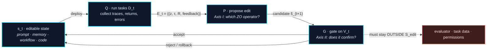

# Awesome Harness Optimization

**一份 Harness Optimization（HarnessOpt）阅读清单：运行证据如何驱动冻结语言模型周围的软件系统更新，以及修改进入持久状态前应如何评估。**

[](https://awesome.re)
[](#贡献)
[](LICENSE)

[English](README.md) | **中文**

> **组织方式。** 本清单使用三条互补的分析轴：
>
> - **[Axis 0 — 可编辑面](#axis-0--可编辑面-l0l5)：** 从 prompt 到 optimizer code，哪些状态可以修改。
> - **[Axis I — 查询与提议](#axis-i--零阶视角)：** proposer 能看到哪些目标信息和运行证据，以及如何形成修改。
> - **[Axis II — 验证](#axis-ii--pac-与稳定性)：** gate 使用哪些数据、这些数据是否被自适应复用，以及分数能够支持什么结论。
>
> 下文的“ZO 算子”默认是分析类比，除非方法确实构造了相应的数值估计量。若同一个 held-out 集被反复用于自适应选择，它不再等同于独立确认。

---

## Table of Contents

- [收录范围](#收录范围)
- [HarnessOpt 更新循环](#harnessopt-更新循环)
- [Axis 0 — 可编辑面 L0–L5](#axis-0--可编辑面-l0l5)
- [**Axis I — 零阶视角**](#axis-i--零阶视角)
  - [I.1 为什么是零阶](#i1-为什么是零阶)
  - [I.2 提案信号与对应算子](#i2-提案信号与对应算子)
  - [I.3 算子可实现性取决于可编辑面结构](#i3-算子可实现性取决于可编辑面结构)
- [**Axis II — PAC 与稳定性**](#axis-ii--pac-与稳定性)
  - [II.1 两个界及其分工](#ii1-两个界及其分工)
  - [II.2 多轮复用与可达集界](#ii2-多轮复用与可达集界)
  - [II.3 对接受门的推论](#ii3-对接受门的推论)
- [论文列表](#论文列表)
  - [1. 基础与保证阶梯](#1-基础与保证阶梯)
  - [**2. 可编辑面 L0–L5**](#2-可编辑面-l0l5)
  - [3. 提案机制](#3-提案机制运行证据如何变成一次编辑)
  - [4. 验证协议](#4-验证协议候选如何进入持久-state)
  - [5. 评测器与基准](#5-评测器与基准)
  - [6. 相关综述与边界](#6-相关综述与边界)
- [开放问题](#开放问题)
- [配套文档](#配套文档)
- [贡献](#贡献)
- [引用](#引用)

---

## 收录范围

固定基座模型 $M$、任务分布 $\mathcal{D}$ 和外部评测边界。设 $s$ 为模型外部的软件状态，包括 prompt、context、memory、workflow 图、工具接口、agent 代码和 optimizer 代码。harness 执行任务 $z$ 后得到轨迹 $\tau=H_s(M,z)$。

**HarnessOpt** 指反复收集运行证据、提出对 $s$ 的修改并决定下一轮持久状态的过程。持久化规则可以是真正的 accept/reject gate，也可以是无条件写入；后者归为 open loop。

**焦点范围。** 基座模型冻结、用运行时反馈修改模型外部 state 的工作。包括 prompt 优化、自演化 memory / skill、workflow 搜索、自修改 agent 代码、meta 优化器代码，以及这类循环所优化的评测器与基准。

**边界情形。** L5（harness 与权重联合优化）作为边界收录，不作为核心。纯权重侧自改进（self-play、RLVR、合成数据）和手工设计的 harness（ReAct、SWE-agent、MCP）只在 [§6](#6-相关综述与边界) 列出，用来标出边界位置。

---

## HarnessOpt 更新循环

三个算子构成一次状态转移：

```math
\begin{aligned}
\mathcal{E}_t &= Q(s_t;D_t),\\
\widetilde{s}_{t+1} &= P(s_t,\mathcal{E}_t),\\
s_{t+1} &= G(s_t,\widetilde{s}_{t+1};V_t).
\end{aligned}
```

$Q$ 在提议任务 $D_t$ 上收集证据，$P$ 生成候选，$G$ 参考验证数据 $V_t$ 决定下一轮状态。open-loop 方法中的 $G$ 是无条件写入。



三个条件界定本文的核心范围：

1. 本轮内基座模型与外部评测边界固定；
2. 编辑作用于显式界定的可编辑 state 集合 $\mathcal{S}_{\mathrm{edit}}$；
3. 更新结果会影响后续运行。

allowlist、编译门、smoke test、held-out 评估、人工评审和 rollback 都是协议选项，不是定义的一部分。

---

## Axis 0 — 可编辑面 L0–L5

对象轴，作为两条分析轴的脚手架保留。它回答"**什么可以被改**"，不回答怎么改，也不回答改动是否站得住。**六个层级及其论文集中在 [§2](#2-可编辑面-l0l5) 一节。** 这里给出的是层级号掩盖掉的部分。

### 三个区分性子轴

可编辑对象的层级几乎不说明*实际*动作空间，下面三个属性才说明：

| 子轴 | 问题 | 为什么重要 |
|---|---|---|
| **写权限** | agent 自主写入，还是必须经人工评审后才写入？ | 决定循环是否闭合 |
| **持久性** | 只在临时 sandbox 里跑，还是提交进受版本管理的 state？ | 决定错误能否累积 |
| **约束执行方式** | 在 prompt 中声明，还是由权限、sandbox、隐藏评测器或静态检查强制？ | 决定外部评测边界是否受到保护 |

可编辑面大小不能推出 gate 强度。写权限、持久性和约束执行方式需要与 L0–L5 分开记录。

---

## Axis I — 零阶视角

这条轴记录 proposer 可获得的信息。经典 ZO 是参照，不是等价关系。

### I.1 为什么是零阶

固定基座模型后的期望回报为：

```math
f_M(s)=\mathbb{E}_{z\sim\mathcal{D}}\!\left[R\!\left(H_s(M,z)\right)\right].
```

$\nabla_s f_M(s)$ 不可用有两个独立原因，二者的失效方式不同。

**离散性。** 可编辑状态 $s\in\mathcal{S}_{\mathrm{edit}}$ 是文本、程序和文件结构。没有显式连续松弛时，不存在能定义 $s+\mu u$ 的环绕空间，导数因而没有定义。

**复合不可微。** 即便把状态连续松弛，复合 $H_s\circ M$——tool call、控制流、环境副作用、采样、外部 exit code——仍不是可微映射。这一条堵住了最直接的反驳：把文本 embed 成向量并不产生可微目标，因为无论状态如何编码，中间那段执行都不可微。这也是少数确实拿到梯度的方法——GPTSwarm 在拓扑上的 edge-level REINFORCE、ScoreFlow 的 Score-DPO 松弛、SEAL 的 RL 循环——在这条轴上属于边界情形而非实例的原因。

目标只能通过在采样任务上运行候选来估计：

```math
Y(s,z)=R\!\left(H_s(M,z)\right),
\qquad
\widehat{f}_{D}(s)=\frac{1}{|D|}\sum_{z\in D}Y(s,z).
```

从目标接口看，这是 zeroth-order：优化器观察函数值而不是导数。许多 HarnessOpt 系统还会读取 trace、错误、测试结果和文本反馈：

```math
\mathcal{E}_t=\{(z_i,\tau_i,R_i,\mathrm{feedback}_i)\}_{i=1}^{n_t}.
```

这些侧信息比经典 function-value oracle 更丰富。它们可以提高提议质量，但不会把文本更新变成数值梯度，也不能证明候选应该被接受。

### I.2 提案信号与对应算子

第二列给出每种工程做法在经典无梯度优化中对应的算子形式。**这是类比，不是实现声明**：SkillOpt 的 $B_m{=}8$ 聚合的是八个*任务*上的 rollout，不是对同一个状态施加八次数值扰动。

| 信号或约束 | 经典对应形式（类比，非实现） | 工程作用 | 代表工作 |
|---|---|---|---|
| **标量分数** | $\widehat{\Delta}=\widehat{R}(s')-\widehat{R}(s)$ | 排序候选或保留精英 | APE, OPRO, DSPy, MIPROv2, GEPA, Reflexion, Voyager |
| **批量证据** | $\frac{1}{b}\sum_i\big[f(s+\mu u_i)-f(s)\big]u_i$ | 聚合跨任务模式后再修改 | ExpeL, SkillOpt（$B_m{=}8$）, SkillOpt-Lite, Trace2Skill, SkillForge, Self-Harness |
| **成败对比** | $\widehat{\Delta}=\widehat{R}(s^{+})-\widehat{R}(s^{-})$ | 定位行为差异 | ProTeGi, TextGrad, SkillCAT, ReasoningBank, DemoEvolve |
| **局部编辑** | $\dfrac{f(s+\mu e_i)-f(s)}{\mu}\,e_i$ | 将提议限制在一个条目、模块、文件或子图 | SkillAdaptor, Trace2Skill, SkillWeaver, AgentSquare, MASS, AlphaEvolve, Meta-Harness, AHE |
| **有界编辑** | $s_{k+1}\in\mathcal{B}(s_k,\Delta_k)$ | 限制每轮在描述空间中的改动 | SkillOpt（$L_t: 4 \to 2$）, SkillOpt-Lite, SkillForge, SoftSkill（$m{=}32$）, ACE, Self-Harness |
| **搜索记忆** | $\hat g_{\mathrm{cv}}=\hat g-c+\mathbb{E}[c]$ | 使提议避开已知的死方向；novelty 拒绝采样 | SkillOpt rejected buffer, ShinkaEvolve, GEPA, Meta-Harness |
| **档案或种群** | $\widetilde{s}\in\operatorname{Select}(\mathcal{A}_t;R)$ | 保留、重组或分散候选 | Promptbreeder, EvoPrompt, ADAS, AFlow, MaAS, ELM, FunSearch, AlphaEvolve, DGM, CORAL, AIDE |
| **自适应调度** | 按改进历史设定步长或半径 | 按改进幅度与停滞情况分配探索预算 | AdaEvolve, ShinkaEvolve, ThetaEvolve, AFlow |

各行不互斥：SkillOpt 同时占四行。这个分类划分的是机制，不是论文。

每条类比的失效位置：跨任务聚合不是多方向 ZO 估计量，因为任务是噪声样本而非扰动方向；成败对比只有在两侧都是同一状态的受控扰动时才构成 central difference；编辑次数上限不自动成为 trust-region radius，因为句法尺寸未必界定行为距离；rejected-edit buffer 只有在指明相关量并测得方差下降时才算 control variate。逐标签的成立条件见 [`docs/zo-operator-map.md`](docs/zo-operator-map.md)。

**一处值得重述的地方。** SkillOpt 用一阶词汇描述自己——learning rate、momentum、mini-batch。从结构上看它是**带结构化提案算子的 (1+1)-ES**：编辑预算是提案半径，rejected buffer 是提案分布的负向条件化，接受规则是 held-out 上的严格改进。这样说不削弱方法本身，只是澄清 ZO 映射组织的是信息结构，不主张梯度下降等价性。

### I.3 算子可实现性取决于可编辑面结构

| 所需结构 | 纯文本 | 受版本管理的可执行代码 |
|---|---|---|
| 受控成对比较 | 通常只能做启发式对比 | 可使用 feature flag 和 paired replay |
| 稳定编辑边界 | section 或 entry 由约定划分 | file、module、interface 或 graph node |
| 运行前可行性检查 | 主要是 schema 和 syntax | compile、type-check、static analysis |
| 精确恢复 | 可恢复内容，副作用需另行处理 | 版本控制加进程、缓存、注册项和 memory 清理 |

allowlist、feature flag 和 rollback 会同时影响搜索与治理，但不能单独证明修改提高了期望性能。

---

## Axis II — PAC 与稳定性

有界损失与总体风险定义为：

```math
\ell(s;z)=1-R\!\left(H_s(M,z)\right)\in[0,1],
\qquad
\epsilon(s)=\mathbb{E}_{z\sim\mathcal{D}}[\ell(s;z)].
```

对有限任务集 $V$，记平均经验损失为 $\widehat\epsilon_V(s)$，平均经验回报为 $\widehat R_V(s)=1-\widehat\epsilon_V(s)$。

### II.1 两个界及其分工

**更新稳定性**问的是：替换一个提议任务后，学到的状态会变化多少。设 $\mathcal{A}$ 把提议样本 $D_N$ 映射为一个状态，$\beta_{\mathrm{avg}}$ 为 $\ell(\mathcal{A}(D_N);z)$ 的期望替换一例敏感度。average stability 支持的是**期望级**陈述：

```math
\mathbb{E}\!\left[\epsilon(\mathcal{A}(D_N))-\widehat{\epsilon}_{D_N}(\mathcal{A}(D_N))\right]
\le
\beta_{\mathrm{avg}},
```

仅此而已：从这一定义推不出高概率界，那需要 uniform stability 或额外假设。

$\beta_{\mathrm{avg}}$ 正是 [I.2](#i2-提案信号与对应算子) 中批量证据一行的统计内涵，也是两条轴唯一的交汇点。逐例硬编码、照抄某次试验独有的环境细节会抬高它；跨任务聚合与有界编辑降低它。除非论文真的估计了这个替换一例的量，否则这只是机制假设，不是实测系数。

**独立确认**问的是：一个固定候选在新任务上的表现如何。若 $V_m$ 包含从 $\mathcal{D}$ 独立同分布采样的 $m$ 个任务，且候选 $s$ 的生成没有使用 $V_m$，则由 Hoeffding 不等式，以至少 $1-\delta$ 的概率有：

```math
\epsilon(s)
\le
\widehat{\epsilon}_{V_m}(s)
+
\sqrt{\frac{\ln(1/\delta)}{2m}}.
```

两者不可替换。批量聚合可能降低对单个提议任务的敏感性，但不会让被反复使用的验证集重新变成 fresh data；fresh validation 可以评估固定候选，却不能证明 proposer 稳定。

该不等式只保证 $\ell$ 所编码的指标。评测器是否有效、是否受到写权限保护，属于测量条件，不是 concentration 自动给出的结论。

### II.2 多轮复用与可达集界

验证结果一旦影响后续提议，最终候选就不再独立于被复用的集合。一个保守的修正方法，是对一个固定且不依赖验证集的有限类 $\mathcal{C}$ 做 uniform bound，并要求它覆盖所有可能被测试的状态：

```math
\epsilon(s)
\le
\widehat{\epsilon}_{V_m}(s)
+
\sqrt{\frac{\ln|\mathcal{C}|+\ln(1/\delta)}{2m}}
\qquad
\text{for all }s\in\mathcal{C}.
```

有界编辑语言可以使该集合有限。若 $s_0$ 在使用 $V_m$ 前固定，每轮只能从固定脚本集合 $\mathcal{U}_L$ 中选一个脚本，则 $T$ 轮内的可达状态满足：

```math
|\mathcal{C}_T|
\le
\sum_{t=0}^{T}|\mathcal{U}_L|^t.
```

该计数要求编辑脚本完整覆盖路径、插入内容、外部检索和副作用操作。diff size 只能作为描述长度的近似。若候选根据验证反馈自适应生成，单独报告 candidate count 不能建立 union bound。

记由此得到的松弛量为 $\eta_T$。由 $\ln|\mathcal{C}_T|\le(T+1)\ln|\mathcal{U}_L|+O(1)$ 得：

```math
\eta_T
\;=\;
\sqrt{\frac{\ln|\mathcal{C}_T|+\ln(1/\delta)}{2m}}
\;=\;
O\!\left(\sqrt{\frac{T\ln|\mathcal{U}_L|+\ln(1/\delta)}{2m}}\right).
```

由此得到三条推论，均以上述假设为条件。

- **轮数消耗统计预算。** $\eta_T$ 以 $\sqrt{T}$ 增长，要把松弛压在目标 $\epsilon$ 以下需要 $m=\Omega\big(T\ln|\mathcal{U}_L|/\epsilon^2\big)$：**验证集规模必须随轮数增长。** 已报告的实践通常处在相反区间——固定的小划分配上不小的 $T$。
- **决定紧致度的是编辑语言，不是产物大小。** $\eta_T$ 取决于 $|\mathcal{U}_L|$，即单轮编辑的丰富程度，而非 $|s_T|$。这给有界编辑提供了方差缩减之外的另一个理由：**编辑语言越窄，确认界越紧。** 不设预算的整文件重写会让 $\mathcal{U}_L$ 实际上等于整个状态空间，界完全失效。
- **轮换优于扩容。** 每轮抽取新的 $V^{(t)}$ 并把失败概率拆成 $\delta/T$，松弛量为 $\sqrt{\ln(T/\delta)/(2m)}$——对 $T$ 是对数而非平方根——代价是 $Tm$ 个任务。因此当新任务的成本低于扩容成本约 $\sqrt{T/\ln T}$ 倍时，应选择轮换。前提是这些集合确实未被使用过；在少数已观察过的集合之间循环属于复用。

### II.3 对接受门的推论

若一个有效的 uniform event 同时保证当前状态和候选状态满足 $|\epsilon(s)-\widehat{\epsilon}_{V_m}(s)|\le\eta$，则下面的经验提升足以推出候选在 $R$ 所表示指标上的真实风险更低：

```math
\widehat{R}_{V_m}(\widetilde{s}_{t+1})
-
\widehat{R}_{V_m}(s_t)
>
2\eta.
```

该结论依赖有限类和评测器假设，不能自动覆盖 safety、规格完整性或变化后的任务分布。

**死区与编辑预算是耦合的，不是两个独立旋钮。** 若 gate 以 $\widehat{\Delta}_{V_m}>\Delta$ 且 $\Delta>2\eta_T$ 为接受条件，则在 uniform event 上每次被接受的更新都降低真实风险。但 $\eta_T$ 随 $|\mathcal{U}_L|$ 增长，所以放宽编辑预算必须同步抬高接受阈值。常见做法是把 $\Delta$ 当噪声估计、把 $L$ 当提案控制分别调节，这与使两者成立的条件相矛盾。

**单调改进还要求行为层面的精确回滚。** 链式结论 $\epsilon(s_T)\le\epsilon(s_0)$ 要求每次被拒的提议不留残留。若 $s_{t+1}=s_t$ 只在文件层面成立而行为层面不成立——残留进程、注册项、缓存、已写入的 memory——链条在该轮断裂。可撤销的副作用是结论的前提，不是工程卫生；不覆盖运行时副作用的 `git` 回滚提供不了这个前提。

**均值不回归会掩盖尾部塌陷。** $\epsilon$ 是期望，因此集中在概率质量 $p_k$ 的任务簇上的退化，只要低于 $\eta_T/p_k$ 就不可见。要给出逐簇保证需要逐簇采样，$K$ 个簇上 $m_k=\Omega\big((\ln|\mathcal{C}_T|+\ln(K/\delta))/\epsilon_k^2\big)$。"总分上升但具体能力丢失"正是这样发生的，**且不违反任何在起作用的界**——这也是回归测试集必须分层、按簇报告而非只报一个均值的原因。

**两种漂移不能混为一谈。** *目标漂移*指任务分布本身移动（$z\sim\mathcal{D}_t$），按 $\sum_t d(\mathcal{D}_{t-1},\mathcal{D}_t)$ 累积，即**对 $T$ 线性，而 $\eta_T$ 只以 $\sqrt{T}$ 增长**。因此超过某个 horizon 后漂移支配选择偏差，这给出了"何时该从新的 $s_0$ 重跑而不是继续演化"的可检验判据。*证据漂移*是另一种失效，属于 [Axis I](#i3-算子可实现性取决于可编辑面结构)：$\mathcal{E}_t$ 在当前 $s_t$ 下采样，某类失败一旦被修好就从后续 trace 中消失，优化器可能因此撤销当初修好它的约束。这是估计量偏差，不是泛化界问题；此处不给界，因为任何界都需要对 proposer 建模。

实际 gate 应分别记录：

1. 在适当分离的数据上做 performance non-regression；
2. 检查 safety 与权限是否退化；
3. 在运行时保护 evaluator 和受保护路径；
4. 验证拒绝候选后能够恢复原状态。

上述陈述的假设与推导见 [`docs/pac-stability.md`](docs/pac-stability.md)。

---

## 论文列表

**组织方式。** §1 给出基础与推动两条轴的保证阶梯。**§2 是主体：整个可编辑面 L0–L5 集中在一节。** §3 与 §4 把*同一批*工作按两条分析轴重排——§3 按提案机制，§4 按验证协议。§5 覆盖评测器与已记录的失败模式；§6 标出边界。

一项工作同时出现在 §2、§3、§4 不等于被计三次：§2 记录它改什么，§3 记录它怎么提案，§4 记录它的门许可得出什么结论。

**条目格式。** `**Name** — "Title". Authors. Venue Year. [[paper]](link) — 一句话说明它与 HarnessOpt 的关系。[ZO analogy: role] [Gate: protocol]`

`[ZO analogy: …]` 是本清单对提议机制的解释。`[Gate: …]` 记录持久化所用数据的关系，包括 `open`、`search-set`、`held-out`、`fresh test`、`human review` 和 `unverified`。held-out selection 集如果被反复使用，仍会对后续候选产生自适应依赖；只有锁定的最终 test 才独立于完整选择过程。`†` 表示该条近期记录在正式引用前应重新核对 bibliographic metadata。

---

### 1. 基础与保证阶梯

本节只回答一个问题：*在什么意义上可以判定一次自我修改值得保留？* 历史上提出过三个参照点。HarnessOpt 位于中间那个，两条轴都瞄准它。

| 参照点 | 修改如何被判定 | 本清单如何处理 |
|---|---|---|
| **形式化证明** | 系统内部证明有益之后才执行 | 历史锚点；不要求任何现有系统达到 |
| **概率性确认** | 退化或选择偏差被控制在给定概率下 | **[Axis II](#axis-ii--pac-与稳定性) 的目标**——作为研究对象陈述，不是已解决的问题 |
| **经验分数** | 在某些任务上分数更高 | 通行做法；§4 分析它的边界 |

- **Gödel Machines: Self-Referential Universal Problem Solvers Making Provably Optimal Self-Improvements** — J. Schmidhuber. *arXiv* 2003. [[paper]](https://arxiv.org/abs/cs/0309048) — 只有在内部证明效用提升后才自我重写。阶梯的上端。它的立场是重写效用无法证明就无话可说；本清单的立场是*不可证明不等于不可分析*——ZO 描述搜索侧的信息结构，PAC 描述确认侧的样本条件。
- **Speculations Concerning the First Ultraintelligent Machine** — I. J. Good. *Advances in Computers* 1966. [[paper]](https://doi.org/10.1016/S0065-2458%2808%2960418-0) — 通过自设计导向智能爆炸这一想法的来源，仅作历史动机。
- **Recursive Self-Improvement** — E. Yudkowsky. *LessWrong* 2008. [[post]](https://www.lesswrong.com/posts/JBadX7rwdcRFzGuju/recursive-self-improvement) — 命名了 RSI 反馈循环。
- **Harness Engineering for Self-Improvement** — Lilian Weng. *Lil'Log* 2026. [[blog]](https://lilianweng.github.io/posts/2026-07-04-harness/) — 把 harness 视为近期自改进的载体：循环很少从权重开始，它跑在脚手架上。
- **Code as Agent Harness** — Ning et al. *arXiv* 2026.† [[paper]](https://arxiv.org/abs/2605.18747) — 综述 code 作为可执行 agent 基础设施的作用，并把 verification、recovery、state consistency 和 replayability 列为评测挑战。
- **A Survey of Self-Evolving Agents: What, When, How, and Where to Evolve** — Gao et al. *arXiv* 2025.† [[paper]](https://arxiv.org/abs/2507.21046) — 覆盖模型、memory、工具、架构的分类体系；本清单采用的能力维度与时间尺度区分出自这里。
- **A Comprehensive Survey of Self-Evolving AI Agents** — Fang et al. *arXiv* 2025.† [[paper]](https://arxiv.org/abs/2508.07407) — 连接基础模型与终身 agentic 系统；提出 "Three Laws of Self-Evolving AI Agents"。

---

### 2. 可编辑面 L0–L5

**六个层级集中在一节。** 每个小节说明可编辑面是什么、一个编辑单元长什么样，以及层级号掩盖掉的那部分——**该面向 [Axis I](#i3-算子可实现性取决于可编辑面结构) 的算子提供或不提供什么结构**。

| 层级 | 可编辑对象 | 编辑单元 | 有 feasibility oracle 吗？ | 小节 |
|---|---|---|---|---|
| **L0** | 指令 prompt | prompt、指令块、示例 | ❌ 无预运行判据 | [2.1](#21-l0--指令-prompt) |
| **L1** | context / memory / skill | memory 条目、skill 文件、检索单元 | ⚠️ 仅当 skill 可执行 | [2.2](#22-l1--context--memory--skill-库) |
| **L2** | workflow / 图 / 架构 | 节点、边、子图、模块槽位 | ⚠️ 只能判图的合法性，判不了语义 | [2.3](#23-l2--agentic-workflow-与架构搜索) |
| **L3** | harness / agent 代码 | 文件、模块、工具、插件 | ✅ 编译器、类型系统、静态分析 | [2.4](#24-l3--自修改-harness-代码) |
| **L4** | 优化器 / meta-harness 代码 | proposer、selector、搜索算子 | ✅ 同上，且循环在编辑自己的编辑器 | [2.5](#25-l4--优化器与-meta-harness-代码) |
| **L5** | harness 与模型权重 | checkpoint、LoRA、prefix | — 基座模型固定的条件被中止 | [2.6](#26-l5--harness-与权重联合优化的边界情形) |

> **第四列要对着 Axis 0 的三个子轴读。** 层级说明的是名义上什么可编辑。feasibility oracle 强度、写权限、持久性和约束执行方式才说明动作空间*实际*是什么。两者经常分离：见[横切观察 1](docs/audit-table.md#cross-cutting-observations)。

#### 2.1 L0 — 指令 prompt

*以指令层为优化对象。可编辑面：纯文本。* 语法和 schema 检查可以过滤格式错误，但不存在通用的预运行语义判据。由于没有可构造的负方向或由表示预先定义的块边界，central difference 与 coordinate descent 在这里只能作为类比（[I.3](#i3-算子可实现性取决于可编辑面结构)）。

- **APE** — "Large Language Models Are Human-Level Prompt Engineers". Zhou et al. *ICLR* 2023. [[paper]](https://arxiv.org/abs/2211.01910) — 把指令当程序；用搜索提案并打分。`[ZO analogy: population / archive]` `[Gate: search-set]`
- **OPRO** — "Large Language Models as Optimizers". Yang et al. *ICLR* 2024. [[paper]](https://arxiv.org/abs/2309.03409) — 从历史（解，分数）对构成的 meta-prompt 生成新解。meta-prompt 只看得到标量，看不到 trace 证据，因此 Axis I 的语义优势没有被用上。`[ZO analogy: one-point]` `[Gate: search-set]`
- **EvoPrompt** — "EvoPrompt: Connecting LLMs with Evolutionary Algorithms Yields Powerful Prompt Optimizers". Guo et al. *ICLR* 2024. [[paper]](https://arxiv.org/abs/2309.08532) — 在 prompt 种群上做 GA/DE，用 LLM 做变异与交叉。`[ZO analogy: population / archive]` `[Gate: search-set]`
- **Promptbreeder** — "Promptbreeder: Self-Referential Self-Improvement Via Prompt Evolution". Fernando et al. *arXiv* 2023.† [[paper]](https://arxiv.org/abs/2309.16797) — 同时演化任务 prompt 和修改它们的 mutation prompt，组合 L0 内容与 L4 机制。`[ZO analogy: population / archive]` `[Gate: search-set]`
- **ProTeGi** — "Automatic Prompt Optimization with 'Gradient Descent' and Beam Search". Pryzant et al. *EMNLP* 2023. [[paper]](https://arxiv.org/abs/2305.03495) — 使用称为 “textual gradients” 的 LLM critique 引导 prompt 编辑和 beam search。这是诊断性语言，不是数值导数。`[ZO analogy: trace-informed proposal]` `[Gate: search-set]`
- **DSPy** — "DSPy: Compiling Declarative Language Model Calls into Self-Improving Pipelines". Khattab et al. *ICLR* 2024. [[paper]](https://arxiv.org/abs/2310.03714) — 把 LM pipeline 视为可优化文本变换图的编程模型。`[ZO analogy: population / archive]` `[Gate: search-set]`
- **MIPROv2** — "Optimizing Instructions and Demonstrations for Multi-Stage Language Model Programs". Opsahl-Ong et al. *EMNLP* 2024. [[paper]](https://arxiv.org/abs/2406.11695) — 用贝叶斯优化联合自举 few-shot 示例并提案指令，是 surrogate-model search 的一个实例。`[ZO analogy: surrogate-model search]` `[Gate: search-set]`
- **TextGrad** — "TextGrad: Automatic 'Differentiation' via Text". Yuksekgonul et al. *Nature* 2025. [[paper]](https://arxiv.org/abs/2406.07496) — 在复合 AI 系统中传播文本反馈。这里的 “gradient” 是语义侧信息，不是可验证的导数。`[ZO analogy: trace-informed proposal]` `[Gate: search-set]`
- **GEPA** — "GEPA: Reflective Prompt Evolution Can Outperform Reinforcement Learning". Agrawal et al. *arXiv* 2025.† [[paper]](https://arxiv.org/abs/2507.19457) — 读取完整 trace 的 Genetic-Pareto 优化器；论文在与 RL 的比较中报告最高 35 倍 rollout efficiency。`[ZO analogy: population / archive + trace-informed proposal]` `[Gate: held-out]`

#### 2.2 L1 — context / memory / skill 库

*agent 从经验中自行整理并增长自己的 context、memory 或 skill 存储，不更新权重。* 开环协议类别集中在这里：多数系统把经验直接写进后续 state，没有任何测试能拦住一条坏条目。

**Context 与 memory**

- **Reflexion** — "Reflexion: Language Agents with Verbal Reinforcement Learning". Shinn et al. *NeurIPS* 2023. [[paper]](https://arxiv.org/abs/2303.11366) — 把反馈转成语言化 reflection，并跨试验存入 episodic memory。`[ZO analogy: one-point]` `[Gate: open]`
- **ExpeL** — "ExpeL: LLM Agents Are Experiential Learners". Zhao et al. *AAAI* 2024. [[paper]](https://arxiv.org/abs/2308.10144) — 从经验池中抽取可复用的自然语言 insight。聚合可能减少对单条轨迹的依赖，但论文没有给出 algorithmic-stability coefficient。`[ZO analogy: batch evidence]` `[Gate: open]`
- **Dynamic Cheatsheet** — "Dynamic Cheatsheet: Test-Time Learning with Adaptive Memory". Suzgun et al. *EACL* 2026.† [[paper]](https://arxiv.org/abs/2504.07952) — 推理时持久化的自建策略与代码片段 memory。`[ZO analogy: one-point]` `[Gate: open]`
- **ACE** — "Agentic Context Engineering: Evolving Contexts for Self-Improving Language Models". Zhang et al. *ICLR* 2026. [[paper]](https://arxiv.org/abs/2510.04618) — 使用 Generator、Reflector、Curator 与增量 context 更新。`bounded edit` 是本清单的类比；编辑次数不等于行为距离。`[ZO analogy: bounded edit]` `[Gate: open]`
- **ReasoningBank** — "ReasoningBank: Scaling Agent Self-Evolving with Reasoning Memory". Ouyang et al. *ICLR* 2026.† [[paper]](https://arxiv.org/abs/2509.25140) — 从成功与失败中蒸馏策略，并提出 memory-aware test-time scaling。`[ZO analogy: contrastive diagnosis]` `[Gate: open]`
- **Agent Workflow Memory (AWM)** — Wang, Mao, Fried, Neubig. *ICML* 2025. [[paper]](https://arxiv.org/abs/2409.07429) — 归纳可复用 workflow，作为 agent 持久化并复用的 procedural memory。`[ZO analogy: batch evidence]` `[Gate: open]`
- **Memp** — "Memp: Exploring Agent Procedural Memory". Fang et al. *ACL Findings* 2026.† [[paper]](https://arxiv.org/abs/2508.06433) — 把轨迹蒸馏为脚本式流程，并提供构建、检索、更新和删除策略。`[ZO analogy: batch evidence]` `[Gate: open]`
- **MemAct** — "Memory as Action: Autonomous Context Curation for Long-Horizon Agentic Tasks". Zhang et al. *ACL Findings* 2026.† [[paper]](https://arxiv.org/abs/2510.12635) — 把工作记忆管理重述为端到端训练的可学习策略动作。`[ZO analogy: boundary — trained policy]` `[Gate: open]`
- **Continual Harness** — "Continual Harness: Online Adaptation for Self-Improving Foundation Agents". *arXiv* 2026.† [[paper]](https://arxiv.org/abs/2605.09998) — 研究在线 harness 适配；对这类系统，应明确报告轮数和评测数据复用次数。`[ZO analogy: history-conditioned proposal]` `[Gate: open]`

**Skill 库与 skill 优化** — 可编辑面较窄，但其中若干工作使用了较结构化的提案与确认协议。这说明可编辑面大小和协议强度需要分开记录。

- **Voyager** — "Voyager: An Open-Ended Embodied Agent with Large Language Models". Wang et al. *TMLR* 2024. [[paper]](https://arxiv.org/abs/2305.16291) — 自动课程加自增长的可执行 skill 库实现终身学习。单个错误信号触发局部程序覆写。skill 库可执行，所以 feasibility oracle 存在——但它守的是编译，不是泛化。`[ZO analogy: one-point]` `[Gate: open]`
- **SkillWeaver** — "SkillWeaver: Web Agents can Self-Improve by Discovering and Honing Skills". Zheng et al. *COLM* 2025. [[paper]](https://arxiv.org/abs/2504.07079) — 把可复用、已调试的 API skill 合成进 harness；论文报告 WebArena 提升 31.8%。调试循环是 feasibility filter，不是确认门。`[ZO analogy: localized edit]` `[Gate: search-set]`
- **SkillOpt** — "SkillOpt: Executive Strategy for Self-Evolving Agent Skills". *arXiv* 2026.† [[paper]](https://arxiv.org/abs/2605.23904) — mini-batch 反思（$B_m{=}8$）、衰减编辑预算（$L_t: 4 \to 2$）、rejected-edit buffer、分层并行 LLM 树归约；使用三路不相交划分，并将 test 集锁定到最终报告。这些机制可保守地解释为 batch evidence、bounded edit 和历史条件提案，不等同于一阶优化。`[ZO analogy: batch evidence + bounded edit]` `[Gate: held-out]`
- **SkillOpt-Lite** — "SkillOpt-Lite: Better and Faster Agent Self-evolution via One Line of Vibe". Shen, Li, Zhang. *arXiv* 2026.† [[paper]](https://arxiv.org/abs/2607.03451) — 使用 consensus mining、held-out selection 和 compile–smoke–full 分阶段评估。论文是本清单 ZO/PAC 视角的来源；本清单收紧了其中若干理论表述。`[ZO analogy: batch evidence + bounded edit]` `[Gate: held-out]`
- **Trace2Skill** — "Trace2Skill: Distill Trajectory-Local Lessons into Transferable Agent Skills". *arXiv* 2026.† [[paper]](https://arxiv.org/abs/2603.25158) — 对 trajectory-local lesson 做 map-reduce patch merging。其 gate 使用训练派生子集，因此不构成独立确认。`[ZO analogy: batch evidence + localized edit]` `[Gate: search-set]`
- **SkillForge** — "SkillForge: Forging Domain-Specific, Self-Evolving Agent Skills in Cloud Technical Support". *arXiv* 2026.† [[paper]](https://arxiv.org/abs/2604.08618) — 聚合 batch ticket 做 trajectory denoising，并采用 minimal-modification principle。`[ZO analogy: batch evidence + bounded edit]` `[Gate: held-out]`
- **SkillCAT** — "SkillCAT: Contrastive, Assessment-Augmented and Topology-Aware Skill Self-Evolution for LLM Agents". *arXiv* 2026.† [[paper]](https://arxiv.org/abs/2606.13317) — 在 action-divergence point 对比轨迹。这是诊断性对比，不是数值 central-difference estimator。`[ZO analogy: contrastive diagnosis]` `[Gate: search-set]`
- **SkillAdaptor** — "SkillAdaptor: Self-Adapting Skills for LLM Agents from Trajectories". *arXiv* 2026.† [[paper]](https://arxiv.org/abs/2606.01311) — 定位故障步骤并提出局部 skill 修改。`[ZO analogy: localized edit]` `[Gate: search-set]`
- **SoftSkill** — "SoftSkill: Behavioral Compression for Contextual Adaptation". *arXiv* 2026.† [[paper]](https://arxiv.org/abs/2606.20333) — 把适配限制在 32-token soft prefix 中，因此具有可测的参数空间维度。`[ZO analogy: bounded edit]` `[Gate: search-set]`

#### 2.3 L2 — Agentic workflow 与架构搜索

*workflow 图或模块组合由搜索得到而非手工设计。* 预先声明的节点、边和模块槽位可以提供**表示定义的块边界**；当算法确实按这些槽位搜索时，block 或 coordinate search 才是字面机制（[I.3](#i3-算子可实现性取决于可编辑面结构)）。

- **ADAS / Meta Agent Search** — "Automated Design of Agentic Systems". Hu, Lu, Clune. *ICLR* 2025. [[paper]](https://arxiv.org/abs/2408.08435) — meta-agent 在不断增长的档案上用代码编写越来越好的 agent。`[ZO analogy: population / archive]` `[Gate: search-set]`
- **AFlow** — "AFlow: Automating Agentic Workflow Generation". Zhang et al. *ICLR* 2025. [[paper]](https://arxiv.org/abs/2410.10762) — 把 workflow 优化做成代码表示图上的 MCTS。MCTS 把探索/利用调度显式化，对应算子表的自适应搜索一行。`[ZO analogy: population / archive + adaptive schedule]` `[Gate: search-set]`
- **GPTSwarm** — "Language Agents as Optimizable Graphs". Zhuge et al. *ICML* 2024. [[paper]](https://arxiv.org/abs/2402.16823) — 把 agent 视为计算图；节点级 prompt 加边级 REINFORCE 优化。边级 REINFORCE 在拓扑上确实*不是*零阶——一个有用的边界情形，说明 ZO 框架是关于信息可得性的判断，不是通用标签。`[ZO analogy: boundary — first-order over edges]` `[Gate: search-set]`
- **AgentSquare** — "AgentSquare: Automatic LLM Agent Search in Modular Design Space". Shang et al. *ICLR* 2025. [[paper]](https://arxiv.org/abs/2410.06153) — 在 Planning/Reasoning/ToolUse/Memory 模块空间上做演化与重组搜索；预先声明的模块槽位构成搜索坐标。`[ZO analogy: localized edit + population / archive]` `[Gate: search-set]`
- **MaAS** — "Multi-agent Architecture Search via Agentic Supernet". Zhang et al. *ICML* 2025. [[paper]](https://arxiv.org/abs/2502.04180) — 优化概率性 agentic supernet，得到成本自适应、随 query 而变的系统。`[ZO analogy: population / archive]` `[Gate: search-set]`
- **MASS** — "Multi-Agent Design: Optimizing Agents with Better Prompts and Topologies". Zhou et al. *arXiv* 2025.† [[paper]](https://arxiv.org/abs/2502.02533) — 在 prompt 与拓扑之间交错的多阶段搜索。显式的块坐标结构：prompt 与拓扑是交替搜索而非联合搜索。`[ZO analogy: localized edit]` `[Gate: search-set]`
- **ScoreFlow** — "ScoreFlow: Mastering LLM Agent Workflows via Score-based Preference Optimization". Wang et al. *arXiv* 2025.† [[paper]](https://arxiv.org/abs/2502.04306) — 通过 Score-DPO 做连续、基于梯度的 workflow 优化。一阶边界情形：它把 workflow 的一部分松弛为可微对象，靠改变表示而不是改变可得信息跳出 ZO 设定。`[ZO analogy: boundary — first-order]` `[Gate: search-set]`
- **FlowReasoner** — "FlowReasoner: Reinforcing Query-Level Meta-Agents". Gao et al. *arXiv* 2025.† [[paper]](https://arxiv.org/abs/2504.15257) — 用 RL 调优的推理 meta-agent，为每个 query 定制一套多 agent 系统。`[ZO analogy: boundary — RL]` `[Gate: search-set]`
- **EvoAgent** — "EvoAgent: Towards Automatic Multi-Agent Generation via Evolutionary Algorithms". Yuan et al. *NAACL* 2025. [[paper]](https://arxiv.org/abs/2406.14228) — 用变异、交叉、选择把单个 agent 扩展成多 agent 系统。`[ZO analogy: population / archive]` `[Gate: search-set]`
- **Agent Symbolic Learning** — "Symbolic Learning Enables Self-Evolving Agents". Zhou et al. *arXiv* 2024.† [[paper]](https://arxiv.org/abs/2406.18532) — 用语言化的 “loss”“gradient”“backpropagation” 联合优化 prompt、工具和 pipeline。`[ZO analogy: trace-informed proposal]` `[Gate: search-set]`
- **Alita** — "Alita: Generalist Agent Enabling Scalable Agentic Reasoning with Minimal Predefinition and Maximal Self-Evolution". Qiu et al. *arXiv* 2025.† [[paper]](https://arxiv.org/abs/2505.20286) — 在运行时生成并复用 MCP 工具。工具生成会扩大交互面，因此 [§4.2](#42-接受应当是一个联合条件) 的 safety check 需要覆盖新工具和最终输出。`[ZO analogy: population / archive]` `[Gate: open]`

#### 2.4 L3 — 自修改 harness 代码

*以 agent 自身代码为修改对象。* 可执行代码支持编译检查、feature flag 和配对重放；只有满足对应构造时，central difference 或 control variate 才能按字面使用。若评测器与被编辑代码处于同一写权限边界，还会引入 evaluator integrity 风险。

- **STOP** — "Self-Taught Optimizer (STOP): Recursively Self-Improving Code Generation". Zelikman et al. *COLM* 2024. [[paper]](https://arxiv.org/abs/2310.02304) — 种子改进器在权重固定下递归改进自己的脚手架代码。附录 A.2 对有界程序类给出 uniform-convergence 论证；[II.2](#ii2-多轮复用与可达集界) 只借用了有限类计数的结构。`[ZO analogy: population / archive]` `[Gate: search-set]`
- **Gödel Agent** — "Gödel Agent: A Self-Referential Agent Framework for Recursive Self-Improvement". Yin et al. *ACL* 2025. [[paper]](https://arxiv.org/abs/2410.04444) — 在运行时修改自身逻辑。只恢复文件不一定能撤销原地 patch 产生的进程、缓存或其他副作用。`[ZO analogy: one-point]` `[Gate: open]`
- **Darwin Gödel Machine (DGM)** — "Darwin Godel Machine: Open-Ended Evolution of Self-Improving Agents". Zhang et al. *arXiv* 2025.† [[paper]](https://arxiv.org/abs/2505.22954) — 编码 agent 在开放式档案上重写自己的代码库；论文报告其 SWE-bench 分数由 20% 提升到 50%。`[ZO analogy: population / archive]` `[Gate: search-set]`
- **SICA** — "A Self-Improving Coding Agent". Robeyns et al. *arXiv* 2025.† [[paper]](https://arxiv.org/abs/2504.15228) — 取消 meta/target 之分；agent 为成本、速度、准确率编辑自己的代码库。`[ZO analogy: localized edit]` `[Gate: search-set]`
- **Self-Harness** — "Self-Harness: Harnesses That Improve Themselves". Zhang et al. *arXiv* 2026.† [[paper]](https://arxiv.org/abs/2606.09498) — 弱点挖掘、有界 harness 提案，并在 held-in/held-out 划分上做回归检查。`[ZO analogy: batch evidence + bounded edit]` `[Gate: held-out]`
- **Agentic Harness Engineering (AHE)** — "Agentic Harness Engineering: Observability-Driven Automatic Evolution of Coding-Agent Harnesses". *arXiv* 2026.† [[paper]](https://arxiv.org/abs/2604.25850) — 使用 prediction manifest 和下一轮 rollback。这属于回溯式恢复，不是不相交数据上的事前确认；漏归因会使部分回归无法触发 rollback。`[ZO analogy: localized edit]` `[Gate: retrospective]`
- **Ouroboros** — "Ouroboros: A Self-Developing Frontier Coding Agent with Reviewed Core Evolution". Razzhigaev et al. *arXiv* 2026.† [[paper]](https://arxiv.org/abs/2608.08311) [[code]](https://github.com/razzant/ouroboros) — 经评审的 commit 成为后续工作的运行时。人工评审改变写权限；除非评审使用 fresh evaluation data，否则不构成统计独立。`[ZO analogy: localized edit]` `[Gate: human review]`
- **CORAL** — "CORAL: Towards Autonomous Multi-Agent Evolution for Open-Ended Discovery". Qu et al. *COLM* 2026. [[paper]](https://arxiv.org/abs/2604.01658) [[code]](https://github.com/Human-Agent-Society/CORAL) — 编码 agent 在隔离 worktree 中围绕 grader 工作，并保留计分尝试和共享 notes。worktree 能保护父文件树；进程和外部副作用仍需另行检查。`[ZO analogy: population / archive]` `[Gate: held-out, reuse unverified]`
- **DemoEvolve** — "DemoEvolve: Overcoming Sparse Feedback in Agentic Harness Evolution with Demonstrations". *arXiv* 2026.† [[paper]](https://arxiv.org/abs/2605.24539) — 使用 human demonstrations 提供 sparse reward 缺少的诊断证据。`[ZO analogy: contrastive diagnosis]` `[Gate: held-out]`
- **AutoHarness** — "AutoHarness: improving LLM agents by automatically synthesizing a code harness". Lou et al. *arXiv* 2026.† [[paper]](https://arxiv.org/abs/2603.03329) — 合成的是外部控制代码（动作解析器、合法性检查器、重试逻辑）而不是策略，并用环境反馈迭代修正。它针对规则严格环境中的非法动作失败，因此动作合法性是必要条件，不是完整目标。`[ZO analogy: one-point + localized edit]` `[Gate: search-set]`

#### 2.5 L4 — 优化器与 meta-harness 代码

*提出编辑的代码本身也被编辑。* 这不是能力意义上“更高”的一档，而是 $P$ 进入 $\mathcal{S}_{\mathrm{edit}}$ 的情形。此时必须把 proposer 版本和可达候选类一起记录；固定更新算法的 stability 结论不能直接套用。

- **Meta-Harness** — "Meta-Harness: End-to-End Optimization of Model Harnesses". Lee et al. *arXiv* 2026.† [[paper]](https://arxiv.org/abs/2603.28052) — agentic proposer 通过文件系统搜索 harness 代码，并返回 Pareto 前沿。文件级表示提供局部编辑单元；其终端任务设置没有独立 selection split。`[ZO analogy: localized edit + population / archive]` `[Gate: search-set]`
- **Hyperagents** — Zhang et al. *arXiv* 2026.† [[paper]](https://arxiv.org/abs/2603.19461) — meta-agent 控制如何修改任务 agent 以生成新 agent。`[ZO analogy: population / archive]` `[Gate: unverified]`
- **MCE** — "Meta Context Engineering via Agentic Skill Evolution". Ye et al. *arXiv* 2026.† [[paper]](https://arxiv.org/abs/2601.21557) — 双层框架，协同演化 context-management skill 与 context artifact，在同一循环中组合 L1 内容和 L4 机制。`[ZO analogy: population / archive]` `[Gate: search-set]`
- **Promptbreeder** — *(亦见 §2.1)* — 演化变异 prompt 是这个 L0 系统的 L4 侧面。按侧面列两次，不计两次。

#### 2.6 L5 — harness 与权重联合优化的边界情形

*harness 编辑与权重更新在同一循环内。* 作为边界收录，不作为核心比较对象。权重一旦变动，“基座模型固定”的条件就不成立，分析对象必须改为联合 state，本文的 harness-only 有限类计数不能直接使用。

- **SIA** — "SIA: Self Improving AI with Harness & Weight Updates". Hebbar et al. *arXiv* 2026.† [[paper]](https://arxiv.org/abs/2605.27276) — Feedback-Agent 逐轮决定更新 harness 还是模型权重。`[ZO analogy: boundary — mixed]` `[Gate: search-set]`
- **SEAL** — "Self-Adapting Language Models". Zweiger et al. *NeurIPS* 2025. [[paper]](https://arxiv.org/abs/2506.10943) — 模型生成自己的 "self-edits"（微调数据加指令），在 RL 循环中经 SFT 应用。`[ZO analogy: boundary — RL]` `[Gate: search-set]`

---

### 3. 提案机制：运行证据如何变成一次编辑

相关综述已经按方法家族梳理过 prompt 优化和自演化 agent，本节不重复那件事，而是把工作映射到**一个查询信号如何变成修改提案**上——可编辑范围是 §2 的题目，接受协议是 §4 的题目。

标量回报用于比较候选，trace 反馈可辅助定位失败和生成修改，候选档案则保存搜索历史。这些信号可以组合，但不提供同一种保证。

| 信号 | 能支撑什么 | 不能支撑什么 | 工作 |
|---|---|---|---|
| **标量回报与排序** | 比较候选或版本 | 定位原因；为某个具体编辑提供依据 | APE, OPRO, DSPy, MIPROv2, Reflexion, Voyager |
| **轨迹与错误日志** | 定位失败；提出看似合理的补丁 | 正确归因；接受候选的证据 | ProTeGi, TextGrad, SkillCAT, GEPA, AHE, Trace2Skill |
| **搜索历史与档案** | 多样性、新颖性、避开死方向 | 被保留的候选是否泛化 | Promptbreeder, ADAS, AFlow, ELM, AlphaEvolve, ShinkaEvolve, DGM |

语言反馈仍是携带语义侧信息的零阶查询，不是可验证的梯度。局部编辑、编辑预算和拒绝缓冲区约束的是提案的*触及范围*和重复探索，它们不制造可微对象。无论提案怎么形成，它本身都不能构成进入持久 state 的理由：接受、非回归和 rollback 仍然是 §4 的门 $G$。

#### 3.1 代表性提案角色表

下表选择部分系统，把 [I.2](#i2-提案信号与对应算子) 与 §2 的层级交叉制表。竖读一列可见同一角色跨层级出现，横读一行可见一个系统的机制组合。

| 系统 | 层级 | 标量 | 批量 | 对比 | 局部 | 有界 | 记忆 | 种群 | 自适应 |
|---|---|:-:|:-:|:-:|:-:|:-:|:-:|:-:|:-:|
| Reflexion | L1 | ● | | | | | | | |
| Voyager | L1 | ● | | | ● | | | | |
| ExpeL | L1 | | ● | | | | | | |
| ACE | L1 | | ● | | | ● | | | |
| ReasoningBank | L1 | | ● | ● | | | | | |
| SkillOpt | L1 | ● | ● | | | ● | ● | | |
| SkillOpt-Lite | L1 | | ● | | | ● | | | |
| Trace2Skill | L1 | | ● | | ● | | | | |
| SkillCAT | L1 | | | ● | | | | | |
| SkillAdaptor | L1 | | | | ● | | | | |
| SoftSkill | L1 | | | | | ● | | | |
| OPRO | L0 | ● | | | | | | | |
| ProTeGi | L0 | | ● | ● | | | | | |
| TextGrad | L0 | | | ● | | | | | |
| GEPA | L0 | ● | | | | | ● | ● | |
| Promptbreeder | L0 | | | | | | | ● | |
| ADAS | L2 | | | | | | ● | ● | |
| AFlow | L2 | | | | | | | ● | ● |
| AgentSquare | L2 | | | | ● | | | ● | |
| MASS | L2 | | | | ● | | | | |
| DGM | L3 | | | | | | ● | ● | |
| SICA | L3 | ● | | | ● | | | | |
| Self-Harness | L3 | | ● | | | ● | | | |
| AHE | L3 | | | | ● | | | | |
| DemoEvolve | L3 | | | ● | | | | | |
| AutoHarness | L3 | ● | | | ● | | | | |
| CORAL | L3 | | | | | | ● | ● | |
| AlphaEvolve | L3 | | | | ● | | | ● | ● |
| ShinkaEvolve | L3 | | | | | | ● | ● | ● |
| AdaEvolve | L3 | | | | | | | | ● |
| ELM | L3 | | | | | ● | | ● | |
| Meta-Harness | L4 | | | | ● | | ● | ● | |

这张表是本清单的机制编码，不是论文自述，也不蕴含收敛率。三个读法：

1. **算子与层级无关。** 局部编辑从 L1 的 skill 文件一直用到 L4 的优化器代码；种群搜索从 L0 的 prompt 一直用到 L4。对象轴不预测机制。
2. **可编辑面大小不能推出提案机制。** L1 与 L3 都包含简单和组合式机制，不能从层级号推断算子复杂度。
3. **本表中，对比与局部化经常分开出现。** 两者需要不同的信息和表示结构；这只是描述性观察，不表示二者不兼容。

#### 3.2 搜索引擎

以下工作提供 L2–L4 系统常用的搜索机制。

- **FunSearch** — "Mathematical Discoveries from Program Search with Large Language Models". Romera-Paredes et al. *Nature* 2023. [[paper]](https://www.nature.com/articles/s41586-023-06924-6) — LLM 加评测器构成演化循环；后来的自改进编码 agent 沿用这个模板。
- **AlphaEvolve** — "AlphaEvolve: A coding agent for scientific and algorithmic discovery". Novikov et al. *arXiv* 2025.† [[paper]](https://arxiv.org/abs/2506.13131) — LLM 集成加评测器，作用于标注出的 `EVOLVE-BLOCK` 区域。该区域是人工声明的编辑边界，使局部化由表示直接定义。
- **ShinkaEvolve** — "ShinkaEvolve: Towards Open-Ended And Sample-Efficient Program Evolution". Lange et al. *arXiv* 2025.† [[paper]](https://arxiv.org/abs/2509.19349) — 父代采样、novelty 拒绝采样、bandit LLM 选择。novelty 拒绝把提案引离已覆盖的方向，但没有无偏修正项。
- **AdaEvolve** — "AdaEvolve: Adaptive LLM Driven Zeroth-Order Optimization". *arXiv* 2026.† [[paper]](https://arxiv.org/abs/2602.20133) — 明确把 LLM 驱动的搜索表述为带自适应调度的零阶优化。
- **ThetaEvolve** — "ThetaEvolve: Test-time Learning on Open Problems". Wang et al. *arXiv* 2025.† [[paper]](https://arxiv.org/abs/2511.23473) — 把演化搜索与 RL、上下文学习结合。
- **ELM** — "Evolution through Large Models". Lehman et al. *arXiv* 2022.† [[paper]](https://arxiv.org/abs/2206.08896) — 把 LLM diff 模型作为 MAP-Elites 内的变异算子。diff 表示提供了显式编辑单元，但不自动形成与验证集独立的有限候选类。
- **AIDE** — "AIDE: AI-Driven Exploration in the Space of Code". Jiang et al. *arXiv* 2025.† [[paper]](https://arxiv.org/abs/2502.13138) — 把机器学习工程做成在自身解空间上的 agentic 树搜索。

#### 3.3 经典零阶理论

引用它们是为了算子定义及其已知性质；这些论文都不是关于 agent 的。

- **A Primer on Zeroth-Order Optimization in Signal Processing and Machine Learning** — Liu et al. *IEEE SPM* 2020. [[paper]](https://arxiv.org/abs/2006.06224) — 本清单所映射的工具箱：one-point 与 two-point 估计量、坐标方法、方差缩减、收敛率。
- **Optimal Rates for Zero-Order Convex Optimization: The Power of Two Function Evaluations** — Duchi, Jordan, Wainwright, Wibisono. *IEEE TIT* 2015. [[paper]](https://arxiv.org/abs/1312.2139) — 在给定凸优化假设下分析 one-point 与 two-point feedback，并给出匹配速率。这些速率依赖数值扰动，不能迁移到文本编辑。
- **Random Gradient-Free Minimization of Convex Functions** — Nesterov & Spokoiny. *FoCM* 2017. [[paper]](https://link.springer.com/article/10.1007/s10208-015-9296-2) — 给出高斯平滑估计量及其维数依赖速率；该维数是连续表示的维数，不能直接替换为文件数或 token 数。
- **Online Convex Optimization in the Bandit Setting** — Flaxman, Kalai, McMahan. *SODA* 2005. [[paper]](https://arxiv.org/abs/cs/0408007) — one-point bandit feedback及其估计代价的参照；单 trace 反思只共享“一次观测”这一角色。
- **Introduction to Derivative-Free Optimization** — Conn, Scheinberg, Vicente. *SIAM* 2009. [[book]](https://epubs.siam.org/doi/book/10.1137/1.9780898718768) — trust-region 与 model-based DFO 的经典参考。把文本编辑预算称为 trust region，需要另行说明其距离和模型充分性条件。
- **Completely Derandomized Self-Adaptation in Evolution Strategies** — Hansen & Ostermeier. *Evolutionary Computation* 2001. [[paper]](https://direct.mit.edu/evco/article/9/2/159/892/Completely-Derandomized-Self-Adaptation-in) — evolution strategies 的参照；只有实现 parent、offspring、比较和替换规则的方法才可按字面归类。

---

### 4. 验证协议：候选如何进入持久 state

统计解释由两个字段决定：**哪些数据可以阻止持久化**，以及**这些数据被复用多少次**。运行时隔离、人工评审和 rollback 属于治理字段，需要另外记录。

| 协议 | 持久化规则 | 统计解释 |
|---|---|---|
| **开环** | 提案未经 blocking evaluation 直接写入 | 不支持候选确认结论 |
| **search-set gate** | 驱动提案的数据同时参与排序或接受 | 是对已观测任务的经验选择；流程结束后仍可用锁定 test 评估完整过程 |
| **held-out gate** | 单独的 selection 或 regression 集可以拒绝候选 | 提供数据分离，但反复复用会使后续候选依赖该集合 |
| **fresh confirmation** | 搜索完成并固定候选后，在未触碰数据上评估一次 | §II.1 的 fixed-candidate bound 适用 |
| **人工或回溯式门** | 人工评审或后续检查可以阻止或撤销持久化 | 是治理或恢复证据；若没有 fresh task sample，不等于统计独立 |

SkillOpt 报告三路划分，并将 test 集锁定到最终报告；其 validation 集仍参与选择。SkillOpt-Lite 使用 held-out selection 与 compile、smoke、full 分阶段检查。AHE 使用回溯式 prediction 与 rollback，Ouroboros 使用 reviewed commit。它们不应共享同一个 `independent` 标签。

#### 4.1 这张表让三件事变得可见

可编辑面大小、提案机制和 gate protocol 必须分别报告，不能互相推断。

[`docs/audit-table.md`](docs/audit-table.md) 给出代表性 protocol 例子，不能从一手来源确认的字段标为 `unverified`。

#### 4.2 接受应当是一个联合条件

只看任务通过率会漏掉安全退化。在 Misevolution 的特定实验中，AFlow 优化使 HumanEval accuracy 从 81.6% 升至 93.3%，同时 RedCode-Gen Refusal Rate 从 36.3% 降至 5.6%，Attack Success Rate 从 54.4% 升至 83.1%；另一个 memory-evolution 实验中，RR 从 99.4% 降至 54.4%，ASR 从 0.6% 升至 20.6%（[paper](https://arxiv.org/abs/2509.26354)）。这些数字只适用于论文中的模型、任务和协议。

部署 gate 因此应包含与可编辑面相匹配的 safety 与 permission 检查，并覆盖候选新引入的工具和交互。§II.3 列出的四项检查分别处理 performance、safety、evaluator integrity 和 state restoration；单一平均分不能替代它们。

#### 4.3 统计工具

- **Stability and Generalization** — Bousquet & Elisseeff. *JMLR* 2002. [[paper]](https://www.jmlr.org/papers/v2/bousquet02a.html) — uniform stability 与泛化的经典来源。
- **Learnability, Stability and Uniform Convergence** — Shalev-Shwartz, Shamir, Srebro, Sridharan. *JMLR* 2010. [[paper]](https://jmlr.org/papers/v11/shalev-shwartz10a.html) — 讨论 average replace-one stability 与期望泛化；它本身不提供本清单旧版写出的高概率公式。
- **Train Faster, Generalize Better: Stability of Stochastic Gradient Descent** — Hardt, Recht, Singer. *ICML* 2016. [[paper]](https://arxiv.org/abs/1509.01240) — 随机梯度方法的 stability 分析；作为背景引用，不是文本编辑的定理。
- **Mathematical Analysis of Machine Learning Algorithms** — T. Zhang. *Cambridge* 2023. [[book]](https://www.cambridge.org/core/books/mathematical-analysis-of-machine-learning-algorithms/0F86E4F79A5FE3EE9C0A0A5EBFCF8E2C) — concentration 与 model selection 的背景。
- **Preserving Statistical Validity in Adaptive Data Analysis** — Dwork et al. *STOC* 2015. [[paper]](https://arxiv.org/abs/1411.2664) — 自适应统计查询的差分隐私方法。
- **The Reusable Holdout** — Dwork et al. *Science* 2015. [[paper]](https://www.science.org/doi/10.1126/science.aaa9375) — 受控复用 holdout 的 Thresholdout 机制。
- **The Ladder: A Reliable Leaderboard for Machine Learning Competitions** — Blum & Hardt. *ICML* 2015. [[paper]](https://arxiv.org/abs/1502.04585) — 限制反复查询 leaderboard 所泄露信息的机制；与 HarnessOpt selection 相关但不等价。
- **Gradient Episodic Memory for Continual Learning** — Lopez-Paz & Ranzato. *NeurIPS* 2017. [[paper]](https://arxiv.org/abs/1706.08840) — BWT/FWT 指标的来源之一。
- **Overcoming Catastrophic Forgetting in Neural Networks** — Kirkpatrick et al. *PNAS* 2017. [[paper]](https://arxiv.org/abs/1612.00796) — 对比用参考；无权重设定需要在任务行为上重新定义 stability–plasticity。
- **A Programming Paradigm for Spatiotemporal Composability** — Shi, Zhang, Cui. *arXiv* 2026.† [[paper]](https://arxiv.org/abs/2608.25512) — 定义 revertible effects 与 reactive coeffects；它是系统设计参考，不是现有 HarnessOpt 系统已经实现这些性质的证据。

---

### 5. 评测器与基准

基准扮演两个通常被混同的角色：**驱动提案**的集合，和**确认候选**的集合。只有后者受 Axis II 支配。用同一个集合承担两个角色是一种选择，就应当作为选择报告出来。

**编码与终端 agent**

- **SWE-bench** — Jimenez et al. *ICLR* 2024. [[paper]](https://arxiv.org/abs/2310.06770) — 2,294 个真实 issue→PR 任务，是编码 agent 的常用评测集。
- **Terminal-Bench: Benchmarking Agents on Hard, Realistic Tasks in Command Line Interfaces** — Merrill et al. *ICLR* 2026. [[paper]](https://openreview.net/forum?id=a7Qa4CcHak) [[code]](https://github.com/harbor-framework/terminal-bench-1) — 人工验证的容器化终端任务；Meta-Harness 与 Self-Harness 使用。使用时仍需单独报告 selection 与 final test 的关系。
- **ClawBench** — Zhang et al. *arXiv* 2026.† [[paper]](https://arxiv.org/abs/2604.08523) [[code]](https://github.com/reacher-z/ClawBench) — 带请求拦截与可重放 trace 的实时网页任务。
- **HAL** — Kapoor et al. *ICLR* 2026. [[paper]](https://arxiv.org/abs/2510.11977) — 跨 9 个基准的计成本第三方 leaderboard。

**AI 研究与机器学习工程**

- **PaperBench** — Starace et al. *ICML* 2025. [[paper]](https://arxiv.org/abs/2504.01848) — 复现 20 篇 ICML 2024 论文；8,316 条评分细则。
- **MLE-bench** — Chan et al. *ICLR* 2025. [[paper]](https://arxiv.org/abs/2410.07095) — 75 项 Kaggle 竞赛，带人类基线。
- **RE-Bench** — Wijk et al. *ICML* 2025. [[paper]](https://arxiv.org/abs/2411.15114) — 7 个开放式机器学习研发环境，对照 61 位人类专家。
- **KernelBench** — Ouyang et al. *ICML* 2025. [[paper]](https://arxiv.org/abs/2502.10517) — 250 个 PyTorch 工作负载，用 `fast_p` 计分。该验证器适合自动化搜索，但分数只覆盖其定义的正确性与性能目标。

**长跨度保持** — LifelongAgentBench、LTMBenchmark、MemoryAgentBench 等基准用于观察跨任务状态。按任务重置 agent state 的评测无法测量跨轮遗忘、state 污染或 safety drift。

**Harness 交互**

- **Harness Updating Is Not Harness Benefit** — *arXiv* 2026.† [[paper]](https://arxiv.org/abs/2605.30621) — 区分 harness *更新*能力与 harness *收益*，并用 SLR/HFR/LPR 分解激活与遵循失败。论文的比较结果表明，更强模型并不总是更好的 harness optimizer；其可编辑面限于 skill 层。

**验证器**

- **Let's Verify Step by Step** — Lightman et al. *ICLR* 2024. [[paper]](https://arxiv.org/abs/2305.20050) — 过程监督优于结果监督；发布 PRM800K。
- **Generative Verifiers** — Zhang et al. *ICLR* 2025. [[paper]](https://arxiv.org/abs/2408.15240) — 用 next-token 预测做 CoT 验证。
- **LLMs Cannot Self-Correct Reasoning Yet** — Huang et al. *ICLR* 2024. [[paper]](https://arxiv.org/abs/2310.01798) — 报告在没有外部反馈时，intrinsic self-correction 可能使推理性能下降；这支持区分提案者自评与外部反馈。

**本节共有的结构性局限。** episodic 设计测不了长期保持。在同一个集合上反复选择侵蚀确认。执行类验证器仍可能是狭窄代理，所以要报告验证强度和误接受率，不只是通过率。性能基准对评测器 hacking 是盲的，那是对测量装置的攻击，需要隐藏评测器和审计日志。安全与能力可以反向移动。跨不同基座模型与 harness 的收益不能合并：一个分数混了基座模型、演化器、harness、工具协议和评测器。

**文献记录的失败模式。** Misevolution（[2509.26354](https://arxiv.org/abs/2509.26354)）研究 model、memory、tool 与 workflow evolution 的安全退化。其他相关证据包括 reward tampering（[2406.10162](https://arxiv.org/abs/2406.10162)）、monitoring 与 obfuscation（[2503.11926](https://arxiv.org/abs/2503.11926)）、reward hacking 的形式化（[2209.13085](https://arxiv.org/abs/2209.13085)）、overoptimization scaling laws（[2210.10760](https://arxiv.org/abs/2210.10760)）、评测设计问题（[2407.01502](https://arxiv.org/abs/2407.01502)）与数据泄漏（[2207.07048](https://arxiv.org/abs/2207.07048)）。自主研究循环还可能在噪声上选择结果（[2511.16072](https://arxiv.org/abs/2511.16072)、[2601.03315](https://arxiv.org/abs/2601.03315)）。AgentHarm（[2410.09024](https://arxiv.org/abs/2410.09024)）可作为 safety probe 的候选，但是否适用取决于系统的交互面。

---

### 6. 相关综述与边界

- **Awesome-Harness-Self-Improvement** — leezythu. 2026. [[repo]](https://github.com/leezythu/Awesome-Harness-Self-Improvement) — 本清单与之互补的对象轴清单。它按优化阶梯组织；本清单叠加两条分析轴。想覆盖这个领域从那里开始，想知道提案如何形成、是否得到确认来这里。
- **A Survey of Self-Evolving Agents** — Gao et al. *arXiv* 2025.† [[paper]](https://arxiv.org/abs/2507.21046) — 本清单采用的能力维度与时间尺度区分出自这里。
- **A Comprehensive Survey of Self-Evolving AI Agents** — Fang et al. *arXiv* 2025.† [[paper]](https://arxiv.org/abs/2508.07407)
- **A Survey on Self-Evolution of Large Language Models** — Tao et al. *arXiv* 2024.† [[paper]](https://arxiv.org/abs/2404.14387)
- **A Survey of Context Engineering for LLMs** — Mei et al. *arXiv* 2025.† [[paper]](https://arxiv.org/abs/2507.13334)
- **Agent Harness for LLM Agents: A Survey** — Meng et al. *Preprints.org* 2026.† [[repo]](https://github.com/Gloriaameng/Awesome-Agent-Harness) — 把 harness 形式化为 $H = (E,T,C,S,L,V)$。

**不在焦点内，列出以标明边界。** *Harness 设计*——这些方法所作用的手工设计载体：ReAct（[2210.03629](https://arxiv.org/abs/2210.03629)）、Self-Refine（[2303.17651](https://arxiv.org/abs/2303.17651)）、SWE-agent（[2405.15793](https://arxiv.org/abs/2405.15793)）、OpenHands（[2407.16741](https://arxiv.org/abs/2407.16741)）、CodeAct（[2402.01030](https://arxiv.org/abs/2402.01030)）、AutoGen（[2308.08155](https://arxiv.org/abs/2308.08155)）、MetaGPT（[2308.00352](https://arxiv.org/abs/2308.00352)）、MemGPT（[2310.08560](https://arxiv.org/abs/2310.08560)）、MCP（[2503.23278](https://arxiv.org/abs/2503.23278)）。*纯权重自改进*——改进的是模型，不是 harness：SPIN（[2401.01335](https://arxiv.org/abs/2401.01335)）、Self-Rewarding LMs（[2401.10020](https://arxiv.org/abs/2401.10020)）、Absolute Zero（[2505.03335](https://arxiv.org/abs/2505.03335)）、R-Zero（[2508.05004](https://arxiv.org/abs/2508.05004)）、TTRL（[2504.16084](https://arxiv.org/abs/2504.16084)）、DeepSeek-R1（[2501.12948](https://arxiv.org/abs/2501.12948)）、STaR（[2203.14465](https://arxiv.org/abs/2203.14465)）。当它们与 harness 在同一循环中协同优化时，相关工作归入 [§2.6](#26-l5--harness-与权重联合优化的边界情形)。

---

## 开放问题

以下问题直接整理自两版 SURVEY-OUTLINE 的 future works，并改写为可验证的研究问题。

**1 · 持久组件的生命周期契约。** 什么样的可执行 contract 能保证卸载 plugin 时清理注册项和副作用、依赖变化后重新解析兼容组合，并在拒绝候选时恢复编辑前行为？评测需要覆盖 cleanup、replay 和跨版本 recovery，不能只检查文件是否还原。

**2 · 删除与非参数遗忘。** memory 条目、规则、test 或 plugin 应在什么条件下保留、压缩、归档或删除？需要基于任务行为定义遗忘，并把 regression 与 accepted diff 联系起来，同时允许多个修改共同造成回归。

**3 · 按确认成本划分职责。** 哪些检查可以靠近执行端完成，哪些必须交给具备 fresh tasks、重复试验和审计能力的独立 evaluator？这一架构假设应通过晋级率、验证延迟、隐私暴露、rollback 成本和跨版本失败率检验；部署位置本身不产生统计独立性。

**4 · 编辑预算下的稳定性–可塑性。** edit size、受影响组件和行为触及范围如何共同影响改进速度与回归风险？description length 可以测量，但它与行为变化的关系尚不清楚；在估计这种关系之前，edit budget 只是工程约束。

**5 · 复用与漂移下的多轮确认。** selection set 被复用、任务昂贵且部署分布变化时，应如何分配 validation？至少需要报告 reuse count、fresh-test cadence、candidate history，以及 finite-class 或 reusable-holdout 分析所需的显式假设。

**6 · 合并独立演化谱系。** 两条 harness 分支在 merge 前如何对齐 state、依赖和行为？各分支的局部 diff 不能证明组合后的行为，因此 merged state 可能需要重新执行 regression 与 safety evaluation，不能继承原分支的批准。

**7 · Model–harness co-design 与蒸馏。** 经 fresh tasks 确认的 harness 改进能否蒸馏到模型训练或更小的可复用组件中？关键 ablation 是删除或简化补偿性脚手架后，更新模型是否仍保留 fresh-task 收益。缺少这一步，规则持续累积不能证明能力已经内化。

## 配套文档

| 文档 | 内容 |
|---|---|
| [`docs/zo-operator-map.md`](docs/zo-operator-map.md) | 经典算子的必要条件、HarnessOpt 中的对应角色，以及类比的边界 |
| [`docs/pac-stability.md`](docs/pac-stability.md) | fixed-candidate 与 finite-class validation bound、假设和不能推出的结论 |
| [`docs/audit-table.md`](docs/audit-table.md) | 区分 data reuse、gate action、evaluator protection 和 rollback 的简明审计 |
| [`docs/glossary.md`](docs/glossary.md) | 仓库使用的符号与 protocol 术语 |

---

## 贡献

非常欢迎 PR。除常规要求外，本清单只有一条额外要求：

**保持三类句子分开。** 新增条目时：

- 事实类陈述必须可归属到具体论文（必要时指明章节或实验设定）；
- 分析类陈述是本清单在统一框架下的比较，不得当作原论文结论呈现；
- 建议类陈述必须读起来是建议（"应当报告"、"可作为协议选项"），绝不写成对当前实践的描述。

另外：

- 尽可能把工作定位到**三条轴**上：层级（L0–L5）、`[ZO analogy: role]` 和 `[Gate: protocol]`。
- 主张 `[Gate: held-out]` 时，要说明**划分具体是什么**以及**是否跨轮次复用**。"跑了测试"不是独立确认。
- 若某系统的门强度无法从一手来源核实，标为 **`待核实 / unverified`**，不要从层级号或二手摘要推断。
- preprint 用 `†` 标记。优先使用正式发表处，否则用 arXiv 摘要页。

**准确性说明。** 标 `†` 的条目包含 2025–2026 年的 preprint，其作者或发表处可能变化。正式引用前应核对元数据。ZO analogy 和 Gate 标签是本清单的解释，不是论文自述。

---

## 引用

```bibtex
@misc{harnessopt_zo_pac_2026,
  title        = {A Zeroth-Order and PAC View of Agent Harness Optimization},
  author       = {Wei, Chuyang and Shen, Yifei},
  year         = {2026},
  howpublished = {\url{https://github.com/Weichy9218/Awesome-Harness-Optimization}}
}
```

## License

[MIT](LICENSE)。论文元数据版权归各自作者所有。
