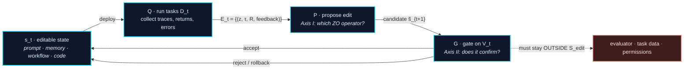

# Awesome Harness Optimization

**一份按理论组织的 Harness Optimization（HarnessOpt）阅读清单：在只能查询的条件下，围绕一个冻结 LLM 的软件系统如何修改自身，以及保留一处修改需要什么依据。**

[](https://awesome.re)
[](#贡献)
[](LICENSE)

[English](README.md) | **中文**

> **这份清单的不同之处。** 现有清单按*被编辑的对象*组织自演化 agent（prompt → memory → workflow → code）。这条轴必要但不充分：它不说明**在无梯度的信息结构下修改提案是怎么形成的**，也不说明**被接受的修改在统计上是否站得住**。本清单补上两条正交的轴：
>
> - **[Axis I — 零阶视角](#axis-i--零阶视角)：** 优化器只能*部署候选、运行任务、观察回报*。每种方法实际实例化的是哪个经典零阶优化（zeroth-order optimization, ZO）算子，以及可编辑面（editable surface）是否允许这个算子存在。
> - **[Axis II — PAC / 稳定性视角](#axis-ii--pac-与稳定性)：** 两个不可互换的界支配 HarnessOpt。更新稳定性（$\beta_{\exp}$）决定单次 rollout 能否劫持整次更新；独立确认决定被选中的候选能否泛化。多数已发表系统两者都没有干净满足，本清单指出每个系统违反的是哪一个。

---

## Table of Contents

- [收录范围](#收录范围)
- [HarnessOpt 更新循环](#harnessopt-更新循环)
- [Axis 0 — 可编辑面 L0–L5](#axis-0--可编辑面-l0l5)
- [**Axis I — 零阶视角**](#axis-i--零阶视角)
  - [I.1 为什么是零阶](#i1-为什么是零阶)
  - [I.2 提案信号与对应算子](#i2-提案信号与对应算子)
  - [I.3 算子可实现性取决于可编辑面结构](#i3-算子可实现性取决于可编辑面结构)
- [**Axis II — PAC 与稳定性**](#axis-ii--pac-与稳定性)
  - [II.1 两个界及其分工](#ii1-两个界及其分工)
  - [II.2 多轮复用与可达集界](#ii2-多轮复用与可达集界)
  - [II.3 对接受门的推论](#ii3-对接受门的推论)
- [论文列表](#论文列表)
  - [1. 基础与保证阶梯](#1-基础与保证阶梯)
  - [**2. 可编辑面 L0–L5**](#2-可编辑面-l0l5)
  - [3. 提案机制](#3-提案机制运行证据如何变成一次编辑)
  - [4. 验证协议](#4-验证协议候选如何进入持久-state)
  - [5. 评测器与基准](#5-评测器与基准)
  - [6. 相关综述与边界](#6-相关综述与边界)
- [开放问题](#开放问题)
- [配套文档](#配套文档)
- [贡献](#贡献)
- [引用](#引用)

---

## 收录范围

**工作定义。** 固定基座模型 $M$、任务分布 $\mathcal{D}$ 和一个外部评测边界。设 $s$ 为*模型外部*的软件 state：prompt、context、memory、workflow 图、工具接口、agent 代码、优化器代码。harness 以 $\tau = H_s(M, z)$ 的形式执行任务 $z$。**HarnessOpt** 指任何反复执行以下三步的过程：(i) 运行系统收集证据；(ii) 从证据出发提出对 $s$ 的编辑；(iii) 通过某种 accept / reject / rollback 规则决定哪些编辑被保留。

**焦点范围。** 基座模型冻结、用运行时反馈修改模型外部 state 的工作。包括 prompt 优化、自演化 memory / skill、workflow 搜索、自修改 agent 代码、meta 优化器代码，以及这类循环所优化的评测器与基准。

**边界情形。** L5（harness 与权重联合优化）作为边界收录，不作为核心。纯权重侧自改进（self-play、RLVR、合成数据）和手工设计的 harness（ReAct、SWE-agent、MCP）只在 [§6](#6-相关综述与边界) 列出，用来标出边界位置。

---

## HarnessOpt 更新循环

四个部件，一次更新：

$$
\underbrace{\mathcal{E}_t = Q(s_t; D_t)}_{\text{collect evidence}}
\qquad
\underbrace{\tilde{s}_{t+1} = P(s_t, \mathcal{E}_t)}_{\text{propose edit}}
\qquad
\underbrace{s_{t+1} = G(s_t, \tilde{s}_{t+1}; V_t)}_{\text{gate: accept / reject / rollback}}
$$



三个条件定义一个 HarnessOpt 系统，其余都是*协议选项*，不属于定义：

1. 本轮内基座模型与外部评测边界固定；
2. 编辑作用于显式界定的可编辑 state 集合 $\mathcal{S}_{\mathrm{edit}}$；
3. 候选经过某种 accept / reject / rollback 处理，其结果影响后续 state。

> allowlist、编译门、smoke test、独立验证、统计死区、人工评审决定的是系统把第 3 步做得*多好*，属于 [Axis II](#axis-ii--pac-与稳定性) 的讨论对象，不是准入条件。

---

## Axis 0 — 可编辑面 L0–L5

对象轴，作为两条分析轴的脚手架保留。它回答"**什么可以被改**"，不回答怎么改，也不回答改动是否站得住。**六个层级及其论文集中在 [§2](#2-可编辑面-l0l5) 一节。** 这里给出的是层级号掩盖掉的部分。

### 三个区分性子轴 — 层级号掩盖掉的部分

可编辑对象的层级几乎不说明*实际*动作空间，下面三个属性才说明：

| 子轴 | 问题 | 为什么重要 |
|---|---|---|
| **写权限** | agent 自主写入，还是必须经人工评审后才写入？ | 决定循环是否闭合 |
| **持久性** | 只在临时 sandbox 里跑，还是提交进受版本管理的 state？ | 决定错误能否累积 |
| **约束执行方式** | 在 prompt 里声明，还是由权限 / sandbox / 隐藏评测器 / 静态检查强制？ | 决定 [PAC 前提 (iii)](#ii1-两个界及其分工) 是否成立 |

> **可编辑面大小与门的强度不是守恒量。** 覆盖控制流和可执行代码的系统并不因此就有更严格的门；一些最大的可编辑面配的是最弱的确认。不要从层级号推断门的强度。见[审计表](#4-验证协议候选如何进入持久-state)。

---
## Axis I — 零阶视角

*这条轴的分类标准只有一个：**运行证据通过什么样的零阶信息结构进入修改提案？** 它与对象轴正交——同一个算子出现在 L0 也出现在 L4，同一个层级也承载多个算子。*

### I.1 为什么是零阶

$\mathcal{S}_{\mathrm{edit}}$ 由离散文本、程序和文件结构构成，$H_s \circ M$ 不可微，因此 $\nabla_s f_M(s)$ 不可得，其中 $f_M(s) = \mathbb{E}_{z \sim \mathcal{D}}[R(H_s(M,z))]$。

一个方法是零阶的，判据不是它的变量是否数值型，而是**优化器只能通过查询 oracle 获得目标函数信息**：部署候选 → 运行任务 → 观察分数与 trace → 决定怎么编辑。单次运行给出 $Y(s,z) = R(H_s(M,z))$，经验均值估计 $f_M(s)$。随机性来自任务采样、模型采样和环境执行，优化器从不构造显式的扰动方向。

**与经典 ZO 的一处实质差异。** 查询返回的是语义，不只是标量：

$$
\mathcal{E}_t = \{(z_i, \tau_i, R_i, \mathrm{feedback}_i)\}_{i=1}^{n_t}
$$

trace、错误日志、堆栈和测试结果能定位失败并提示该改什么。SkillOpt-Lite 把这称为 **language-mediated program compilation**：可编辑 state 是一段程序，rollout 是它的执行 trace，LLM 是编译器与运行时。

> **Insight 1。** 经典 ZO 盲扰动，因为它无法检视函数。HarnessOpt 读执行 trace，做语义驱动的调试——受*同样*的仅查询预算约束。**收益在提案质量，不在 oracle 访问权限。** 两件事不因此成立：语义侧信息不解除仅查询约束；*可读的 trace 不等于正确的归因*，更不等于接受候选的统计证据。已报告的 step 级归因准确率处于低位，回归预测明显弱于修复预测。

### I.2 提案信号与对应算子

下表中的公式表达的是*比较关系*，不是连续 ZO 估计量的实现。SkillOpt 的 $B_m{=}8$ 聚合的是跨多个任务的 rollout，不是对同一个 state 施加八次数值扰动。

| 信号类型 | 分析形式（类比） | 工程做法 | 代表工作 |
|---|---|---|---|
| **标量比较** | $\widehat{\Delta} = \widehat{R}(s') - \widehat{R}(s)$ | 单 trace 反思；批量 rollout；按分数排序或保留精英 | Reflexion, Voyager, APE, OPRO, DSPy, MIPROv2, GEPA, SkillOpt |
| **批量共识** | $\frac{1}{b}\sum_i [f(s+\mu u_i) - f(s)]\,u_i$ | 先聚合一个批次再提案；要求跨任务可复现的模式，而不是单个异常 | SkillOpt（$B_m{=}8$）, SkillOpt-Lite, Trace2Skill, SkillForge, ExpeL, Self-Harness |
| **成对对比** | $\widehat{\Delta} = \widehat{R}(s^+) - \widehat{R}(s^-)$ | 在同一任务上对比成功/失败 trace，提取行为分歧点 | SkillCAT, ProTeGi, TextGrad, DemoEvolve, ReasoningBank |
| **局部编辑** | $\mathcal{B}_{\mathrm{edit}}(s)$ | 只改一个模块 / 文件 / 条目，其余固定；最小补丁；受限路径 | SkillAdaptor, Trace2Skill, SkillWeaver, AgentSquare, MASS, AlphaEvolve, Meta-Harness, AHE |
| **有界搜索** | $s_{k+1} \in \mathcal{B}(s_k, \Delta_k)$ | 编辑预算、最小修改原则、allowlist、接口签名不变性 | SkillOpt（$L_t: 4{\to}2$）, SkillOpt-Lite, SkillForge, SoftSkill（$m{=}32$）, ACE, Self-Harness |
| **搜索记忆** | 候选、回报与拒绝记录构成的档案 | 拒绝编辑缓冲区避免重复探索死方向；novelty 拒绝采样 | SkillOpt rejected buffer, ShinkaEvolve, GEPA, Meta-Harness |
| **无梯度搜索** | $\tilde{s} \in \operatorname{Select}(\mathcal{A}_t; R)$ | 精英保留、island model、重组、Pareto 选择 | Promptbreeder, ADAS, AFlow, AgentSquare, ELM, FunSearch, AlphaEvolve, DGM, CORAL |
| **自适应搜索** | $\delta_t = F_t - F_{t-1}$，按 $\delta_t$ 调度 | 按 fitness 改进幅度与停滞情况分配探索预算 | AdaEvolve, ShinkaEvolve, ThetaEvolve, AFlow |

逐算子的完整注解，包括每个类比失效的确切位置，在 [`docs/zo-operator-map.md`](docs/zo-operator-map.md)。

**一处值得重述的地方。** SkillOpt 用一阶词汇描述自己——learning rate、momentum、mini-batch。从结构上看它是**带结构化提案算子的 (1+1)-ES**：编辑预算是提案半径，rejected buffer 是提案分布的负向条件化，"慢更新"是跨 epoch 的低频分量，接受规则是 held-out 上的严格改进。这样说不削弱方法本身，只是澄清 ZO 映射组织的是信息结构，不构成梯度下降等价性。

### I.3 算子可实现性取决于可编辑面结构

**这是对象轴与这条轴之间真正的依赖关系，而且它对层级不单调。** 不是"层级越高算子越强"，而是**特定算子要求特定结构**。

| 算子 | 要求 | 纯文本 | 受版本管理的可执行代码 |
|---|---|---|---|
| **成对对比** | 可构造的负方向 | $s - \mu u$ 构造不出来，只能在分歧点做启发式对比 | feature toggle 让 on/off 两个版本都可部署、可共跑，构成真正的配对比较 |
| **局部编辑** | 客观的块边界 | 文本坐标不正交，段落切分是任意的 | import 图与接口签名给出可静态判定的边界 |
| **搜索记忆** | 可配对的重放 | 没有显式随机变量，没有已知均值，没有无偏修正——方差缩减不可验证 | 确定性种子加版本控制抵消公共随机性 |
| **有界搜索** | 可测量的行为距离 | 编辑次数不是语义距离：改一个词可能改变一切，加十行注释可能什么都不改 | 改动文件数、跨模块触及范围、签名变化、smoke 通过率 |

这就是 allowlist、feature toggle 和版本化 rollback 不属于外挂安全措施的原因：它们是让这些算子得以实现的前置条件；按 [Proposition A](#ii2-多轮复用与可达集界)，它们同时收紧确认界。

另有两点，只说一次。**(a) 查询预算多出一个层级。** 编译、类型检查和静态分析在任何 rollout 之前就能拒掉候选，所以最优分配是先过滤再评测，而不是均匀切分；可编辑面的形态决定这个过滤器有多强，因为自然语言产物没有可比的预运行判据。这不是"zero-cost oracle"，它消耗算力，只是不消耗任务 rollout。**(b) 证据是 on-policy 的。** $\mathcal{E}_t$ 在当前 $s_t$ 下采样，某类失败一旦被修好就从后续 trace 中消失，优化器可能把修好它的约束撤销。这是估计量的偏差问题，不是泛化界问题；此处不给界：任何界都需要建模 proposer 的行为，假设的代价会超过结论的价值。

---

## Axis II — PAC 与稳定性

*Axis I 解释候选如何产生。这条轴回答：**在什么条件下，一次随机试验的结果可以被提升为持久 state？***

设定：基座模型 $M$ 固定，$z \sim \mathcal{D}$，损失 $\ell(s;z) = 1 - R(H_s(M,z)) \in [0,1]$，风险 $\epsilon(s) = \mathbb{E}_{z\sim\mathcal{D}}[\ell(s;z)]$。

### II.1 两个界及其分工

在已观测任务上得分更高的候选，不因此就在 $\mathcal{D}$ 上更好。两个界处理两种不同的失效。

**(B1) 更新侧 — 稳定性。** 设 $s_D = \mathcal{A}(D_N)$，$s_{D^{\setminus i}}$ 为其留一对应物，期望平均稳定性为

$$
\beta_{\exp} = \mathbb{E}_{D_N, i, z}\big[\,\lvert \ell(s_D; z) - \ell(s_{D^{\setminus i}}; z)\rvert\,\big],
$$

由此

$$
\epsilon(s_D) \le \widehat{\epsilon}_{D_N}(s_D) + O\!\left(\beta_{\exp} + \sqrt{\tfrac{\ln(1/\delta)}{N}}\right).
$$

$\beta_{\exp}$ 度量单次 rollout 异常能把更新推动多远。逐例硬编码、照抄某次试验独有的环境都会抬高它；跨任务聚合与有界编辑降低它。**这就是 [I.2](#i2-提案信号与对应算子) 中批量共识一行的统计内涵**——两条轴在此交汇。

**(B2) 确认侧 — 独立验证。** 若 $V_m$ 独立于训练数据*和提案过程*，则对固定候选 $\tilde{s}$，

$$
\epsilon(\tilde{s}) \le \widehat{\epsilon}_{V_m}(\tilde{s}) + O\!\left(\sqrt{\tfrac{\ln(1/\delta)}{m}}\right).
$$

无论更新过程多不稳定，$\beta_{\exp}$ 从这个界中**完全消失**。

> **Insight 2。** 两者既不可加也不可替代。(B1) 管更新是否被单次 rollout 劫持；(B2) 管在同一个集合上反复选择是否制造了选择偏差。**$\beta_{\exp}$ 极小的更新仍可能跨轮次严重过拟合 $V_m$，反之亦然。** 因此 consensus mining（降低 $\beta_{\exp}$）与验证集轮换（降低选择偏差）解决的是不同问题。文献把两者一并称作"提升泛化"，掩盖了这一分工。

**(B2) 的三条前提，在实践中都会失效。**

| 前提 | 怎么失效 |
|---|---|
| **(i) 独立性** | 固定的 selection 集被反复 `argmax`。任务昂贵时，很多系统改用人工检视加泄漏审计——这是可辩护的工程折中，但不等价于独立性，而这个等价性很少被论证 |
| **(ii) 信号偏差有界** | 编译通过和 smoke test 只说明候选*能跑*，不说明它满足规格。对语义类约束结构上最难：凡是能自动检查的通常已被做成门，剩下的恰恰是自动检查建立不了的部分；而唯一的自验证信号是任务成功，其中一类约束的存在目的正是防止伪造成功 |
| **(iii) 评测器在演化面之外** | 结构上最脆弱的一条：**评测器与被评测对象住在同一个仓库里。** 已记录的行为包括删除日志以绕过检测、预置环境以在不完成真实流程的情况下拿到奖励 |

### II.2 多轮复用与可达集界

多轮循环直接打破前提 (i)：$\tilde{s}_{t+1}$ 通过第 $1..t$ 轮依赖于 $V$。解法不是恢复独立性，而是**界定实际被测过的假设类**。

STOP 的 Lemma 1 对所有长度 $\le l$ 的程序做 union bound，那是一个*静态*类。HarnessOpt 有两点是它没有的：**A1**，优化开始前固定的锚定起点 $s_0$；**A2**，每轮编辑可由长度 $\le L$ 的编辑脚本描述——trust region 原则的直接产物。在 A1–A2 下，所有被提出**或被测试**过的 state 构成的集合 $\mathcal{H}_T$ 满足 $\ln\lvert\mathcal{H}_T\rvert \le T(L+1)\ln\lvert\Sigma\rvert$。

> **Proposition A。** 损失有界于 $[0,1]$ 且 A1–A2 成立时，以概率 $\ge 1-\delta$，对所有 $s \in \mathcal{H}_T$ 同时成立：
>
> $$\epsilon(s) \le \widehat{\epsilon}_{V_m}(s) + \eta_T, \qquad \eta_T := \sqrt{\frac{T(L+1)\ln\lvert\Sigma\rvert + \ln(1/\delta)}{2m}}$$
>
> 它对 $s_T$ 成立**且不要求 $s_T \perp V_m$**——这正是多轮复用需要的。*（Hoeffding 加对 $\mathcal{H}_T$ 的 union bound。）*

三个推论：

- **演化轮次消耗统计预算。** $\eta_T$ 按 $\sqrt{T}$ 增长：每一轮都再看一次同一个集合。把松弛压在 $\epsilon$ 以下需要 $m \gtrsim T(L+1)\ln\lvert\Sigma\rvert / (2\epsilon^2)$——验证集规模必须随轮数增长。已报告的实践处在相反的区间：小划分，$T$ 不小。
- **决定紧致程度的是编辑预算，不是程序规模。** 记 $l_{\mathrm{eff}} := T(L+1)$，Proposition A 就是把 STOP 的界中的 $l$ 换成 $l_{\mathrm{eff}}$，且在 $T(L+1) < \lvert s_T \rvert$ 时严格更强。**这给 trust region 与最小编辑一个超出方差缩减的理由：更小的 $L$ 直接收紧确认界。** 不设预算的整文件重写让 $L \approx \lvert s \rvert$，把这一条让掉。
- **轮换优于扩容。** 每轮使用新的 $V^{(t)}$ 并取 $\delta_t = \delta/T$，松弛为 $\sqrt{(\ln T + \ln(1/\delta))/(2m)}$——对 $T$ 的依赖从线性降到对数，代价是总消耗 $Tm$ 个任务。当新任务的成本低于扩容成本的 $\sqrt{T/\ln T}$ 倍时，轮换而不是扩容。

**失效的地方。** A2 是弱点：$L$ 必须是编辑的*描述长度*（diff 字节数）而不是编辑次数——一次编辑可以贴进 400 行。若 proposer 能把任意外部内容检索进 state，$L$ 无界，命题不适用。A1 在第 0 轮消耗了后来用于确认的任务时失效。

### II.3 对接受门的推论

**死区足够宽时，被接受的改进是真的。** 若接受要求 $\widehat{\Delta}_{V_m} > \Delta$ 且 $\Delta > 2\eta_T$，则在一致事件上每次被接受的更新都满足 $\epsilon(s_{t+1}) < \epsilon(s_t)$。两个推论：

- **$\Delta$ 与 $L$ 是耦合的，不是独立旋钮。** $\Delta$ 的下界随 $L$ 增长，放宽编辑预算必须同步抬高阈值。当前实践把 $\Delta$ 当噪声估计、把 $L$ 当提案控制各自独立调，这不自洽。
- **单调改进要求行为上精确的 rollback。** $\epsilon(s_T) \le \epsilon(s_0)$ 这一轨迹结论要求被拒提案不留残留。若 $s_{t+1} = s_t$ 在行为上不成立——残留进程、注册表条目、缓存文件、已写入的 memory——链条在那一轮断掉。**可撤销的副作用是定理前提，不是工程卫生习惯**；不覆盖运行时副作用的 `git` rollback 不够用。

**平均非回归掩盖尾部塌陷。** $\epsilon$ 是期望，所以局限在质量为 $p_k$ 的簇内的退化只要低于 $\eta_T / p_k$ 就完全不可见。要对每个簇得到保证，需要按簇独立采样 $m_k = \Omega\big((T(L+1)\ln\lvert\Sigma\rvert + \ln(K/\delta))/\epsilon_k^2\big)$。这就是"总分上升而个别里程碑被丢失"如何在**不违反任何生效的界**的情况下发生——也是非回归套件必须分层并按簇报告的原因。

**两种漂移不可混淆。** *目标漂移*（$z \sim \mathcal{D}_t$）属于这条轴，按 $\sum_t d(\mathcal{D}_{t-1},\mathcal{D}_t)$ **线性累加，而 $\eta_T$ 只按 $\sqrt{T}$ 增长，所以在足够长的时间跨度上漂移主导选择偏差**，这给出了"何时该重启而不是继续"的可检验判据。*证据漂移*属于 [Axis I](#i3-算子可实现性取决于可编辑面结构)，是估计量偏差问题，不是界的问题。

完整陈述、证明与假设审计在 [`docs/pac-stability.md`](docs/pac-stability.md)。

---
## 论文列表

**组织方式。** §1 给出基础与推动两条轴的保证阶梯。**§2 是主体：整个可编辑面 L0–L5 集中在一节。** §3 与 §4 把*同一批*工作按两条分析轴重排——§3 按提案机制，§4 按验证协议。§5 覆盖评测器与已记录的失败模式；§6 标出边界。

一项工作同时出现在 §2、§3、§4 不等于被计三次：§2 记录它改什么，§3 记录它怎么提案，§4 记录它的门许可得出什么结论。

**条目格式。** `**Name** — "Title". Authors. Venue Year. [[paper]](link) — 一句话说明它与 HarnessOpt 的关系。[ZO: operator] [PAC: class]`
`[ZO: …]` 把工作定位到 [Axis I](#i2-提案信号与对应算子)；`[PAC: …]` 定位到 [Axis II](#4-验证协议候选如何进入持久-state)（`open` / `same-set` / `independent`）。两个标注都是本清单的读法，不是论文的自我描述。`†` 标记元数据可能仍会变动的 preprint。

---

### 1. 基础与保证阶梯

本节只回答一个问题：*在什么意义上可以判定一次自我修改值得保留？* 历史上提出过三个参照点。HarnessOpt 位于中间那个，两条轴都瞄准它。

| 参照点 | 修改如何被判定 | 本清单如何处理 |
|---|---|---|
| **形式化证明** | 系统内部证明有益之后才执行 | 历史锚点；不要求任何现有系统达到 |
| **概率性确认** | 退化或选择偏差被控制在给定概率下 | **[Axis II](#axis-ii--pac-与稳定性) 的目标**——作为研究对象陈述，不是已解决的问题 |
| **经验分数** | 在某些任务上分数更高 | 通行做法；§4 分析它的边界 |

- **Gödel Machines: Self-Referential Universal Problem Solvers Making Provably Optimal Self-Improvements** — J. Schmidhuber. *arXiv* 2003. [[paper]](https://arxiv.org/abs/cs/0309048) — 只有在内部证明效用提升后才自我重写。阶梯的上端。它的立场是重写效用无法证明就无话可说；本清单的立场是*不可证明不等于不可分析*——ZO 描述搜索侧的信息结构，PAC 描述确认侧的样本条件。
- **Speculations Concerning the First Ultraintelligent Machine** — I. J. Good. *Advances in Computers* 1965. — 通过自设计导向智能爆炸这一想法的源头。仅作动机，一段的分量。
- **Recursive Self-Improvement** — E. Yudkowsky. *LessWrong* 2008. [[post]](https://www.lesswrong.com/posts/JBadX7rwdcRFzGuju/recursive-self-improvement) — 命名了 RSI 反馈循环。
- **Harness Engineering for Self-Improvement** — Lilian Weng. *Lil'Log* 2026. [[blog]](https://lilianweng.github.io/posts/2026-07-04-harness/) — 把 harness 视为近期自改进的载体：循环很少从权重开始，它跑在脚手架上。
- **Code as Agent Harness: Toward Executable, Verifiable, and Stateful Agent Systems** — *arXiv* 2026.† [[paper]](https://arxiv.org/abs/2605.18747) — 主张 harness 应当可执行、可验证、有状态。它的验证强度 / 恢复能力 / 状态一致性 / 可重放性列表在原文中只有名目——没有定义，没有测量协议，没有实证。本清单把它们落成[开放问题](#开放问题)中的运行时伴随指标。
- **A Survey of Self-Evolving Agents: What, When, How, and Where to Evolve** — Gao et al. *arXiv* 2025.† [[paper]](https://arxiv.org/abs/2507.21046) — 覆盖模型、memory、工具、架构的分类体系；本清单采用的能力维度与时间尺度区分出自这里。
- **A Comprehensive Survey of Self-Evolving AI Agents** — Fang et al. *arXiv* 2025.† [[paper]](https://arxiv.org/abs/2508.07407) — 连接基础模型与终身 agentic 系统；提出 "Three Laws of Self-Evolving AI Agents"。

---

### 2. 可编辑面 L0–L5

**六个层级集中在一节。** 每个小节说明可编辑面是什么、一个编辑单元长什么样，以及层级号掩盖掉的那部分——**该面向 [Axis I](#i3-算子可实现性取决于可编辑面结构) 的算子提供或不提供什么结构**。

| 层级 | 可编辑对象 | 编辑单元 | 有 feasibility oracle 吗？ | 小节 |
|---|---|---|---|---|
| **L0** | 指令 prompt | prompt、指令块、示例 | ❌ 无预运行判据 | [2.1](#21-l0--指令-prompt) |
| **L1** | context / memory / skill | memory 条目、skill 文件、检索单元 | ⚠️ 仅当 skill 可执行 | [2.2](#22-l1--context--memory--skill-库) |
| **L2** | workflow / 图 / 架构 | 节点、边、子图、模块槽位 | ⚠️ 只能判图的合法性，判不了语义 | [2.3](#23-l2--agentic-workflow-与架构搜索) |
| **L3** | harness / agent 代码 | 文件、模块、工具、插件 | ✅ 编译器、类型系统、静态分析 | [2.4](#24-l3--自修改-harness-代码) |
| **L4** | 优化器 / meta-harness 代码 | proposer、selector、搜索算子 | ✅ 同上，且循环在编辑自己的编辑器 | [2.5](#25-l4--优化器与-meta-harness-代码) |
| **L5** | harness 与模型权重 | checkpoint、LoRA、prefix | — 基座模型固定的条件被中止 | [2.6](#26-l5--harness-与权重联合优化的边界情形) |

> **第四列要对着 Axis 0 的三个子轴读。** 层级说明的是名义上什么可编辑。feasibility oracle 强度、写权限、持久性和约束执行方式才说明动作空间*实际*是什么。两者经常分离：见[横切观察 1](docs/audit-table.md#cross-cutting-observations)。

#### 2.1 L0 — 指令 prompt

*以指令层为优化对象。可编辑面：纯文本。* 不存在预运行可行性判据，所以每个候选都消耗 rollout；又因为没有可构造的负方向和客观块边界，central difference 和 coordinate descent 在这里只以类比形式存在（[I.3](#i3-算子可实现性取决于可编辑面结构)）。

- **APE** — "Large Language Models Are Human-Level Prompt Engineers". Zhou et al. *ICLR* 2023. [[paper]](https://arxiv.org/abs/2211.01910) — 把指令当程序；用搜索提案并打分。`[ZO: population & archive]` `[PAC: same-set]`
- **OPRO** — "Large Language Models as Optimizers". Yang et al. *ICLR* 2024. [[paper]](https://arxiv.org/abs/2309.03409) — 从历史（解，分数）对构成的 meta-prompt 生成新解。meta-prompt 只看得到标量，看不到 trace 证据，因此 Axis I 的语义优势没有被用上。`[ZO: one-point]` `[PAC: same-set]`
- **EvoPrompt** — "Connecting LLMs with Evolutionary Algorithms Yields Powerful Prompt Optimizers". Guo et al. *ICLR* 2024. [[paper]](https://arxiv.org/abs/2309.08532) — 在 prompt 种群上做 GA/DE，用 LLM 做变异与交叉。`[ZO: population]` `[PAC: same-set]`
- **Promptbreeder** — "Self-Referential Self-Improvement via Prompt Evolution". Fernando et al. *arXiv* 2023.† [[paper]](https://arxiv.org/abs/2309.16797) — 同时演化任务 prompt *和*修改它们的变异 prompt。L0 内容加 L4 机制的混合体，是本清单中最早的"循环编辑自己的编辑器"的实例。`[ZO: population]` `[PAC: same-set]`
- **ProTeGi** — "Automatic Prompt Optimization with 'Gradient Descent' and Beam Search". Pryzant et al. *EMNLP* 2023. [[paper]](https://arxiv.org/abs/2305.03495) — 提出 "textual gradients"：把 LLM 的批评当作编辑 prompt 的自然语言梯度。结构上扮演 central difference 的*角色*，但没有可构造的 $s-\mu u$。`[ZO: central difference (analogy)]` `[PAC: same-set]`
- **DSPy** — "Compiling Declarative Language Model Calls into Self-Improving Pipelines". Khattab et al. *ICLR* 2024. [[paper]](https://arxiv.org/abs/2310.03714) — 把 LM pipeline 视为可优化文本变换图的编程模型。`[ZO: population & archive]` `[PAC: same-set]`
- **MIPROv2** — "Optimizing Instructions and Demonstrations for Multi-Stage Language Model Programs". Opsahl-Ong et al. *EMNLP* 2024. [[paper]](https://arxiv.org/abs/2406.11695) — 用贝叶斯优化联合自举 few-shot 示例并提案指令。为 $f$ 建代理模型而不是盲查询，是与 LLM 提案实质不同的 ZO 策略，也是本清单中唯一这么做的工作。`[ZO: surrogate-model search]` `[PAC: same-set]`
- **TextGrad** — "Automatic 'Differentiation' via Text". Yuksekgonul et al. *Nature* 2025. [[paper]](https://arxiv.org/abs/2406.07496) — 在复合 AI 系统中反向传播文本反馈。这里的"梯度"是零阶查询上的语义侧信息，不是可验证的导数；没有任何东西被抵消，所以 central difference 的方差优势一条都不迁移过来。`[ZO: central difference (analogy)]` `[PAC: same-set]`
- **GEPA** — "Reflective Prompt Evolution Can Outperform Reinforcement Learning". Agrawal et al. *arXiv* 2025.† [[paper]](https://arxiv.org/abs/2507.19457) — 读取完整 trace 的 Genetic-Pareto 反思式优化器；rollout 最多比 RL 少 35 倍。这是 trace 驱动的提案降低*所需查询数*的证据，属于提案质量，不代表省掉了任何一次查询。`[ZO: population + control variate]` `[PAC: independent]`

#### 2.2 L1 — context / memory / skill 库

*agent 从经验中自行整理并增长自己的 context、memory 或 skill 存储，不更新权重。* 开环协议类别集中在这里：多数系统把经验直接写进后续 state，没有任何测试能拦住一条坏条目。

**Context 与 memory**

- **Reflexion** — "Language Agents with Verbal Reinforcement Learning". Shinn et al. *NeurIPS* 2023. [[paper]](https://arxiv.org/abs/2303.11366) — 把反馈转成语言化自我反思，跨试验存入 episodic memory。典型的 one-point 估计量——一条 trace，一次编辑——也是本清单中 $\beta_{\exp}$ 最高的设计。在开环中完全跳过动态验证。`[ZO: one-point]` `[PAC: open]`
- **ExpeL** — "LLM Agents Are Experiential Learners". Zhao et al. *AAAI* 2024. [[paper]](https://arxiv.org/abs/2308.10144) — 收集经验并抽取自然语言洞察，存入不断增长的库。跨经验抽取即便没有正式的门，也是真实降低 $\beta_{\exp}$ 的机制。`[ZO: multi-point]` `[PAC: open]`
- **Dynamic Cheatsheet** — "Test-Time Learning with Adaptive Memory". Suzgun et al. *EACL* 2026.† [[paper]](https://arxiv.org/abs/2504.07952) — 推理时持久化的自建策略与代码片段 memory。`[ZO: one-point]` `[PAC: open]`
- **ACE** — "Agentic Context Engineering: Evolving Contexts for Self-Improving Language Models". Zhang et al. *ICLR* 2026. [[paper]](https://arxiv.org/abs/2510.04618) — Generator/Reflector/Curator 加增量 delta 更新，避免 context collapse。delta 更新是文本面上的 trust region；它防的 "context collapse" 是高 $\beta_{\exp}$ 的具体实例。`[ZO: trust region]` `[PAC: open]`
- **ReasoningBank** — "Scaling Agent Self-Evolving with Reasoning Memory". Ouyang et al. *ICLR* 2026.† [[paper]](https://arxiv.org/abs/2509.25140) — 从成功*与*失败中蒸馏可泛化策略；提出 memory-aware 的 test-time scaling。成功/失败配对是 memory 层上的 central difference 角色。`[ZO: central difference (analogy)]` `[PAC: open]`
- **Agent Workflow Memory (AWM)** — Wang, Mao, Fried, Neubig. *ICML* 2025. [[paper]](https://arxiv.org/abs/2409.07429) — 归纳可复用 workflow 作为 agent 自行增长并复用的持久程序性 memory。`[ZO: multi-point]` `[PAC: open]`
- **Memp** — "Exploring Agent Procedural Memory". Fang et al. *ACL Findings* 2026.† [[paper]](https://arxiv.org/abs/2508.06433) — 把轨迹蒸馏为脚本式流程，配套构建/检索/更新策略。少数明确规定*删除*而不只是写入的工作之一，与[开放问题](#开放问题)中的生命周期缺口直接相关。`[ZO: multi-point]` `[PAC: open]`
- **MemAct** — "Memory as Action: Autonomous Context Curation for Long-Horizon Agentic Tasks". Zhang et al. *ACL Findings* 2026.† [[paper]](https://arxiv.org/abs/2510.12635) — 把工作记忆管理重述为端到端训练的可学习策略动作。`[ZO: — trained policy]` `[PAC: open]`
- **Continual Harness** — "Online Adaptation for Self-Improving Foundation Agents". *arXiv* 2026.† [[paper]](https://arxiv.org/abs/2605.09998) — 在线 harness 适配。持续适配使它正处在 [Proposition A 推论](#ii2-多轮复用与可达集界)标出的小 $m$、大 $T$ 区间。`[ZO: one-point / multi-point]` `[PAC: open]`

**Skill 库与 skill 优化** — 本清单中最窄的可编辑面，同时也是算子清单最完整、确认协议最强的一类。这个倒置是对"面越大方法越强"最直接的反驳。

- **Voyager** — "An Open-Ended Embodied Agent with Large Language Models". Wang et al. *TMLR* 2024. [[paper]](https://arxiv.org/abs/2305.16291) — 自动课程加自增长的可执行 skill 库实现终身学习。单个错误信号触发局部程序覆写。skill 库可执行，所以 feasibility oracle 存在——但它守的是编译，不是泛化。`[ZO: one-point]` `[PAC: open]`
- **SkillWeaver** — "Web Agents can Self-Improve by Discovering and Honing Skills". Zheng et al. *COLM* 2025. [[paper]](https://arxiv.org/abs/2504.07079) — 把可复用、已调试的 API skill 合成进 harness；WebArena 上 +31.8%。调试循环是 feasibility oracle，不是确认门。`[ZO: coordinate descent]` `[PAC: same-set]`
- **SkillOpt** — "Executive Strategy for Self-Evolving Agent Skills". *arXiv* 2026.† [[paper]](https://arxiv.org/abs/2605.23904) — mini-batch 反思（$B_m{=}8$）、衰减编辑预算（$L_t: 4 \to 2$）、rejected-edit buffer、分层并行 LLM 树归约；三路不相交划分且测试集在最终报告前锁定。skill 文献中最完整的算子清单。它用一阶词汇描述自己（learning rate、momentum、mini-batch），但结构上是带结构化提案算子的 (1+1)-ES，见 [I.2](#i2-提案信号与对应算子)。`[ZO: multi-point + trust region + control variate]` `[PAC: independent]`
- **SkillOpt-Lite** — "Better and Faster Agent Self-evolution via One Line of Code". *arXiv* 2026.† [[paper]](https://arxiv.org/abs/2607.03451) — consensus mining、held-out 选择、compile–smoke–full 分阶段确认。本清单所依托的 ZO/PAC 框架的来源；明确把 skill 优化表述为 language-mediated program compilation。报告了小验证集划分上的高方差——小 $m$ 区间的实证观察。`[ZO: multi-point + confirmation gate]` `[PAC: independent]`
- **Trace2Skill** — "Distill Trajectory-Local Lessons into Transferable Agent Skills". *arXiv* 2026.† [[paper]](https://arxiv.org/abs/2603.25158) — 带 map-reduce 补丁合并的 ZO-SGD。(B1) 机制强，(B2) 被损害：它的门跑在训练集的子采样子集上。两个界相互独立的最干净的单例。`[ZO: multi-point + coordinate descent]` `[PAC: same-set]`
- **SkillForge** — "Forging Domain-Specific, Self-Evolving Agent Skills in Cloud Technical Support". *arXiv* 2026.† [[paper]](https://arxiv.org/abs/2604.08618) — 用 batch ticket 聚合做轨迹去噪；执行最小修改原则。`[ZO: multi-point + trust region]` `[PAC: independent]`
- **SkillCAT** — "Contrastive, Assessment-Augmented and Topology-Aware Skill Self-Evolution for LLM Agents". *arXiv* 2026.† [[paper]](https://arxiv.org/abs/2606.13317) — 在动作分歧点 $w_i$ 上的定制对比算子。skill 文献中最接近真实 central difference 的做法，仍缺可构造的 $s-\mu u$；它的门跑在源训练失败实例的直接克隆上。`[ZO: central difference]` `[PAC: same-set]`
- **SkillAdaptor** — "Self-Adapting Skills for LLM Agents from Trajectories". *arXiv* 2026.† [[paper]](https://arxiv.org/abs/2606.01311) — 以故障步 $t^*$ 为坐标轴、候选 skill $s_j$ 为基向量的 coordinate descent。`[ZO: coordinate descent]` `[PAC: same-set]`
- **SoftSkill** — "Behavioral Compression for Contextual Adaptation". *arXiv* 2026.† [[paper]](https://arxiv.org/abs/2606.20333) — 把 soft prefix 限定在 $m{=}32$ token。少见的把 trust region 做成*硬性维度*约束而非编辑次数启发式的例子——本清单中唯一无歧义可测的半径。`[ZO: trust region]` `[PAC: same-set]`

#### 2.3 L2 — Agentic workflow 与架构搜索

*workflow 图或模块组合由搜索得到而非手工设计。* 节点/边结构第一次提供了**客观块边界**，使 coordinate descent 不再只是类比（[I.3](#i3-算子可实现性取决于可编辑面结构)）。

- **ADAS / Meta Agent Search** — "Automated Design of Agentic Systems". Hu, Lu, Clune. *ICLR* 2025. [[paper]](https://arxiv.org/abs/2408.08435) — meta-agent 在不断增长的档案上用代码编写越来越好的 agent。`[ZO: population & archive]` `[PAC: same-set]`
- **AFlow** — "Automating Agentic Workflow Generation". Zhang et al. *ICLR* 2025. [[paper]](https://arxiv.org/abs/2410.10762) — 把 workflow 优化做成代码表示图上的 MCTS。MCTS 把探索/利用调度显式化，对应算子表的自适应搜索一行。`[ZO: population + adaptive step]` `[PAC: same-set]`
- **GPTSwarm** — "Language Agents as Optimizable Graphs". Zhuge et al. *ICML* 2024. [[paper]](https://arxiv.org/abs/2402.16823) — 把 agent 视为计算图；节点级 prompt 加边级 REINFORCE 优化。边级 REINFORCE 在拓扑上确实*不是*零阶——一个有用的边界情形，说明 ZO 框架是关于信息可得性的判断，不是通用标签。`[ZO: partially first-order over edges]` `[PAC: same-set]`
- **AgentSquare** — "Automatic LLM Agent Search in Modular Design Space". Shang et al. *ICLR* 2025. [[paper]](https://arxiv.org/abs/2410.06153) — 在 Planning/Reasoning/ToolUse/Memory 模块空间上做演化与重组搜索。模块槽位给出本清单中最干净的客观坐标基。`[ZO: coordinate descent + population]` `[PAC: same-set]`
- **MaAS** — "Multi-agent Architecture Search via Agentic Supernet". Zhang et al. *ICML* 2025. [[paper]](https://arxiv.org/abs/2502.04180) — 优化概率性 agentic supernet，得到成本自适应、随 query 而变的系统。`[ZO: population]` `[PAC: same-set]`
- **MASS** — "Multi-Agent Design: Optimizing Agents with Better Prompts and Topologies". Zhou et al. *arXiv* 2025.† [[paper]](https://arxiv.org/abs/2502.02533) — 在 prompt 与拓扑之间交错的多阶段搜索。显式的块坐标结构：prompt 与拓扑是交替搜索而非联合搜索。`[ZO: block coordinate descent]` `[PAC: same-set]`
- **ScoreFlow** — "Mastering LLM Agent Workflows via Score-based Preference Optimization". Wang et al. *arXiv* 2025.† [[paper]](https://arxiv.org/abs/2502.04306) — 通过 Score-DPO 做连续、基于梯度的 workflow 优化。一阶边界情形：它把 workflow 的一部分松弛为可微对象，靠改变表示而不是改变可得信息跳出 ZO 设定。`[ZO: boundary — first-order]` `[PAC: same-set]`
- **FlowReasoner** — "Reinforcing Query-Level Meta-Agents". Gao et al. *arXiv* 2025.† [[paper]](https://arxiv.org/abs/2504.15257) — 用 RL 调优的推理 meta-agent，为每个 query 定制一套多 agent 系统。`[ZO: boundary — RL]` `[PAC: same-set]`
- **EvoAgent** — "Towards Automatic Multi-Agent Generation via Evolutionary Algorithms". Yuan et al. *NAACL* 2025. [[paper]](https://arxiv.org/abs/2406.14228) — 用变异、交叉、选择把单个 agent 扩展成多 agent 系统。`[ZO: population]` `[PAC: same-set]`
- **Agent Symbolic Learning** — "Symbolic Learning Enables Self-Evolving Agents". Zhou et al. *arXiv* 2024.† [[paper]](https://arxiv.org/abs/2406.18532) — 用语言化的 "loss/梯度/反向传播" 联合优化 prompt、工具和 pipeline。`[ZO: central difference (analogy)]` `[PAC: same-set]`
- **Alita** — "Generalist Agent Enabling Scalable Agentic Reasoning with Minimal Predefinition and Maximal Self-Evolution". Qiu et al. *arXiv* 2025.† [[paper]](https://arxiv.org/abs/2505.20286) — 通过即时自主生成并复用自己的 MCP 工具实现自演化。工具生成扩张的是*交互*面而不只是 state，正是安全探针必须覆盖新引入面而不只是最终输出的情形（[§4.2](#42-接受应当是一个联合条件)）。`[ZO: population]` `[PAC: open]`

#### 2.4 L3 — 自修改 harness 代码

*以 agent 自身代码为修改对象。* 唯一一个 [feasibility oracle](#i3-算子可实现性取决于可编辑面结构) 强、真实 central difference 可通过 feature toggle 构造、配对重放使 control variate 可验证的层级。它同时也是 (B2) 前提 (iii) 最脆弱的地方——**评测器与被编辑代码住在同一个仓库**。

- **STOP** — "Self-Taught Optimizer: Recursively Self-Improving Code Generation". Zelikman et al. *COLM* 2024. [[paper]](https://arxiv.org/abs/2310.02304) — 种子改进器在权重固定下递归改进自己的脚手架代码；目标是改进器本身而不是解。附录 A.2 Lemma 1 给出对所有长度 $\le l$ 程序的一致收敛界。[Proposition A](#ii2-多轮复用与可达集界) 是它的动态对应版本：锚定起点加每轮有界编辑把静态程序类替换为可达集，$l$ 替换为 $l_{\mathrm{eff}} = T(L+1)$。`[ZO: population]` `[PAC: same-set + uniform-convergence analysis]`
- **Gödel Agent** — "A Self-Referential Agent Framework for Recursive Self-Improvement". Yin et al. *ACL* 2025. [[paper]](https://arxiv.org/abs/2410.04444) — 在运行时对自身逻辑做动态 monkey patch。运行时原地打补丁使*行为上精确*的 rollback 变难，直接威胁 [II.3](#ii3-对接受门的推论) 的单调性前提。`[ZO: one-point]` `[PAC: open]`
- **Darwin Gödel Machine (DGM)** — "Open-Ended Evolution of Self-Improving Agents". Zhang et al. *arXiv* 2025.† [[paper]](https://arxiv.org/abs/2505.22954) — 编码 agent 在开放式档案上重写自己的代码库；SWE-bench 20%→50%。每轮 $L$ 很大的档案搜索——正是 $\eta_T$ 增长最快的区间（[II.2](#ii2-多轮复用与可达集界)），因为不设预算的重写让 $L \approx \lvert s \rvert$。`[ZO: population & archive]` `[PAC: same-set]`
- **SICA** — "A Self-Improving Coding Agent". Robeyns et al. *arXiv* 2025.† [[paper]](https://arxiv.org/abs/2504.15228) — 取消 meta/target 之分；agent 为成本、速度、准确率编辑自己的代码库。`[ZO: one-point + coordinate descent]` `[PAC: same-set]`
- **Self-Harness** — "Harnesses That Improve Themselves". Zhang et al. *arXiv* 2026.† [[paper]](https://arxiv.org/abs/2606.09498) — 弱点挖掘 → 有界 harness 提案 → 在 held-in/held-out 划分上做回归验证。held-in/held-out 双向非回归检查是已发表工作中最接近[四项接受检查](#42-接受应当是一个联合条件)的近似。`[ZO: multi-point + trust region + confirmation gate]` `[PAC: independent]`
- **Agentic Harness Engineering (AHE)** — "Observability-Driven Automatic Evolution of Coding-Agent Harnesses". *arXiv* 2026.† [[paper]](https://arxiv.org/abs/2604.25850) — prediction manifest 加下一轮 rollback。回溯式确认，没有不相交 held-out 集；其安全上限受归因准确率约束，而后者被报告为低（[II.1](#ii1-两个界及其分工)）。`[ZO: coordinate descent]` `[PAC: independent (retrospective)]`
- **AutoHarness** — "Improving LLM Agents by Automatically Synthesizing a Code Harness". Lou et al. *arXiv* 2026.† — 用环境反馈做迭代式代码精化，自动合成 code harness。`[ZO: one-point / multi-point]` `[PAC: unverified]`
- **Ouroboros** — "A Self-Developing Frontier Coding Agent with Reviewed Core Evolution". Razzhigaev et al. *arXiv* 2026.† [[paper]](https://arxiv.org/abs/2608.08311) [[code]](https://github.com/razzant/ouroboros) — 经评审的 commit 成为后续工作的运行时。把人工评审放进写路径，是*写权限*子轴上一个独立的点，并实质改变 $\mathcal{H}_T$ 的内容：被人工拒绝的候选从不进入可达集。`[ZO: coordinate descent]` `[PAC: independent (human-gated)]`
- **CORAL** — "Towards Autonomous Multi-Agent Evolution for Open-Ended Discovery". Qu et al. *COLM* 2026. [[paper]](https://arxiv.org/abs/2604.01658) [[code]](https://github.com/Human-Agent-Society/CORAL) — 编码 agent 在隔离 worktree 中围绕一个外部 grader 工作，保留计分尝试并共享 notes 与可复用 skill。worktree 隔离是 [II.3](#ii3-对接受门的推论) 精确 rollback 前提的具体实现——被拒尝试按构造无法在父 state 中留下残留。`[ZO: population & archive]` `[PAC: independent]`
- **DemoEvolve** — "Overcoming Sparse Feedback in Agentic Harness Evolution with Demonstrations". *arXiv* 2026.† [[paper]](https://arxiv.org/abs/2605.24539) — 人类演示提供稀疏奖励给不出的对比信号。演示是外部提供的"正方向"，是少数几种不构造 $s - \mu u$ 也能拿到对比对的做法之一。`[ZO: central difference]` `[PAC: independent]`

#### 2.5 L4 — 优化器与 meta-harness 代码

*提出编辑的代码本身也被编辑。* 在能力意义上它不是"更高"的一档，而是 $P$ 进入 $\mathcal{S}_{\mathrm{edit}}$ 的情形。对 Axis II 的后果很具体：Proposition A 的可达集计数仍然适用，但 $\beta_{\exp}$ 现在描述的是一个自身在变的算法，(B1) 管的是一个移动的对象。

- **Meta-Harness** — "End-to-End Optimization of Model Harnesses". Lee et al. *arXiv* 2026.† [[paper]](https://arxiv.org/abs/2603.28052) — agentic proposer 通过文件系统在 harness *代码*上搜索，返回 harness 的 Pareto 前沿。文件级编辑给出真实块边界，Pareto 选择对应无梯度搜索一行。文中说明在昂贵终端任务上未切独立集——小 $m$、$T$ 不小的情形。`[ZO: coordinate descent + population + control variate]` `[PAC: independent (partial)]`
- **Hyperagents** — Zhang et al. *arXiv* 2026.† [[paper]](https://arxiv.org/abs/2603.19461) — meta-agent 控制如何修改任务 agent 以生成新 agent。`[ZO: population]` `[PAC: unverified]`
- **MCE** — "Meta Context Engineering via Agentic Skill Evolution". Ye et al. *arXiv* 2026.† [[paper]](https://arxiv.org/abs/2601.21557) — 双层框架，协同演化 context 管理 *skill*（meta）与 context *产物*（base，以文件或代码形式）。L1 内容加 L4 机制在同一循环中；正是机制与内容的显式分离才让这两层可分。`[ZO: population]` `[PAC: same-set]`
- **Promptbreeder** — *(亦见 §2.1)* — 演化变异 prompt 是这个 L0 系统的 L4 侧面。按侧面列两次，不计两次。

#### 2.6 L5 — harness 与权重联合优化的边界情形

*harness 编辑与权重更新在同一循环内。* 作为边界收录，不作为核心比较对象：权重一旦变动，HarnessOpt 定义中"基座模型固定"的条件被中止，$\beta_{\exp}$ 必须在联合 state 上重新定义，Proposition A 的可达集计数也不再适用，因为权重更新无法用 $\Sigma$ 上的有界编辑脚本描述。

- **SIA** — "Self Improving AI with Harness & Weight Updates". Hebbar et al. *arXiv* 2026.† [[paper]](https://arxiv.org/abs/2605.27276) — Feedback-Agent 逐轮决定更新 harness 还是模型权重。`[ZO: — mixed]` `[PAC: same-set]`
- **SEAL** — "Self-Adapting Language Models". Zweiger et al. *NeurIPS* 2025. [[paper]](https://arxiv.org/abs/2506.10943) — 模型生成自己的 "self-edits"（微调数据加指令），在 RL 循环中经 SFT 应用。`[ZO: boundary — RL]` `[PAC: same-set]`

---
### 3. 提案机制：运行证据如何变成一次编辑

相关综述已经按方法家族梳理过 prompt 优化和自演化 agent，本节不重复那件事，而是把工作映射到**一个查询信号如何变成修改提案**上——可编辑范围是 §2 的题目，接受协议是 §4 的题目。

标量回报回答的是*哪些候选值得继续*。trace 反馈进一步回答*失败在哪、可能该改什么*。候选档案决定*保留、变异还是重组什么*。这些可以叠加，多数系统同时用其中两三种。

| 信号 | 能支撑什么 | 不能支撑什么 | 工作 |
|---|---|---|---|
| **标量回报与排序** | 比较候选或版本 | 定位原因；为某个具体编辑提供依据 | APE, OPRO, DSPy, MIPROv2, Reflexion, Voyager |
| **轨迹与错误日志** | 定位失败；提出看似合理的补丁 | 正确归因；接受候选的证据 | ProTeGi, TextGrad, SkillCAT, GEPA, AHE, Trace2Skill |
| **搜索历史与档案** | 多样性、新颖性、避开死方向 | 被保留的候选是否泛化 | Promptbreeder, ADAS, AFlow, ELM, AlphaEvolve, ShinkaEvolve, DGM |

语言反馈仍是携带语义侧信息的零阶查询，不是可验证的梯度。局部编辑、编辑预算和拒绝缓冲区约束的是提案的*触及范围*和重复探索，它们不制造可微对象。无论提案怎么形成，它本身都不能构成进入持久 state 的理由：接受、非回归和 rollback 仍然是 §4 的门 $G$。

#### 3.1 逐系统的算子清单

把 [I.2](#i2-提案信号与对应算子) 与 §2 的层级交叉制表。竖着读一列看到同一个算子跨层级复现，横着读一行看到一个系统实际的机制组合。

| 系统 | 层级 | 标量 | 批量 | 对比 | 局部 | 有界 | 记忆 | 种群 | 自适应 |
|---|---|:-:|:-:|:-:|:-:|:-:|:-:|:-:|:-:|
| Reflexion | L1 | ● | | | | | | | |
| Voyager | L1 | ● | | | ● | | | | |
| ExpeL | L1 | | ● | | | | | | |
| ACE | L1 | | ● | | | ● | | | |
| ReasoningBank | L1 | | ● | ● | | | | | |
| SkillOpt | L1 | ● | ● | | | ● | ● | | |
| SkillOpt-Lite | L1 | | ● | | | ● | | | |
| Trace2Skill | L1 | | ● | | ● | | | | |
| SkillCAT | L1 | | | ● | | | | | |
| SkillAdaptor | L1 | | | | ● | | | | |
| SoftSkill | L1 | | | | | ● | | | |
| OPRO | L0 | ● | | | | | | | |
| ProTeGi | L0 | | ● | ● | | | | | |
| TextGrad | L0 | | | ● | | | | | |
| GEPA | L0 | ● | | | | | ● | ● | |
| Promptbreeder | L0 | | | | | | | ● | |
| ADAS | L2 | | | | | | ● | ● | |
| AFlow | L2 | | | | | | | ● | ● |
| AgentSquare | L2 | | | | ● | | | ● | |
| MASS | L2 | | | | ● | | | | |
| DGM | L3 | | | | | | ● | ● | |
| SICA | L3 | ● | | | ● | | | | |
| Self-Harness | L3 | | ● | | | ● | | | |
| AHE | L3 | | | | ● | | | | |
| DemoEvolve | L3 | | | ● | | | | | |
| CORAL | L3 | | | | | | ● | ● | |
| AlphaEvolve | L3 | | | | ● | | | ● | ● |
| ShinkaEvolve | L3 | | | | | | ● | ● | ● |
| AdaEvolve | L3 | | | | | | | | ● |
| ELM | L3 | | | | | ● | | ● | |
| Meta-Harness | L4 | | | | ● | | ● | ● | |

三个读法：

1. **算子与层级无关。** 局部编辑从 L1 的 skill 文件一直用到 L4 的优化器代码；种群搜索从 L0 的 prompt 一直用到 L4。对象轴不预测机制。
2. **最窄的面有最丰富的清单。** L1 的 skill 优化占据的格子比 L3 的代码编辑多。算子复杂度跟随的是*确认问题被当回事的程度*，不是可编辑的量。
3. **对比与局部化很少同时出现**——多数系统只选一个。按 [I.3](#i3-算子可实现性取决于可编辑面结构)，两者要求可编辑面提供不同的结构，所以这是约束，不是偏好。

#### 3.2 搜索引擎

L2–L4 系统所依托的机制。它们的贡献*就是*算子。

- **FunSearch** — "Mathematical Discoveries from Program Search with Large Language Models". Romera-Paredes et al. *Nature* 2023. [[paper]](https://www.nature.com/articles/s41586-023-06924-6) — LLM 加评测器构成演化循环；后来的自改进编码 agent 沿用这个模板。
- **AlphaEvolve** — "A Coding Agent for Scientific and Algorithmic Discovery". Novikov et al. *arXiv* 2025.† [[paper]](https://arxiv.org/abs/2506.13131) — LLM 集成加评测器，作用于标注出的 `EVOLVE-BLOCK` 区域。标注区域是人工声明的坐标基——把可编辑面工程化成让局部化可实现而非类比的最干净例子。
- **ShinkaEvolve** — "Towards Open-Ended and Sample-Efficient Program Evolution". Lange et al. *arXiv* 2025.† [[paper]](https://arxiv.org/abs/2509.19349) — 父代采样、novelty 拒绝采样、bandit LLM 选择。novelty 拒绝把提案引离已覆盖的方向，但没有无偏修正项。
- **AdaEvolve** — "Adaptive LLM Driven Zeroth-Order Optimization". *arXiv* 2026.† [[paper]](https://arxiv.org/abs/2602.20133) — 明确把 LLM 驱动的搜索表述为带自适应调度的零阶优化；已发表工作中与这条轴最近的邻居。
- **ThetaEvolve** — "Test-time Learning on Open Problems". Wang et al. *arXiv* 2025.† [[paper]](https://arxiv.org/abs/2511.23473) — 把演化搜索与 RL、上下文学习结合。
- **ELM** — "Evolution through Large Models". Lehman et al. *arXiv* 2022.† [[paper]](https://arxiv.org/abs/2206.08896) — 把 LLM diff 模型作为 MAP-Elites 内的变异算子。diff 模型就是字面意义上的有界编辑脚本 proposer——假设 A2 按构造实现，而不是靠约定。
- **AIDE** — "AI-Driven Exploration in the Space of Code". Jiang et al. *arXiv* 2025.† [[paper]](https://arxiv.org/abs/2502.13138) — 把机器学习工程做成在自身解空间上的 agentic 树搜索。

#### 3.3 经典零阶理论

引用它们是为了算子定义及其已知性质；这些论文都不是关于 agent 的。

- **A Primer on Zeroth-Order Optimization in Signal Processing and Machine Learning** — Liu et al. *IEEE SPM* 2020. [[paper]](https://arxiv.org/abs/2006.06224) — 本清单所映射的工具箱：one-point 与 two-point 估计量、坐标方法、方差缩减、收敛率。
- **Optimal Rates for Zero-Order Convex Optimization: The Power of Two Function Evaluations** — Duchi, Jordan, Wainwright, Wibisono. *IEEE TIT* 2015. [[paper]](https://arxiv.org/abs/1312.2139) — 为什么 two-point 估计量优于 one-point，并给出匹配下界。这是"可构造的负方向为什么重要"的形式化理由：文本面丢掉的是可证明的速率，不是优雅。
- **Random Gradient-Free Minimization of Convex Functions** — Nesterov & Spokoiny. *FoCM* 2017. [[paper]](https://link.springer.com/article/10.1007/s10208-015-9296-2) — 高斯平滑估计量及其维数依赖的速率。更大的编辑面*搜索*代价更高，这与确认侧的论证相互独立。
- **Online Convex Optimization in the Bandit Setting** — Flaxman, Kalai, McMahan. *SODA* 2005. [[paper]](https://arxiv.org/abs/cs/0408007) — one-point bandit 估计量及其方差代价；单 trace 反思的形式化祖先。
- **Introduction to Derivative-Free Optimization** — Conn, Scheinberg, Vicente. *SIAM* 2009. [[book]](https://epubs.siam.org/doi/book/10.1137/1.9780898718768) — trust region 与基于模型的 DFO；"半径必须是行为距离"这一要求的来源。
- **Completely Derandomized Self-Adaptation in Evolution Strategies** — Hansen & Ostermeier. *Evolutionary Computation* 2001. [[paper]](https://direct.mit.edu/evco/article/9/2/159/892/Completely-Derandomized-Self-Adaptation-in) — 把 SkillOpt 类方法读作结构化 (1+1)-ES 而非 SGD 的参照。

---

### 4. 验证协议：候选如何进入持久 state

§II.1 给出两个界：更新侧的稳定性与确认侧的独立验证。要描述文献的实际做法，还需要加上第三类——完全没有独立确认的那一类。权限、sandbox、审计和 rollback 是横跨这三类的治理条件，不是单独一类。

**决定性的差别不是测试是否跑过，而是测试结果能否阻止候选进入持久 state，以及用于该决策的集合是否跨轮次复用。**

| 协议 | 特征 | 代表工作 | 与两个界的关系 |
|---|---|---|---|
| **开环** | 经验直接写入后续 state；无候选测试，无恢复路径 | Reflexion, Voyager, ExpeL, Dynamic Cheatsheet, ACE, ReasoningBank, Memp, AWM, MemAct, Continual Harness, Gödel Agent, Alita | 前提 (i) 按构造就不存在。只能支撑关于经验积累的声称 |
| **同集打分** | 在搜索任务上打分、排序、保留精英；测试集结果在最后单独报告 | APE, OPRO, Promptbreeder, DSPy, MIPROv2, ADAS, AFlow, MaAS, AgentSquare, ELM, AlphaEvolve, ShinkaEvolve, ThetaEvolve, STOP, DGM, SICA | 候选依赖被反复观测的任务，独立性不成立。适用的读法是 [Proposition A](#ii2-多轮复用与可达集界)，$\eta_T$ 随 $T$ 和 $L$ 增长 |
| **独立验证与 rollback** | 在不相交集合上确认，或通过回溯预测加版本测试；失败则拒绝或回滚 | SkillOpt, SkillOpt-Lite, SkillForge, GEPA, SkillCAT, DemoEvolve, Self-Harness, CORAL, Ouroboros；Meta-Harness（部分）；AHE（回溯式） | 前提 (i) 在第 1 轮成立，除非轮换验证集，否则跨轮次退化。轮换则适用 Proposition A′，否则适用 Proposition A |

第三类内部的协议细节各不相同。SkillOpt 使用三路不相交划分且测试集在最终报告前锁定；SkillOpt-Lite 使用 held-out 选择加 compile–smoke–full 分阶段确认；Self-Harness 使用 held-in/held-out 双向非回归；CORAL 在隔离 worktree 中围绕外部 grader 隔离每次尝试；Ouroboros 以人工评审过的 commit 为门。AHE 的 prediction manifest 加下一轮 rollback 提供的是回溯式确认，没有不相交的 held-out 集。SkillCAT、SkillAdaptor 和 Trace2Skill 的门跑在源训练失败实例的克隆或子采样子集上——尽管有门，仍属于第二类。

#### 4.1 这张表让三件事变得可见

**可编辑面大小不预测门的强度。** 覆盖控制流和可执行代码的系统并不因此就有更严格的门；一些最大的面完全没有确认门，而 skill 优化中最窄的面配的是三路不相交划分。门的强度无法从层级号推断。

**(B1) 与 (B2) 由不同的系统满足。** Trace2Skill 和 SkillCAT 共识机制强、确认弱；若干演化系统是相反的画像。若两个界可以互相替代，这个模式不会持续存在——这是 Insight 2 的经验形态。

**算子复杂度不跟随门的强度。** SkillOpt 和 ShinkaEvolve 实现的算子范围最广，两者都不轮换验证集。

逐系统的细节，含标注为 unverified 的条目，在 [`docs/audit-table.md`](docs/audit-table.md)。

#### 4.2 接受应当是一个联合条件

已发表的接受门几乎都只测任务通过率，这对一个有记录的失败模式原则上是盲的：性能与安全可以反向移动。在 workflow 优化中，HumanEval 性能上升的同时 Refusal Rate 从 36.3% 降到 5.6%，Attack Success Rate 从 54.4% 升到 83.1%；在 memory 演化设定中，Refusal Rate 从 99.4% 降到 54.4%，ASR 从 0.6% 升到 20.6%——而且退化可能突然出现，不是逐步发生（Misevolution，[2509.26354](https://arxiv.org/abs/2509.26354)）。

只看通过率的门看不见这些。**安全指标必须进入 $G$ 本身，而不是作为最终表格的一个附加列。** 这与 [I.3](#i3-算子可实现性取决于可编辑面结构) 的分阶段 oracle 兼容：安全探针可以放在 smoke 层，成本只是完整验证的一小部分。被优化的组件也可能长出具备外部交互能力的结构——子 agent 构建、工具注册、集成节点——所以探针必须覆盖候选新引入的交互面，而不只是它的输出。

结合 §II.3，候选只有在以下四条全部成立时才应进入持久 state：无关键性能回归（取 $\Delta > 2\eta_T$，并按簇分层）；无关键安全或权限回归；评测器、任务数据和受保护路径未被修改，在运行时强制而非在 prompt 中声明；候选可记录、可重放、rollback 精确。

#### 4.3 统计工具

- **Stability and Generalization** — Bousquet & Elisseeff. *JMLR* 2002. [[paper]](https://www.jmlr.org/papers/v2/bousquet02a.html) — 一致稳定性蕴含泛化；稳定性路线的源头。
- **Learnability, Stability and Uniform Convergence** — Shalev-Shwartz, Shamir, Srebro, Sridharan. *JMLR* 11:2635–2670, 2010. [[paper]](https://jmlr.org/papers/v11/shalev-shwartz10a.html) — 期望平均稳定性，即 $\beta_{\exp}$ 所实例化的概念。*（无 arXiv 版本。）*
- **Train Faster, Generalize Better: Stability of Stochastic Gradient Descent** — Hardt, Recht, Singer. *ICML* 2016. [[paper]](https://arxiv.org/abs/1509.01240) — 更少更新步蕴含更好稳定性；"累计编辑预算越小界越紧"的参数化对应物，由一条独立路径得到。
- **Mathematical Analysis of Machine Learning Algorithms** — T. Zhang. *Cambridge* 2023. [[book]](https://www.cambridge.org/core/books/mathematical-analysis-of-machine-learning-algorithms/0F86E4F79A5FE3EE9C0A0A5EBFCF8E2C) — (B2) 所依据的模型选择界。
- **Preserving Statistical Validity in Adaptive Data Analysis** — Dwork, Feldman, Hardt, Pitassi, Reingold, Roth. *STOC* 2015. [[paper]](https://arxiv.org/abs/1411.2664) — 用差分隐私在自适应查询下复用 holdout。它对 accept/reject 这种查询模式是否优于 Proposition A 的 union bound，尚未解决。
- **The Reusable Holdout** — Dwork et al. *Science* 349(6248), 2015. [[paper]](https://www.science.org/doi/10.1126/science.aaa9375) — Thresholdout 机制；让多轮复用在统计上站得住最可行的路线。
- **The Ladder: A Reliable Leaderboard for Machine Learning Competitions** — Blum & Hardt. *ICML* 2015. [[paper]](https://arxiv.org/abs/1502.04585) — 反复查询 leaderboard 与在固定 selection 集上反复 `argmax` 结构相同；它的防御手段——只在显著改进时报告——正是死区 $\Delta$ 所实现的。
- **Gradient Episodic Memory for Continual Learning** — Lopez-Paz & Ranzato. *NeurIPS* 2017. [[paper]](https://arxiv.org/abs/1706.08840) — BWT/FWT 的源头。这里的遗忘由一次显式编辑造成，因此可归因到具体 diff——非参数设定唯一的优势。
- **Overcoming Catastrophic Forgetting in Neural Networks** — Kirkpatrick et al. *PNAS* 2017. [[paper]](https://arxiv.org/abs/1612.00796) — 标出对比：这里没有权重可保护，稳定性–可塑性必须在任务集性能上重新表述，也没有参数重要性的对应物。
- **A Programming Paradigm for Spatiotemporal Composability** — *2026.†* — revertible effects 与 reactive coeffects；精确 rollback 前提所需的系统层语言。

---

### 5. 评测器与基准

基准扮演两个通常被混同的角色：**驱动提案**的集合，和**确认候选**的集合。只有后者受 Axis II 支配。用同一个集合承担两个角色是一种选择，就应当作为选择报告出来。

**编码与终端 agent**

- **SWE-bench** — Jimenez et al. *ICLR* 2024. [[paper]](https://arxiv.org/abs/2310.06770) — 2,294 个真实 issue→PR 任务；编码 harness 自改进的标准目标。
- **Terminal-Bench** — Merrill et al. *arXiv* 2026.† — 人工验证的容器化终端任务；Meta-Harness 与 Self-Harness 使用。单任务成本正是把系统推离独立划分的原因。
- **ClawBench** — Zhang et al. *arXiv* 2026.† [[paper]](https://arxiv.org/abs/2604.08523) [[code]](https://github.com/reacher-z/ClawBench) — 带请求拦截与可重放 trace 的实时网页任务。
- **HAL** — Kapoor et al. *ICLR* 2026. [[paper]](https://arxiv.org/abs/2510.11977) — 跨 9 个基准的计成本第三方 leaderboard。

**AI 研究与机器学习工程**

- **PaperBench** — Starace et al. *ICML* 2025. [[paper]](https://arxiv.org/abs/2504.01848) — 复现 20 篇 ICML 2024 论文；8,316 条评分细则。
- **MLE-bench** — Chan et al. *ICLR* 2025. [[paper]](https://arxiv.org/abs/2410.07095) — 75 项 Kaggle 竞赛，带人类基线。
- **RE-Bench** — Wijk et al. *ICML* 2025. [[paper]](https://arxiv.org/abs/2411.15114) — 7 个开放式机器学习研发环境，对照 61 位人类专家。
- **KernelBench** — Ouyang et al. *ICML* 2025. [[paper]](https://arxiv.org/abs/2502.10517) — 250 个 PyTorch 工作负载，用 `fast_p` 计分。快速可自动化的验证器是很强的预运行过滤器，这既是演化型 harness 偏好它的原因，也是它的分数比看上去更难泛化的原因。

**长跨度保持** — 能看到 episodic 评测看不到的东西的基准：LifelongAgentBench、LTMBenchmark、MemoryAgentBench。多数基准每个任务都重置 agent state，因此完全观察不到遗忘、state 污染或安全漂移。

**Harness 交互**

- **Harness Updating Is Not Harness Benefit** — *arXiv* 2026.† [[paper]](https://arxiv.org/abs/2605.30621) — 把 harness *更新*能力与 harness *收益*分开，通过 SLR/HFR/LPR 把失败分解为激活与遵循两部分，并反驳"最强模型就是最好优化器"这一默认假设。原文自身让两点变得可核实：其可编辑面限于 skill 层；更新侧与收益侧的聚合方式不对称。

**验证器**

- **Let's Verify Step by Step** — Lightman et al. *ICLR* 2024. [[paper]](https://arxiv.org/abs/2305.20050) — 过程监督优于结果监督；发布 PRM800K。
- **Generative Verifiers** — Zhang et al. *ICLR* 2025. [[paper]](https://arxiv.org/abs/2408.15240) — 用 next-token 预测做 CoT 验证。
- **LLMs Cannot Self-Correct Reasoning Yet** — Huang et al. *ICLR* 2024. [[paper]](https://arxiv.org/abs/2310.01798) — 没有外部信号时内在自纠正会退化——把验证器保持在 $\mathcal{S}_{\mathrm{edit}}$ 之外的经验依据。

**本节共有的结构性局限。** episodic 设计测不了长期保持。在同一个集合上反复选择侵蚀确认。执行类验证器仍可能是狭窄代理，所以要报告验证强度和误接受率，不只是通过率。性能基准对评测器 hacking 是盲的，那是对测量装置的攻击，需要隐藏评测器和审计日志。安全与能力可以反向移动。跨不同基座模型与 harness 的收益不能合并：一个分数混了基座模型、演化器、harness、工具协议和评测器。

**文献记录的失败模式。** Misevolution（[2509.26354](https://arxiv.org/abs/2509.26354)）是跨模型、memory、工具、workflow 路径的系统性研究。关于评测器可达：reward tampering（[2406.10162](https://arxiv.org/abs/2406.10162)）、监控与混淆（[2503.11926](https://arxiv.org/abs/2503.11926)）、reward hacking 的形式化（[2209.13085](https://arxiv.org/abs/2209.13085)）、过度优化的缩放律（[2210.10760](https://arxiv.org/abs/2210.10760)）。关于评测有效性：AI Agents That Matter（[2407.01502](https://arxiv.org/abs/2407.01502)）、机器学习驱动科学中的数据泄漏（[2207.07048](https://arxiv.org/abs/2207.07048)）、METR 关于许多通过 SWE-bench 的 PR 不会被合并的发现。关于循环在噪声上宣布胜利："p-hacking and eureka-ing"（[2511.16072](https://arxiv.org/abs/2511.16072)）——正是死区要防的失败——以及自主研究循环的六种反复出现的失败模式（[2601.03315](https://arxiv.org/abs/2601.03315)）。适合放进 $G$ 内部的安全探针：AgentHarm（[2410.09024](https://arxiv.org/abs/2410.09024)）。

---

### 6. 相关综述与边界

- **Awesome-Harness-Self-Improvement** — leezythu. 2026. [[repo]](https://github.com/leezythu/Awesome-Harness-Self-Improvement) — 本清单与之互补的对象轴清单。它按优化阶梯组织；本清单叠加两条分析轴。想覆盖这个领域从那里开始，想知道提案如何形成、是否得到确认来这里。
- **A Survey of Self-Evolving Agents** — Gao et al. *arXiv* 2025.† [[paper]](https://arxiv.org/abs/2507.21046) — 本清单采用的能力维度与时间尺度区分出自这里。
- **A Comprehensive Survey of Self-Evolving AI Agents** — Fang et al. *arXiv* 2025.† [[paper]](https://arxiv.org/abs/2508.07407)
- **A Survey on Self-Evolution of Large Language Models** — Tao et al. *arXiv* 2024.† [[paper]](https://arxiv.org/abs/2404.14387)
- **A Survey of Context Engineering for LLMs** — Mei et al. *arXiv* 2025.† [[paper]](https://arxiv.org/abs/2507.13334)
- **Agent Harness for LLM Agents: A Survey** — Meng et al. *Preprints.org* 2026.† [[repo]](https://github.com/Gloriaameng/Awesome-Agent-Harness) — 把 harness 形式化为 $H = (E,T,C,S,L,V)$。

**不在焦点内，列出以标明边界。** *Harness 设计*——这些方法所作用的手工设计载体：ReAct（[2210.03629](https://arxiv.org/abs/2210.03629)）、Self-Refine（[2303.17651](https://arxiv.org/abs/2303.17651)）、SWE-agent（[2405.15793](https://arxiv.org/abs/2405.15793)）、OpenHands（[2407.16741](https://arxiv.org/abs/2407.16741)）、CodeAct（[2402.01030](https://arxiv.org/abs/2402.01030)）、AutoGen（[2308.08155](https://arxiv.org/abs/2308.08155)）、MetaGPT（[2308.00352](https://arxiv.org/abs/2308.00352)）、MemGPT（[2310.08560](https://arxiv.org/abs/2310.08560)）、MCP（[2503.23278](https://arxiv.org/abs/2503.23278)）。*纯权重自改进*——改进的是模型，不是 harness：SPIN（[2401.01335](https://arxiv.org/abs/2401.01335)）、Self-Rewarding LMs（[2401.10020](https://arxiv.org/abs/2401.10020)）、Absolute Zero（[2505.03335](https://arxiv.org/abs/2505.03335)）、R-Zero（[2508.05004](https://arxiv.org/abs/2508.05004)）、TTRL（[2504.16084](https://arxiv.org/abs/2504.16084)）、DeepSeek-R1（[2501.12948](https://arxiv.org/abs/2501.12948)）、STaR（[2203.14465](https://arxiv.org/abs/2203.14465)）。当它们与 harness 在同一循环中协同优化时，相关工作归入 [§2.6](#26-l5--harness-与权重联合优化的边界情形)。

---
## 开放问题

按可用实验检验的问题陈述，不按声称可行的系统设计陈述。

**1 · 更紧的多轮复用。** Proposition A 为验证集复用付出 $\sqrt{T}$ 的代价。差分隐私的可复用 holdout 能在同一个集合上回答大量自适应查询，且依赖更好。它能否在 HarnessOpt 的查询模式下成立——查询是对候选的 accept/reject 决策，比一般自适应分析更有结构——代价是多少精度，尚未解决。

**2 · 证据漂移的一种表述。** 某类失败一旦被修好就从 trace 中消失，优化器因此失去"该约束仍然必要"的证据，可能把它撤销。此处不给界，因为任何界都需要建模 proposer。一个假设更轻的表述——界定一条约束的证据可以衰减到什么程度才使撤销变得可能——会是真正的贡献。

**3 · 删除，而不只是写入。** 多数自演化工作规定了怎么写、没规定怎么删，这有统计后果：精确 rollback 是单调性结论的前提，未清理的副作用会在那一轮破坏它。需要两条不变量——卸载一个组件即撤销它的注册和副作用；依赖变化时能重新解析出兼容配置。一份可执行的规范给持久条目显式的生命周期，其保留判据取决于**该条目是否仍覆盖当前搜索邻域中的高概率陷阱**，而不是条目长度。用 Axis I 的语言说，memory 集合应当覆盖当前邻域的高概率失败方向。

**4 · 合并独立演化的分支。** 逐轮的局部编辑记录不足以预测合并后的行为，单分支的协议也无法照搬。这是理论空白而不只是工程问题：可达集计数在合并时失效，因为合并后的 state 不在任一分支的可达集中。

**5 · 可操作的簇划分。** 分层验证要求按簇报告，但没有站得住的能力划分方法，"按簇报告"就无法执行。在有之前，报告实际使用的划分及其理由，好让读者判断某个长尾能力是否可能藏在一个大簇里。

**6 · 量化稳定性–可塑性。** 更小的编辑预算意味着更少遗忘和更慢改进。把它变成命题需要一个界定单次编辑行为触及范围的假设，目前没有站得住的假设可用。

**7 · 什么时候该重启而不是继续。** 目标漂移线性累加而确认松弛只按 $\sqrt{T}$ 增长，所以超过某个跨度之后，重跑第 0 轮优于继续增量演化。定位这个交叉点是一个低成本实验，目前看没有已发表工作做过。

**8 · 模型–harness 协同设计，作为一个可检验的循环。** 命题不是"组件化能产生智能"。三个已发表的观察支撑一个联合循环：较弱的模型从 harness 优化中获益更多；不存在对所有模型都最优的通用 harness；agent 能力不完全由模型智能决定。这个循环是：trace 暴露一个反复出现的失败，harness 提出局部补丁或把 trace 变成训练证据，独立任务确认收益并确认没有回归，稳定的经验被蒸馏为一般能力，**模型改进之后原来的脚手架可以删除，而跨任务收益仍然保持。** 最后一步才是证据：长期进展表现为脚手架在缩小，而不是一堆删不掉的规则不断累积。

## 配套文档

| 文档 | 内容 |
|---|---|
| [`docs/zo-operator-map.md`](docs/zo-operator-map.md) | 完整 ZO 算子表，含逐工作注解，以及每个文本空间类比失效的确切位置 |
| [`docs/pac-stability.md`](docs/pac-stability.md) | Proposition A、A′、B、B-1、B-2、C 的完整陈述与证明，附假设审计 |
| [`docs/audit-table.md`](docs/audit-table.md) | 逐系统的稳定性/确认审计，标注每条的证据状态 |
| [`docs/glossary.md`](docs/glossary.md) | 本清单使用的全部符号与指标缩写 |

---

## 贡献

非常欢迎 PR。除常规要求外，本清单只有一条额外要求：

**保持三类句子分开。** 新增条目时：
- 事实类陈述必须可归属到具体论文（必要时指明章节或实验设定）；
- 分析类陈述是本清单在统一框架下的比较，不得当作原论文结论呈现；
- 建议类陈述必须读起来是建议（"应当报告"、"可作为协议选项"），绝不写成对当前实践的描述。

另外：
- 尽可能把工作定位到**三条轴**上：层级（L0–L5）、`[ZO: operator]`、`[PAC: class]`。
- 主张 `[PAC: independent]` 时，要说明**划分具体是什么**以及**是否跨轮次复用**。"跑了测试"不是独立确认。
- 若某系统的门强度无法从一手来源核实，标为 **`待核实 / unverified`**，不要从层级号或二手摘要推断。
- preprint 用 `†` 标记。优先使用正式发表处，否则用 arXiv 摘要页。

**准确性说明。** 标 `†` 的条目包含 2025–2026 年的 preprint，其 ID、作者或发表处可能仍会变动。正式引用前请先核实链接。本清单给出的 ZO 算子或 PAC 类别归类是本清单的读法，不是论文的自我描述。

---

## 引用

```bibtex
@misc{harnessopt_zo_pac_2026,
  title        = {A Zeroth-Order and PAC View of Agent Harness Optimization},
  author       = {Wei, Chuyang and Shen, Yifei},
  year         = {2026},
  howpublished = {\url{https://github.com/Weichy9218/Awesome-Harness-Optimization}}
}
```

## License

[MIT](LICENSE)。论文元数据版权归各自作者所有。
